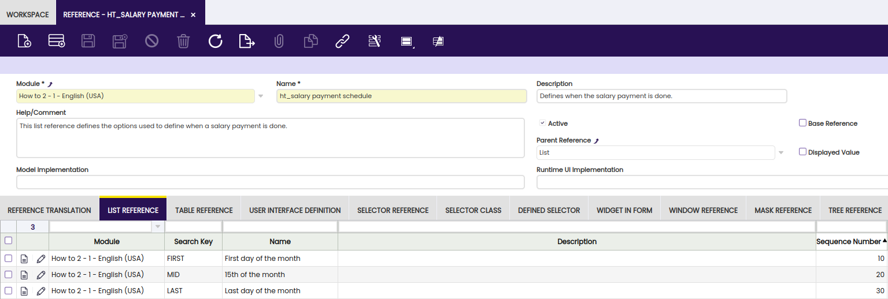
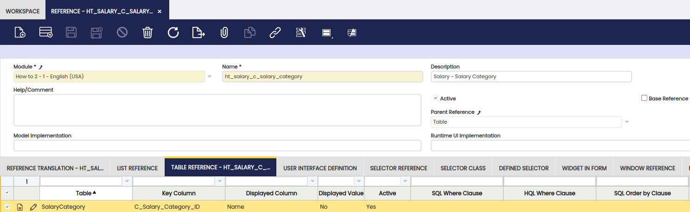
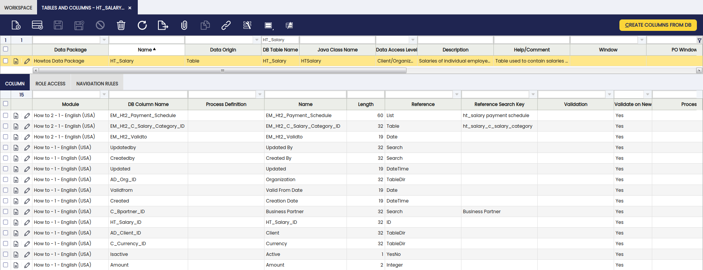

#  How to Add Columns to a Table 

##  Overview

In this section, the user can find information about how to extend the table created in the [How to Create a Table](how-to-create-a-table.md) section to include additional fields.

Three different fields will be added to show how to configure some of the possible references:

  1. _ValidTo_ , a simple date-field matching the ValidFrom date already present in this table 
  2. _Payment Schedule_ , shown as a combobox to the user to be able to choose from three values defined in a list-reference. 
    1. First day of the month 
    2. Mid of the month 
    3. Last day of the month 
  3. _Payment Category_ , a link to another existing table which allows selecting among the values present in that table. 

  
These changes can be done in two different locations:

  1. Add columns to the *original* module (dbprefix `HT` ) 
  2. Create a *second* module (dbprefix `HT2` ) which adds the columns to the first module 

The first option can be chosen if the original module author wants to add more columns to their module. The second option is possible for anyone as the columns are added by a new module to the existing one which is not changed directly.

The main difference between these two methods is the names which need to be chosen for the columns to comply with the modularity naming rules.

  1. Adding column to same module: Any valid column name can be picked 
  2. Via second module: New column name must comply to the pattern `EM_<DBPREFIX>` where `<DBPREFIX>` must be the dbprefix if the new module contaning the column to be added. In this example: `EM_HT2`

From now on, we follow this second approach and will place all new elements into a new module with dbprefix `HT2` .

To show how different types of column are configured, we will be adding 3 new columns:

  * _Valid To_ a simple column of type date 
  * _Payment Schedule_ a list-reference containing a list of values: _Start of Month_ , _Mid of Month_ , _End of Month_
  * _Salary Category_ a reference pointing to the existing _Salary Category_ table. 

###  Creating the new module

This section only lists the main important elements needed for the new module. More details can be found in the [How To Create a Module](How_To_Create_a_Module.md)

  * dbprefix: `HT2`
  * Dependencies: 
    * Core as usual 

###  Creating the columns in the database

| Column name     | Type   | Length | Note                                                                                                                                   |
| --------------- | ------ | ------ | -------------------------------------------------------------------------------------------------------------------------------------- |
|`em_ht2_validto`  |  DATE  |  |  Date that this salary is valid to.  
|`em_ht2_payment_schedule`  |  VARCHAR  |  60  |  When the salary is paid  
|`em_ht2_c_salary_category_id`  |  VARCHAR  |  32  |  Link to the Salary Category  
  
To create the above table within the database, use one of the following `ALTER TABLE` statements depending on the DB you are using:

```sql title="SQL script"
ALTER TABLE ht_salary ADD COLUMN em_ht2_validto timestamp without time zone;
ALTER TABLE ht_salary ADD COLUMN em_ht2_payment_schedule VARCHAR(60);
ALTER TABLE ht_salary ADD COLUMN em_ht2_c_salary_category_id VARCHAR(32);
ALTER TABLE ht_salary ADD CONSTRAINT "em_ht2_c_salary_category" FOREIGN KEY (em_ht2_c_salary_category_id) REFERENCES c_salary_category(c_salary_category_id);
```

As can be seen in the SQL, a foreign key is added along with the new field linking to the `c_salary_category` table. This ensures that only existing categories can be selected and also that no salary category can be deleted as long as it is used in the `ht_salary` table.

###  Adding & Configuring the columns in the Application Dictionary

In this part, we will add the newly added column to the list of columns already defined for the `ht_salary` table and then configure those column definitions to match the description giving in the objective section above.

####  Adding the new column to the Application Dictionary

The steps to follow are:

  1. In the `Tables and Columns` window search for the entry of the `ht_salary` table. 
  2. With this record selected, run the *Create columns from DB* process. As the table already contains several columns only column which are not yet present in the Application Dictionary definition of that table will be added. In this section, this process will add our newly created 3 columns to the list. Notice that those new entries are automatically associated with the new module with prefix `HT2` as the process detected this via the naming of the database columns. 

Taking a look at the folder structure of the module after running `./gradlew export.database`, it shows that the new columns have been exported into a file in a 'modifiedTables' folder instead of the usual 'tables' to indicate that this module does not create the `ht_salary` table but instead is adding new elements to it.

```
org.openbravo.howtos2
└── src-db
    └── database
        └── model
            ├── functions
            └── modifiedTables
            │       └── HT_SALARY.xml
            ├── sequences
            ├── tables
            ├── triggers
            └── views
        └── sourcedata
            ├── AD_MODULE_DBPREFIX.xml
            ├── AD_MODULE_DEPENDENCY.xml
            ├── AD_MODULE.xml
            └── AD_PACKAGE.xml
```  

####  Configuring the new columns

Before starting to configure the new columns, two preparatory steps need to be done.

  1. Create a _List Reference_ for the column _Payment Schedule_ to define the 3 values which should be allowed for this list. 
  2. Create _Table_ reference for the `em_ht2_c_salary_category_id` column as the standard _TableDir_ reference cannot be used with `em` _type columns_.

When adding these new elements remember to place them in the new module with prefix `HT2`.

The first step is to create a new *Reference* to hold the list of values for the _Payment Schedule_ column. Important values to configure here are:

  * _Parent Reference_ = *List* in the Reference definition itself, to define it as a List Reference. 
  * For each entry in the _List Reference_ tab 
    * _Search Key_ The value stored in the database field when this entry is selected by a user in the ComboBox. 
    * _Name_ The user visible (translatable) text shown in the UI. 
    * _Sequence_ to define the order of the entries which should be used in the UI. 

The following screenshot shows how the defined reference will look like.



  
The second step is to create a *Table Reference* to define how the new *Salary Category* field is linked with the `c_salary_category` table.

For this, a new *Reference* needs to be created. In this case, the important values for it are the following:

  * _Parent Reference_ = *Table* to denote this is a Table Reference. 
  * In the _Table Reference_ Tab: 
    * _Table_ = `c_salary_category` as this is the target table our new column will be pointing to.
    * _Key Column_ = `c_salary_category_id` as this is the primary key of the target table 
    * _Display Column_ = `Name` to denote the field of this table which should be shown in the UI for this column. 

The following screenshot shows how the defined reference will look like.  



  
After this two previous steps, we can finally configure the new columns to use the reference we just created.

In the *Tables and Columns* window, we search for the entry to the `ht_salary` table. In the column tab we make the following changes for our new columns:

  1. _Payment Schedule_, change the *Reference* of this column from _String_ to *List* and change the *Reference Search Key* to our newly created List Reference with name `EM_Ht2_Payment_Schedule`. 
  2. _Salary Category_ , change the *Reference* of this column from _TableDir_ to *Table* and change the *Reference Search Key* to the new `ht_salary_c_salary_category` . 

  
The final step would be to run the *Synchronize Terminology* process and update the created elements to have useful names for the UI.

However as long as issue  10886  is unfixed this process will not map existing elements correctly for columns following the `EM_` naming rules.

To work around this and reuse the existing core elements for the two columns for which such exists ( _validto_ , _Salary Category_ ) assign the existing elements manually to those two columns.

For this, the following changes are needed in the same open window *Tables and Columns* still open from the last step and in the *Columns* tab of the `ht_salary` table.

  1. _ValidTo_ change the *Application Element* to _ValidTo - Valid To Date_
  2. _Salary Category_ change the *Application Element* to _C_Salary_Category_ID - Salary Category_

  
Now run the *Synchronize Terminology* process to set element for the last column which does not yet have a matching element.

After this, the new columns should look like shown in the following screenshot:


  
As a final step, we now update the newly created `EM_Ht2_Payment_Schedule` element to have a useful label for the UI.

Navigating to `Application Dictionary` > `Element` we search for the new element and to the following updates:

  1. *Name* change from `EM_Ht2_Payment_Schedule` to *Payment Schedule*
  2. *Print Name* change from `EM_Ht2_Payment_Schedule` to *Payment Schedule*

Those updates are needed to have useful labels in the UI for any windows defined on this table and to avoid those having internal names using the technical `EM`-terminology.

###  Rebuilding the system

Finally, to make the newly added columns available at runtime `./gradlew generate.entities` needs to be called and the changes deployed to tomcat. Those two steps can be done together by calling `./gradlew smartbuild`. After that, Tomcat must be restarted to refresh the DAL In-Memory Model so it knows about the newly added columns.

Once the columns are added to the table, the user can [export](../../../developer-guide/etendo-classic/how-to-guides/How_To_Create_a_Module.md#exporting-a-module) the module.

To add the new columns to the window defined on top of this table, visit [How to add a field to a Window Tab](../../../developer-guide/etendo-classic/how-to-guides/how-to-add-a-field-to-a-window-tab.md).

---

This work is a derivative of [How to Add Columns to a Table](http://wiki.openbravo.com/wiki/How_to_add_Columns_to_a_Table){target="\_blank"} by [Openbravo Wiki](http://wiki.openbravo.com/wiki/Welcome_to_Openbravo){target="\_blank"}, used under [CC BY-SA 2.5 ES](https://creativecommons.org/licenses/by-sa/2.5/es/){target="\_blank"}. This work is licensed under [CC BY-SA 2.5](https://creativecommons.org/licenses/by-sa/2.5/){target="\_blank"} by [Etendo](https://etendo.software){target="\_blank"}.