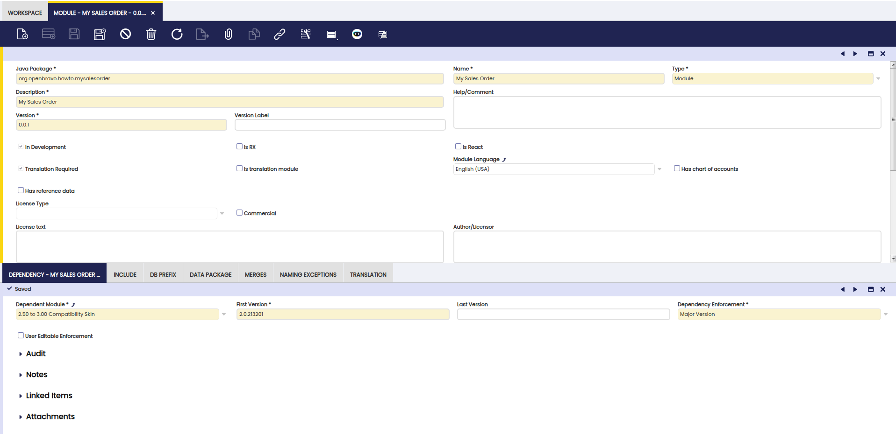
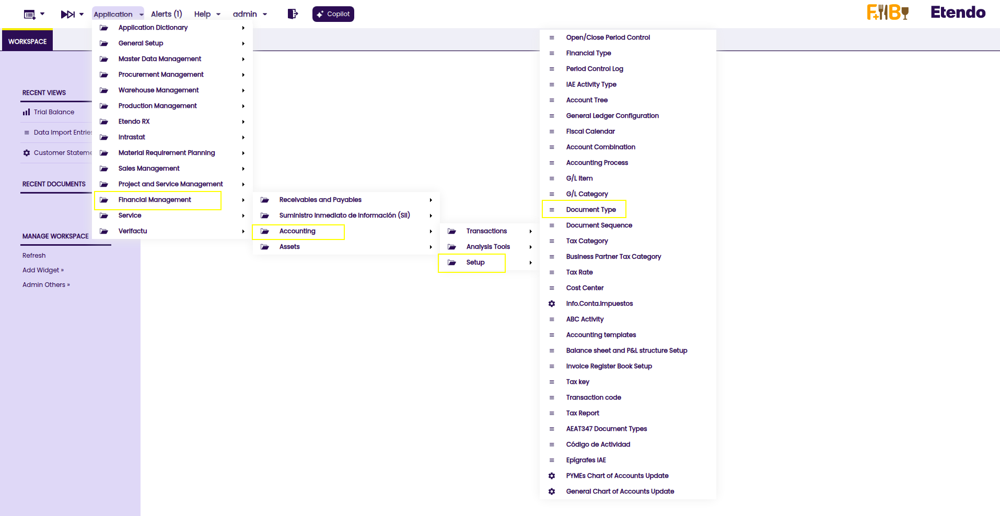
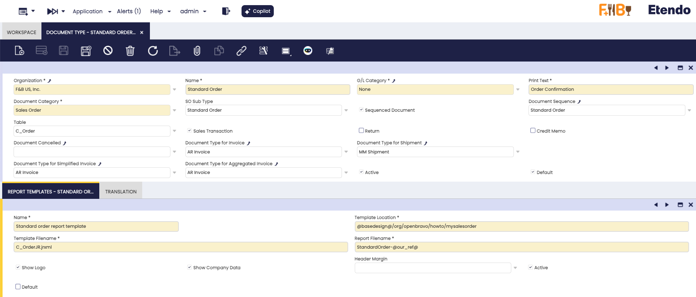
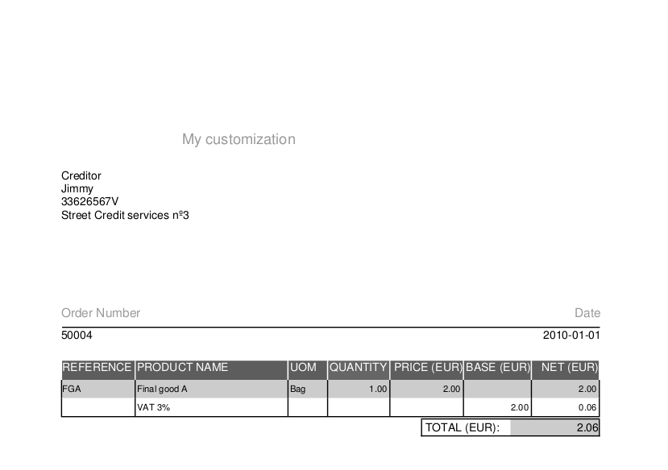

# How to change an existing Report
 
!!! example  "IMPORTANT: THIS IS A BETA VERSION"
    This page is under active development and may contain **unstable or incomplete features**. Use it **at your own risk**.

## Overview

When deploying Etendo, one of the most common initial customizations is adapting the standard document templates such as **Orders, Shipments, and Invoices** to meet the company’s functional requirements and corporate branding. These documents are shared across customer and vendor processes, making it essential that they reflect accurate information and a consistent visual identity.
This guide describes how to modify existing report templates in a modular and maintainable way, using the Sales Order report as the reference example.

!!! info 
    For more information visit, [How to Create a Report ](../how-to-guides/how-to-create-a-report.md).


## Defining the Module

First it is necessary to define a new module that contains your report modifications.

!!! info
    For more information about creating a module, visit [How to Create a Module ](../how-to-guides/how-to-create-a-module.md). 

1. As System Administrator
    - Create a new record in the **Module** window.
    - Fill all required fields. 
    - Fill all required data in child tabs: Dependency, DB Prefix, etc.
    
    


2. Export your changes to create the module structure

    ``` bash title="Terminal"
    ./gradlew export.database
    ```

## Copying the Base Template

After exporting the changes, there will be a new folder under the modules folder.

- Create a src folder. 
- Copy the base templates from `src/org/openbravo/erpReports/C_Order*.jrxml` to the module folder.

    It is important to follow the **Java package structure** so to end up with some structure like this one:

    

## Changing the Template

After making a copy of the **base template** to the module, it is possible to make all the changes you need. Just add a simple label to the report header.

- Start iReport.
- Open the `C_OrderJR.jrxml` file of your module.
- Add a simple label: **My customization**.

    !!!info
        It is possible to customize your template with any change you like, more fields, changing position, etc.  

    

- Rebuild your changes to deploy the module structure 
    
    ```bash title="Terminal"
    ./gradlew smartbuild
    ```

- Reload Etendo from Tomcat Manager 

## Defining the Report Template at Document Level

Report templates are defined at **document level**. It is necessary to change it in order to work.

- As Client Admin Role 
- Go to: `Financial Management > Accounting > Setup > Document Type`

    

- Search for Name **Standard Order** and open it. 
    - Open the **Report Template** tab and modify the **Template Location** field. 
    - Use the location where your copy is located. E.g  `@basedesign@/org/openbravo/howto/mysalesorder`
    - Save the changes. 

    

## Testing the changes

All the definitions required to use the customized **Sales Order** template has been done. It is only needed to verify that the new document template created renders the document as expected with an existing Sales Order document.

- Open any Sales Order using **Standard Order** as document type.
- Print it.



---
This work is a derivative of [How to Change an Existing Report](http://wiki.openbravo.com/wiki/How_to_change_an_existing_Report){target="\_blank"} by [Openbravo Wiki](http://wiki.openbravo.com/wiki/Welcome_to_Openbravo){target="\_blank"}, used under [CC BY-SA 2.5 ES](https://creativecommons.org/licenses/by-sa/2.5/es/){target="\_blank"}. This work is licensed under [CC BY-SA 2.5](https://creativecommons.org/licenses/by-sa/2.5/){target="\_blank"} by [Etendo](https://etendo.software){target="\_blank"}. 

