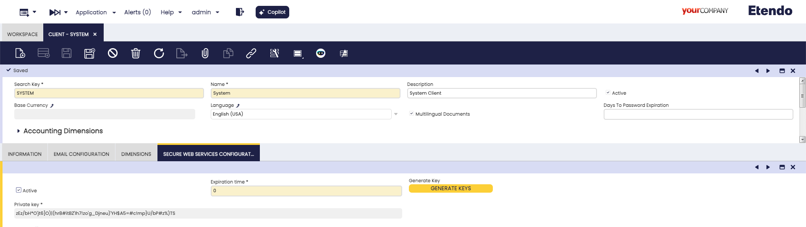

---
tags:
  - How to
  - Etendo Classic
  - Main UI
  - Docker
  - Configuration
---

# How to Configure Etendo Main UI

## Overview

Etendo Main UI is a modern React/TypeScript-based user interface included in the base Etendo installation. It runs as a containerized Docker service alongside the Etendo instance and is started automatically with `./gradlew resources.up`.

This guide covers manual configuration of the Main UI variables and the advanced development setup for contributors.

!!! info
    To be able to include this functionality, the Platform Extensions Bundle must be installed. To do that, follow the instructions from the marketplace: [_Platform Extensions Bundle_](https://marketplace.etendo.cloud/#/product-details?module=5AE4A287F2584210876230321FBEE614){target="\_blank"}. For more information about the available versions, core compatibility and new features, visit [Platform Extensions - Release notes](../../../whats-new/release-notes/etendo-classic/bundles/platform-extensions/release-notes.md).

## Requirements

- Etendo project properly set up. See the [Local Development](../getting-started/installation/local-development.md) or [Server Installation](../getting-started/installation/production-server.md) guides.
- [Docker](https://docs.docker.com/get-docker/){target="_blank"} version `26.0.0` or higher
- [Docker Compose](https://docs.docker.com/compose/install/){target="_blank"} version `2.26.0` or higher

!!! warning
    Avoid installing Docker via [Snap](https://snapcraft.io){target="_blank"} — its sandbox restrictions may prevent Etendo Docker containers from accessing host directories correctly. Install Docker following the official guide for your distribution.

!!! info
    The [Docker Management](../bundles/platform/docker-management.md) module, included as a dependency, manages the distribution of infrastructure within Etendo modules via Docker containers.

## Client Access Token

:material-menu: `Application` > `General Setup` > `Client` > `Client`

A one-time encryption token must be configured for authentication. This token is required for the Main UI to start a session.

!!! note
    Starting from **Etendo 26.1**, the SWS key is generated automatically during `./gradlew install` — no manual action is needed for new installations. For earlier versions, or to rotate the key, use one of the following options (not both):

    - **From the command line:** `./gradlew generate.sws.keys`
    - **From the UI:** follow the steps below.

The following steps apply only if you need to generate or rotate the key manually:

1. Access Etendo Classic as a `System Administrator`.
2. Navigate to `Client` > `Secure Web Service Configuration` tab.
3. Click **Generate Key** to create a token. The expiration time is in minutes; set to `0` for no expiration.



## Configuration

### Using the Interactive Setup

Run the interactive configuration assistant to set all required variables:

```bash title="Terminal"
./gradlew setup -Pinteractive=true --console=plain
```

For a full walkthrough, see the [How to Use the Interactive Setup](./how-to-use-interactive-setup.md) guide.

Then start the Docker services:

```bash title="Terminal"
./gradlew resources.up
```

### Manual Configuration

Add the following variables to `gradle.properties`:

```groovy title="gradle.properties"
docker_com.etendoerp.mainui=true
etendo.classic.url=http://host.docker.internal:8080/etendo
etendo.classic.host=http://localhost:8080/etendo
authentication.class=com.etendoerp.etendorx.auth.SWSAuthenticationManager
ws.maxInactiveInterval=3600
next.public.app.url=http://localhost:3000
ui.port=3000
```

| Variable | Description | Local | Production |
|---|---|---|---|
| `docker_com.etendoerp.mainui` | Enables the Main UI Docker service. | `true` | `true` |
| `etendo.classic.url` | Backend URL used by the Main UI server to connect to Etendo Classic. Use `host.docker.internal` when Main UI runs in Docker and Tomcat runs locally. | `http://host.docker.internal:8080/etendo` | `https://your.backend.etendo.cloud/etendo` |
| `etendo.classic.host` | Client-side URL the browser uses to make direct requests to Etendo Classic. | `http://localhost:8080/etendo` | `https://your-domain.com/etendo` |
| `authentication.class` | Java class that manages authentication between Main UI and Etendo Classic. | `com.etendoerp.etendorx.auth.SWSAuthenticationManager` | `com.etendoerp.etendorx.auth.SWSAuthenticationManager` |
| `ws.maxInactiveInterval` | Session duration in seconds for the Main UI WebSocket connection. Does not affect Etendo Classic session timeout. | `3600` | `3600` |
| `next.public.app.url` | Public URL where users access the Main UI. | `http://localhost:3000` | `https://your.frontend.etendo.cloud` |
| `ui.port` | Port on which the Main UI service listens inside the container. Must match the port referenced in `next.public.app.url`. | `3000` | `3000` |

Apply the configuration and start services:

```bash title="Terminal"
./gradlew setup
./gradlew resources.up
```

!!! warning "host.docker.internal not resolving"
    On some Linux systems, `host.docker.internal` may not resolve correctly inside the container, causing connection errors even when the rest of the setup works. If this happens, find the actual host IP by running:

    ```bash
    docker run --rm alpine sh -c 'ip route show default | head -1 | cut -d" " -f3'
    ```

    Use the IP returned by that command in place of `host.docker.internal` in `etendo.classic.url`. For example:

    ```groovy title="gradle.properties"
    etendo.classic.url=http://172.17.0.1:8080/etendo
    ```

    After updating `gradle.properties`, rebuild and restart the containers so the new value is picked up:

    ```bash title="Terminal"
    docker compose down
    docker rmi $(docker images | grep mainui | awk '{print $3}')
    ./gradlew setup
    ./gradlew resources.up
    ```

## Access the Main UI

Once all services are running, the Main UI is available at:

| Environment | URL |
|---|---|
| **Local** | [http://localhost:3000](http://localhost:3000){target="_blank"} |
| **Production** | `https://<server-address>/` |

## Advanced Configuration

This section is for developers who want to contribute to or customize the Main UI codebase directly.

### Additional Requirements

- **Node.js** version `^18.0.0` or higher
- **pnpm** version `^9.15.2`

### Required Modules

Install the following modules in the `modules/` directory:

```bash title="Terminal"
cd modules
git clone git@github.com:etendosoftware/com.etendoerp.etendorx.git
git clone git@github.com:etendosoftware/com.etendoerp.openapi.git
git clone git@github.com:etendosoftware/com.etendoerp.metadata.git
git clone git@github.com:etendosoftware/com.etendoerp.metadata.template.git
```

### Project Structure

```
com.etendorx.workspace-ui/
├── packages/
│   ├── api-client/          # API client for backend communication
│   ├── ComponentLibrary/    # Reusable UI components
│   └── MainUI/              # Main application
├── package.json
├── pnpm-workspace.yaml
└── README.md
```

### Development Setup

1. Clone the Main UI development repository:

    ```bash title="Terminal"
    git clone https://github.com/etendosoftware/com.etendorx.workspace-ui.git
    cd com.etendorx.workspace-ui
    ```

2. Install dependencies:

    ```bash title="Terminal"
    pnpm install
    ```

3. Create `packages/MainUI/.env.local` and add the backend URL:

    ```env title=".env.local"
    ETENDO_CLASSIC_URL=http://localhost:8080/etendo
    ```

4. Build required packages in order:

    ```bash title="Terminal"
    pnpm --filter @workspaceui/api-client build
    pnpm --filter @workspaceui/componentlibrary build
    ```

5. Start the development server:

    ```bash title="Terminal"
    pnpm dev
    ```

    The application is available at [http://localhost:3000](http://localhost:3000){target="_blank"}.

### Development Commands

**Root-level commands:**

```bash title="Terminal"
pnpm dev          # Start Main UI development server
pnpm build        # Build all packages
pnpm test         # Run tests across all packages
pnpm lint         # Lint all packages
pnpm lint:fix     # Fix lint issues automatically
pnpm format       # Format code across all packages
pnpm format:fix   # Auto-fix formatting issues
pnpm clean        # Clean all build artifacts
```

**Per-package commands:**

```bash title="Terminal"
pnpm --filter @workspaceui/mainui dev
pnpm --filter @workspaceui/api-client build
pnpm --filter @workspaceui/componentlibrary build
pnpm --filter @workspaceui/api-client test
pnpm --filter @workspaceui/mainui lint
```

---
This work is licensed under :material-creative-commons: :fontawesome-brands-creative-commons-by: :fontawesome-brands-creative-commons-sa: [ CC BY-SA 2.5 ES](https://creativecommons.org/licenses/by-sa/2.5/es/){target="_blank"} by [Futit Services S.L](https://etendo.software){target="_blank"}.
