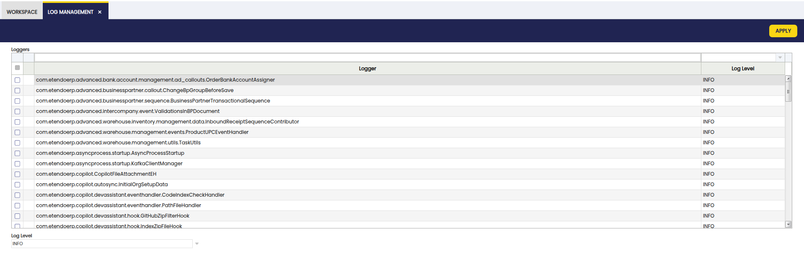

# How to Configure Log

## Overview

Logging allows developers to **record messages** during code execution. Use these messages to diagnose backend issues such as errors, warnings, and performance bottlenecks.

To learn how to use logging in your custom code, refer to the [How To Log Using Log4j](how-to-log-using-log4j.md) guide.

## Configuration

Logging is configured using three main configuration files, depending on the scenario:

- `config/log4j2.xml`: Configuration for command-line build tasks (e.g., `./gradlew install`). 
- `config/log4j2-web.xml`: Configuration for the Web Application running in a container like Tomcat. 
- `src-test/src/log4j2-test.xml`: Configuration used specifically for JUnit tests and suites. 

### File

By default, log output is redirected to a file. This is defined by the `<RollingFile>` tag inside the `<Appenders>` section. The defaults are:

```XML title="log4j2-web.xml"
<RollingFile name="RollingFile" fileName="${logDir}/etendo.log"
                filePattern="${logDir}/etendo-%d{yyyyMMdd}-%i.log.gz">
<PatternLayout pattern="%d [%t] %-5p %c - %m%n"/>
    <Policies>
    <TimeBasedTriggeringPolicy />
    <SizeBasedTriggeringPolicy size="100MB" />
    </Policies>
    <DefaultRolloverStrategy max="30"/>
</RollingFile>
```
With this configuration, the main log is written to `etendo.log` within the `${logDir}` directory. In a standard Tomcat deployment, this directory is typically found in the `logs/` folder of the Tomcat installation.

!!! tip
    If you are running Etendo from the command line, `${logDir}` usually points to the `build/` directory or the project root depending on the task execution.

### Console Logging

You can also see logs in the console (Standard Output) by using the `<AppenderRef ref="Console"/>` appender. This is useful for development to avoid constantly tailing a file.

```XML
<Loggers>
    <Root level="info">
        <AppenderRef ref="RollingFile"/>
        <AppenderRef ref="Console"/>
    </Root>
</Loggers>
....
<Appenders>
    <Console name="Console" target="SYSTEM_OUT">
        <PatternLayout pattern="%d [%t] %-5p %c - %m%n"/>
    </Console>
    ...
</Appenders>
```

### Log Verbosity

Verbosity is controlled by log levels: `ALL`, `TRACE`, `DEBUG`, `INFO`, `WARN`, `ERROR`, `FATAL`, and `OFF`.

| Level | Description |
|-------|-------------|
| ALL   | All levels, including custom ones. |
| TRACE | Extremely fine-grained informational events, more detailed than DEBUG. |
| DEBUG | Fine-grained informational events most useful for debugging applications. |
| INFO  | Informational messages highlighting application progress at a high level. |
| WARN  | Potentially harmful situations. |
| ERROR | Error events that might allow the application to continue running. |
| FATAL | Severe error events that will likely lead to application failure. |
| OFF   | No log messages. |

!!! warning "Production environments"
    Avoid using `DEBUG` or `TRACE` levels in production environments, as they can significantly impact performance and consume large amounts of disk space.

It is possible to configure the log level **globally** or **per class/package**.

This can be modified in two ways:

- **Static Configuration**: Edit the `log4j2*.xml` files. This requires a redeploy (`./gradlew smartbuild`) and a Tomcat restart to take effect.
    
    - **Globally**: Change the Root Logger level: 

        ``` XML    
        <Loggers>
            <Root level="debug">
            ...
            </Root>
        </Loggers>
        ```

    - **Per Java class or package**: Add a `<Logger>` entry: 

        ``` XML 
        <Loggers>
        ...
        <!-- Set a specific package to debug level -->
        <Logger name="com.etendoerp.copilot" level="debug"/>
        ...
        </Loggers>
        ```

        !!! note
            These loggers inherit appenders from the Root logger by default. To change this, set the `additivity` attribute to `false`. 

        !!! info
            For more information, see the [Log4j2 documentation](https://logging.apache.org/log4j/2.x/manual/configuration.html#Additivity){target="\_blank"}. 

- **Runtime Configuration**: This method does not require a restart but is non-persistent (settings are lost after a Tomcat restart). To modify levels at runtime:
    1. Log into the application as **System Administrator**.
    2. Navigate to `General Setup > Application > Log Management`. 
    3. Filter and select the desired loggers.
    4. Choose the log level to set and click **Apply**.

    

!!! info
    Loggers for classes or packages appear in this list as they are executed. If a specific logger is missing, run the functionality that uses it to register it in the system. Note that restarting Tomcat clears this list, and you will need to re-run the features to see the loggers again. For debugging during application startup, configure the log level directly in `log4j2-web.xml`.

## Rotation

To prevent log files from growing indefinitely, **rotation** is configured to archive old logs.

Configuration is handled in the `<RollingFile>` section:
    
``` XML
<Policies>
    <SizeBasedTriggeringPolicy size="100MB" />
    <TimeBasedTriggeringPolicy />
</Policies>
<DefaultRolloverStrategy max="30">
    <Delete basePath="${logDir}">
    <IfFileName glob="etendo-*.log.gz">
        <IfAccumulatedFileCount exceeds="30"/>
    </IfFileName>
    </Delete>
</DefaultRolloverStrategy>
```

By default, the log file is limited to **100MB**. It is archived and compressed daily or when it reaches the size limit. Up to 30 archived files are kept; once this limit is reached, the oldest archive is deleted.

---
This work is a derivative of [How to Configure Log](http://wiki.openbravo.com/wiki/How_To_Configure_Log){target="\_blank"} by [Openbravo Wiki](http://wiki.openbravo.com/wiki/Welcome_to_Openbravo){target="\_blank"}, used under [CC BY-SA 2.5 ES](https://creativecommons.org/licenses/by-sa/2.5/es/){target="\_blank"}. This work is licensed under [CC BY-SA 2.5](https://creativecommons.org/licenses/by-sa/2.5/){target="\_blank"} by [Etendo](https://etendo.software){target="\_blank"}. 

