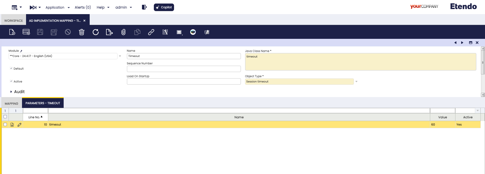

# How to Configure Session Timeout

## Overview

Etendo Classic includes a session timeout mechanism that logs out users after a defined period of inactivity. This feature helps ensure security and efficient resource management.

This guide explains how to configure the session timeout setting in Etendo Classic, including steps to apply and export the configuration.

## What is Session Timeout?

The session timeout defines the duration of user inactivity that triggers automatic session termination.  

- For example, with a timeout set to **60 minutes**, a user who remains inactive for that time will be automatically logged out.  
- If a user closes the browser without selecting **Close Session**, the session will still expire after the configured timeout period.


## Customizing Session Timeout
:material-menu: `Application` > `Application Dictionary` > `AD Implementation Mapping`

Follow these steps to configure a custom session timeout:

1. Log in as a **System Administrator**.
2. Go to `Application Dictionary > AD Implementation Mapping`.
3. Search for the object named `Timeout`.
4. Switch to the `Parameters` tab and locate the **Timeout** parameter.
5. Set the **Search Key** to the desired timeout value (in minutes).

!!!tip
    Default session timeout: **60 minutes**

!!!info 
    Before exporting this configuration, ensure that an **active template** is present, as this is a core system value that cannot be modified unless a template is active.



## Applying the Changes

After modifying the timeout parameter, apply the changes using the following Gradle task:

```bash title="Terminal"
./gradlew smartbuild
```
This command regenerates the `web.xml` file and applies the necessary changes.


## Exporting the Configuration

If a template is active and you wish to export the modified session timeout configuration, run:

```bash title="Terminal"
./gradlew export.config.script
```

!!!note
    This step is required only when distributing the configuration as part of a template. If not exported, the change may be lost upon future builds or updates.


