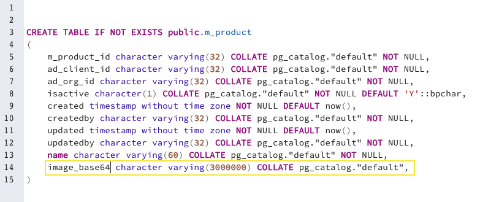
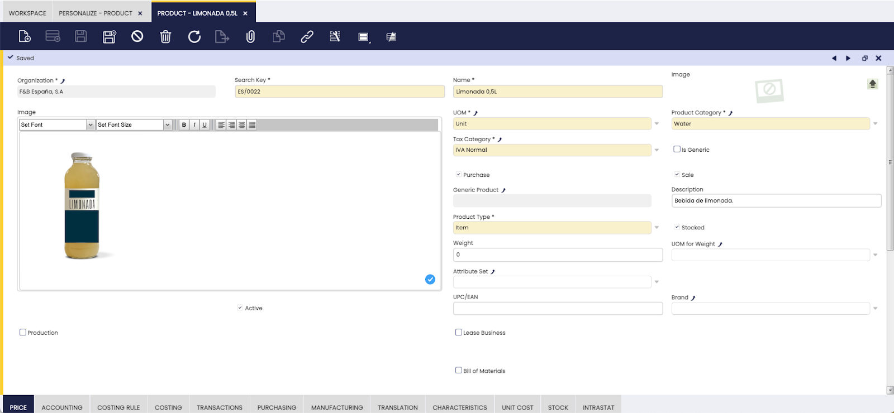

## Copy and Paste Images in Etendo

### Overview

This section explains how to use rich text areas to save images in Etendo.

### How to include images with rich text areas

First, the user must define a column in the database where the corresponding image is saved.

!!! info
    To do this, it is important to remember that this column must have the enough size to store a codified image in base64 format. For example: a 2 MB image contains 3 million characters.




Once the column is defined, the user must log in with the System Administrator role, go to Application Dictionary | Windows, Tables and Columns, find the corresponding table, in our case “product” and create columns from the database with the “Create column from DB” button. 

In the recently created column, the reference “rich text area” must be selected. 

Also, a field for the corresponding image must be created. 

Finally, it is necessary to compile executing:

```bash title="Terminal"
./gradlew smartbuild
```




As seen in the image above, the “image” field was created, in which it is possible to paste content to store in base64 format in the database. In this way, this information is available for later.