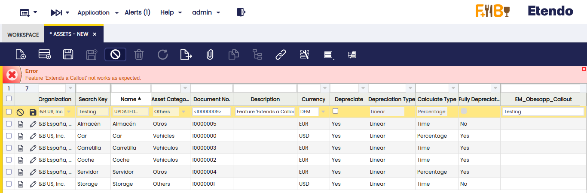
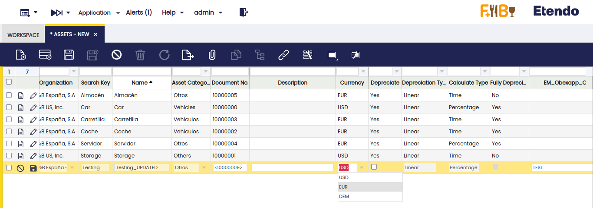
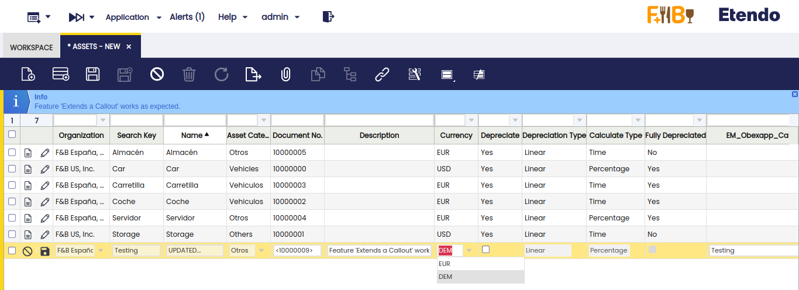

#  How to Create a Callout that Extends from Another Callout
  
##  Overview

This section discusses how to implement a callout that extends from another callout. The main important elements needed for the new feature are explained. More details about callouts can be found in [How to create a Callout](How_to_create_a_Callout.md).
  
##  Example Module

This section is supported by an example module which shows examples of the code shown and discussed.

The code of the example module can be downloaded from this public GitHub repository: [com.etendoerp.client.application.examples](https://github.com/etendosoftware/com.etendoerp.client.application.examples){target="_blank"}.

##  Defining Callouts

Two callouts will be shown. One of them is the parent callout and the other one is the child callout. In this example, these two callouts are working in **Assets** window.

####  Defining Parent Callout

The following example follows [this guide](How_to_create_a_Callout.md) to implement the callout. The example shows a callout that edits value of the **Name** field.

```java
  package com.etendoerp.client.application.examples.callouts;
  
  import javax.servlet.ServletException;
   
  import org.openbravo.erpCommon.ad_callouts.SimpleCallout;
   
  public class OBEXAPP_Assets_Name extends SimpleCallout {
   
    protected static final String MODIFIED_FIELD = "_UPDATED";
   
    @Override
    protected void execute(CalloutInfo info) throws ServletException {
   
      // get value of field name and update value
      final String name = info.getStringParameter("inpname");
      info.addResult("inpname", name + MODIFIED_FIELD);
   
      // Combo example. Added three currencies to currency combo.
      info.addSelect("inpcCurrencyId");
      // USD currency is selected.
      info.addSelectResult("100", "USD", true);
      info.addSelectResult("102", "EUR", false);
      info.addSelectResult("103", "DEM", false);
      info.endSelect();
    }
   
  }
```

As you can see, the callout gets the value of **Name** field and concatenates the following string: `_UPDATED`. Besides you can see a code that defines a combo. This code will be explained in the following section.

####  Defining Child Callout

This example callout extends from the parent callout that is defined above. Combo example is explained in next section.

```java
  package com.etendoerp.client.application.examples.callouts;
  
  import javax.servlet.ServletException;
   
  public class OBEXAPP_Assets_Desc extends OBEXAPP_Assets_Name {
   
    @Override
    protected void execute(CalloutInfo info) throws ServletException {
   
      // OBEXAPP_Assets_Name callout is executed
      super.execute(info);
   
      // Combo example. Removed USD currency from combo and select DEM currency.
      info.addSelect("inpcCurrencyId");
      info.removeSelectResult("100");
      info.addSelectResult("103", "DEM", true);
      info.endSelect();
   
      // Checks if name field has been updated by parent callout.
      String name = info.getStringParameter("inpname");
      String message = "Feature 'Extends a Callout' works as expected.";
      if (name.endsWith(MODIFIED_FIELD)) {
        info.addResult("inpdescription", message);
        info.addResult("MESSAGE", message);
      } else {
        message = "Feature 'Extends a Callout' not works as expected.";
        info.addResult("inpdescription", message);
        info.addResult("ERROR", message);
      }
   
      // Now it is possible to update the 'name' field again and the value will be overwritten
      info.addResult("inpname", "UPDATED...");
    }
  }
```

First of all, `OBEXAPP_Assets_Desc` callout extends from `OBEXAPP_Assets_Name`. In this situation, you should take into account the following sections in this callout:

  * Run parent callout. 
  
  ```java
      // OBEXAPP_Assets_Name callout is executed
      super.execute(info);
  ```

  * Operations for **combo** field are executed. This code is explained in the next section. 
  
  ```java
      // Combo example. Removed USD currency from combo and select DEM currency.
      info.addSelect("inpcCurrencyId");
      info.removeSelectResult("100");
      info.addSelectResult("103", "DEM", true);
      info.endSelect();
  ```
  
  * Operations **after** parent callout is executed. In this case, child callout checks if name is been modified by parent callout. Then, child callout takes two actions. Update the description field with a message and shows an information or failure message. Finally, the name field is updated again. 

  ```java
      // Checks if name field has been updated by parent callout.
      String name = info.getStringParameter("inpname");
      String message = "Feature 'Extends a Callout' works as expected.";
      if (name.endsWith(MODIFIED_FIELD)) {
        info.addResult("inpdescription", message);
        info.addResult("MESSAGE", message);
      } else {
        message = "Feature 'Extends a Callout' not works as expected.";
        info.addResult("inpdescription", message);
        info.addResult("ERROR", message);
      } 
        
      // Now it is possible to update the 'name' field again and the value will be overwritten
      info.addResult("inpname", "UPDATED...");
  ```

In the following screenshot, you can see how a failure message is displayed.

!!!note
    For the purpose of this example, a new column named 'EM_Obexapp_Callout' was created to trigger the callout.  



##  Working with Combos

As you can see in above sections, the `OBEXAPP_Assets_Name` callout builds a currency combo. This combo is populated with 3 currencies and one of them is selected.
  ```java
      // Combo example. Added three currencies to currency combo.
      info.addSelect("inpcCurrencyId");
      // USD currency is selected.
      info.addSelectResult("100", "USD", true);
      info.addSelectResult("102", "EUR", false);
      info.addSelectResult("103", "DEM", false);
      info.endSelect();
  ```

You can see the currency combo with 3 currencies and **USD** as selected currency.



  
Then, child callout `OBEXAPP_Assets_Desc` removes a currency and select another one. This child callout extends `OBEXAPP_Assets_Name` and change the currency combo.
  ```java
      // Combo example. Removed USD currency from combo and select DEM currency.
      info.addSelect("inpcCurrencyId");
      info.removeSelectResult("100");
      info.addSelectResult("103", "DEM", true);
      info.endSelect();
  ```
In this screenshot, you can see how currency combo is displayed when child callout is executed.

!!!note
    The DEM currency is selected and USD currency has been removed.    
  


##  Using getStringParameter method

This method is used in callouts to get values of any field of the window (e.g. value of name field in Assets window).

Now, with the inclusion of this project this method takes into account if a parent callout modified a value. If a value was modified,
`getStringParameter()` method returns value modified by parent callout. If not, `getStringParameter()` method returns the initial value of the parameter. 

---

This work is a derivative of [How to Create a Callout that Extends from Another Callout](http://wiki.openbravo.com/wiki/How_to_create_a_callout_that_extends_from_another_callout){target="blank"} by [Openbravo Wiki](http://wiki.openbravo.com/wiki/Welcome_to_Openbravo){target="\_blank"}, used under [CC BY-SA 2.5 ES](https://creativecommons.org/licenses/by-sa/2.5/es/){target="\_blank"}. This work is licensed under [CC BY-SA 2.5](https://creativecommons.org/licenses/by-sa/2.5/){target="\_blank"} by [Etendo](https://etendo.software){target="\_blank"}.