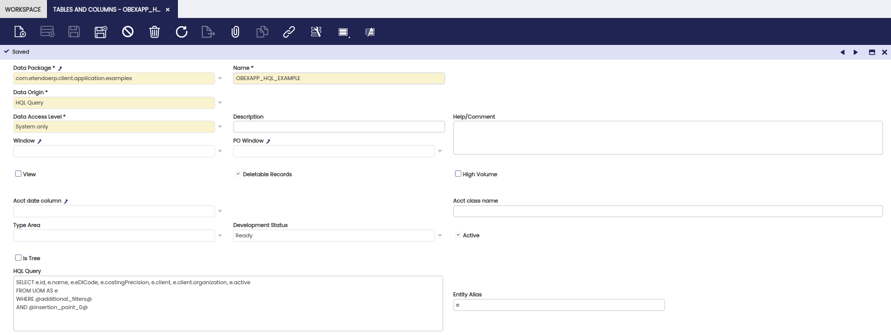

# How to create a HQL Based Table

## Introduction

There are three available data origin in the definition of a table in the application dictionary:

  * Table: A table actually defined in a DBMS.
  * Datasource: A manual datasource will be used for the data origin of this table.
  * HQL Table.

The _HQL Table_ data origin allows to define a table without the need of a physical table in the database and without having to define a manual datasource.

HQL Based Tables must define a HQL select query, that will be used to obtain the proper records when a request to its datasource is done.

## Defining a HQL Based Table in the Application Dictionary

### Table Definition

When a HQL based table is defined in the application dictionary, there is no need to fill in the _DB Table Name_ and _Java Class Name_ fields. There are two new fields that must be set for these tables:

  * HQL Query: The HQL query that will be used to fetch the records for this table.
  * Entity Alias: The alias of one of the tables used in the HQL Query. It will be used to add automatically the mandatory client and organization filters.

Design considerations for HQL queries:

  * Use alias for all the columns and tables used in the query. It will simplify the column definition in the application dictionary.
  * Include the string _@additional_filters@_ inside a where clause in the HQL Query. That string will be replaced with the mandatory client and organization filters, and with the filters generated from the criteria included in the datasource request.
  * All HQL queries should include a column that acts as its primery key. The alias of this column should be _id_.
  * If a HQL query contains several from clauses because it uses subqueries in the select clause or in the where clause, then the MAINFROM text must be used instead of FROM in the main from clause.



### Column Definition

The _Create Columns from DB_ process does not apply to HQL based tables, so they have to be created manually.

Considerations in the definition of columns of HQL tables in the application dictionary:

  * The _DB Column Name_ and the _Name_ of the column must be the alias used for the column in the HQL Query.
  * The _Clause Left Part_ field must be filled with the left part definition of the column in the HQL query. For instance, if a column is defined in the HQL query is `e.name as countryName` , then the _Name_ and _DB Column Name_ of the column must be `countryName` and its _Clause Left Part_ must be `e.name`.

To include a foreign key in a column of a HQL table, the column must point to the referenced entity itself, not to its id. Then, when that column is defined in the application dictionary, the _Table_ reference must be used, and the proper table instance must be selected in the _Reference Search Key_ field.

For instance, if `e` is the alias of the Country table and we want to include its currency, we must enter `e.currency as countryCurrency` in the HQL query. Then we must select the _Table_ reference in the definition of that column in the application dictionary and `c_currency` in the _Reference Search Key_ field.

## Tab and Fields Definition

The tab and the fields of a HQL based table are defined in the application dictionary in the same way as with standard tables.
The only restriction is that all tabs associated with HQL based tables will be read only.

## Advanced Topics

### HQL Inserters

HQL Inserters allow to add code to a HQL query at a point specified in the HQL Query defined in the application dictionary.

#### HQL Insertion points in the HQL Query

To define a HQL Insertion point in your HQL query you need to use the `@insertion_point#@` string, `#` being the index of the insertion point. The
index of the first injection point must be 0, the index for the second must be 1, etc. There cannot be gaps in the indexes of insertion points.

Insertion points can only be defined in `where clauses`. If the HQL Query defines an insertion point but then there are no `HQLInserter` defined for it, then the insertion point will be replaced by `1 = 1` in the HQL query.

For instance, this HQL Query defines a place to enter the additional filters and an HQL insertion point:

```HQL
SELECT 
  e.id, 
  e.name, 
  e.eDICode, 
  e.costingPrecision, 
  e.client, 
  e.client.organization, 
  e.active
FROM 
  UOM AS e
WHERE 
  @additional_filters@
AND 
  @insertion_point_0@
```

#### Defining a HQL Inserter

Custom HQL inserters must extend the `HQLInserter` class. Subclasses of the `HQLInserter` class must implement this method:

```java
/**
  * Returns some code to be inserted in a HQL query, and adds query named parameters when needed
  * 
  * @param requestParameters
  *          the parameters of the request. The inserted code may vary depending on these
  *          parameters
  * @param queryNamedParameters
  *          the named parameters of the hql query that will be used to fetch the table data. If
  *          the inserted code uses named parameters, the named parameters must be added to this
  *          map
  * @return the hql code to be inserted
  */
public abstract String insertHql(Map<String, String> requestParameters,
    Map<String, Object> queryNamedParameters);
```

The string returned by this method will be used to replace the @insertion_point_#@.

`HQLInserter` are instantiated using dependency injection. A particular `HQLInserter` is used to replace a specific injection point of a particular table. For instance, the following `HQLInserter` is used to replace the `@insertion_point_0@` defined in the HQL query of the table with ID `59ED9B23854A4B048CBBAE38436B99C2`:

```java
  @HQLInserterQualifier.Qualifier(tableId = "59ED9B23854A4B048CBBAE38436B99C2", injectionId = "0")
public class AddPaymentCreditToUseInjector extends HqlInserter {
 
  @Override
  public String insertHql(Map<String, String> requestParameters,
      Map<String, Object> queryNamedParameters) {
    final String strBusinessPartnerId = requestParameters.get("received_from");
    final BusinessPartner businessPartner = OBDal.getInstance().get(BusinessPartner.class,
        strBusinessPartnerId);
    boolean isSalesTransaction = "true".equals(requestParameters.get("issotrx")) ? true : false;
    queryNamedParameters.put("bp", businessPartner.getId());
    queryNamedParameters.put("issotrx", isSalesTransaction);
    return "f.businessPartner.id = :bp and f.receipt = :issotrx";
  }
}
```

### HQL Transformers

While HQL Inserters only allow to add some criterion on a point predefined by the user that created the HQL Query, HQL Transformers allow to modify the whole structure of the query.

To implement a HQL transformer, you have to subclass the HqlQueryTransformer class.
This class has an abstract method that must be implemented in the custom HQL transformer:

```java
/**
  * Returns the transformed hql query
  * 
  * @param hqlQuery
  *          original hql query
  * @param requestParameters
  *          the parameters of the request
  * @param queryNamedParameters
  *          the named parameters of the hql query that will be used to fetch the table data. If
  *          the transformed hql query uses named parameters that did not exist in the original hql
  *          query, the named parameters must be added to this map
  * @return the transformed hql query
  */
public abstract String transformHqlQuery(String hqlQuery, Map<String, String> requestParameters,
    Map<String, Object> queryNamedParameters);
```

This function receives a HQL query, a map with the parameters sent in the request and a map with all the named parameters that are used in the HQL query. It returns the transformed HQL query, and if in the transformation some named parameters have been added to the query, they must be included in the queryNamedParameters map.

HQL transformers are instantiated using dependency injection. To apply a HQL transformer to a HQL table you must include the table id in the qualifier, for instance:

```java
@ComponentProvider.Qualifier("58AF4D3E594B421A9A7307480736F03E")
public class AddPaymentOrderInvoicesTransformer extends HqlQueryTransformer {
```

---
This work is a derivative of [How to create a HQL Based Table](http://wiki.openbravo.com/wiki/How_to_create_a_HQL_Based_Table){target="\_blank"} by [Openbravo Wiki](http://wiki.openbravo.com/wiki/Welcome_to_Openbravo){target="\_blank"}, used under [CC BY-SA 2.5 ES](https://creativecommons.org/licenses/by-sa/2.5/es/){target="\_blank"}. This work is licensed under [CC BY-SA 2.5](https://creativecommons.org/licenses/by-sa/2.5/){target="\_blank"} by [Etendo](https://etendo.software){target="\_blank"}.