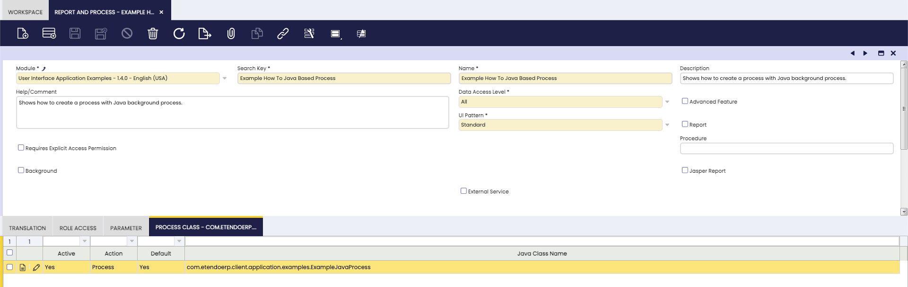
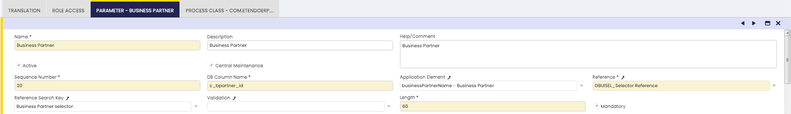
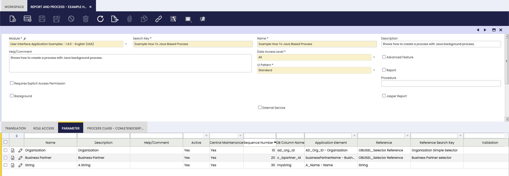
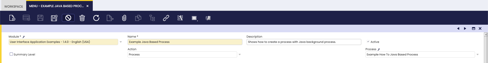
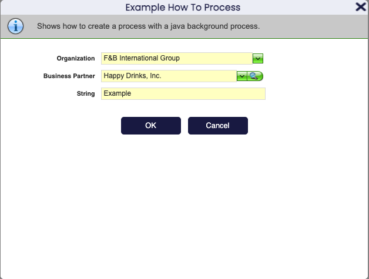
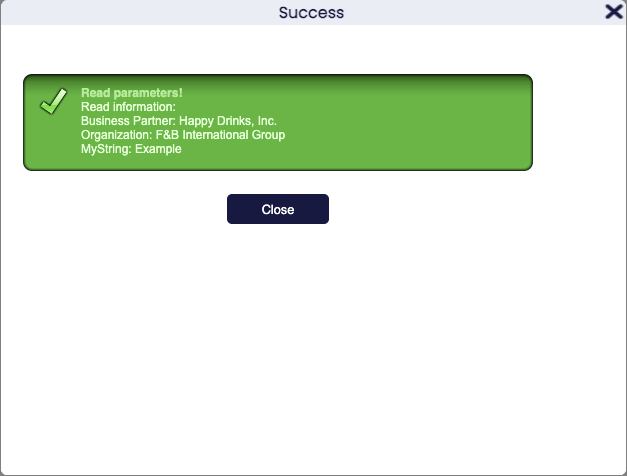

## Overview

**Java processes** are one of the mechanisms Etendo provides to implement business logic. A Java process can run in the [background process](../how-to-guides/how-to-develop-a-dal-background-process.md) or offer a user interface that allows entering parameters. This section explains how to create a Java process that includes a user interface with user-defined **parameters**. It also describes the underlying infrastructure used to support Java processes in Etendo.

!!! info
    For a generic description of java processes visit [Processes](../concepts/processes.md).

## Example Module

This section is supported by an example module which shows example of the code shown and discussed here. The code of the example module can be downloaded from this [repository](https://github.com/etendosoftware/com.etendoerp.client.application.examples){target="\_blank"}. 

!!! info
    For any specific development, create a new module. For more information visit, [How to create a module](../how-to-guides/how-to-create-a-module.md).


## Development Steps

The steps to create a java process supported by a user interface are:

  1. Create a **java class** implementing the business logic.
  2. Enter a new record in **Report and Process**, defining the pattern, the java class (step 1) and the parameters. 
  3. Add the **new process** to the menu.

### Java class declaration

First of all, take a look at the Java package in which the java class is defined, it must be included in the java package the module defines. The Java class implementing the process must implement the `org.openbravo.scheduling.Process` interface, this is done usually extending the class `org.openbravo.service.db.DalBaseProcess` that provides common code to use **DAL** in Processes. 

Extending this class there is only needed to overwrite one method:

``` java
public void doExecute(ProcessBundle bundle) throws Exception{...}
```

This method receives a `ProcessBundle`, this bundle contains all the parameters for the process. When the process finishes it must add a result to this bundle, this result is an `OBError` instance that will be shown in the pop-up. 

!!! info
    For further explanations on messages read the [Messages](../concepts/messages.md) documentation.

Let's see an example (this class and its parameters are used in the process definition further down in this section):  

``` java
public class ExampleJavaProcess extends DalBaseProcess {

  @Override
  public void doExecute(ProcessBundle bundle) throws Exception {
    try {

      // retrieve the parameters from the bundle
      final String bPartnerId = (String) bundle.getParams().get("cBpartnerId");
      final String organizationId = (String) bundle.getParams().get("adOrgId");
      final String myString = (String) bundle.getParams().get("mystring");

      // implement your process here

      // Show a result
      final StringBuilder sb = new StringBuilder();
      sb.append("Read information:<br/>");
      if (bPartnerId != null) {
        final BusinessPartner bPartner = OBDal.getInstance().get(BusinessPartner.class, bPartnerId);
        sb.append("Business Partner: " + bPartner.getIdentifier() + "<br/>");
      }
      if (organizationId != null) {
        final Organization organization = OBDal.getInstance()
            .get(Organization.class, organizationId);
        sb.append("Organization: " + organization.getIdentifier() + "<br/>");
      }
      sb.append("MyString: " + myString + "<br/>");

      // OBError is also used for successful results
      final OBError msg = new OBError();
      msg.setType("Success");
      msg.setTitle("Read parameters!");
      msg.setMessage(sb.toString());

      bundle.setResult(msg);

    } catch (final Exception e) {
      e.printStackTrace(System.err);
      final OBError msg = new OBError();
      msg.setType("Error");
      msg.setMessage(e.getMessage());
      msg.setTitle("Error occurred");
      bundle.setResult(msg);
    }
  }
}
```

In this example a parameter named `cBpartnerId` is expected. It is read by the following line:

``` java
final String bPartnerId = (String) bundle.getParams().get("cBpartnerId");
```

The name of the parameter to use in the get method depends on the **db column name** entered in the parameters of the process.

Once the process is finished a new `OBError` is created to handle the message and it is added as result to the **bundle**.

``` java
bundle.setResult(msg);
```

### Defining the user interface

The java class above shows how to implement the **backend business logic**. This section explains how to define a user interface which makes it possible to enter parameters.

To define process records, it is needed to be a **System Admin**.

The first step is to create a process record, go to `Application Dictionary > Report and Process`. Create a new process record as shown in the example below.



  
The main aspect here is to select **UI Pattern: Standard**. 

Then create a child record in **Process Class** and enter the fully qualified class name of the java class created below.

!!! note
    Check the default flag! If this is not done then a compile error will occur in the next build step.

Now the parameters of the process need to be defined. Or more exactly their type and visualization. This is done through the Parameter child tab of the process. The example has three parameters: **business partner, organization and a string**. The images below visualize their settings:





!!! note 
    - The **db column name** does not have to be a real database column, the value of this field is used to generate the parameter name used in the source code. It is adviced to use simple names without underscores,
    - The **application element** defines the label in the user interface,
    - The 2 reference fields denote the **type of the field**.

### Add the process form to the menu

To make the process window available to the user it has to be added to a **menu**.

This is done like this:




### Build Step

After creating the process user interface, stop the application and type in the following command in a console (within the development project):

``` bash title="Terminal"
./gradlew smartbuild
```

This will generate the process window. If IntelliJ is running, refresh the development project. Then start the application and login with the client administrator (normally the system administrator will not have access).

## The result

Go to quick launch and enter the name of the new process or find it in the correct location in the menu.



Enter some values and press ok. The result:



## Variant: Running the process from a button in another window

A process can also be executed from another window using a **button**. In Etendo, buttons displayed in a window are defined through an **AD Column** with **Reference = Button**, linked to a specific **process**.

To run a process from a button in an existing window, follow these steps:

#### 1. Add a column to the table used by the target window
- Go to `Application Dictionary > Table and Columns`.
- Locate the table that is shown in the window where you want the button to appear.
- Create a new column.

#### 2. Configure the column as a button linked to your process
- Set the column **Reference** to **Button**.
- In the column configuration, select the **Process** that should be executed when the button is pressed.
- Use a meaningful name (this will be the base for the label shown later through the **Application Element** / **Field**).

#### 3. Expose the button in the window
- Go to `Application Dictionary > Window, Tabs and Fields`.
- Locate the target **Window** and **Tab**.
- Create a **Field** linked to the column you created.
- Adjust its placement as needed so it appears in the desired section of the tab.

#### 4. Use the button in the UI
- Once the window is generated and the field is present, the user will see a button in the window (for example, a button like **“Example Document Action”**).
- Clicking the button will execute the configured process.
  
When a process is run from another window then the **ProcessBundle** will contain extra default parameters which can be useful:

- **recordID**: the id of the selected record.
- **tabId**: the id of the tab from which the process was called.

## Variant: Manual UI Pattern

The difference between **Standard and Manual UI Pattern** is that no pop-up is automatically generated for **Manual UI** pattern processes, in this case the pop-up must be manually generated by the class implementing the process.

As shown above, java classes for **standard processes** implement the manual processes that are implemented by a Java class `org.openbravo.scheduling.Process` interface. 

For **manual processes**, the java class needs to extend `org.openbravo.base.secureApp.HttpSecureAppServlet`, this is a standard servlet that generates the pop-up.
