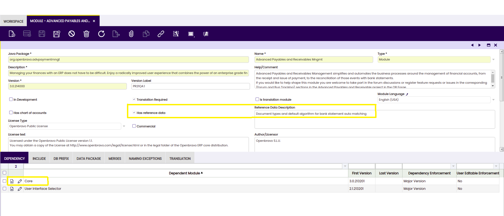
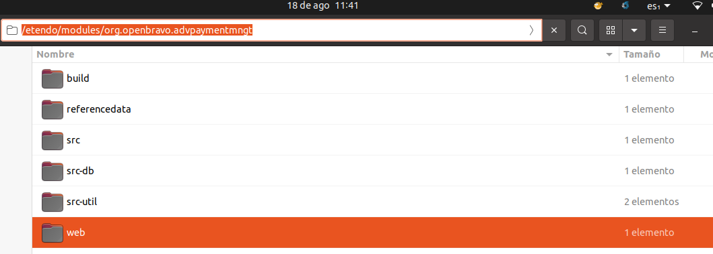
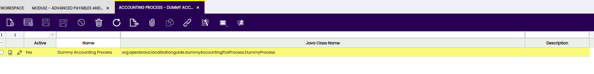
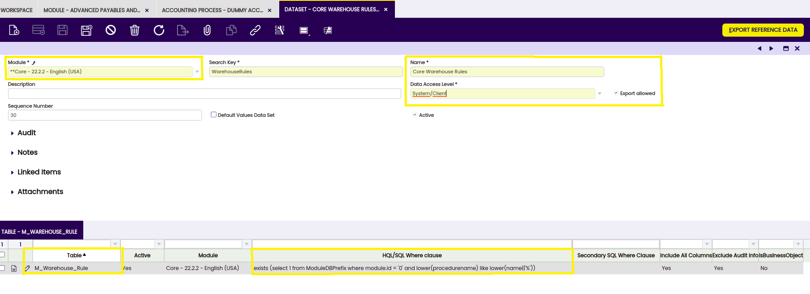

## Introduction

This module is not to change the accounting entries generated by Etendo, but to run any additional process to be executed at posting time.
 
From the functional side, there is no special requirement for the development of this module. It is just recommended to understand the role of  [Accounting Schemas](../../../user-guide/etendo-classic/basic-features/financial-management/accounting/setup.md#general-ledger-configuration) in the general accounting configuration for Etendo.

Etendo allows running processes just after the posting logic for any document which has been successfully completed. These kinds of processes are called Accounting Post-Processes because they are executed after the normal accounting process.

From a development point of view, this feature gives us the possibility to fulfill any possible requirement specific for our country, like for example to keep an up-to-date log of the documents that have been posted, create some kind of official reports each time a document is posted, send data to a webservice, etc.
 
!!! note
    Depending on the country's requirements, these Accounting Post-Processes may not be necessary. These kinds of modules are not part of the core for a localization, like translations, chart of accounts or taxes, and must be included into a localization extension just in case they are really needed.

##  Creating the module definition

Each time a new module is developed, the first step must always be to create the module's definition and to register it in the Central Repository.

These are the special considerations for the module:

- Try to follow the [Naming guidelines for modules](../../../developer-guide/etendo-classic/concepts/naming-guidelines-for-modules.md)
- The flag Has reference data must be set because the module [will contain a dataset](#dataset-definition) with the Accounting Post-Process configuration. Remember to write any useful information inside the Reference Data Description field.
- Define the mandatory dependency to Core.
- Include a DB Prefix for the module in case it is necessary. For example, the module will probably define new messages that will require a DB Prefix.
- If the module has UI elements that can be translated (like messages), set the Translation Required checkbox and specify the necessary Module Language.

!!! info
    Now export the database to generate the file structure inside the module folder     ant export.database

 
Finally, inside the modules accounting post-process java package directory, create the src folder, where the Java class that implements the accounting post-process code is stored.

  

## Creating the Accounting Post-Process Configuration
  
The Java class that implements the Accounting Post-Process logic is defined at the Accounting Process window. The definition is quite simple and only requires a name and the Java class name, which must be inside the java package of the module.

This Accounting Post-Process will be later on associated with an Accounting Schema. So in this step it is important to define as many Java classes as Accounting Post-Processes we want to include in our module, although it is usually recommended to include just one process per module to keep the general rule of isolating features in separate modules.
 
### Dataset definition
  
Dataset definition is a key step in this process. A wrong dataset definition can waste all our previous work, so it is important to follow all these considerations:

- The dataset must belong to your accounting post-process module.
- Try to avoid strange characters in the dataset name. This string is used for generating the XML file name that stores the dataset.
- The Data Access Level must be set to System/Client, which means we allow users to apply the configuration only at Client level (Organization *).
- The Export allowed flag must be set.
- Inside the Table tab we must include the AD_AcctProcess table, which is the one that stores the Accounting Process configuration.
- The HQL/SQL Where clause is an important field, because it allows filtering the records necessary  to include into the dataset. In the example all the records that are inside our module java package name are filtered.

The dataset definition is ready, so the user just needs to export it to a file pressing the Export Reference Data button. This process queries the previous tables and gets all the records that fulfill the HQL/SQL Where clause, generating a XML file inside the module's referencedata/standard directory. As a fast check, this file can be opened using any plain text editor and the user can verify that it contains several lines.
  
!!! info
    In case the file is empty, the user should double check the dataset definition, specially the HQL/SQL Where clause used for each table. 

---

This work is a derivative of [How To Guides](https://wiki.openbravo.com/wiki/Category:HowTo){target="\_blank"} by [Openbravo Wiki](http://wiki.openbravo.com/wiki/Welcome_to_Openbravo){target="\_blank"}, used under [CC BY-SA 2.5 ES](https://creativecommons.org/licenses/by-sa/2.5/es/){target="\_blank"}. This work is licensed under [CC BY-SA 2.5](https://creativecommons.org/licenses/by-sa/2.5/){target="\_blank"} by [Etendo](https://etendo.software){target="\_blank"}.