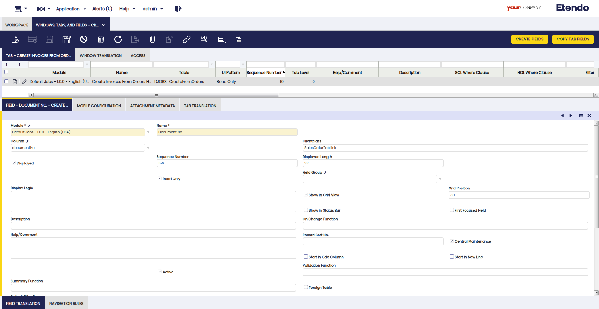
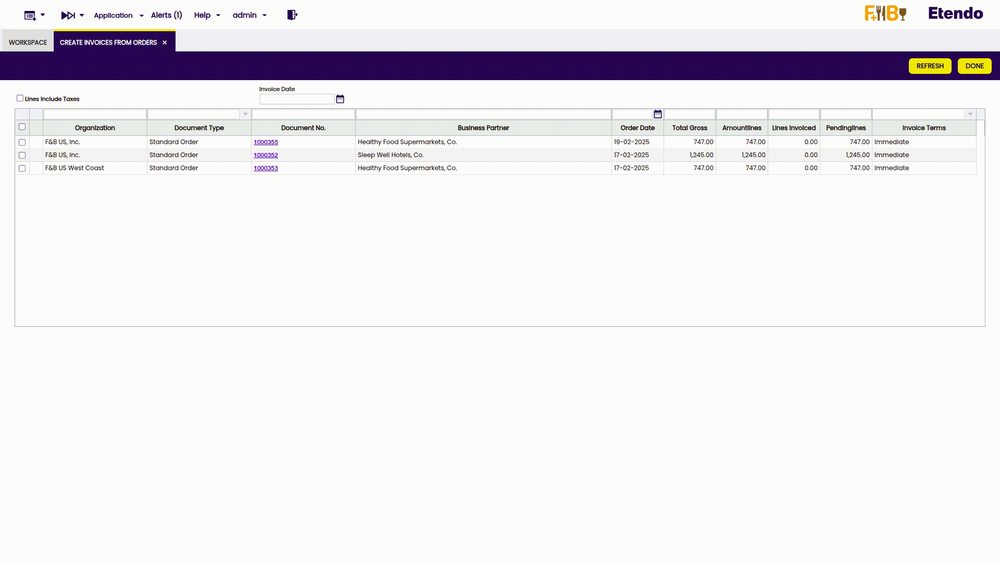

#  How to Create a Navigable Link

## Overview

This section explains how to create a navigable link in Etendo Classic, implementing a ClientClass. A ClientClass allows you to add visual components to a form or a row of a grid. This is useful for adding calculated fields to forms and grids, integrating elements such as buttons, links or dynamic labels.

In this case, we will implement a navigable ClientClass so that the documentNo in the **Create Invoice from Orders** window allows to directly open the corresponding sales order in the Sales Order window.

This section shows how to use the record and form information to get dynamic data in the grid or form. 

!!! info
    The implementation of these fields requires JavaScript knowledge.


## Main Steps to Create a new ClientClass

1. Implement the ClientClass in JavaScript:

    - Create the JavaScript file with the corresponding class and place it in the appropriate directory. The convention is to place the `.js` files in:

        ```web/[module.java.package]/js```

    - Register the JavaScript file (along with other static resources such as CSS files) in a ComponentProvider.


2. Specify the JavaScript class in the field definition:

    - Configure the field in the tab/window where the functionality will be applied.


## Implementing the ClientClass in JavaScript

The first step is to define the class in JavaScript in two stages:

1. Create the JavaScript class and calculate `tabId` and `recordId`.
    In this case, the logic is implemented in the `DirectTabLink` class, which handles the opening of the window, passing the values of `tabId` and `recordId`.

    ``` javascript title="direct-tab-link.js"
    isc.ClassFactory.defineClass('DirectTabLink', isc.OBGridFormLabel);


    isc.DirectTabLink.addProperties({
    height: 1,
    width: 1,
    overflow: 'visible',


    // Method that subclasses must override
    getTabAndRecordId: function(record, callback) {
    callback({ tabId: null, recordId: null });
    },


    setRecord: function(record) {
    var value = record[this.field.name];


    // Call the asynchronous function from the subclass
    this.getTabAndRecordId(record, function(result) {
        var tabId = result.tabId;
        var recordId = result.recordId;


        if (!value || !tabId || !recordId) {
        this.setContents("");
        return;
        }


        // Create the inline function for onclick
        var linkHTML =
        "<a href='#' style='color:blue; text-decoration:underline;' " +
        "onclick='OB.Utilities.openDirectTab(\"" + tabId + "\", \"" + recordId + "\"); return false;'>" +
        value + "</a>";


        this.setContents(linkHTML);


        // Force grid redraw
        if (this.grid && this.grid.body) {
        this.grid.body.markForRedraw();
        }
    }.bind(this));
    }
    });

    ```

2. Specific Implementation of the ClientClass

    In our example, the target window is Sales Order. Since the `tabId` is fixed and does not change, it can be left as a static value.

    The `recordId`, on the other hand, contains the unique identifier of each order, which facilitates navigation without the need for additional calculations.

    ``` javascript title="sales-order-tab-link.js"
    isc.ClassFactory.defineClass('SalesOrderTabLink', DirectTabLink);
    isc.SalesOrderTabLink.addProperties({
    getTabAndRecordId: function(record, callback) {
    var tabId = "186"; // Fixed tab ID for "Sales Order"
    var recordId = record.id;


    if (!recordId) {
        console.error("Error: Record ID not found in the record.");
        callback({ tabId: null, recordId: null });
        return;
    }


    callback({ tabId: tabId, recordId: recordId });
    }
    });
    ```

## Special cases: Calculating `recordId` with Java

In some cases, the `recordId` information is not available directly in the record, so it must be calculated. This can be achieved through a Java class that determines the corresponding `recordId`.

Example:
If the record does not have the `recordId` of the commands directly, we can calculate it by calling a specific Java class:

``` java title="sales-order-tab-link-with-java.js"
isc.ClassFactory.defineClass('SalesOrderTabLink', DirectTabLink);
isc.SalesOrderTabLink.addProperties({
 getTabAndRecordId: function(record, callback) {
   var tabId = "186"; // Predefined Tab ID for "Sales Order"
   var documentNo = record.documentNo; // Retrieve documentNo from the record


   if (!documentNo) {
     console.error("Error: documentNo not found in the record.");
     callback({ tabId: null, recordId: null });
     return;
   }
   // Call the Openbravo Action Handler to retrieve the recordId
   OB.RemoteCallManager.call(
     'org.openbravo.client.application.GetSalesOrderIdActionHandler', // Java Action Handler class name
     { documentNo: documentNo }, // Parameter sent to the backend
     {},
     function(response, data, request) {
       if (data.success && data.recordId) {
         callback({ tabId: tabId, recordId: data.recordId }); // Use predefined tabId
       } else {
         console.error("Error retrieving recordId: " + (data.errorMessage || "Invalid response"));
         callback({ tabId: null, recordId: null });
       }
     }
   );
 }
});
```

In Java:

``` java title="GetSalesOrderIdActionHandler.java"
import org.openbravo.dal.service.OBCriteria;
import org.openbravo.dal.service.OBDal;
import org.openbravo.model.common.order.Order;


/**
* Action handler to retrieve the sales order ID based on a given document number.
*/
public class GetSalesOrderIdActionHandler extends BaseActionHandler {


 private static final String DOCUMENT_NO = "documentNo";
 private static final String SUCCESS = "success";
 private static final String RECORD_ID = "recordId";
 private static final String ERROR_MESSAGE = "errorMessage";


 /**
  * Executes the action to retrieve the sales order ID based on the provided document number.
  *
  * @param parameters A map containing execution parameters.
  * @param content A JSON string containing the document number.
  * @return A JSON object containing the sales order ID and status of the operation.
  */
 @Override
 protected JSONObject execute(Map<String, Object> parameters, String content) {
   JSONObject result = new JSONObject();
   try {
     final JSONObject jsonData = new JSONObject(content);


     if (!jsonData.has(DOCUMENT_NO) || jsonData.isNull(DOCUMENT_NO)) {
       result.put(SUCCESS, false);
       result.put(ERROR_MESSAGE, "The 'documentNo' parameter is required.");
       return result;
     }


     String documentNo = jsonData.getString(DOCUMENT_NO);


     OBCriteria<Order> orderOBCriteria = OBDal.getInstance().createCriteria(Order.class);
     orderOBCriteria.add(Restrictions.eq(Order.PROPERTY_DOCUMENTNO, documentNo));
     orderOBCriteria.setMaxResults(1);


     Order order = (Order) orderOBCriteria.uniqueResult();
     result.put(RECORD_ID, order.getId());
     result.put(SUCCESS, true);


   } catch (Exception e) {
     try {
       result.put(SUCCESS, false);
       result.put(ERROR_MESSAGE, e.getMessage());
     } catch (Exception ex) {
       throw new OBException(e);
     }
   }
   return result;
```

## Registering the JavaScript file in the ComponentProvider

Once the JavaScript class is created, it is necessary to register it in the ComponentProvider of the corresponding module.

``` javascript title="UIComponentProvider.java"
/** JavaScript files required for UI navigation. */
protected static final String[] JS_FILES = new String[]{
   "direct-tab-link.js",
   "sales-order-tab-link.js"
};
```

## Definition of the ClientClass in the tab field (ADField)

The last step is to add the implementation in the field where the functionality will be applied and configure its ClientClass.



## Final Result

As seen below, using the created link, you can directly open the linked sales order in the Sales Order window.

