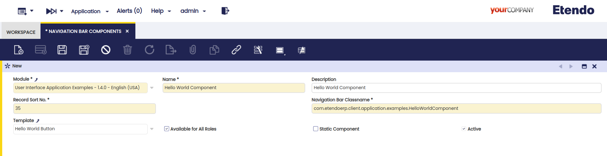
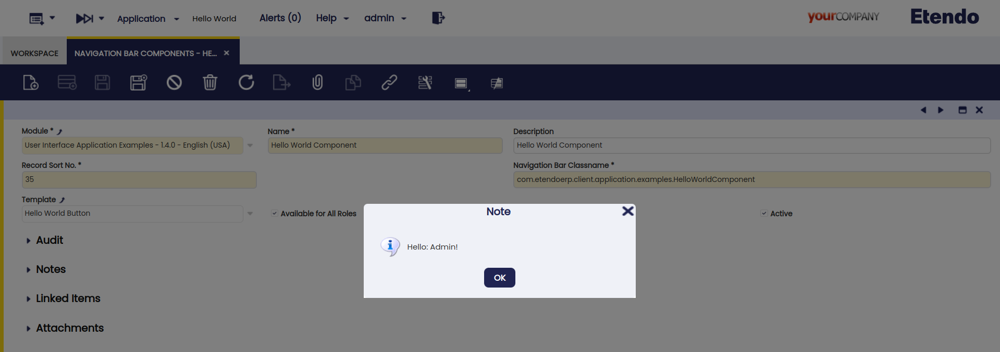

---
tags:
  - navigation bar
  - components
  - Etendo Classic
---

#  How to create a Navigation Bar Component
  
##  Overview

This section explains how a component can be added to the Etendo main navigation bar. Navigation bar components are shown in the top of the Etendo Classic layout. They are positioned from left to right.

Some main features of the Etendo Classic navigation bar components:

  * A navigation bar component can be any [Smartclient](https://smartclient.com/product/documentation.jsp){target="blank"} canvas. 
  * Modules can provide new navigation bar components. 
  * The position of a navigation bar component can be controlled. 
  * Navigation bar components can be enabled by role. 

  


##  Example Module

This is supported by an example module which shows examples of the code shown and discussed.

  The code of this module can be downloaded from [this repository](https://github.com/etendosoftware/com.etendoerp.client.application.examples/tree/main/src/com/etendoerp/client/application/examples).


##  Main Flow of the Navigation Bar Generation

The navigation bar generation goes through a number of steps:

  1. The user logs in, and navigates to the start page.
  2. The start page builds the main layout consisting of the navigation bar and the main content area (with tabs).
  3. The navigation bar is generated on the server as JavaScript (which is send to the browser). 
  4. this is done by the main layout component. This component creates the overall JavaScript structure and then reads the navigation bar components from the navigation bar component table (using role information). 
  5. Each navigation bar component is instantiated, its template is set and the generate method is called which generates the JavaScript of that component (using the template). 
  6. The JavaScript of each component is assumed to create a single canvas or an array of Smartclient canvasses. The JavaScript (i.e. navigation bar component) is placed as a member of the horizontal layout, which builds the navigation bar. 

This main flow illustrates that each navigation bar component can implement its own visualization by providing/using a custom template and component.

##  Implementing a Navigation Bar Component

To create a component which is shown in the navigation bar, the following parts need to be implemented:

  * Create a Java class (the component) which represents the navigation bar component on the server 
  * Create a template which generates the JavaScript which creates the component on the client 
  * Register the navigation bar component in the navigation bar component table

Each of these steps is described in more detail below.

The example module contains a **Hello World** component with a template. This example adds a button to the navigation bar which (when clicked) will say hello to the current user.

``` 
modules
└── com.etendoerp.client.application.examples
    ├── referencedata
    └── src
        └── com
            └── etendoerp
                └── client
                    └── application
                        └── examples
                            └── templates
                            │   └── hello_world.js.ftl
                            └── HelloWordlComponent.java
```

###  Creating a Component

A component is useful when you want to add runtime information to the navigation bar component JavaScript when it gets generated. For example, the user name or other role or user information.


!!!info
    If you do not have the requirement to use dynamic information in the generated JavaScript of your component, then you do not need to implement a component (only a template). You can make use of the standard Etendo template component: org.openbravo.client.kernel.BaseTemplateComponent, in the navigation bar component definition table.

The example module has a hello world component which provides the current logged in user to the template. The component can be found in the module's src directory. Here is the code:
    
  ```java title="HelloWorldComponent.java"
  package com.etendoerp.client.application.examples;
   
  import org.openbravo.client.kernel.BaseTemplateComponent;
  import org.openbravo.dal.core.OBContext;

  /**
   * Provides a widget which shows a hello world message when clicked.
   * 
   * @author mtaal
   */
  public class HelloWorldComponent extends BaseTemplateComponent {
   
    public String getUserName() {
      return OBContext.getOBContext().getUser().getName();
    }
  }
  ```

###  Creating a Template

The template contains the actual JavaScript. A template consists of two parts:

  1. A template file (the template source) ending on `.FTL` (a [freemarker](https://freemarker.sourceforge.io/docs/){target="blank"} extension) which is located in the source tree (in the classpath). 
  2. A record in the template table.

The template is a powerful mechanism of Etendo as it makes it possible to combine dynamic generated information and allows overriding of templates by other modules.

####  The Template Source

To create the template for your navigation bar component, create a `.FTL` file in the source tree of your module. The `.FTL` file should contain plain JavaScript with possible freemarker constructs to read information from the component. The JavaScript should create one Smartclient canvas or a JavaScript array with Smartclient canvas instances.

As an example, the **Hello World** template can be found in the `com.etendoerp.client.application.examples` package, it creates a button which can be clicked to say hello. The content of the template is this:
    
  ```javascript title="hello_world.js.ftl"
  /* jslint */
  isc.Button.create({
    baseStyle: 'navBarButton',
    title: OB.I18N.getLabel('OBEXAPP_HelloWorld'),
    overflow: "visible",
    width: 100,
    layoutAlign: "center",
    showRollOver: false,
    showFocused: false,
    showDown: false,
    click: function() {
      isc.say(OB.I18N.getLabel('OBEXAPP_SayHello', ['${data.userName?js_string}']));
    }
  })
  ```

Some aspects to note in this JavaScript source:

  * The /*jslint*/ tells Etendo to do a check on the generated JavaScript. Errors are printed in the console or output log. 
  * As you can see, the templates create a canvas (the Button). It is also allowed to create an array of canvasses. 
  * The title of the button is retrieved through the `OB.I18N.getLabel` method. This is to support translation, see a section below in this article for more information. 
  * See the `${data.userName?js_string}'` part, this is a [freemarker](https://freemarker.sourceforge.io/docs/){target="blank"} template construct whereby information is retrieved from a Java object. In the Etendo templating system, the component instance is available as the **data** object. The `${data.userName?js_string}'` will call the accessor `getName` on the HelloWorldComponent. 

####  Template Record

The next step is to let Etendo know that the template exists. This is done by registering the template in Etendo in the Template table. The template maintenance function can be found here: `Application Dictionary` > `User Interface` > `Template`.


###  Registering the Component as a Navigation Bar Component

The last step is to add the component to the navigation bar. This is done through the navigation bar components table/window. You can find it through quick launch or in the menu here: `Application Dictionary` > `User Interface` > `Navigation Bar Components`.



###  The Result

After executing the above steps, you should see a **Hello World** button in the navigation bar. Clicking it will popup a small hello message.



###  Static Navigation Bar Components
  
By checking the **Static Component** flag of a a navigation bar component in `Application Dictionary` > `User Interface` > `Navigation Bar Components` it is declared as **static** . This kind of components differ from their counterparts in the way they are created. **Static Navigation Bar Components** are loaded at the beginning of the **JavaScript** content used within the application and they do not require an extra request to be loaded.

Besides, the content of the template of a **Static Navigation Bar Components** is defined in a slightly different way:

  ```javascript    
  /* jslint */
  {
    className: 'OBApplicationMenuButton',
    properties: {
      title: 'UINAVBA_APPLICATION_MENU',
      initWidget: function () {
        this.Super('initWidget', arguments);
        this.baseData = isc.clone(OB.Application.menu);
      }
    }
  }
  ```

!!!note
    The template defines a JSON object with two properties:

      * **className** : the class name of the navigation bar component. 
      * **properties** : contains the set of attributes and functions that will be used to configure the component. 

---

This work is a derivative of [How to Create a Navigation Bar Component](http://wiki.openbravo.com/wiki/How_to_create_a_Navigation_Bar_Component){target="\_blank"} by [Openbravo Wiki](http://wiki.openbravo.com/wiki/Welcome_to_Openbravo){target="\_blank"}, used under [CC BY-SA 2.5 ES](https://creativecommons.org/licenses/by-sa/2.5/es/){target="\_blank"}. This work is licensed under [CC BY-SA 2.5](https://creativecommons.org/licenses/by-sa/2.5/){target="\_blank"} by [Etendo](https://etendo.software){target="\_blank"}.