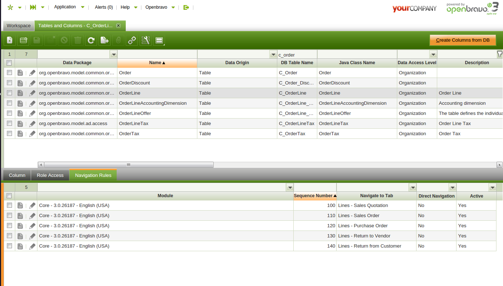

# How to Create a Navigation Rule

!!! example "IMPORTANT: THIS IS A BETA VERSION"
    This page is under active development and may contain **unstable or incomplete features**. Use it **at your own risk**.

## Overview

**Navigation rules** allow Etendo to dynamically route users to different tabs based on the data viewed. These rules can be defined at both **field level and table level**, giving administrators flexible control over how records are opened. Each rule can specify a destination tab, its priority, and when needed, an HQL Logic condition that determines when the rule should apply. By combining these elements, Etendo can handle complex navigation scenarios, such as opening different windows depending on the type of document or record being accessed.

##  Rules definition at field level

These rules are defined in the **Navigation Rules** tab of the **Windows, Tabs and Fields** window, below the **Field** tab.

System administrator can add rules to a field in order to make it navigate to a custom tab.

Main fields that have to be set are:

- **Sequence Number**: Priority of the rule. The rules are applied in ascending order. 
- **Tab**: Destination tab that will be opened if the rule is met. 
- **Direct Navigation**: Flag that determines whether the `HQL Logic` clause is executed or if the rule is always applied. 
- **HQL Logic**: HQL where clause that the record being opened has to meet in order to open the specified tab of the rule. 

##  Rules definition at table level

The rules at table level for the **Extended Navigation Model** are defined in a new tab of the **Tables and Columns** window called **Navigation Rules**. 

System administrator can add new rules to a table in order to make the links which have that table as a reference navigate to a custom tab.

The rules are defined following the same logic than Field Level Rules.

##  Creating Rules

To create a rule that it is not of **Direct Navigation**, define the **HQL Logic** field with a where clause expression. This expression is appended to a HQL that it is executed on the table where the record that it is being
opened is stored. The HQL is also filtered by the **id** of the record so it can only return that record. If the HQL returns the record then the rule is valid and it is opened on its **tab**. If no results are returned, the next rule is executed.

The `HQL Logic` has to be a valid HQL where clause. The alias of the main table is **e** , using it it is possible to access the properties of that table.

For example the `C_OrderLine` table has different Order types that are managed on different windows. Sales orders that are not return orders have to be opened in the **Sales Order** window. It is needed to create a rule with an HQL Logic that returns the order line only in case it is a Sales Order and it is not a Return. The HQL Logic looks like:

    
    
    e.salesOrder.salesTransaction=true AND e.salesOrder.documentType.return=false
    

This work is a derivative of [How to Create a Navigation Rule](http://wiki.openbravo.com/wiki/How_to_create_a_navigation_rule){target="\_blank"} by [Openbravo Wiki](http://wiki.openbravo.com/wiki/Welcome_to_Openbravo){target="\_blank"}, used under [CC BY-SA 2.5 ES](https://creativecommons.org/licenses/by-sa/2.5/es/){target="\_blank"}. This work is licensed under [CC BY-SA 2.5](https://creativecommons.org/licenses/by-sa/2.5/){target="\_blank"} by [Etendo](https://etendo.software){target="\_blank"}.
