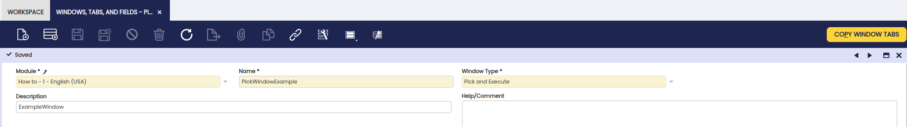
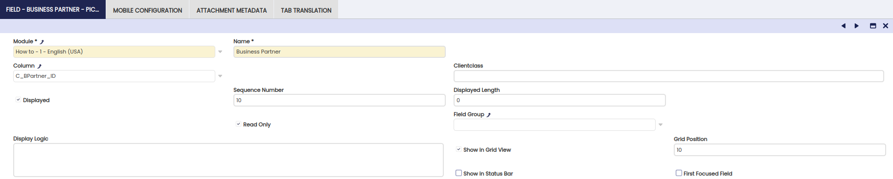
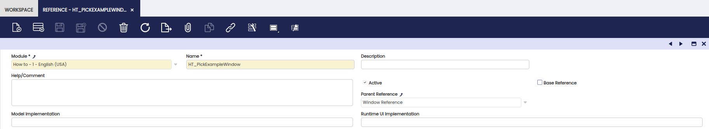
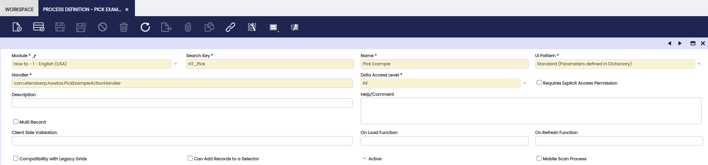
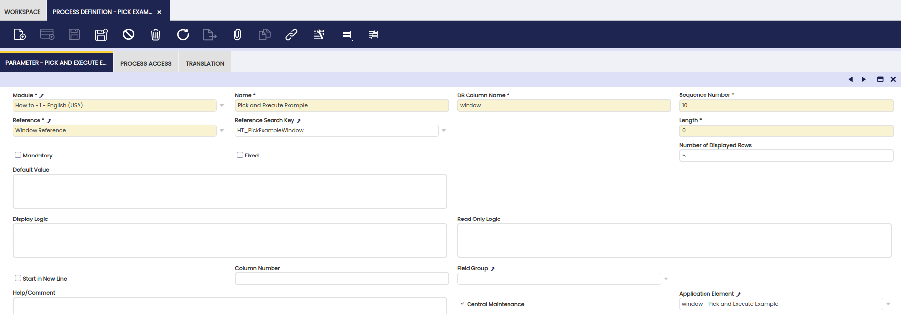
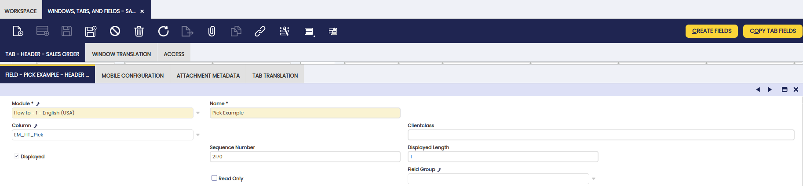
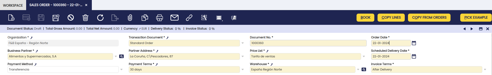

---
tags:
  - PickandExecute
  - Process definition
  - Action handler
  - Actions
  - Standard UI pattern
---

# How to Create a Pick and Execute Process

## Overview

**Pick and Execute (P&E)** is a case of **Process Definition** with **Standard UI pattern**.

This section will add a new Pick and Execute process and associate it with the **Sales Order window**.

The implementation requires development experience.

The following concept pages provide background information on action handlers and javascript
development:

- [Action Handler](how-to-create-client-event-handler-actions.md)
- [Client Side Development and API](../concepts/client-side-development-and-api.md)
- [JavaScript Coding Conventions](../concepts/javascript-coding-conventions.md)

## Steps to implement the Process

### Overview

The P&E processes take advantage of the same foundation concepts in the Application Dictionary. The **Window, Tabs and Fields** will be used for defining the editable grid that will be shown, a new **Reference** for the parameter of the process; and then implementing an **action handler** that will get executed when the user hits the **Done** button.

### Implementation

#### Defining the Window

1. Create a new window
2. Fill the required fields
3. Select **Pick and Execute** as window type

    

4. Following the same concepts, a **Table** is required as data-source.

    - In case it is needed to mix information from several tables, there are different options:

      - A database view used to create a table in [Application Dictionary](how-to-create-a-table.md).
      - A table based on an [HQL query](how-to-create-a-hql-based-table.md).
      - A table based on a [manual datasource](how-to-create-a-table-based-on-a-user-defined-datasource.md).

    

5. Create the necessary fields that will turn into the columns of the grid. Pick a **Column** and pay attention to some important properties:

    - **Displayed:** This must be checked in order to generate a field. If Displayed is unchecked no field will be generated.
    - **Read Only:** Most of the times all the fields will be read-only. If you want a user to be able to modify some data, e.g. quantity, leave it unchecked.
    - **Show in Grid View:** Defines if the field will be shown in the grid. A Field as displayed can be defined but not shown in grid, so a field will get generated but not shown. This is useful for retrieving data to the grid and send it to the process.
    - **Grid Position:** Defines the sequence of the fields in the grid.

    

#### Defining the Reference

After defining the window, a new Reference needs to be defined.

1. Create a new Reference
2. Select in the Base Reference drop down: Window Reference
3. Save

    

4. Move to Window tab
5. Create a new record
6. Select your newly created window
7. Save


#### Defining the Process

There is a new window for processes: **Process Definition**

1. Open the Process Definition window
2. Create a new record
3. Define the UI pattern: Standard (Parameters defined in Dictionary)
4. Set the Handler (Java class implementing the process)
5. Save



##### Parameters

Window Reference is an implementation of a **rich parameter**.

1. Move to Parameters tab
2. Create a new record
3. Fill the required fields. The name of the parameter will be the name shown in the title of the running process.
4. Select Window Reference
5. Pick the Window you defined previously
6. Save



#### Adding a button to Sales Order

##### Create a Column

A new column is required to be associated to a button.

!!!info
For more information, visit [How to add a field to a Window Tab](how-to-add-a-field-to-a-window-tab).

1. Create a new column in the `C_Order` table. `PostgreSQL` syntax:

    ```
    `ALTER TABLE c_order ADD COLUMN em_obexapp_pick1 character(1)`;
    `ALTER TABLE c_order ALTER COLUMN em_obexapp_pick1 SET DEFAULT 'N'::bpchar`;
    ```

2. Go to: Tables and Columns
3. Open the `C_Order` record
4. Execute: **Create Columns from DB** process
5. Move to the Columns Tab
6. Pick the newly created column
7. Change the reference from: Yes/No to Button
8. Pick your defined process


##### Create a Field

1. Go to Windows, Tabs and Fields
2. Search for Sales Order
3. Create a new Field associated with the column

  

#### Java Implementation

In the case of a Pick and Execute action handler, extend from **BaseProcessActionHandler** and implement the **doExecute** method.

```java title="PickExampleActionHandler.java"
/*
  *************************************************************************
  * The contents of this file are subject to the Openbravo  Public  License
  * Version  1.1  (the  "License"),  being   the  Mozilla   Public  License
  * Version 1.1  with a permitted attribution clause; you may not  use this
  * file except in compliance with the License. You  may  obtain  a copy of
  * the License at http://www.openbravo.com/legal/license.html
  * Software distributed under the License  is  distributed  on  an "AS IS"
  * basis, WITHOUT WARRANTY OF ANY KIND, either express or implied. See the
  * License for the specific  language  governing  rights  and  limitations
  * under the License.
  * The Original Code is Openbravo ERP.
  * The Initial Developer of the Original Code is Openbravo SLU
  * All portions are Copyright (C) 2011 Openbravo SLU
  * All Rights Reserved.
  * Contributor(s):  ______________________________________.
  ************************************************************************
  */
package org.openbravo.client.application.examples;
 
import java.util.Map;
 
import org.apache.log4j.Logger;
import org.codehaus.jettison.json.JSONArray;
import org.codehaus.jettison.json.JSONObject;
import org.openbravo.client.application.ApplicationConstants;
import org.openbravo.client.application.process.BaseProcessActionHandler;
 
/**
  * @author iperdomo
  *
  */
public class PickExampleActionHandler extends BaseProcessActionHandler {
 
  private static final Logger log = Logger.getLogger(PickExampleActionHandler.class);
 
  @Override
  protected JSONObject doExecute(Map<String, Object> parameters, String content) {
    try {
      JSONObject request = new JSONObject(content);
 
      log.info(">> parameters: " + parameters);
      // log.info(">> content:" + content);
 
      // _selection contains the rows that the user selected.
      JSONArray selection = new JSONArray(
          request.getString(ApplicationConstants.SELECTION_PROPERTY));
 
      log.info(">> selected: " + selection);
 
      // _allRows contains all the rows available in the grid
      JSONArray allRows = new JSONArray(request.getString(ApplicationConstants.ALL_ROWS_PARAM));
 
      log.info(">> allRows: " + allRows);
 
      // A Pick and Execute process can have several buttons (buttonList)
      // You can know which button was clicked getting the value of _buttonValue
      log.info(">> clicked button: " + request.getString(ApplicationConstants.BUTTON_VALUE));
 
      return request;
    } catch (Exception e) {
      log.error("Error processing request: " + e.getMessage(), e);
    }
    return new JSONObject();
  }
}
```

## Testing the Process

Since the structure of some Entity has been changed by adding a new column, it is needed to restart the tomcat server.

- After restarting, it should be able to go to the Sales Order window and see a new button.



## Advanced Topics

### Selecting by default

The data-source (table or view) defined in the Tab, can set which rows will be selected by default when the user launches the process. It is just needed to create a column `c_ob_selected`, this will turn into a `obSelected` property in the generated entity. When the value of this column is **Y** , the row will be selected by default. Here you have an working example:
`M_RM_RECEIPT_PICK_EDIT.xml`.

!!!note
When registering the column in the Application Dictionary the **Yes/No** reference must be used.

### Validation Function

Define at Field level, a JavaScript validation function. In an editable field when the user enters a value, this function will get executed.

1. Go to Window, Tabs and Fields
2. Pick your window and the tab
3. Go to the Quantity field


#### JavaScript Definition

- The Component Provider needs to register a new global resource.
- If the function returns false, the cell will be marked with an error.
- In the JavaScript, define a validation function e.g.

```javascript
OB.OBHT = {};
OB.OBHT.validate = function (item, validator, value, record) {
  // item has access to grid: item.grid
  // from the grid you can get all selected records and edited values, e.g.
  //   * item.grid.getSelection()
  //   * item.grid.getEditedRecord()
  // grid has access to view: grid.view
  // view has access to parentWindow: view.parentWindow (the window running the process)
  // parentWindow has access to currentView
  // currentView has getContextInfo
  // debugger;
  if (window.console) {
    console.log("validation function!", value);
  }
  return true;
};
```

### Selection Function

A selection function can be defined at Tab level. This function will get called when the user select/unselect a row.


And define a JavaScript function in your loaded static `.js` file:

```javascript
OB.OBHT.selectionChanged = function (grid, record, recordList) {
  if (window.console) {
    console.log("selection function!");
    console.log(grid, record, recordList);
  }
};
```

If you want to change any value of the selected record, use the following instruction:

    grid.setEditValue(grid.getRecordIndex(record), columnName, newColumnValue)

### Performing Several Actions after Execution

After the process is executed, a series of actions can be taken.

!!!info
For more information about several actions after execution, see [How to create a Standard Process Definition](how-to-create-a-standard-process-definition.md).

This work is a derivative of [How to create a Pick and Execute Process](http://wiki.openbravo.com/wiki/How_to_create_a_Pick_and_Execute_Process){target="\_blank"} by [Openbravo Wiki](http://wiki.openbravo.com/wiki/Welcome_to_Openbravo){target="\_blank"}, used under [CC BY-SA 2.5 ES](https://creativecommons.org/licenses/by-sa/2.5/es/){target="\_blank"}. This work is licensed under [CC BY-SA 2.5](https://creativecommons.org/licenses/by-sa/2.5/){target="\_blank"} by [Etendo](https://etendo.software){target="\_blank"}.
