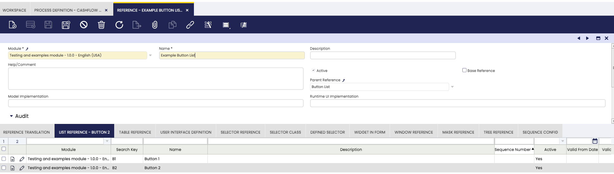

# How to Create a Report using Process Definition

## Overview

This section explains how to add a new Report using a Process Definition and create a menu entry to invoke it.

!!!info
     For background information, visit [How to Create a Standard Process Definition](../how-to-guides/how-to-create-a-standard-process-definition.md) and [How to Create a Report](../how-to-guides/how-to-create-a-report.md).

## Example Module

This section is supported by an example module which includes the simple report described in the examples of this document. The report is named **Product Simple Report** and prints in `PDF` a list of Products that can be filtered by Product Category.

The code of the example module can be downloaded from this mercurial repository:
https://code.openbravo.com/erp/mods/org.openbravo.platform.features

## Report Definition in Application Dictionary

### Process Definition

Create a new record in **Process Definition** window. Fields to consider:

- **UI Pattern**: Set `Report (Using JR Templates)` . This value will display the Report Definition tab.

- **Action Handler**: If none is set when the UI Pattern is selected, the `org.openbravo.client.application.report.BaseReportActionHandler` is set.


The `BaseReportActionHandler` is the default action handler to use in reports. In case you desire to make some Java validations or include some extra parameters that are not defined in the Process Definition parameters tab it is possible to use a custom Action Handler that extends the `BaseReportActionHandler`.

### Parameter Definition

In the **Parameter** tab are added all the parameters that are needed to filter the results of the report. Their values are handled by the `BaseReportActionHandler` and sent to Jasper Reports as parameters. These parameters need to be defined in the JR template with the same name as the column name.


When the filter parameter is a Selector reference the value is sent as a **JSONOBject** that includes 2 keys:

- **value** with the id of the selected BaseOBObject to be used in the SQL query
- **identifier** with the readable identifier that can be used to print in the report the filter values.

In case of Multiple Selectors the **JSONObject** includes 4 keys:

- **values** with a JSONArray including all the selected ids.
- **identifiers** with a JSONArray including all the identifiers.
- **strValues** with a comma separated String with all the selected ids that can be used in a SQL _IN_ clause.
- **strIdentifiers** with a comma separated String with all the selected identifiers.

In the Jasper Template, the parameter has to be defined using the class _org.codehaus.jettison.json.JSONObject_ . In the example, it is set a _Product Category_ multiple selector. As this parameter is optional, the filter is included in the query using an auxiliary parameter ( _AUX_Product_category_ ).
The auxiliary parameter has a default expression that returns **" 1 = 1 "** when there is no category selected and the corresponding where clause when some categories are selected:

    ("".equals($P{M_Product_Category_ID}.getString("strValues"))) ? " 1 = 1 " : " pc.m_product_category_id IN ("+$P{M_Product_Category_ID}.getString("strValues")+")"

This parameter is then included in the query using the "$P!{}" notation to replace it with the parameter value instead of using SQL Parameters.

    FROM m_product p
      JOIN m_product_category pc ON p.m_product_category_id = pc.m_product_category_id
    WHERE $P!{AUX_Product_category}
      AND p.ad_client_id = $P{Current_Client_ID}

The identifiers can be shown in a Text field with the following Expression:

    $P{M_Product_Category_ID}.getString("strIdentifiers")


The `BaseReportActionHandler` and the `ReportingUtils` class used to generate the report includes some additional parameters that can be used in the template:

**SUBREPORT_DIR**

    The path where the main template is located. Useful to set the paths of the subreports.

**jasper_process**

    A _org.openbravo.client.application.Process_ object with the Process Definition of the report.

**jasper_hbSession**

    A _org.hibernate.Session_ object with the current hibernate session.

**jasper_obContext**

    A _org.openbravo.dal.core.OBContext_ with the OBContext that has launched the report.

**AMOUNTFORMAT**

    A _java.text.DecimalFormat_ object with the format to be used on Amounts.

**QUANTITYFORMAT**

    A _java.text.DecimalFormat_ object with the format to be used on Quantities.

**REPORT_FORMAT_FACTORY**

    JR Base parameter with the date format.

**Current_Client_ID**

    String with the current _AD_Client_ID_. Useful to filter the SQL of the report.

**Readable_Organizations**

    Comma separated String with the readable organizations of the User/Role executing the report. Useful to filter the `SQL` of the report.

Depending on the report output some additional parameters are set:

**PDF** output:

**IS_IGNORE_PAGINATION**

    with **false** value to ensure that the report breaks in different pages.

**XLS** output:

**IS_IGNORE_PAGINATION**

    with **true** value to ensure that the report does not break in different pages and all the results are shown in the same sheet.

In case it is desired to add more parameters that cannot be defined as **Parameters** of the **Process Definition**, it is possible to use a custom **Handler** that extends the `BaseReportActionHandler` and overwrites the `addAdditionalParameters` method.

It is possible to check all the parameters and values sent to the Jasper Report engine by enabling the **DEBUG log level** on the `org.openbravo.client.application.report.ReportingUtils` class by modifying
the `log4j2-web.xml` and for older versions, `log4j.lcf` file:

    DEBUG org.openbravo.client.application.report.ReportingUtils - list of parameters available in the jasper report
    DEBUG org.openbravo.client.application.report.ReportingUtils - parameter name: SUBREPORT_DIR value: /home/gorkaion/src/openbravo/pi-reporting-merge/WebContent/web/org.openbravo.platform.features/jasper/
    DEBUG org.openbravo.client.application.report.ReportingUtils - parameter name: Current_Client_ID value: 23C59575B9CF467C9620760EB255B389
    DEBUG org.openbravo.client.application.report.ReportingUtils - parameter name: REPORT_FORMAT_FACTORY value: org.openbravo.erpCommon.utility.JRFormatFactory@14ffa3fc
    DEBUG org.openbravo.client.application.report.ReportingUtils - parameter name: REPORT_VIRTUALIZER value: net.sf.jasperreports.engine.fill.JRSwapFileVirtualizer@1b670029
    DEBUG org.openbravo.client.application.report.ReportingUtils - parameter name: jasper_process value: OBUIAPP_Process(70889433974B409BAC4F9D7BFB211248) (name: Product Simple Report)
    DEBUG org.openbravo.client.application.report.ReportingUtils - parameter name: M_Product_Category_ID value: {"values":["291B401A38354A2C8247DFF0DFBDF4AE","5525FCABFE9545018EE221E8802AA283"],"identifiers":["Bio","Fruit juice"],"strValues":"'291B401A38354A2C8247DFF0DFBDF4AE', '5525FCABFE9545018EE221E8802AA283'","strIdentifiers":"Bio, Fruit juice"}
    DEBUG org.openbravo.client.application.report.ReportingUtils - parameter name: AMOUNTFORMAT value: java.text.DecimalFormat@674dc
    DEBUG org.openbravo.client.application.report.ReportingUtils - parameter name: QUANTITYFORMAT value: java.text.DecimalFormat@674dc
    DEBUG org.openbravo.client.application.report.ReportingUtils - parameter name: Readable_Organizations value: 'E443A31992CB4635AFCAEABE7183CE85','0','DC206C91AA6A4897B44DA897936E0EC3','7BABA5FF80494CAFA54DEBD22EC46F01','BAE22373FEBE4CCCA24517E23F0C8A48','19404EAD144C49A0AF37D54377CF452D','B843C30461EA4501935CB1D125C9C25A','2E60544D37534C0B89E765FE29BC0B43'
    DEBUG org.openbravo.client.application.report.ReportingUtils - parameter name: jasper_obContext value: org.openbravo.dal.core.OBContext@73b91cd
    DEBUG org.openbravo.client.application.report.ReportingUtils - parameter name: jasper_hbSession value: SessionImpl(PersistenceContext[entityKeys=...
    DEBUG org.openbravo.client.application.report.ReportingUtils - parameter name: IS_IGNORE_PAGINATION value: false

### Button List Parameters

When a button list parameter is added, the buttons are added together with the predefined buttons of this type of process (**View**, **Export To PDF**, **Export To Excel**). This behavior allows adding additional logic to the standard behavior of these processes, since it is possible to extend the base behavior from the java implementation of the process.

Below is an example of a button list that adds two buttons (Button 1, Button 2) to this type of process:




In order to add execution logic to these buttons, the `handleCustomAction` method must be redefined within the java class of the process:

```java
  @Override
  protected void handleCustomAction(JSONObject result, Map<String, Object> parameters,
      JSONObject jsonContent, String action) throws JSONException {
    switch (action) {
      case "B1":
        result.put("message", new JSONObject()
            .put("severity", "success")
            .put("text", "Button B1 has been pressed."));
        break;
      case "B2":
        result.put("message", new JSONObject()
            .put("severity", "success")
            .put("text", "Button B2 has been pressed."));
        break;
      default:
        super.handleCustomAction(result, parameters, jsonContent, action);
    }
  }
```

!!! note
    The action parameter will have the information corresponding to the search key of the button pressed, the identifiers are mandatory and are defined together with the button in the reference tab of the list within the reference.

Once the configuration is done, it is necessary to compile.

```bash title="Terminal"
./gradlew smartbuild
```

Then, when you enter the process, you will see your custom buttons next to the predefined report buttons.


Then, when you press the buttons, your custom logic is executed.


### Report Datasource Definition

There are two ways of defining the data to be displayed by the report:

1. Defining a **query** in the `jrxml` template.
2. Providing a **datasource** to the `jrxml` template.

In case of the second approach, we need to use a custom **Handler** that extends the `BaseReportActionHandler` and overwrites the `getReportData` method. This method receives a parameter map as an argument that contains:

- The parameters of the HTTP request.
- The parameters available inside the Jasper Report. They are available through another map that can be accessed by using the _JASPER_REPORT_PARAMETERS_ key.

```
protected JRDataSource getReportData(Map<String, Object> parameters) {
// Retrieve the report id (HTTP request parameter)
String reportId = (String) parameters.get("reportId");
// retrieve the map of JR Parameters
Map<String, Object> jrParameters = (Map<String, Object>) parameters
.get(JASPER_REPORT_PARAMETERS);
// Here goes the logic to generate the JRDataSource
...
}
```

This allows generating the report data dynamically, i.e, based on some kind of logic built with the value of any of these parameters.

### Message Handling

It is possible to display messages (success, warning, etc.) to the user after running a report based on a Process Definition.

This is useful when the report is generated successfully, but the system still needs to inform the user about potential issues in the data — for example, when some products have transactions with no calculated cost.

To enable this functionality, override the `addAdditionalParameters` method in your custom Java class that extends `BaseReportActionHandler`. In this method, you can add a new entry to the `parameters` map with the key `"message"` and a value of type `OBError`. For example:

``` java
OBError msg = new OBError();
msg.setType("Warning");
msg.setMessage("Please review the report for incomplete data.");
parameters.put("message", msg);
```

This message will be automatically captured by the BaseReportActionHandler and shown in the UI once the report finishes.

If the "message" parameter is not provided, the system will show a default success message:
"Report successfully generated."

### Sub-Report Runtime Compilation

In case our process definition report contains sub-reports, the infrastructure supports compiling the sub-reports at runtime. To do that the following conditions should be met:

1. The parameter name for the sub-report in the main report follows this pattern: `SUBREP_name_of_the_sub_report_file` .
2. The sub-reports (jrxml files) are placed in the same folder as the main report.

### Report Definition

In the **Report Definition** tab the JR Templates of the report are defined. Each Process Definition can only have a Report definition. It is also needed to define at least one template: `HTML`, `PDF` or `Excel`.

- If `PDF` and `Excel` outputs share the same template, it is possible to set the `PDF` template and check the **Use PDF as Excel Template** flag.
- If `PDF` and `HTML` outputs share the same template, it is possible to set the `PDF` template and check the **Use PDF as HTML Template** flag.
- If `HTML`, `PDF` and `Excel` outputs share the same template, then the `PDF` template must be set and both flags must be checked.

The templates need to be stored in the **web** folder.


### Adding Hyperlinks to a Report

You can add hyperlinks to report elements to allow navigation to another record, open a different report, or execute custom logic as needed.

To do this, select the component you want to make clickable (e.g. **Text Field**, **Image**, **Chart**, or **Subreport**) and configure its hyperlink properties:

- **Link Target**: `"Self"` — Opens the link in the same browser window.
- **Link Type**: `"Reference"` — Indicates that this is a URL link.
- **Hyperlink Reference Expression**: This is the expression or URL to execute when clicked.
- **Hyperlink When Expression**: (Optional) A boolean expression to control when the hyperlink should be active.


#### Example 1: Navigating to a specific record (e.g., an invoice)

To open a specific window and record in the system (e.g., an Invoice window with a given invoice ID), use an expression like this in the **Hyperlink Reference Expression**:

```java
"javascript:top.OB.Utilities.openDirectTab('" + $V{OPEN_INVOICE_TAB} + "', '" + $F{C_INVOICE_ID} + "')"
```

Where:

- **$V{OPEN_INVOICE_TAB}** is the window ID of the Sales Invoice window.
- **$F{InvoiceID}** is the field containing the ID of the invoice you want to open.

You can also add a Hyperlink When Expression to make sure the link is only clickable when the report is being viewed in `HTML` format, or add any other conditions as needed.

``` java
$P{OUTPUT_FORMAT}.equalsIgnoreCase("HTML")? Boolean.TRUE: Boolean.FALSE
```

Where:

- **$P{OUTPUT_FORMAT}** is the output format of the report.

#### Example 2: Opening another report from a link

You can also use a hyperlink to trigger the generation of another report. In this case, instead of a simple URL, the Hyperlink Reference Expression should contain a javascript: call to OB.RemoteCallManager.call(...), passing all the required parameters for the report:

``` java
"javascript:top.OB.RemoteCallManager.call('your.custom.ReportActionHandler',"
  + "{"
  + "  _buttonValue: 'HTML',"
  + "  _params: {"
  + "    // Add here all the necessary input parameters"
  + "    Param1: '" + $P{Param1} + "',"
  + "    Param2: '" + $F{FieldFromDataSet} + "',"
  + "    DateParam: '" + $P{DateValue} + "'"
  + "  }"
  + "},"
  + "{"
  + "  processId: '" + $P{processId} + "',"
  + "  reportId: '" + $P{reportId} + "',"
  + "  windowId: null"
  + "},"
  + "function(rpcResponse, data, rpcRequest) {"
  + "  top.OB.Utilities.Action.executeJSON(data.responseActions, null, null, null);"
  + "}"
  + ");"
```

This JavaScript snippet makes a remote call to the report's process handler, passing all the parameters it needs. The report will be generated and opened as a result of this action.

You can fully customize this logic to fit your navigation or integration needs.

## Result

The result is shown in a new form with all the parameters and the corresponding Export button(s).


Once the report is generated, a file download is requested in the browser. The form is kept enabled so it is possible to rerun the report with different parameters.

---

This work is a derivative of [How to create a Report using Process Definition](http://wiki.openbravo.com/wiki/How_to_create_a_Report_using_Process_Definition){target="\_blank"} by [Openbravo Wiki](http://wiki.openbravo.com/wiki/Welcome_to_Openbravo){target="\_blank"}, used under [CC BY-SA 2.5 ES](https://creativecommons.org/licenses/by-sa/2.5/es/){target="\_blank"}. This work is licensed under [CC BY-SA 2.5](https://creativecommons.org/licenses/by-sa/2.5/){target="\_blank"} by [Etendo](https://etendo.software){target="\_blank"}.