# How to Create a Report with iReport

!!! example "IMPORTANT: THIS IS A BETA VERSION"
    This page is under active development and may contain **unstable or incomplete features**. Use it **at your own risk**.
  
##  Overview

The goal of this section is to describe the steps required to create a new report in Etendo. The example explained is a simple report with a list of products.

##  Setting up iReport

You need to download iReport, a graphical tool that allows you create and modify JasperReports templates (.jrxml files).
 
  * Download [iReport 4.0.1](https://sourceforge.net/directory/build-tools/linux/){target="\_blank"}
  * On Linux: just download the .tar.gz or .zip file and uncompress it, execute the binary 
    
    ```
    bin/ireport
    ```

  * On Windows: Download and execute the .exe file 

###  Configuring iReport

Some properties of iReport need to be modified in order to work properly. You need to make sure:

* You modified the JasperReport property `net.sf.jasperreports.awt.ignore.missing.font` and set it to **true**
* **Not** use any **Scriplet** class 
* Use **Java** as default expression language 

###  Setting up Classpath

* Open from the menu options: `Tools` > `Options`
* Move to **Classpath** tab 
* Click **Add Jar** button 
* Go to your Etendo sources folder. Under **lib/runtime** folder, search for **postgresql*jdbc*.jar** and pick it. 
* Click **OK**

{: .legacy-image-style}

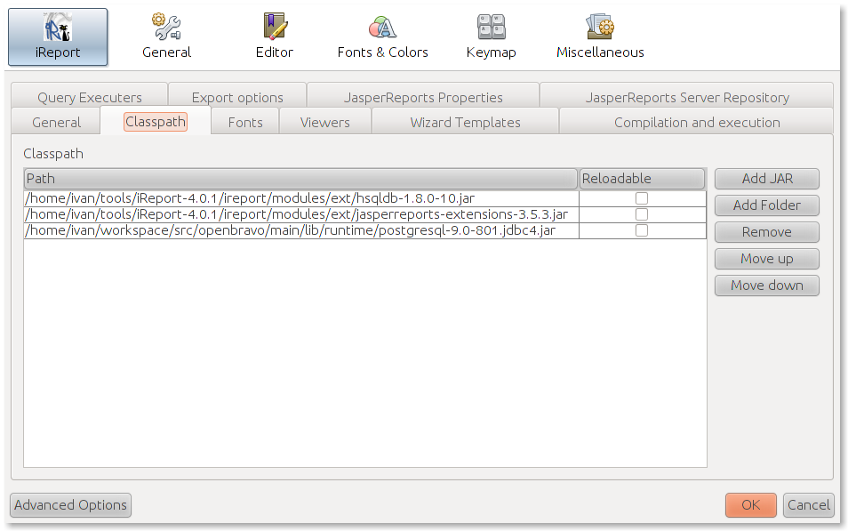{: .legacy-image-style}

###  Defining a Database Connection

1. Click the Report Datasources icon  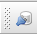{: .legacy-image-style}
2. Click **New**
3. Pick **Database JDBC Connection** and click **Next**
4. Fill all the fields 
    * **Name:** Etendo (or any name you like, e.g. pi) 
    * **JDBC Driver:** PostgreSQL (`org.postgresql.Driver`) 
    * **Server Address:** your database server address, e.g. localhost 
    * **Database:** pi (or the name of your database) 
    * **Username:** tad (you can check your username/password in `Openbravo.properties` configuration file) 
    * **Password:** tad 
5. Click Wizzard button to generate the JDBC URL 
6. Test your connection 
7. Save 

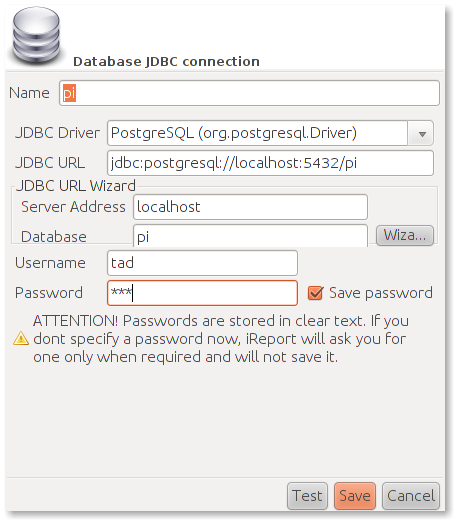{: .legacy-image-style}

{: .legacy-image-style}

##  Creating the Template

1. Go to **File** > **New**
2. Pick **Report**
3. Click **Launch Report Wizzard**

    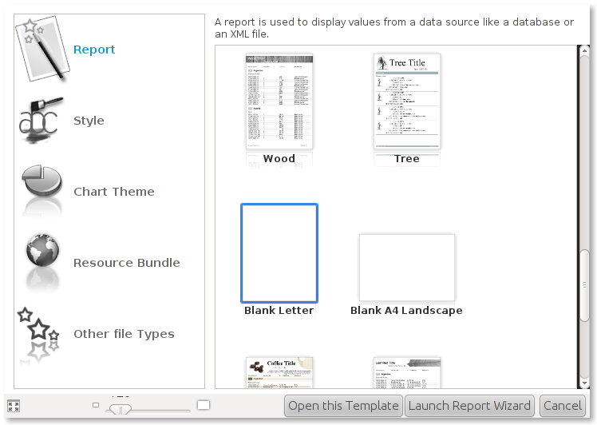{: .legacy-image-style}

    {: .legacy-image-style}

4. Define a **Report Name**.
5. Define the **File Location**. Notice that your `.jrxml` template must be placed under the src folder of your module. More information on the  [project folder structure](../concepts/development-project-structure.md#modules). A common convention is to place your reports in a `ad_reports` folder, e.g. `modules/org.your.java.package/src/org/your/java/package/ad_reports`. This is a convention, not a requirement, but you need to remember where you placed your template. 

    {: .legacy-image-style}

    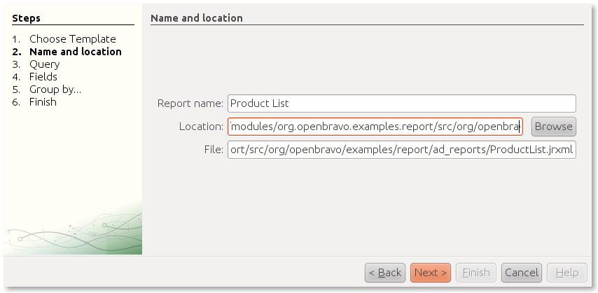{: .legacy-image-style}

6. Define the query to extract the data 
7. Pick the report datasource previously defined 
8. The products are stored in the M_Product table 
    ```
    SELECT m_product_id, value, name FROM m_product
    ```
9. Click **Next** 

    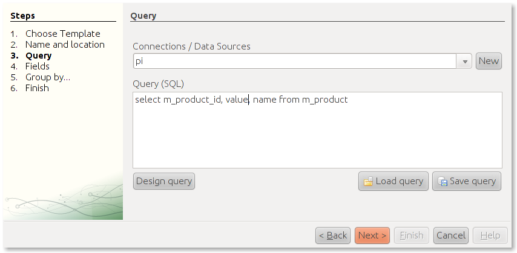{: .legacy-image-style}

    {: .legacy-image-style}

10. iReport defines the fields based on your query 
11. Pick all the fields and click Next 

    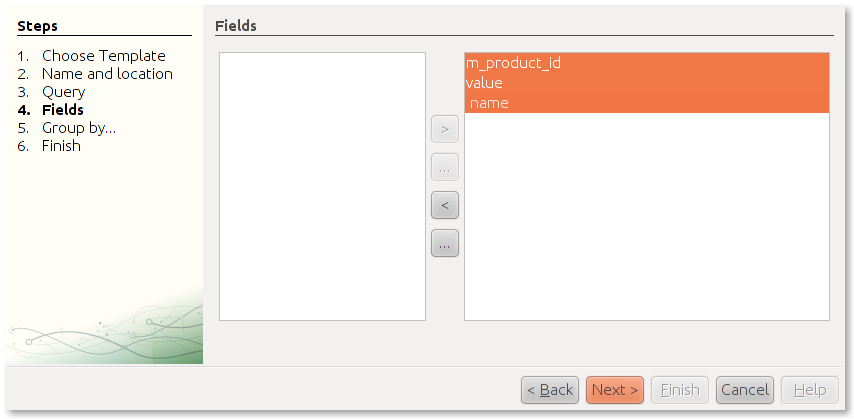{: .legacy-image-style}

    {: .legacy-image-style}

12. Remember to clear the Scriptlet class and modify the Language for expressions 
13. Go to **Window** > **Report Inspector**
14. In the report properties in the right, scroll down to More section 
    * Clear the Scriptlet class 
    * Choose Java as Language 
15. **Save** your changes 

    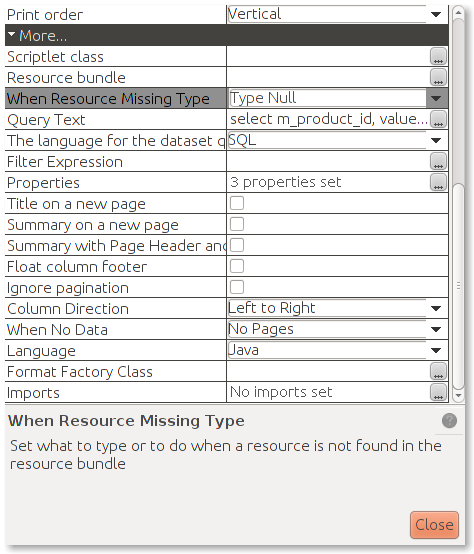{: .legacy-image-style}

    {: .legacy-image-style}

16. Put a static text as report title: `Product List`
17. Place the fields in the **Detail** band and a title in the **Column Header** band 
18. **Save** your changes 

    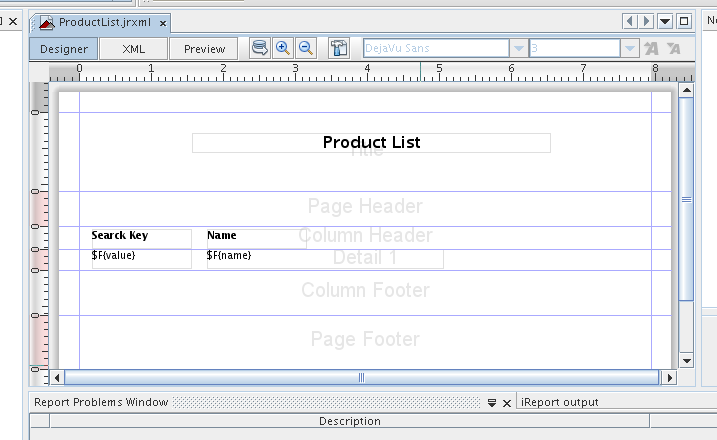{: .legacy-image-style}

    {: .legacy-image-style}


19. Click the **Preview** button to get a report preview 

    {: .legacy-image-style}

    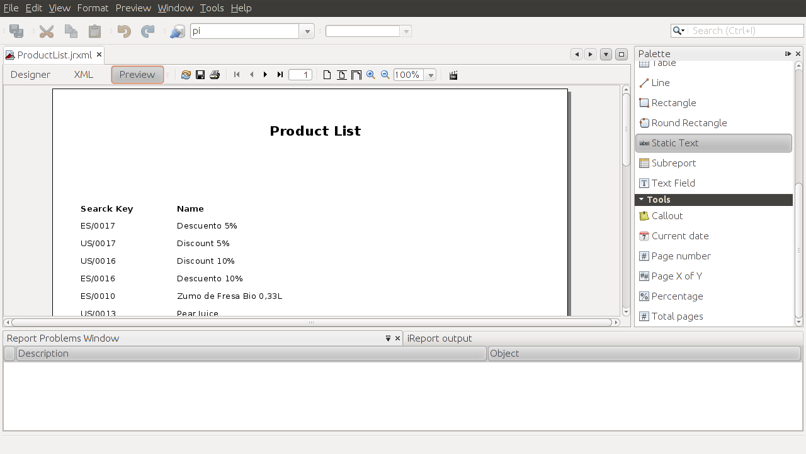{: .legacy-image-style}

!!!Note
    It is recommended to use Dejavu fonts in jasper reports because these fonts support most of the characters in almost all languages​​. Besides, Dejavu typography is the family of fonts that Etendo included in jasperreports-fonts library ???.    
  
##  Registering the Report in Application Dictionary

###  Creating the Report

1. Using the quick-launch, under the System Administrator role, open: **Report and Process** window 
    * You can find it in the menu: `Application Dictionary` > `Report and Process` 

2. Create a **new record** 
3. Fill all required fields 
    * **Module:** Pick your module 
    * **Search Key:** SMPLRProductList (Is a best practice to start with your module's [DB_Prefix](../concepts/modularity-concepts.md#db-prefix)) 
    * **Name:** Product List 
    * **Data Access Level:** Client/Organization 
    * **UI Pattern:** Standard 
    * **Jasper Report:** Check 
    * **JR Template name** : 
        
                @basedesign@/org/openbravo/examples/report/ad_reports/ProductList.jrxml

      * _@basedesign@_ is a **constant** that you **must** use always, after that, starting with a slash you need to write the path to your jrxml template. 


!!!Note
    **Report** checkbox must be unchecked.  
    
    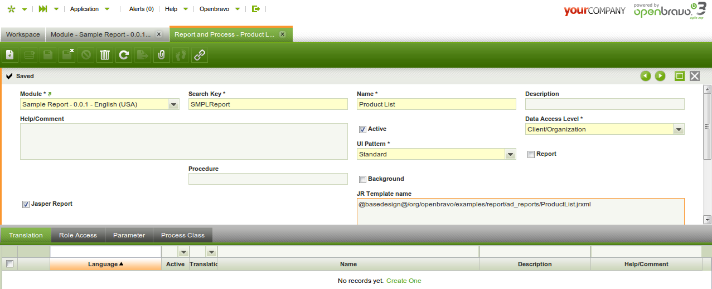{: .legacy-image-style}

    {: .legacy-image-style}

###  Creating the Menu record

1. Using the System Administrator role, open the **Menu** window 
2. Create a **new record** 
3. Fill all required fields: 
    * **Module:** Your module 
    * **Name:** Name of the menu entry (Product List) 
    * **Description:** You must enter a description. Although is not mark as required, it is for this type of reports 
    * **Action:** Pick Process 
    * **Process:** Pick your process (Product List) 

{: .legacy-image-style}

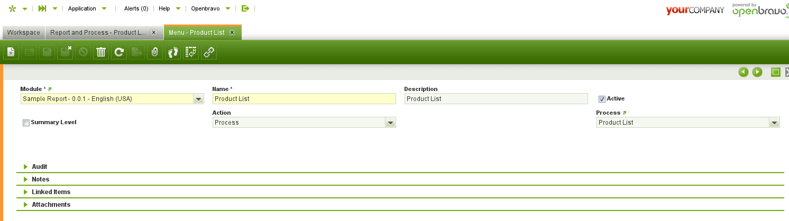{: .legacy-image-style}

##  Compiling

After you have registered the report and menu entry in the Application Dictionary, you need to compile to generated the the necessary code.
    
```   
ant smartbuild
```

Once the compilation has completed, refresh your Eclipse project, and restart your tomcat server.

##  Testing the Report

If you have completed all the steps, you should be able to open your Product List report form the quick-launch, or menu entry.

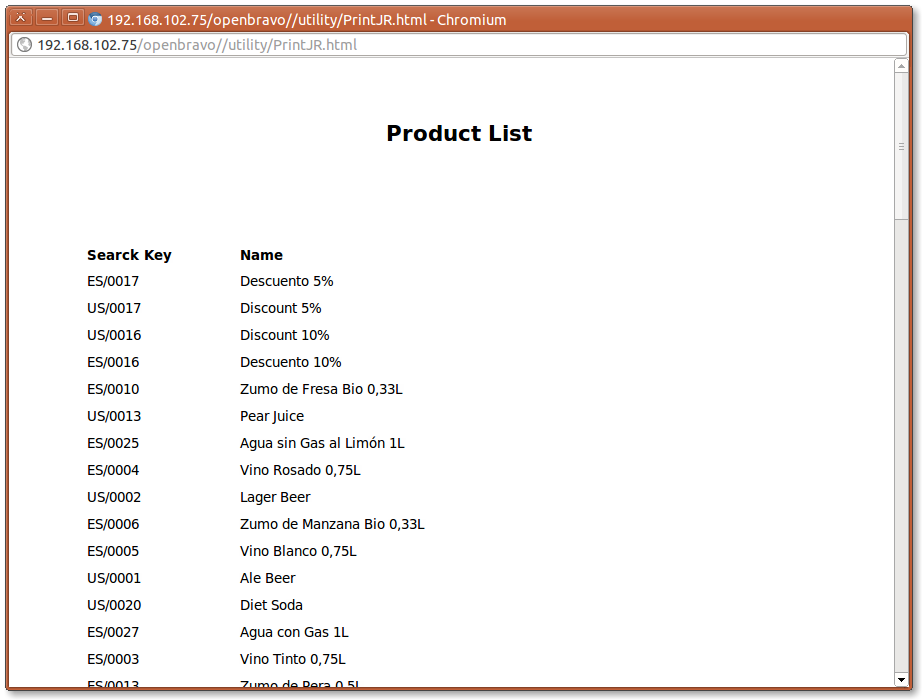{: .legacy-image-style}

{: .legacy-image-style}


##  Creating a Report Using a Process Definition
  
It is possible to create a report using a process definition. For more information, visit [How to Create a Report using Process Definition](how-to-create-a-report-using-process-definition.md).

---

This work is a derivative of [How to Create a Report with iReports](http://wiki.openbravo.com/wiki/How_to_create_a_Report_with_iReport){target="\_blank"} by [Openbravo Wiki](http://wiki.openbravo.com/wiki/Welcome_to_Openbravo){target="\_blank"}, used under [CC BY-SA 2.5 ES](https://creativecommons.org/licenses/by-sa/2.5/es/){target="\_blank"}. This work is licensed under [CC BY-SA 2.5](https://creativecommons.org/licenses/by-sa/2.5/){target="\_blank"} by [Etendo](https://etendo.software){target="\_blank"}.