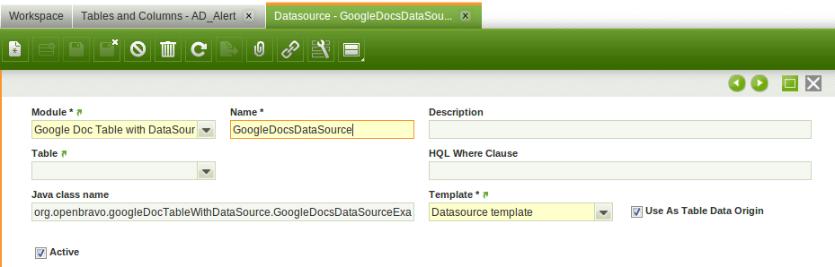
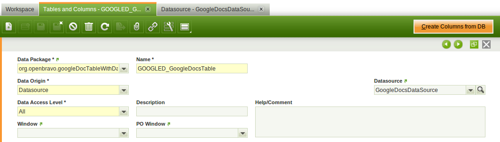
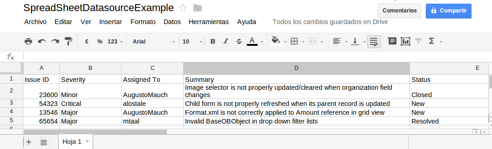
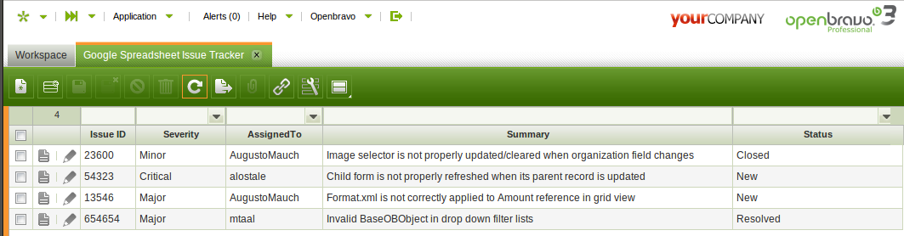
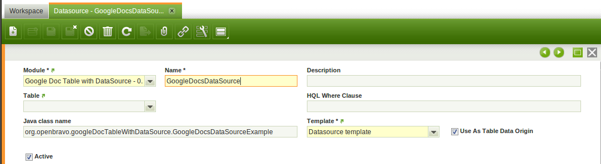
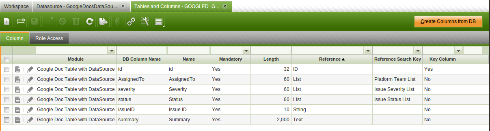
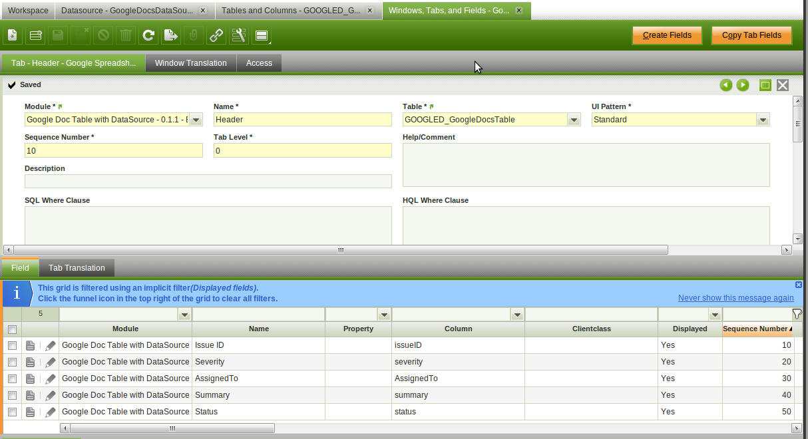

---
tags:
  - create a table
  - table
  - application dictionary
  - user defined datasource
---

#  How to Create a Table Based on a User Defined Datasource

##  Overview

Two different data origins can be set for tables defined in the application dictionary: **Tables** (database tables and views) and **Datasource**. There are two main reasons why to use a datasource based table.

  * To use as data origin objects other than database tables or views. For instance, it is possible to define a datasource based table that uses as data origin a Google Docs Spreadsheet, a `.CSV` file, data obtained from a webservice, etc. 
  * To solve performance related problems. For instance, the Return from Customer window has a pick and execute window that suffers performance problems in systems with very high volumes. The cause of this problem is that the table used in that pick and execute window is based in a very complex database view. A user defined datasource can be created to build that view manually. This datasource has been included in the module `org.openbravo.highvolumedatasources` and has reduced the response time of that particular pick an execute window from >60 seconds to <1 second. 

!!!note
    Defining a datasource requires a big effort (filtering, pagination, sorting and so on needs to be coded). If it is suitable for your needs, an [HQL Based Table](../../../developer-guide/etendo-classic/how-to-guides/how-to-create-a-hql-based-table.md) can be used.  
  
##  Creating the Java Datasource

[Here](../../../developer-guide/etendo-classic/concepts/datasources.md) you can find information on how to create a Java Datasource, and find [some examples](../../../developer-guide/etendo-classic/concepts/datasources.md#datasource_examples).

If the datasource is read-only (for instance to be used in a pick and execute window), then it is recommended to create a new class that extends the `ReadOnlyDataSourceService` class. If the datasource is going to be used also to add, update or delete existing records, then it is recommended to extend the `DefaultDataSourceService` class.

The datasource must override the `getEntity()` method. This template can be used, the only necessary change is the value of the `AD_TABLE_ID` constant.
```
   
    //Table ID of the datasource based table defined in the application dictionary
    private static final String AD_TABLE_ID = "A9BC62219E644720867F6402B0C25933";
   
    @Override
    public Entity getEntity() {
      return ModelProvider.getInstance().getEntityByTableId(AD_TABLE_ID);
    }
```

##  Defining the Datasource in the Application Dictionary

[Here](../../../developer-guide/etendo-classic/concepts/datasources.md#datasource_definition) you can find information on how to define a datasource in the application dictionary.

The flag **Use as Table Data Origin** should be checked in datasources that will be used as data origin for tables defined in the application dictionary. If this flag is checked:

  * The Datasource Fields subtab of the Datasource window will be hidden. The columns returned from datasource that will be used as table data origin will be defined in the Tables and Columns window, so defining them also in the Datasource window would be redundant and confusing. 
  * Datasources with this flag checked will be shown in the Datasource combo of the Table header tab. 



##  Defining the Table and its Columns

[Here](../../../developer-guide/etendo-classic/how-to-guides/how-to-create-a-table.md#registering-the-table-within-the-application-dictionary) you can find information on how to define in the application dictionary tables based on database tables or views.

The **Data Origin** field allows the user to select the type of data origin for the table he is defining. This field is a combo that contains two options: Datasource and Table. If the Table option is selected, the Datasource combo will be hidden. If the Datasource option is selected, the **DB Table Name** and **Java Class Name** fields will be hidden, and the Datasource combo will be shown. This combo will be used to select the user defined datasource that will work as the table data origin.



It is not possible to use the **Create Columns from DB** to define the columns of datasource based tables, so they will have to be added manually.

##  Defining the Window, its Tabs and its Fields

Once the table and its columns have been defined, it is necessary to define the window. Windows with tabs associated with datasource based tables are defined in the exact same way as with tabs associated with database table based tables. [Here](../../../developer-guide/etendo-classic/how-to-guides/how-to-create-a-window.md) you can find information on how to do it.

##  Design Considerations

There are some design considerations that must be taken into account when creating a datasource based table:

  * Tabs associated with datasource based tables can not have subtabs. 
  * No Java class is generated for datasource based tables. 
  * Manual datasources must implement the filtering, sorting and pagination of the tables. If the manual datasource being defined does not support filtering foreign keys based on their id, the Support Filtering Foreign Key Columns Using Their ID flag must be unchecked. For instance, the criteria built when filtering the **\*** organization using its id would be: `{fieldName: 'organization', operator: 'equals', value: '0'}`. 

##  Example: A Window Based on a Google Spreadsheet

This section is a summary of a datasource based table that uses a Google Spreadsheet as its data origin.

In this example, a Google Spreadsheet that serves as an issue tracker
  



is used as data origin for an Etendo window



The window defined in this example has the same functionality as if it had been defined based on a database table. It is possible to: 

* Fetch records
* Update records in grid and form view
* Create new records
* Sort the grid using any column 
* Filter the grid

When a record is updated from the Etendo window, the Google spreadsheet is updated in real time. If the Google spreadsheet is updated manually, the Etendo grid must be refreshed in order to fetch the updated records.

###  Java Datasource

Implementing the Java Datasource is the most time consuming step of the whole process. In this section, only the fetch operation is going to be demonstrated, the full implementation of the datasource can be found [here]().

This datasource will be used in an Etendo window and it will allow to fetch, add, update and delete registers. In this case, it is very convenient to extend the `DefaultDataSourceService` class.

This is the implementation of the fetch method:    
    
     
      @Override
      public String fetch(Map<String, String> parameters) {
        int startRow = 0;
        final String startRowStr = parameters.get(JsonConstants.STARTROW_PARAMETER);
        if (startRowStr != null) {
          startRow = Integer.parseInt(startRowStr);
        }
        final List<JSONObject> jsonObjects = fetchJSONObject(parameters);
        final JSONObject jsonResult = new JSONObject();
        final JSONObject jsonResponse = new JSONObject();
        try {
          jsonResponse.put(JsonConstants.RESPONSE_STATUS, JsonConstants.RPCREQUEST_STATUS_SUCCESS);
          jsonResponse.put(JsonConstants.RESPONSE_STARTROW, startRow);
          jsonResponse.put(JsonConstants.RESPONSE_ENDROW, jsonObjects.size() + startRow - 1);
          jsonResponse.put(JsonConstants.RESPONSE_DATA, new JSONArray(jsonObjects));
          jsonResponse.put(JsonConstants.RESPONSE_TOTALROWS,
              parameters.get(JsonConstants.RESPONSE_TOTALROWS));
          jsonResult.put(JsonConstants.RESPONSE_RESPONSE, jsonResponse);
        } catch (JSONException e) {
          try {
            jsonResponse.put(JsonConstants.RESPONSE_STATUS, JsonConstants.RPCREQUEST_STATUS_SUCCESS);
          } catch (JSONException ex) {
            log.error("Error while building the response status", ex);
          }
        }
        return jsonResult.toString();
      }

The datasource must return a Json string with the following attributes:

  * **status**: Indicates if the fetch has been successful. If it is successful, these other attributes must be provided: 
  * **startRow**: Index of the first row returned by the datasource in the current fetch request. 
  * **endRow**: Index of the last row returned by the datasource in the current fetch request. 
  * **totalRows**: Total number of rows that the datasource can return given the filters of the current fetch request. 
  * **data**: a Json array containing all the fetched objects. 

A convenience class called `GoogleSpreadsheet` has been created as a link between the datasource and the Google Docs API. Its implementation can be found here.

The data objects are retrieved using the `fetchJSONObject` method:
    
     
      private List<JSONObject> fetchJSONObject(Map<String, String> parameters) {
        final String startRowStr = parameters.get(JsonConstants.STARTROW_PARAMETER);
        final String endRowStr = parameters.get(JsonConstants.ENDROW_PARAMETER);
        int startRow = -1;
        int endRow = -1;
        // Obtains the startRow and endRow parameters
        if (startRowStr != null) {
          startRow = Integer.parseInt(startRowStr);
        }
        if (endRowStr != null) {
          endRow = Integer.parseInt(endRowStr);
        }
        // Retrieves the user credentials for Google Docs
        String username = OBPropertiesProvider.getInstance().getOpenbravoProperties()
            .getProperty("googleUsername");
        String password = OBPropertiesProvider.getInstance().getOpenbravoProperties()
            .getProperty("googlePassword");
        ListFeed feed = null;
        try {
          // Retrieves the Google Spreadsheet
          GoogleSpreadsheet spreadsheet = new GoogleSpreadsheet(SPREADSHEET_NAME, username, password);
          // Sets the sorting given the _sortBy parameter
          String sortByColumn = parameters.get(JsonConstants.SORTBY_PARAMETER);
          if (sortByColumn != null && !sortByColumn.isEmpty()) {
            spreadsheet.setOrderBy(sortByColumn);
          }
          // Sets the ID parameter if a specific record must be fetched
          String recordId = parameters.get(JsonConstants.ID);
          if (recordId != null && !recordId.isEmpty()) {
            spreadsheet.setRecordId(recordId);
          }
          // Retrieves the ListFeed given the spreadsheet name, user credentials, sorting criteria and
          // record ID
          feed = spreadsheet.getFeed();
        } catch (Exception e) {
          log.error("Error retrieving the feed", e);
        }
        // Retrieves the actual records to be returned given the feed, startRow, endRow and parameters
        final List<Map<String, Object>> data = getData(parameters, feed, startRow, endRow);
        // Converts the records to its Json representation
        final DataToJsonConverter toJsonConverter = OBProvider.getInstance().get(
            DataToJsonConverter.class);
        toJsonConverter.setAdditionalProperties(JsonUtils.getAdditionalProperties(parameters));
        return toJsonConverter.convertToJsonObjects(data);
      }

The `getData` method returns the records that will be actually returned given the ListFeed and the filter criteria:

    
    
     
      protected List<Map<String, Object>> getData(Map<String, String> parameters, ListFeed feed,
          int startRow, int endRow) {
        List<Map<String, Object>> result = new ArrayList<Map<String, Object>>();
        Map<String, String> filterCriteria = new HashMap<String, String>();
        try {
          // Builds the criteria based on the fetch parameters
          JSONArray criterias = (JSONArray) JsonUtils.buildCriteria(parameters).get("criteria");
          for (int i = 0; i < criterias.length(); i++) {
            final JSONObject criteria = criterias.getJSONObject(i);
            filterCriteria.put(criteria.getString("fieldName"), criteria.getString("value"));
          }
        } catch (JSONException e) {
          log.error("Error while building the criteria", e);
        }
        // Obtains all the feed entries
        List<ListEntry> entries = feed.getEntries();
        for (ListEntry entry : entries) {
          CustomElementCollection elements = entry.getCustomElements();
          IssueTrackerItem issue = new IssueTrackerItem(elements);
          // Adds to the result only the entries that are not filtered out
          if (applyFilter(issue, filterCriteria)) {
            result.add(issue.toMap());
          }
        }
        return result;
      }

Another convenience class called `IssueTrackerItem` has been created to handle each issue tracker record.

####  Security Datasource

The datasources should implement security mechanism. The `checkFetchDatasourceAccess` method allows to implement a security access to a
DataSource when it is used `fetch()` method. The `checkEditDatasourceAccess` method is used to implement security mechanism in add, remove and update operations. It can be overridden in specific datasources to apply a particular security mechanism. This is an implementation example of the `checkFetchDatasourceAccess` method:
```
 
  @Override
  public void checkFetchDatasourceAccess(Map<String, String> parameter) {
    final OBContext obContext = OBContext.getOBContext();
    try {
      final Entity entity = ModelProvider.getInstance().getEntityByTableId(AD_TABLE_ID);
      if (entity != null) {
        obContext.getEntityAccessChecker().checkReadableAccess(entity);
      }
    } catch (OBSecurityException e) {
      handleExceptionUnsecuredDSAccess(e);
    }
  }
 
 
  @Override
  public void checkEditDatasourceAccess(Map<String, String> parameter) {
  // To implement security mechanism: add, remove and update.
  }
 
```
To implement security mechanism, 3 check methods have been implemented in `EntityAccessChecker` class:

  * checkReadableAccess(Entity entity): Checks if an entity is readable for current user. 
  * checkDerivedAccess(Entity entity): Checks if an entity is derived for current user. 
  * checkWritableAccess(Entity entity): Checks if an entity is writable for current user. 

###  Datasource Definition in the Application Dictionary

It is very easy to define the datasource in the application dictionary. Just make sure to enter the correct Java class name and to check the **Use as Table Data Origin** flag.



###  Table and Columns Definition in the Application Dictionary

Make sure you select the **Datasource** option in the **Data Origin** combo. The datasource defined in the previous step should be shown in the **Datasource** combo.

The table is not based on a database table, so its columns must be added manually:



At least one column must be defined as a primary key.

The name of the columns in the application dictionary is the same as the title of the columns in the google spreadsheet, this simplifies the implementation of the datasource.

###  Window, Tab and Fields Definition in the Application Dictionary

Defining the window, tab and field in the application dictionary is done in the same way as with the standard tables:



---

This work is a derivative of [How to Create a Table Based on a User Defined Datasource](http://wiki.openbravo.com/wiki/How_to_Create_a_Table_Based_on_a_User_Defined_Datasource){target="\_blank"} by [Openbravo Wiki](http://wiki.openbravo.com/wiki/Welcome_to_Openbravo){target="\_blank"}, used under [CC BY-SA 2.5 ES](https://creativecommons.org/licenses/by-sa/2.5/es/){target="\_blank"}. This work is licensed under [CC BY-SA 2.5](https://creativecommons.org/licenses/by-sa/2.5/){target="\_blank"} by [Etendo](https://etendo.software){target="\_blank"}.