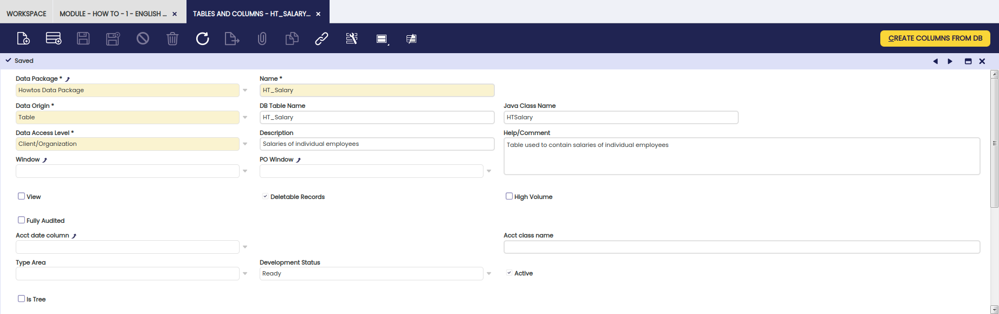
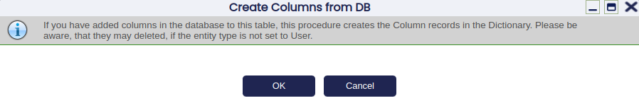
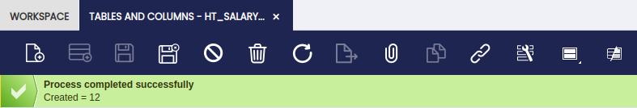
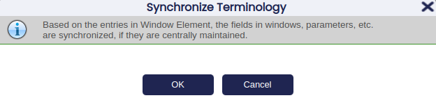
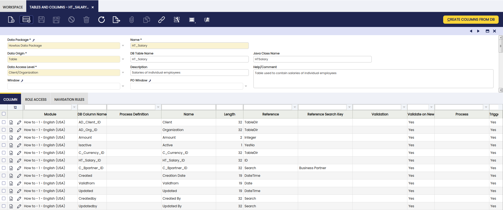

---
tags:
  - How to
  - Etendo classic
  - create a table
  - table
  - application dictionary
  - rebuilding the system
---

# How to Create a Table

## How to create a new table

More generic documentation about tables and their characteristics in Etendo can be found in the [Tables](../../concepts/Tables.md) page. That page explains common columns needed for all tables in Etendo, naming rules and more important info.

First of all, the underlying database structures that will hold the data need to be created. In other words, using a database administration tool (e.g., [pgAdmin 4](https://www.pgadmin.org/){target="\_blank"} or [phpPgAdmin](https://github.com/phppgadmin/phppgadmin){target="\_blank"} for PostgreSQL and [Oracle SQL Developer](https://www.oracle.com/database/sqldeveloper/){target="\_blank"}) one needs to first `CREATE TABLE` that will be used to hold data of the new window/tabs.

### Objective

Imagine we are developing an HR module and we need a window that will enable the user to input salaries of employees. We also need to track the employee's salary so history records need to be preserved. Each salary record needs to have a Valid From Date field that indicates when a particular salary came into being. The record belonging to a particular employee with the latest Valid From Date is the salary that is valid today. Note that employees are already inside the system contained in the `C_BPARTNER` database table and indicated by the `C_BPARTNER ISEMPLOYEE` column. Therefore, we only need to create a database table that will hold the actual salaries.

### Modularity

All new developments must belong to a module that is not the _core_ module. Please follow the [How to create a module](How_To_Create_a_Module.md) section of the Modularity Developer's Manual to create a new module.

Once you have registered the module, you need to decide on the database prefix that will indicate DB items that belong to this module. This is done by adding DB prefix(es) to the module That way, any database artefact(table, trigger, stored procedure) that belongs to that module will need to have the name prefixed with it. In our case, add the `HT` _DB prefix_.

Finally, the data package needs to be entered in the _Data Package_ tab of the _Module_ window. Enter a new record there with HR Data as the _Name_ and _{modulePackage}.data_ (note that this package must be a subpackage of the one you entered on the level of module), for example com.etendoerp.howtos.data in case com.etendoerp.howtos is the package of the module.

### Create new tables in the database

Let's introduce a new database table called `ht_salary` that will hold the required data. Notice the `HT` prefix of the table name indicating the module this table belongs to.

The new `ht_salary` table must include the `AD_Client_ID`, `AD_Org_ID`, `IsActive`, `Created`, `CreatedBy`, `Updated` and `UpdatedBy` fields that are `mandatory` and required for security and auditory purposes of the application.

| Column name     | Type   | Length | Note                                                                                                                                   |
| --------------- | ------ | ------ | -------------------------------------------------------------------------------------------------------------------------------------- |
| `HT_SALARY_ID`  | CHAR   | 32     | The primary key of the table that must follow the table name followed by the \_ID.                                                     |
| `AD_CLIENT_ID`  | CHAR   | 32     | Indicates which client (company) the record belongs to (multitenancy).                                                                 |
| `AD_ORG_ID`     | CHAR   | 32     | Indicates which organization (city/department/location) within a client a record belongs to.                                           |
| `ISACTIVE`      | CHAR   | 1      | This is intended for deactivating records that are not valid anymore but are referenced within the system and hence cannot be deleted. |
| `CREATED`       | DATE   |        | Date/time of creation of a record.                                                                                                     |
| `CREATEDBY`     | CHAR   | 32     | Foreign key to `AD_USER` indicating the user that created this record.                                                                 |
| `UPDATED`       | DATE   |        | Date/time of last update of a record.                                                                                                  |
| `UPDATEDBY`     | CHAR   | 32     | Foreign key to `AD_USER` indicating the user that last updated this record.                                                            |
| `C_BPARTNER_ID` | CHAR   | 32     | Employee this salary belongs to.                                                                                                       |
| `AMOUNT`        | NUMBER | 10     | The actual amount of the salary.                                                                                                       |
| `C_CURRENCY_ID` | CHAR   | 32     | Foreign key to `C_CURRENCY` indicating the currency the amount is in.                                                                  |
| `VALIDFROM`     | DATE   |        | Date that this salary is valid from.                                                                                                   |

To create the above table within the database, use one of the following `CREATE TABLE` statements depending on the DB you are using:

!!!note
    All identifiers in the SQL must be written in lowercase. So they can be used later without quoting them.

```sql title="SQL table creation script"
CREATE TABLE ht_salary
(
  ht_salary_id  CHARACTER VARYING(32)		NOT NULL,
  ad_client_id  CHARACTER VARYING(32)		NOT NULL,
  ad_org_id     CHARACTER VARYING(32)		NOT NULL,
  isactive      CHARACTER(1)                   NOT NULL        DEFAULT 'Y',
  created       TIMESTAMP WITHOUT TIME ZONE 	NOT NULL 	DEFAULT now(),
  createdby     CHARACTER VARYING(32)		NOT NULL,
  updated       TIMESTAMP WITHOUT TIME ZONE 	NOT NULL 	DEFAULT now(),
  updatedby     CHARACTER VARYING(32)         	NOT NULL,
  c_bpartner_id CHARACTER VARYING(32)         	NOT NULL,
  amount	 NUMERIC 	      	        NOT NULL,
  c_currency_id VARCHAR(32)         	        NOT NULL,
  validfrom     TIMESTAMP WITHOUT TIME ZONE    NOT NULL,
    CONSTRAINT ht_salary_isactive_check CHECK (isactive = ANY (ARRAY['Y'::bpchar, 'N'::bpchar])),
    CONSTRAINT ht_salary_key PRIMARY KEY (ht_salary_id),
    CONSTRAINT ht_salary_ad_org FOREIGN KEY (AD_ORG_ID) REFERENCES AD_ORG (ad_org_id),
    CONSTRAINT ht_salary_ad_client FOREIGN KEY (AD_CLIENT_ID) REFERENCES AD_CLIENT (ad_client_id),
    CONSTRAINT ht_salary_c_bpartner FOREIGN KEY (C_BPARTNER_ID) REFERENCES C_BPARTNER (c_bpartner_id),
    CONSTRAINT ht_salary_c_currency FOREIGN KEY (C_CURRENCY_ID) REFERENCES C_CURRENCY (c_currency_id)
);
```

### Registering the table within the Application Dictionary

The following steps register the newly created table within the Etendo Classic Application Dictionary.

For this purpose, first log into Etendo Classic using a username with access to `System Administrator` > `Role`. Navigate to `Application Dictionary`> `Tables and Columns` and create a new record as shown in the screenshot below:



Main fields of this window are (for more information, see the `AD_Table` table description):

- _Data Package_ specifies to which java data package within the module the table will belong when used within [DAL](../concepts/Data_Access_Layer.md) (Data Access Layer).
- _Name_ Defines the name that Etendo Classic uses to recognize the defined database table. This name is used in [REST webservices](../../concepts/xml-rest-web-services.md) and in the [Data Access Layer](../../concepts/Data_Access_Layer.md#entity-naming).
- _Description_ Gives a small description of the table.
- _Help/Comments_ Defines the text that is displayed in Help window.
- _DB Table name_ Defines database table name as it was defined by the `CREATE TABLE` during its creation.
- _Java Class Name_ This will be the actual Java class within the Data Package of the module through which you will be able to access this table when using DAL.
- _Data Access Level_ determines what kind of data will the table contain due to the multitenancy functionality
  - _System only_: Only system records can be inserted into this table (`AD_CLIENT_ID=0`, `AD_ORG_ID=0`), for example `AD_TABLE`.
  - _System/Client_: System or client specific records can be inserted here (`AD_CLIENT_ID=anything`, `AD_ORG_ID=0`), for example `AD_ROLE`
  - _Organization_: Only client and organization specific data can be inserted into this table (`AD_CLIENT_ID<>0`, `AD_ORG_ID<>0`), for example `C_INVOICE`
  - _Client/Organization_: Only client specific data can be inserted here, however, it can belong to a specific organizations within that client or be shared among all (`AD_CLIENT_ID<>0`,`AD_ORG_ID=anything`), for example `C_BPARTNER`
  - _All_: Any combination of `AD_CLIENT_ID` and `AD_ORG_ID` can be inserted into this table.

Save this record then press the _Create columns from DB_ button to create columns within the Column tab automatically.



Once the creation process has finished, you will be informed of the number of columns that have been added to this table.



Switch to _Column_ tab to see all the columns (for more information, see the AD*Column table description) that were created according to their definition within the database. You can now additionally alter the properties of each column. Each column is assigned a reference (which defines the data type) depending on its name and its data type. Run \_Synchronize Terminology* process (`Application Dictionary` > `Synchronize Terminology`). Two tricky details before you run it:

- Check you have defined dependencies from your module to core and any other needed module. Synchronize Terminology will link your columns to Elements in your module or in modules it depends on. If you don't declare the dependency to core, the system will create new elements for standard columns like IsActive, CreatedBy, etc.
- Do not set the Elements linked to your columns, let the Synchronize terminology to do the job. This way, the process will find the appropiate elements and will set the proper column names for the standard columns (IsActive, CreatedBy, etc.).



This process tries to find an existing application element (within the currently developed module) and thus its label, help and description and if one is not found, a new one is created. This enables a centralized translation of the application/module.



Each table must have at least one column marked as an identifier. The actual values of identifier columns later get concatenated to be shown to the user as a representation of a particular record (see the link to the Sales Order within the Sales Invoice window). These identifiers will also be used to construct dropdown lists of records of that particular table. By default all columns with column name _Name_ are set as an identifier. In case there is no column with this _Name_ , no identifier is set and needs to be done so manually or compilation will fail.

The name is used by the [Data Access Layer](../../concepts/Data_Access_Layer.md) and in [REST webservices](../../concepts/xml-rest-web-services.md). For specific columns (audit info, client/organization, active) it is important to be precise in the naming.

!!!note
    The columns that are named `line` or `seqNo` are used to contain the sequence number of a record (i.e. the number of a line in an invoice They take a default value like:

    ```
    @SQL=SELECT COALESCE(MAX(ColumnName),0)+10 AS DefaultValue FROM TableName
    WHERE xxParentColumn=@xxParentColumn@
    ```

    The `WHERE` part of this clause needs to be replaced with the required values. The code that should appear here is the name of the column which links with the _id_ of the parent one For example, each record of the `C_InvoiceLine` belongs to a particular `C_Invoice` record and they are all sequenced. `C_Invoice` is the parent table for the lines saved in `C_InvoiceLine` . This table has a column named line and the default value that it takes is:

    ```
    @SQL=SELECT COALESCE(MAX(LINE),0)+10 AS DefaultValue FROM C_INVOICELINE
    WHERE C_INVOICE_ID=@C_INVOICE_ID@
    ```

Most of the columns in our specific `HT_SALARY` case will be automatically detected correctly, however, some need revising:

- _Amount_ : Reference = _Amount_ , Length = _10_
- _C_BPartner_ID_ : Reference = _Search_ , Reference Search Key = _Business Partner_ , Length = _32_ , Link To Parent Column = _Y_
- _Valid From_ : Identifier = _Y_
- _Amount_ : Identifier = _Y_

Etendo Classic now knows about the new HT_SALARY database table and how to treat it in terms of its definition and the representation to the user.

### Rebuilding the system

Finally to make the newly added table available at runtime `./gradlew generate.entities` needs to called and the changes deployed to Tomcat. Those two steps can be done together by calling `./gradlew smartbuild` . After that, Tomcat must be restarted to refresh the DAL In-Memory Model, so it knows about the newly added columns.

---

This work is a derivative of [How to Create a Table](http://wiki.openbravo.com/wiki/How_to_create_a_Table){target="\_blank"} by [Openbravo Wiki](http://wiki.openbravo.com/wiki/Welcome_to_Openbravo){target="\_blank"}, used under [CC BY-SA 2.5 ES](https://creativecommons.org/licenses/by-sa/2.5/es/){target="\_blank"}. This work is licensed under [CC BY-SA 2.5](https://creativecommons.org/licenses/by-sa/2.5/){target="\_blank"} by [Etendo](https://etendo.software){target="\_blank"}.
