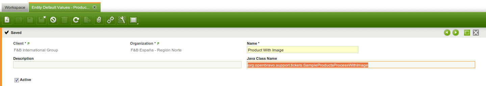
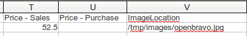
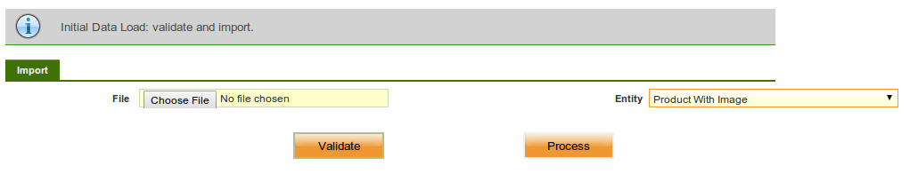
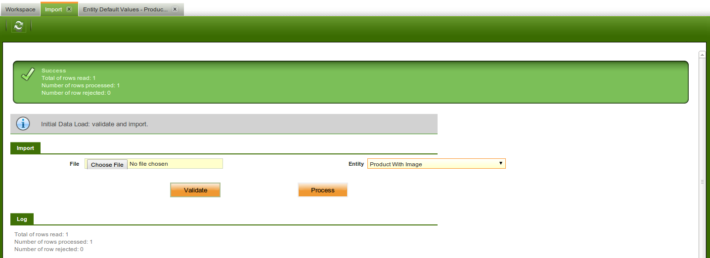
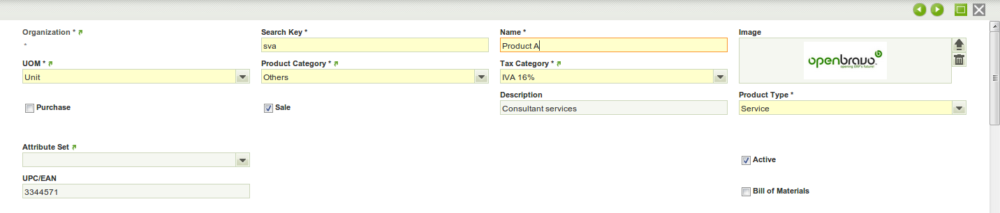

# How to Create an Import Process with Images

!!! example "IMPORTANT: THIS IS A BETA VERSION"
        This page is under active development and may contain **unstable or incomplete features**. Use it **at your own risk**.

## Overview

This article explains how to create a **mass image import process** in Etendo Classic, focusing on the import of product images. Using the Initial Data Load for Java module as a base, it demonstrates how to extend an **existing import process** to handle **image files** associated with products.

##  Execution Steps

Let's create a  **custom importation process**, using the **Initial Data Load for Java** module and the java class `SampleProductsProcess`, included in this module. For that, use the java class `SampleProductsProcess.java` as the base that is included in the **Initial Data Load Module for Java**, and through a series of single modifications include a new column within the import `.csv` which will allow to specify the path of the image that is associated to the product.

###  Installing Required Modules

- Activate the **Professional subscription License**. 
- Go to `General Setup > Application > Module Management > Add Modules`. 
- Search and install the following modules:
    - `Initial Data Load (Refer [  [1]  ])` 
    - `Initial Data Load Extension for Java (Refer[  [2]  ])` 

###  Preparing SampleProductsProcess.java

The following modifications need to be made:

- `getEntityName` method: We will simply return the name of our new entity. 

        
        public String getEntityName() {
                return "Simple Products With Image";
        }

- `getParameters` method : We add a new parameter to localize our image. 

        
                ....
                new Parameter("ImageLocation", Parameter.STRING) };
                ....

- `validateProcess` method: We add a validator for our new field (for example: for the maximum length) 

        
                ....
                validator.checkString(values[21], 255);
                ....

- `internalProcess` method: We have to pass a parameter to the createProduct() method. 

        
        public BaseOBObject internalProcess(Object... values) throws Exception {
                return createProduct((String) values[0], (String) values[1], (String) values[2],
                        (String) values[3], (String) values[4], (String) values[5], (String) values[6],
                        (String) values[7], (String) values[8], (String) values[9], (String) values[10],
                        (String) values[11], (String) values[12], (String) values[13], (String) values[14],
                        (String) values[15], (String) values[16], (String) values[17], (String) values[18],
                        (String) values[19], (String) values[20], (String) values[21]);
        }

- `createProduct` method: Additionally to receiving a new parameter (imagelocation), this method does contain the logic to import the image to the database from its physical location. 

        
        
        
                ....
                File imageFile = new File(imagelocation);
                if (imageFile.exists()) {
                    FileInputStream is = new FileInputStream(imageFile);
                    long length = imageFile.length();
                    byte[] bytes = new byte[(int) length];
                    int offset = 0;
                    int numRead = 0;
                    while (offset < bytes.length 
                         && (numRead = is.read(bytes, offset, bytes.length - offset)) >= 0) {
                            offset += numRead;
                    }
                    is.close();
                    ByteArrayInputStream bis = new ByteArrayInputStream(bytes);
                    BufferedImage rImage = ImageIO.read(bis);
                    Image productImage = OBProvider.getInstance().get(Image.class);
                    productImage.setName(imageFile.getName());
                    productImage.setBindaryData(bytes);
                    productImage.setWidth(new Long(rImage.getWidth()));
                    productImage.setHeight(new Long(rImage.getHeight()));
                    productImage.setMimetype(tika.detect(bytes));
                    OBDal.getInstance().save(productImage);
                    OBDal.getInstance().flush();
                    product.setImage(productImage);
                }
                ....

###  Registering the Process

- Go to `Master Data Management > Initial Data Load > Setup > Entity Default Value`. 

- Register the **Java file** here. 

    
###  Importing the Data

The `.csv` file that contains the data, must include the new column just added, with the string **ImageLocation** in the header.

    
Pay special attention on the **class name** while adding the entity default value.

- Import the data using the **Import** window. 
- Go to `Master Data Management > Initial Data Load > Process > Import`. 
- Choose the **input** file.
- Choose the entity as **Product With Image**.

    
- Validate the **input file**: If the file has invalid data, it will show the invalid data in the log screen. 

- Once the input values are validated, the data can be loaded into the actual table by clicking on the process. 

- If there are any issues while processing the input data, appropriate messages will be logged in the message box provided under the Log header in the Import window. 

##  Result

As a result, the product is imported with its corresponding product image.  

This work is a derivative of [How to Create an Import Process with Images](http://wiki.openbravo.com/wiki/How_To_Create_An_Import_Process_With_Images){target="\_blank"} by [Openbravo Wiki](http://wiki.openbravo.com/wiki/How_To_Create_a_Trigger){target="\_blank"}, used under [CC BY-SA 2.5 ES](https://creativecommons.org/licenses/by-sa/2.5/es/){target="\_blank"}. This work is licensed under [CC BY-SA 2.5](https://creativecommons.org/licenses/by-sa/2.5/){target="\_blank"} by [Etendo](https://etendo.software){target="\_blank"}.

