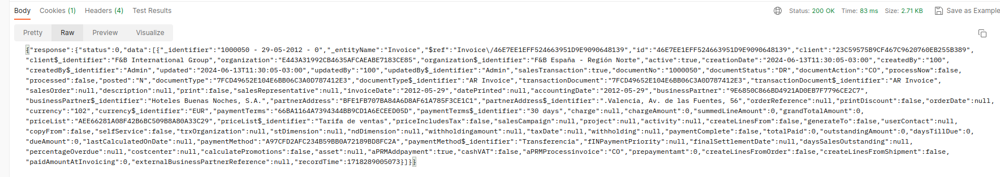

---
tags:
  - How to
  - Business Entities
  - Update
  - Etendo Classic
  - JSON REST
  - Secured Web Services
---

# How to Create and Update Business Entities Using Web Services

## Overview

The aim of this section is to show how to use some of **Etendo's available web services** to create business entities and/or to update them.

Therefore, these web services features will be explained in detail:

  * **JSON REST**
  * **Secure Web Services**

## Execution Steps

To add or update entities, use `HTTP` commands. To execute any `HTTP commands`, a [**Java class**](../how-to-guides/how-to-call-an-etendo-webservice-from-java.md) could be created and use the available classes related to the HTTP protocol.

!!!note
    We could do the same for any other protocol or scripting language like PHP.

Alternatively, use any plugin or application like [**Postman**](https://www.postman.com/downloads/){target="\_blank"} which allows executing any HTTP command on an URL of your choice. In the following examples we will make use of this plugin and we will assume that our Etendo environment is running on a local machine via `http://localhost:8080/etendo`.

### JSON REST

We are about to create a new **invoice header**, so that the URL for this case will be:

    http://localhost:8080/etendo/org.openbravo.service.json.jsonrest/Invoice

In `Authorization` we have to select the **Basic Auth** type and add the credentials which we use to get access to the **Web Service** (which are by the way the same that we use to get into the application). Take into account that the visibility of the data within the web service will be the same as if you logged into the application with the default role of this user. The `Content-Type` of the Request will be `application/json` and the **body** content of the request will be as follows, where the `ID`s will be replaced by those needed to be present in the invoice. 


We have set the attribute `salesTransaction` to `true`, indicating that this is a sales invoice:


```json
    {
      "data":
      {
        "entityName":          "Invoice",
        "active":              true,
        "organization":        { "id": "E443A31992CB4635AFCAEABE7183CE85" },
        "salesTransaction":    true,
        "documentType":        { "id": "7FCD49652E104E6BB06C3A0D787412E3" },
        "transactionDocument": { "id": "7FCD49652E104E6BB06C3A0D787412E3" },
        "documentNo":          "1000050",
        "accountingDate":      "2012-05-29",
        "invoiceDate":         "2012-05-29",
        "currency":            { "id": "102" },
        "priceList":           { "id": "AEE66281A08F42B6BC509B8A80A33C29" },
        "businessPartner":     { "id": "9E6850C866BD4921AD0EB7F7796CE2C7" },
        "partnerAddress":      { "id": "BFE1FB707BA84A6D8AF61A785F3CE1C1" },
        "paymentTerms":        { "id": "66BA1164A7394344BB9CD1A6ECEED05D" },
        "paymentMethod":       { "id": "A97CFD2AFC234B59BB0A72189BD8FC2A" }
      }
    }
```


We use the HTTP `POST` command with this data. We will get a `200 OK` response back, indicating that everything went well with the invoice data that was just created.



To make an update, we will use the `PUT` command. For instance, to update a Business Partner's name, we will execute that command on this URL:

  `http://localhost:8080/etendo/org.openbravo.service.json.jsonrest/BusinessPartner`

with the following content:

```json
    {
      "data":
      {
        "entityName": "BusinessPartner",
        "id":         "A6750F0D15334FB890C254369AC750A8",
        "name":       "New Name"
      }
    }
```

### Secure Web Services

!!!note
    To know more about how Etendo introduces its own Secure Web Services with unique features, visit [How to Use Secure Webservices](../how-to-guides/how-to-use-secure-webservices.md).

---

This work is a derivative of [How to Create and Update Business Entities using Web Services](https://wiki.openbravo.com/wiki/How_to_Create_And_Update_Business_Entities_Using_Web_Services){target="\_blank"} by [Openbravo Wiki](https://wiki.openbravo.com/wiki/Welcome_to_Openbravo){target="\_blank"}, used under [CC BY-SA 2.5 ES](https://creativecommons.org/licenses/by-sa/2.5/es/){target="\_blank"}. This work is licensed under [CC BY-SA 2.5](https://creativecommons.org/licenses/by-sa/2.5/){target="\_blank"} by [Etendo](https://etendo.software){target="\_blank"}.