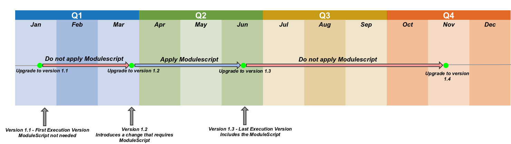

#  How to Create Build Validations and Module Scripts

##  Overview

This section provides information about how to create both a **Build Validation** and a **Module Script**. They are both very similar concepts, and are also implemented in a very similar way.

##  Build Validations

A build validation in Etendo is a Java class which is **executed at the beginning** of the `update.database` task.

The build validations main use is to **stop the build** because the instance is in such a state that rebuilding the system cannot be safely done. In modules, validations can be used to stop the build in case the module cannot be installed safely in the system for some reason.

So, for example, a validation could be used to check if **the user has done a necessary manual setup step that cannot be automated**. Or a validation could also be used to **check if the user has filled some data which is needed for the module to be installed correctly**.

Build validations are a different piece of code in Etendo, in that they are distributed as binaries (compiled classes), which are executed directly without them being compiled on the run. 

!!!note
      Build validations should not be a common case. Normally, they should only be needed when there was a mistake in a previous version of the module, or Core. The ultimate result for a validation is that, if it detects what it was meant to detect, the user will need to do manual actions to fix the problem, and this should be avoided if possible by all developers. 

###  Introduction to the implementation of build validations

The main steps to create a build validation are:

  1. Write it (Create a Java class for each validation you want to do). 
  2. Compile it (Build Validations are compiled separately from the rest of the Etendo code, using a specific gradle compile task). 
  3. Test it (Carefully test the validation before including it in your module, or in Core). 

To create a build validation, first create a class which extends the `org.openbravo.buildvalidationBuildValidation class`. This is an abstract class which has one abstract method: `List<String> execute()`

This method needs to be implemented. The class will be loaded at the beginning of the `update.database` task, and this method will be called. A **List of Strings** must be returned. If the list is empty, the build will continue. If the list contains at least one string, every string will be shown to the user, and the build will stop. Every string is supposed to be a meaningful error message, which shows the user what it needs to fix in his system for the validation to pass.

###  Writing the build validation

As was just explained, a build validation is nothing more than a class which extends the `org.openbravo.buildvalidation.BuildValidation` class, and implements the **abstract execute method**. Let's see an example:

```java title="ValidationExample.java"
public class ValidationExample extends BuildValidation {
 
  public List<String> execute() {
    try {
      ConnectionProvider cp = getConnectionProvider();
      PreparedStatement ps = cp
          .getPreparedStatement("SELECT COUNT(*) FROM C_Bpartner WHERE name IS NULL");
      ps.execute();
      ResultSet rs = ps.getResultSet();
      rs.next();
      ArrayList<String> errors = new ArrayList<String>();
      if (rs.getInt(1) > 0) {
        errors
            .add("There are business partners which don't have a defined name. Please fill the name of every business partner before installing the module MyModule.");
      }
      return errors;
    } catch (Exception e) {
      return handleError(e);
    }
  }
}
```

In this example, the main points of any build validation can be seen:

  * The class implements the **BuildValidation** class, and its corresponding execute method. 
  * In the **method**, the validation can be done (i.e. check if the Etendo instance complies with some specific rule). There is a convenient `getConnectionProvider()` method, provided by the abstract superclass, which allows doing direct queries to the database. It is important to remark that **validations should only do queries to the database, they should never change the contents of the database**. Module Scripts can be used to change the database if needed. 
  * Finally, the method returns a **List of error Strings**, which can be empty if the validation went well, or can contain one or more errors if the system did not comply with the validation. 

You can also use `SqlClass` if it is necessary to do the database operations.

```java  title="ValidationExample2.java"
public class ValidationExample2 extends BuildValidation {
 
  public List<String> execute() {
    try {
      ConnectionProvider cp = getConnectionProvider();
      ArrayList<String> errors = new ArrayList<String>();
      int numBpartners=Integer.parseInt(ValidationExample2Data.queryBPartners(cp));
      if (numBpartners > 0) {
        errors.add("There are business partners which don't have a defined name. Please fill the name of every business partner before installing the module MyModule.");
      }
      return errors;
    } catch (Exception e) {
      return handleError(e);
    }
  }
}
```

This needs the following `xsql` file:

```xml title="ValidationExample2Data.xsql"
<?xml version="1.0" encoding="UTF-8" ?>
 
<SqlClass name="ValidationExample2Data" package="org.openbravo.buildvalidation">
  <SqlMethod name="queryBPartners" type="preparedStatement" return="string">
      <SqlMethodComment></SqlMethodComment>
      <Sql><![CDATA[
          SELECT COUNT(*) FROM C_Bpartner WHERE name IS NULL
          ]]>
      </Sql>
  </SqlMethod>
</SqlClass>
```

!!!info
      The class source files should be inside the module folder, in: `src-util/buildvalidation/src`. And they should follow the standard **Java package rules**. The folder will not exist if it is the first validation, so it will be needed to create it.


###  Compiling the build validation

Build Validations should be compiled using, at most, the latest supported **JDK version**.
  
To compile the build validation, use the following command:

```bash
./gradlew compile.buildvalidation -Dmodule=javapackageofmodule
```

!!!info
      In case of compiling the validations of **Etendo Core**, the module property needs to be set to `org.openbravo`. 

This task will compile the Java classes, and copy them to the correct **build** folder in the module, or in the `src-util/buildvalidation` of Core.

###  Executing the build validation

The build validations will be automatically executed in the `update.database` task, or in `update.database.mod` if the module is being applied. 

!!!warning
      Validations will not be compiled in this task, they need to have been compiled previously to be executed.


Another important point to remark is that the build validations will be executed in every version of the module, or Core, in which they are present. The developer needs to take this into account (it is advisable not to design validations which are **version-dependant**, they should always be designed to be **generic**).

!!!note
      When adding a validation to Etendo Core, remember to **include the binary classes** contained in 
      `src-util/buildvalidation/build/classes/` to the repository as any source files are added. If not, they will not be executed (because the classes are not compiled by default in the build process, they are executed only if the binary files are there).

###  Defining the build validation execution limits
  
The build validations provide by default a couple of mechanisms that allow to control when they should be executed:

####  Build Validation version limits

It is possible to define a dependency with two versions of a particular module to identify when the build validation should be executed:

  * **First Execution Version**: defines the first version since the build validation should be executed. Before an upgrade, if the dependent module has a version lower or equal than this version, the build validation will **NOT** be executed. By setting this limit, it is being ensured that this version and previous ones do not require the build validation execution. 

  * **Last Execution Version**: defines the last version of the dependent module for which the build validation should be executed. Before an upgrade, if the dependent module has a version higher or equal than this version, the build validation will **NOT** be executed. 

This way, the build validation can be executed only when it is really needed, avoiding extra time calculations when updating database.

The dependent module and its limit versions can be set by overriding the
`getBuildValidationLimits()` method in our `BuildValidation` subclass:

```java
@Override
protected ExecutionLimits getBuildValidationLimits() {
  return new ExecutionLimits("0", new OpenbravoVersion(3, 0, 28207), new OpenbravoVersion(3, 0, 29495));
}
```

Following this code example, we are setting that our build validation should only be executed when upgrading core module (id = "0") from a version between _3.0.28207_ (first execution version) and _3.0.29495_ (last execution version). This way, we are avoiding the execution of the build validation in those cases which it does not apply.

####  Executing just once

In case it is necessary to execute the build validation just once, this can be covered by setting just the **Last Execution Version** .

For example, if adding a check in version _1.7.0_ of a module, we want to execute the build validation when upgrading from versions previous this version. So we can define its limits as follows:

```java
@Override
protected ExecutionLimits getBuildValidationLimits() {
  return new ExecutionLimits(ad_module_id, null, new OpenbravoVersion(1, 7, 0));
}
```

Where `ad_module_id` is the **UUID** of the module.

This way the build validation will be executed when upgrading the module from any version prior to _1.7.0_ and it will not be executed anymore.

####  Execute on install

It is also possible to configure whether the build validation should be executed when installing the dependent module defined with the `getBuildValidationLimits()` method. By default, the build validation will be executed when installing the dependent module.

But in case we do not want to execute it, the `executeOnInstall()` method should be overridden as follows:

```java
@Override
protected boolean executeOnInstall() {
  return false;
}
```

##  Module Scripts

A **module script** is a task that is executed when a module is being applied in the **database**. This task is supposed to do operations that need to be done in the database, and cannot be done in a different way.

Conceptually, they are extremely similar to **Build Validations**, and the main steps involved to create a **Module Script** are virtually the same, so it is advisable to read the previous section before this one. 

The main points of module scripts are the following ones:

  * Whereas build validations are executed at the beginning of update.database, module scripts are executed in the middle of the process, when the foreign keys and triggers of the database have been disabled. 
  * As with build validations, module scripts will be executed every time an update.database or update.database.mod for that particular module is called. This means that **the script must be built in such a way that can be repeatedly executed without problems** , and this is a very important consideration that the developer needs to take into account. 
  * The module script should never fail. If it fails, the build will be stopped, but as it has already been started, **the system will be in an inconsistent state** (for example, all the foreign keys and triggers will be down). The developer must avoid this at all costs if possible. 

###  Introduction to the implementation of module scripts

As with build validations, a module script is a Java class which extends the abstract class `org.openbravo.modulescript.ModuleScript`, and implements the `execute()` method. This execute method will be called by the `update.database` task. This method will include the logic of the module script, here all the operations will be done.

###  Writing the module script

Here goes a very simple **Module script**, which just sets the value of some column to a default in case the column value is null:

```java title="ModuleScriptExample.java"
public class ModuleScriptExample extends ModuleScript {
 
  public void execute() {
    try {
      ConnectionProvider cp = getConnectionProvider();
      PreparedStatement ps = cp
          .getPreparedStatement("UPDATE mytable SET mycolumn=0 WHERE mycolumn IS NULL");
      ps.executeUpdate();
    } catch (Exception e) {
      handleError(e);
    }
  }
}
```

The main two important points to take into account when building the script are:

  * The script should never fail. Failure will leave the user in a very unfriendly situation (with the build stopped in the middle), and **should be avoided at all costs**. In this case, this script will not fail unless the table does not exist. 
  * The script needs to be designed so that it can be executed an **indefinite number of times**. This example script, for example, can be executed several times without problems (the first time will set all rows which have a null value, and after that, only the new rows which have been inserted before will be modified, but the previously modified rows will not be modified again unless they have the supposedly wrong null value again). 

  
!!!info
      The class source files themselves should be inside the module folder, in the folder: `src-util/modulescript/src`. And they should follow the standard **Java package rules**. The folder will not exist if it is the first script, so it will be needed to create it.


###  Compiling the module script

Module scripts should be compiled using, at most, the latest supported **JDK version**.

To compile the module script, use the following command:

```bash
./gradlew compile.modulescript -Dmodule=<javapackage>
```

!!!info
      In case of compiling the scripts of **Etendo Core**, the module property needs to be set to `org.openbravo`.

This task will compile the Java classes, and copy them to the correct **build** folder in the module, or in the `src-util/modulescript` of Core.

###  Executing the module script

The **module scripts** will be automatically executed in the `update.database` task, or in `update.database.mod` if the module is being applied. 

!!!warning
      Module scripts will not be compiled in this task, they need to have been compiled previously to be executed.

Another important point to remark is that the module scripts work as **build validations** in regards to execution criteria; that is, they will be executed in every version of the module, or Core, in which they are present. The developer needs to take this into account (it is advisable not to design scripts which are **version-dependant**, they should always be designed to be **generic**).

And, as it was explained above, scripts should also be designed to produce the same result if executed multiple times, because they will be executed every time the system is rebuilt, or the module is updated.

!!!info
      If you are adding a module script to Etendo Core, remember that you need to **include the binary classes** contained in `src-util/modulescript/build/classes/` to the repository as any source files are added. If not, they will not be executed (because the classes are not compiled by default in the build process, they are executed only if the binary files are there).

###  Defining the module script execution limits

The module scripts provide by default a couple of mechanisms that allow to control when they should be executed:

####  Module version limits

It is possible to define a dependency with two versions of a particular module to identify when the module script should be executed:

  * **First Execution Version**: defines the first version since the module script should be executed. Before an upgrade, if the dependent module has a version lower or equal than this version, the module script will **NOT** be executed. By setting this limit we are ensuring that this version and previous ones do not require the module script execution. 

  * **Last Execution Version**: defines the last version of the dependent module for which the module script should be executed. Before an upgrade, if the dependent module has a version higher or equal than this version, the module script will **NOT** be executed. 

This way, the module script can be executed only when it is really needed, avoiding extra time calculations when updating database.



The dependent module and its limit versions can be set by overriding the`getModuleScriptExecutionLimits()` method in our `ModuleScript` subclass:

```java
@Override
protected ModuleScriptExecutionLimits getModuleScriptExecutionLimits() {
  return new ModuleScriptExecutionLimits("0", new OpenbravoVersion(3,0,27029), 
      new OpenbravoVersion(3,0,27050));
}
```

Following this code example, we are setting that our `modulescript` should only be executed when upgrading core module (id = "0") from a version between _3.0.27029_ (first execution version) and _3.0.27050_ (last execution version). This way, we are avoiding the execution of our `modulescript` in those cases which it does not apply.

####  Executing just once

One typical case of `modulescripts` usage, is to populate the values of a newly added column. So, it is necessary to execute the `modulescript` once. This can be covered by setting just the **Last Execution Version**.

For example, if we add a new column in version _1.5.0_ of a module, we want to execute the `modulescript` when upgrading from versions previous this version. So, we can define its limits as follows:

```java
@Override
protected ModuleScriptExecutionLimits getModuleScriptExecutionLimits() {
  return new ModuleScriptExecutionLimits(ad_module_id, null, 
      new OpenbravoVersion(1,5,0));
}
 ```

Where `ad_module_id` is the **UUID** of the module.

This way the `modulescript` will be executed when upgrading the module from any version prior to _1.5.0_ and it will not be executed anymore.

####  Execute on install

It is also possible to configure whether the module script should be executed when installing the dependent module defined with the `getModuleScriptExecutionLimits()` method or during the `install` gradle task. By default, the module script will be executed in the following cases:

  * When installing the dependent module 
  * On `install` task 

But in case we do not want to execute it in these cases, the `executeOnInstall()` method should be overridden as follows:

```java
@Override
protected boolean executeOnInstall() {
  return false;
}
```

####  Executing just on `install`

In case we want to configure a `modulescript` to be executed just on every `install`, we **do not** override the `executeOnInstall()` method and we define the execution limits as follows:

```java
@Override
protected ModuleScriptExecutionLimits getModuleScriptExecutionLimits() {
  return new ModuleScriptExecutionLimits(ad_module_id, null, 
      new OpenbravoVersion(0,0,0));
}
```

This work is a derivative of [How to Create Build Validations and Module Scripts](http://wiki.openbravo.com/wiki/How_to_create_build_validations_and_module_scripts){target="\_blank"} by [Openbravo Wiki](http://wiki.openbravo.com/wiki/Welcome_to_Openbravo){target="\_blank"}, used under [CC BY-SA 2.5 ES](https://creativecommons.org/licenses/by-sa/2.5/es/){target="\_blank"}. This work is licensed under [CC BY-SA 2.5](https://creativecommons.org/licenses/by-sa/2.5/){target="\_blank"} by [Etendo](https://etendo.software){target="\_blank"}.