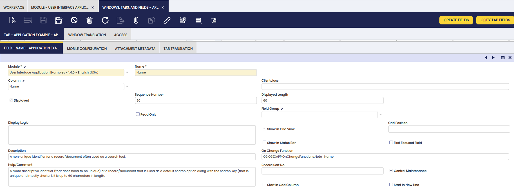
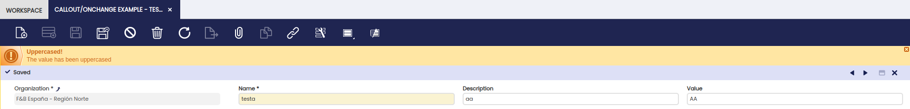

---
tags:
  - client-side development
  - JavaScript functions
  - OnChange event handling
  - user interface interactions
---

# How to Create Client Side Callout OnChange Function

## Overview

This section discusses how to implement **client side (javascript) functions** which are executed when a field value in the user interface changes. The onChange concept corresponds to the traditional [callout](How_to_create_a_Callout.md), the main difference is that the **onChange functionality is implemented on the client**. This gives the following advantages:

- better performance as for many actions no server side call is needed
- direct access to user interface components such as field, the form and the grid

In addition the onChange function has all the benefits of the classic callout, you can still **call the server** to execute more performance intensive actions or do queries.

## Example Module

This section is supported by an example module which shows examples of the code shown and discussed.

The code of the example module can be downloaded from this repository: [com.etendoerp.client.application.examples](https://github.com/etendosoftware/com.etendoerp.client.application.examples)

The example module is available through the Central Repository (See 'Client Application Examples'), for more information see the Examples Client Application project page.

## Defining OnChange Functions

An `OnChange` function is a function in javascript available through a global ID.

!!!note
    The global ID should be unique, it is strongly adviced to use the module's db prefix.

The `OnChange` function has to be defined in a javascript file located in the module.

!!!info
    For more information read [how to add javascript code](../concepts/client-side-development-and-api.md#adding-javascript-to-etendo) to Etendo.

Here is an example of an `OnChange` function defined in the example module:

```javascript
OB.OBEXAPP = {};
OB.OBEXAPP.OnChangeFunctions = {};
 
OB.OBEXAPP.OnChangeFunctions.Note_Name = function(item, view, form, grid) {
  // set a message
  view.messageBar.setMessage(
    isc.OBMessageBar.TYPE_INFO,
    'Changed!',
    'You changed the name to ' + item.getValue()
  );

  // set the value for the description and make sure that the
  // onchange handlers are called
  form.setItemValue('description', 'Description ' + item.getValue());
};
```

As you can see the `OnChange` function is placed in a global object, in this case the module's dbprefix is used for that.

!!!note
    It is important to note that you should not use var before the global object definition, otherwise your var is not global.

This is because the global javascript code included in Etendo is in fact executed within a function.

An onchange function receives four arguments:

- item: the FormItem that changes.
- view: the standard view ( OBStandardView ) which provides access to the complete window and tab structure in a loaded window.
- form: the OBViewForm which contains the fields, the form can also be the form used in inline grid editing.
- grid: the OBViewGrid which contains the list of records loaded for the tab.

This example onchange sets a message in the message bar and sets the value of another field.

!!!note
    Note that the form's setItemValue method is used to trigger other onchange functions. The form also has a setValue method but that one will not trigger an onchange event.

!!!info
    If your onchange function does not work or is not called or if your window does not load anymore after defining an onchange then check the console.

## Registering, setting an OnChange for a specific field

There are two ways to link an `OnChange` function to a specific field:

- Through the application dictionary
- Programmatically using javascript code

The first approach allows you to define the `OnChange` directly in the Field definition. For the second approach you need to use javascript, but it offers additional flexibility.

### Setting an OnChange function through the AD

The Application Dictionary allows you to set the `OnChange` for a specific field, see the `OnChange` function field in the `Window, Tabs and Fields` window.



The value should be the unique global ID mentioned above.

### Programmatic registration of OnChange functions

It is also possible register an **OnChange function through javascript**. This offers more flexibility than defining through the Application Dictionary:

- you can add `OnChange` functions to existing Fields without changing the information in the table
- you can add more than one `OnChange` function to a field
- you can override/overwrite the `OnChange` function defined in the Application Dictionary

An `OnChange` function is registered through the `OB.OnChangeRegistry.register` method. It expects 4 parameters:

- tab id
- field: the name of the field for which the onchange is registered
- callback function: the onchange function itself
- id: can be used to overwrite an existing `OnChange` function registered using the same id

An example of a registration:

```javascript
OB.OnChangeRegistry.register('FF8081813290114F0132901EB0A2001A', 'value', OB.OBEXAPP.OnChangeFunctions.Note_Value, 'OBEXAPP_Value');
```

#### Multiple OnChange Functions per Field, call order

The `OnChange` function can have a sort property to control the call-order if there are multiple `OnChange` functions for one field.

It is for example set like this:

```javascript
OB.OBEXAPP.OnChangeFunctions.Note_Value.sort = 20;
```

Some notes on sorting:

- the `OnChange` defined in the Application Dictionary has sort 50 and id: default
- if an `OnChange` does not have a sort defined it gets the sort 100

#### Overriding/replacing an OnChange

An `OnChange` can be registered using an id. If there is already an `OnChange` with the same id then it is replaced by the new registration.

The `OnChange` defined through the Application Dictionary has the id **default**. So by registering a new `OnChange` using that id you will overwrite the `OnChange` defined through the Application Dictionary.

## Example: OnChange calling a server side action

This section shows an example of an `OnChange` which calls a server side action:

```javascript
OB.OBEXAPP.OnChangeFunctions.Note_Value = function(item, view, form, grid) {
  // the callback called after the server side call returns
  var callback = function(response, data, request) {
    form.setItemValue(item, data.upperCased);
    view.messageBar.setMessage(
      isc.OBMessageBar.TYPE_WARNING,
      'Uppercased!',
      'The value has been uppercased'
    );
  };

  // do a server side call and on return call the callback
  OB.RemoteCallManager.call(
    'com.etendoerp.client.application.examples.OnchangeExampleActionHandler',
    {
      value: item.getValue()
    },
    {},
    callback
  );
};
OB.OBEXAPP.OnChangeFunctions.Note_Value.sort = 20;
```

The above example calls an ActionHandler class: OnchangeExampleActionHandler. The result is returned and set in a field and a message is shown in the message bar.

!!!info
    It is possible to disable the form during the server side action, call the setDisabled method on the form with the value true as a parameter.

## OnChange and the Classic Callout

If a field has both an `OnChange` and a classic callout defined, then the following applies:

- in the Openbravo 3 UI the `OnChange` function will be used and the callout will be disabled
- in the classic UI the callout is used and the `OnChange` functions are ignored

## Example Module: example window

The Example Module has an example window with several examples of a callout/onchange function. You can find the example window in `Application Examples` >`Callout/OnChange Function`.


To test out the onchange, create a new record and set some values in the fields. You should see automatic behavior.



You can **enable/disable** different onchange functions by going into the web/com.etendoerp.client.application.examples/js/example-onchange.js file and uncomment some of the commented lines.

---

This work is a derivative of [How to create client side callout onchange function](http://wiki.openbravo.com/wiki/How_to_create_client_side_callout_onchange_function){target="\_blank"} by [Openbravo Wiki](http://wiki.openbravo.com/wiki/Welcome_to_Openbravo){target="\_blank"}, used under [CC BY-SA 2.5 ES](https://creativecommons.org/licenses/by-sa/2.5/es/){target="\_blank"}. This work is licensed under [CC BY-SA 2.5](https://creativecommons.org/licenses/by-sa/2.5/){target="\_blank"} by [Etendo](https://etendo.software){target="\_blank"}.
