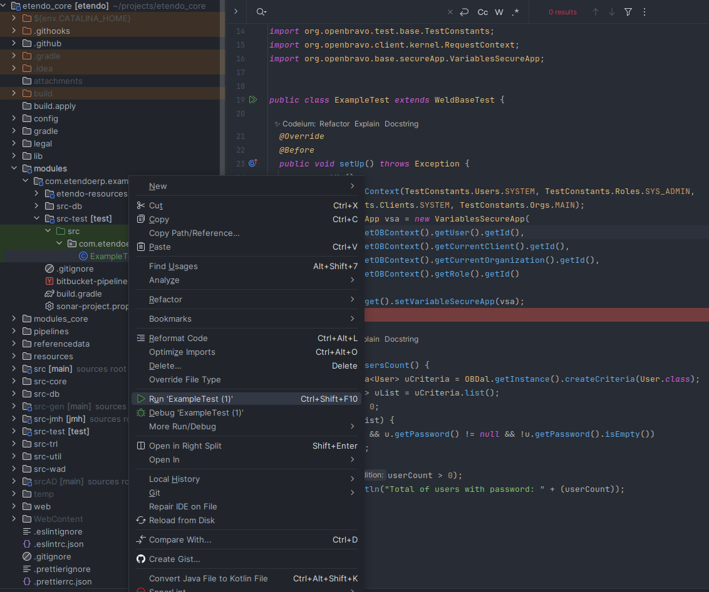
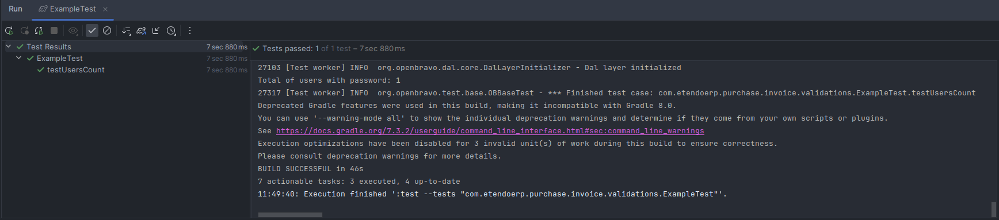
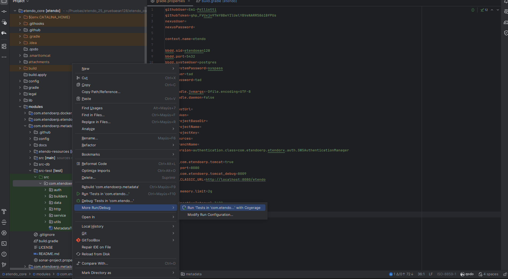
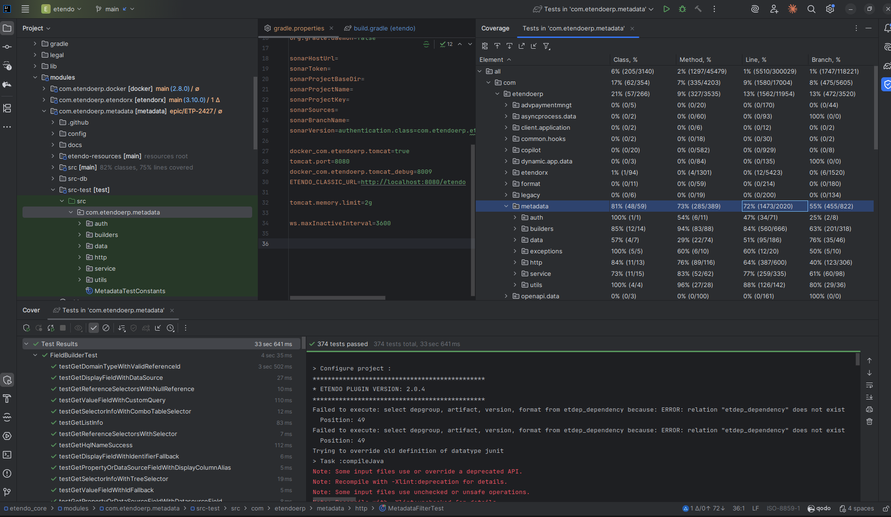

# How to Create JUnit Test Cases

## Overview

This how-to will focus on creating a test case making use of the `OBBaseTest` and `WeldBaseTest` classes. The test case will check that our system has at least one User with password. For this, we'll use the new DAL approach to access the database.

In computer programming, **unit testing** is a software design and development method where the programmer gains confidence that individual units of source code are fit for use. A unit is the smallest testable part of an application. In procedural programming a unit may be an individual program, function, procedure, etc., while in object-oriented programming, the smallest unit is a method, which may belong to a base/super class, abstract class or derived/child class.

All new developments must belong to a module that is not the _core_ module.

## Preparing development environment

!!! info
    Make sure that in the root build.gradle you have included the plugin `com.etendoerp.testing.gradleplugin`. If you don't have it, consult the [Etendo Testing Plugin](../../developer-tools/etendo-testing-plugin.md#installation) documentation to install it and finally reload Gradle from your IntelliJ.

First of all you need to create a src-test directory in your module package directory in Etendo ERP.

``` 
modules
└── com.etendoerp.example
    └── src-test                <-- source of the test cases 
        └── src
            └── com.etendoerp.example
                └── EtendoTest.java
```

Now, you are ready to work with test cases.

## Creating the test case

### Inheriting from OBBaseTest

All the core test cases are subclasses from `OBBaseTest`. (org.openbravo.test.base.OBBaseTest). This class handles all the necessary steps to initialize the Data Access Layer, takes care of transaction handling and provides a set of utilities (methods) for working with the Openbravo context (OBContext).

!!! info
    When writing test cases for Etendo that involve dependency injection or require the execution of DAL event observers, it is recommended to extend `org.openbravo.base.weld.test.WeldBaseTest` instead of `org.openbravo.test.base.OBBaseTest`.
    `OBBaseTest` has limitations related to CDI, and it does not support certain features that are available when using WeldBaseTest tests. The latter is a subclass of `OBBaseTest` and provides access to the complete DAL infrastructure, making it more suitable for scenarios involving CDI and event observers.
    Make sure to use `WeldBaseTest` to leverage the full capabilities of dependency injection and DAL event observers in your test cases.

### Execution order of test methods

Until now, the methods were simply invoked in the order returned by the reflection API. However, using the JVM order is unwise since the Java platform does not specify any particular order. Of course, well-written test code would not assume any order, but some does, and a predictable failure is better than a random failure on certain platforms.

### Creating the Java class

  * Open your IntelliJ IDE. 
  * Create a new folder structure under the ``modules`` folder: ``modules/com.etendoerp.examples/src-test/src/com.etendoerp.example`` . 
  * Create a new Java class with the following content: 

```java title="ExampleTest.java" 
package com.etendoerp.example;
 
import static org.junit.Assert.assertTrue;
 
import java.util.List;
 
import org.junit.jupiter.api.BeforeEach;
import org.junit.jupiter.api.Test;
import org.junit.jupiter.api.TestMethodOrder;
import org.junit.jupiter.api.MethodOrderer.OrderAnnotation;
import org.openbravo.dal.core.OBContext;
import org.openbravo.dal.service.OBCriteria;
import org.openbravo.dal.service.OBDal;
import org.openbravo.model.ad.access.User;
import org.openbravo.base.weld.test.WeldBaseTest;
import org.openbravo.test.base.TestConstants;
import org.openbravo.client.kernel.RequestContext;
import org.openbravo.base.secureApp.VariablesSecureApp;


@TestMethodOrder(OrderAnnotation.class)
public class ExampleTest extends WeldBaseTest {

  @Override
  @BeforeEach
  public void setUp() throws Exception {
    super.setUp();
    OBContext.setOBContext(TestConstants.Users.SYSTEM, TestConstants.Roles.SYS_ADMIN,
        TestConstants.Clients.SYSTEM, TestConstants.Orgs.MAIN);
    VariablesSecureApp vsa = new VariablesSecureApp(
        OBContext.getOBContext().getUser().getId(),
        OBContext.getOBContext().getCurrentClient().getId(),
        OBContext.getOBContext().getCurrentOrganization().getId(),
        OBContext.getOBContext().getRole().getId()
    );
    RequestContext.get().setVariableSecureApp(vsa);
  }
 
  @Test
  public void testUsersCount() {
    final OBCriteria<User> uCriteria = OBDal.getInstance().createCriteria(User.class);
    final List<User> uList = uCriteria.list();
    int userCount = 0;
    for (User u: uList) {
      if (u != null && u.getPassword() != null && !u.getPassword().isEmpty())
        userCount++;
    }
    assertTrue(userCount > 0, "There should be at least one user with password");
    System.out.println("Total of users with password: " + (userCount));
  }
}
```

### Understanding the class

You have just created a new class named Example that extends from the `WeldBaseTest` class.

```java
@TestMethodOrder(OrderAnnotation.class)
```

This annotation specifies that test methods will be executed in the order specified by the `@Order` annotation. You can use `@Order` on test methods to define their execution order.

```java
public void testUsersCount() {}
```

This class has a testUsersCount function. Note that in JUnit 5, the method naming convention is not required anymore as the `@Test` annotation is what identifies a test method. However, for clarity, it's still a good practice to use a naming convention for test methods.

```java
@Override
@BeforeEach
public void setUp() throws Exception {
  super.setUp();
  OBContext.setOBContext(TestConstants.Users.SYSTEM, TestConstants.Roles.SYS_ADMIN,
      TestConstants.Clients.SYSTEM, TestConstants.Orgs.MAIN);
  VariablesSecureApp vsa = new VariablesSecureApp(
      OBContext.getOBContext().getUser().getId(),
      OBContext.getOBContext().getCurrentClient().getId(),
      OBContext.getOBContext().getCurrentOrganization().getId(),
      OBContext.getOBContext().getRole().getId()
  );
  RequestContext.get().setVariableSecureApp(vsa);
}
```

Note the `@BeforeEach` annotation instead of JUnit 4's `@Before`. This method sets the context as if a System Administrator is logged in the application. You can also set the context as if another user is logged in the application.

```java
final OBCriteria<User> uCriteria = OBDal.getInstance().createCriteria(User.class);
final List<User> uList = uCriteria.list();
```

Uses the `OBDal` instance to create a new `OBCriteria` object, and uses it for listing all (since we are not filtering) the Users in the database.

```java
int userCount = 0;
for (User u: uList) {
  if (u != null && u.getPassword() != null && !u.getPassword().isEmpty())
    userCount++;
}
```

We loop through the uList collection, and we increment the userCount variable if the user has a password.

```java
assertTrue(userCount > 0, "There should be at least one user with password");
```

We assert that the userCount is more than 0. Note the optional message parameter in JUnit 5's assertion methods.

```java
System.out.println("Total of users with password: " + (userCount));
```

Finally, we print a total of users with password just for the record.

## Transaction Handling

A question which might pop-up when looking at the above code: where is the database transaction handling done? The answer is that this is handled by the `WeldBaseTest` class and the Etendo data access layer:

  * a transaction is automatically started at first database access in the test cases. This is done by the Data Access Layer. 
  * a transaction is either committed (when no exception happened) or rolled-back (when an exception happened). 

The `WeldBaseTest` class detects automatically if an exception happened or not.

There are certainly cases whereby it makes sense to have more control over the database transactions. There are a number of relevant methods which can be useful then:

  * `OBDal.getInstance().flush()`: flushes the update/insert queries in hibernate to the database. 
  * `OBDal.getInstance().commitAndClose()`: commits the transaction and closes the session. A new session/transaction is automatically started at the next database access. 
  * `OBDal.getInstance().rollbackAndClose()`: rolls back and closes the transactions. A new session/transaction is automatically started at the next database access. 

!!! info
    DAL event observers are not triggered within test cases extending `OBBaseTest` class. They to work require of test cases extending `WeldBaseTest`. 

## Side-Effect Free

A test case will often change the data in the underlying database. Most of the time, it is not feasible to setup a completely new test database for each test run. Therefore test-cases should be developed such that they are side effect free. This means:

  * When the test-case changes data then it should have a test method which is run as the last test method which cleans up/repairs the data. 
  * This clean-up method should also clean up data which is left from previous test runs. For this common issue should be used `@AfterAll` notation. This method runs automatically at the end of the class.

This last point is important because there can be always reasons why during a test the clean-up step is not performed. For example because the test run is stopped before the clean-up is done.

## Run Tests

Etendo has a number of ant tasks which run the test cases:

  * `./gradlew test`: This suite contains all the test cases.
  * `./gradlew test --tests "module-name.*"`: This suite contains all the test cases of a particular module. (e.g. `./gradlew test --tests "com.etendoerp.example.*"`)

!!! info
    If tests have been implemented or modified for [etendo_core](https://github.com/etendosoftware/etendo_core.git) and package belongs to org.openbravo, make sure that the class is included in the `StandaloneTestSuite` or `WebserviceTestSuite`.

### The Result

To be able to execute your test cases:

  * Right click on the `ExampleTest` class. 
  * Select Run `ExampleTest`. 



  * You can check the result of the test case on the JUnit view and the output of your tests in the Console view: 



Also, in the build folder you can find the report of the tests execution, and you can open it on your browser.

``` 
build
└── reports
    └── tests 
        └── test
            └── index.html
```

## Run Tests with Coverage

To execute your tests and visualize the **code coverage** of your module:

1. In **IntelliJ IDEA**, locate your test package (for example: `src-test/java/com.etendoerp.example`).
2. Right click on the folder or test class.
3. Select **Run Tests in 'com.etendoerp.example' with Coverage**.



### The Coverage Report

Once the tests finish running, IntelliJ will display the **Coverage tool window**, showing the percentage of code covered by your tests.



| Metric | Description |
|---------|-------------|
| **Class %** | Percentage of classes that have at least one test covering them. |
| **Method %** | Percentage of methods executed during tests. |
| **Line %** | Percentage of source code lines that were executed. |
| **Branch %** | Coverage of conditional branches (`if`, `else`, `switch`, etc). |

## Advanced Testing Features

### Approach to features of JUnit

#### Parameterized Tests

!!! info
    For more information, visit:  [Parameterized-Test](https://junit.org/junit5/docs/current/user-guide/#writing-tests-parameterized-tests){target="_blank"}.

#### Extension

!!! info
    In JUnit 5, the Rules concept has been replaced by Extensions. For more information, visit:  [Extension](https://junit.org/junit5/docs/current/user-guide/#extensions){target="_blank"}.

#### Assertions and Hamcrest 1.13

!!! info
    For more information, visit:  [Hamcrest](https://hamcrest.org/){target="_blank"}.

Hamcrest is a framework for writing matcher objects allowing 'match' rules to be defined declaratively. There are a number of situations where matchers are invaluble, such as UI validation, or data filtering, but it is in the area of writing flexible tests that matchers are most commonly used.

When writing tests it is sometimes difficult to get the balance right between overspecifying the test, and not specifying enough (making the test less valuable). Having a tool that allows you to pick out precisely the aspect under test and describe the values it should have, to a controlled level of precision, helps greatly in writing tests.

### JSON Matchers
  
Etendo provides a set of matchers that can be useful when asserting JSONObjects or JSONArrays.

#### equal

Matches when the examined `JSONObject` has exactly the same number of properties with the same values as the expected one. The order of the keys is not taken into account. Supports matcher properties.

```java  
@Test
public void testEqual() {
  JSONObject json1 = new JSONObject(Map.of("p1", 1, "p2", "abcd"));
  JSONObject json2 = new JSONObject(Map.of("p1", 1, "p2", "abcd"));
  JSONObject json3 = new JSONObject(Map.of("p2", "abcd", "p1", 1));
  JSONObject json4 = new JSONObject(Map.of("p1", 1, "p2", "efgh"));
  JSONObject json5 = new JSONObject(Map.of("p1", 1));
  JSONObject json6 = new JSONObject(Map.of("p1", greaterThan(0), "p2", startsWith("abc"))); // matcher properties
 
  assertThat("JSON objects are equal", json1, equal(json2));
  assertThat("JSON objects are equal", json1, equal(json3));
  assertThat("JSON objects are not equal", json1, not(equal(json4)));
  assertThat("JSON objects are not equal", json1, not(equal(json5)));
  assertThat("JSON objects are equal", json1, equal(json6));
}
```

#### matchesObject

Matches when the examined JSONObject contains the properties with the same values of the expected one. The order of the keys is not taken into account. Supports matcher properties.

```java
@Test
public void testMatchesObject() {
  JSONObject json1 = new JSONObject(Map.of("p1", 1, "p2", "abcd"));
  JSONObject json2 = new JSONObject(Map.of("p1", 1, "p2", "abcd"));
  JSONObject json3 = new JSONObject(Map.of("p2", "abcd", "p1", 1));
  JSONObject json4 = new JSONObject(Map.of("p1", 1, "p2", "efgh"));
  JSONObject json5 = new JSONObject(Map.of("p1", 1));
  JSONObject json6 = new JSONObject(Map.of("p1", 1, "p2", "abcd", "p3", "abcd"));
  JSONObject json7 = new JSONObject(Map.of("p1", greaterThan(0), "p2", "abcd"));
 
  assertThat("JSON object match", json1, matchesObject(json2));
  assertThat("JSON object match", json1, matchesObject(json3));
  assertThat("JSON object does not match", json1, not(matchesObject(json4)));
  assertThat("JSON object match", json1, matchesObject(json5));
  assertThat("JSON object does not match", json1, not(matchesObject(json6)));
  assertThat("JSON object match", json1, matchesObject(json7));
}
```

#### hasItems

Used to match the items of a `JSONArray`. This matcher can be used with two different kind of arguments.

If an array of objects is passed, then it matches when the examined `JSONArray` contains all the received objects. The order of the objects is not taken into account.

```java   
@Test
public void testHasItems() {
  JSONObject json1 = new JSONObject(Map.of("p1", 1, "p2", "abcd"));
  JSONObject json2 = new JSONObject(Map.of("p2", 2, "p3", "efgh"));
  JSONArray array = new JSONArray();
  array.put(json1);
  array.put(json2);
  array.put(5);
  JSONObject json3 = new JSONObject(Map.of("p2", 2, "p3", startsWith("e")));
  JSONObject json4 = new JSONObject(Map.of("p2", 2, "p3", "ijkl"));
 
  assertThat("JSON array has items", array, hasItems(5, json3));
  assertThat("JSON array does not have items", array, not(hasItems(4, json3)));
  assertThat("JSON array does not have items", array, not(hasItems(json4)));
}
```

It also supports receiving an array of Hamcrest matchers. In that case, then it matches when the examined JSONArray matches with all the received matchers.

```java
@Test
public void testHasItems() {
  JSONObject json1 = new JSONObject(Map.of("p1", 1, "p2", "abcd"));
  JSONObject json2 = new JSONObject(Map.of("p2", 2, "p3", "efgh"));
  JSONArray array = new JSONArray();
  array.put(json1);
  array.put(json2);
  array.put(5);
  JSONObject json3 = new JSONObject(Map.of("p2", 2, "p3", startsWith("e")));
  JSONObject json4 = new JSONObject(Map.of("p1", 1));
  JSONObject json5 = new JSONObject(Map.of("p2", 2, "p3", "ijkl"));
 
  assertThat("JSON array has items", array, hasItems(greaterThan(4), equal(json3)));
  assertThat("JSON array has items", array, hasItems(greaterThan(4), matchesObject(json4)));
  assertThat("JSON array does not have items", array, not(hasItems(greaterThan(5))));
  assertThat("JSON array does not have items", array, not(hasItems(equal(json5))));
}
```

### Mocking with Mockito in JUnit

When writing unit tests, it's often necessary to simulate the behavior of external dependencies. [Mockito](https://site.mockito.org/) is a popular mocking library for Java that allows you to create mock objects to isolate the code being tested from its dependencies.

#### Ways to Create Mocks

There are two main approaches to creating mocks in Mockito:

**1. Using Annotations**

The cleanest way is to use annotations:

```java
@ExtendWith(MockitoExtension.class)
class UserServiceTest {
    
    @Mock
    private UserRepository userRepository;
    
    @InjectMocks
    private UserService userService;
    
    @Test
    void testGetUserById() {
        // Arrange
        String userId = "123";
        User mockUser = new User(userId, "John Doe");
        when(userRepository.findById(userId)).thenReturn(mockUser);
        
        // Act
        User result = userService.getUserById(userId);
        
        // Assert
        assertEquals(mockUser.getName(), result.getName());
        verify(userRepository).findById(userId);
    }
}
```

In this example:
- `@ExtendWith(MockitoExtension.class)` integrates Mockito with JUnit 5
- `@Mock` creates a mock implementation of UserRepository
- `@InjectMocks` injects the created mocks into UserService

**2. Creating Mocks Manually**

You can also create mocks manually:

```java
@Test
void testUserServiceManualMocks() {
    // Create mocks manually
    UserRepository mockRepo = mock(UserRepository.class);
    UserService service = new UserService(mockRepo);
    
    // Configure behavior
    User mockUser = new User("123", "Jane Doe");
    when(mockRepo.findById("123")).thenReturn(mockUser);
    
    // Execute and verify
    User result = service.getUserById("123");
    assertEquals("Jane Doe", result.getName());
}
```

#### Mocking Static Methods

To mock static methods, you must use `mockito-inline`. This allows you to simulate classes with static methods such as utilities or service facades.

**Example with MockedStatic:**

```java
@Test
void testWithStaticMock() {
    // The static mock must be created inside a try-with-resources block
    // or closed manually to prevent memory leaks
    try (MockedStatic<DateUtils> dateUtilsMock = mockStatic(DateUtils.class)) {
        // Configure the behavior of the static method
        LocalDate fixedDate = LocalDate.of(2025, 4, 8);
        dateUtilsMock.when(DateUtils::getCurrentDate).thenReturn(fixedDate);
        
        // Now DateUtils.getCurrentDate() will return our fixed date
        LocalDate result = DateUtils.getCurrentDate();
        
        assertEquals(fixedDate, result);
        dateUtilsMock.verify(DateUtils::getCurrentDate);
    }
}
```

#### Complete Example: Mocking Regular and Static Dependencies

Here's an example that combines regular and static mocks:

```java
@ExtendWith(MockitoExtension.class)
class PaymentProcessorTest {
    
    @Mock
    private PaymentGateway paymentGateway;
    
    @InjectMocks
    private PaymentProcessor paymentProcessor;
    
    @Test
    void testProcessPayment() {
        // Regular object mock
        Payment payment = new Payment("123", 100.00);
        TransactionResult mockResult = new TransactionResult(true, "Approved");
        when(paymentGateway.submitPayment(payment)).thenReturn(mockResult);
        
        // Static method mock for current date
        try (MockedStatic<TransactionUtils> transUtilsMock = mockStatic(TransactionUtils.class)) {
            LocalDateTime fixedDateTime = LocalDateTime.of(2025, 4, 8, 15, 30);
            transUtilsMock.when(TransactionUtils::getCurrentDateTime).thenReturn(fixedDateTime);
            
            // Act
            TransactionResponse response = paymentProcessor.processPayment(payment);
            
            // Assert
            assertTrue(response.isSuccessful());
            assertEquals(fixedDateTime, response.getTransactionDate());
            
            // Verify that methods were called correctly
            verify(paymentGateway).submitPayment(payment);
            transUtilsMock.verify(TransactionUtils::getCurrentDateTime);
        }
    }
}
```

#### Mocking Best Practices

1. **Close static mocks**: Static mocks must be closed to prevent memory leaks.
   ```java
   try (MockedStatic<UtilityClass> mock = mockStatic(UtilityClass.class)) {
       // Use the static mock
   } // Automatically closed
   ```

2. **Verify interactions**: Use `verify()` to confirm that expected methods were called.
   ```java
   verify(mockObject).someMethod();
   verify(mockObject, times(3)).someMethod();
   verify(mockObject, never()).otherMethod();
   ```

3. **Use annotations for simple cases**: Annotations like `@Mock` and `@InjectMocks` make the code more readable.

4. **Reset mocks when necessary**: If you need to reuse a mock with different behavior:
   ```java
   reset(mockObject);
   ```

## Testing Requests

In general unit tests don't require of an Etendo Classic instance running in Tomcat to be executed. But in some cases, how requests work is wanted to be tested. Depending on the request to be tested, different classes should be extended:

  * _REST Webservices_. `BaseWSTest` should be extended, it deals with authentication and provides methods to execute requests, parse xml results, etc. 
  * _Other Requests_ (such as datasources). `BaseDataSourceTestNoDal` or `BaseDataSourceTestDal` classes can be extended (depending if the test case requires or not DAL). Similarly to webservices it provides authentication handling as well as utility methods to perform requests. 

## Testing CDI
  
Default test cases extending `org.openbravo.test.base.OBBaseTest` class cannot make use of dependency injection. In order to use it `org.openbravo.base.weld.test.WeldBaseTest` class needs to be extended instead. This is also a subclass of `OBBaseTest`, so it makes available all DAL infrastructure.

`WeldBaseTest` uses internally Weld SE containers for CDI support.

Example of a test case injecting dependencies:

```java
public class CdiInfrastructure extends WeldBaseTest {
 
  @Inject
  private ApplicationScopedBean applicationBean;
 
  @Inject
  private SessionScopedBean sessionBean;
 
  @Inject
  private RequestScopedBean requestBean;
 
  /** beans are correctly injected */
  @Test
  public void beansAreInjected() {
    assertNotNull(applicationBean, "application bean is injected");
    assertNotNull(sessionBean, "session bean is injected");
    assertNotNull(requestBean, "request bean is injected");
  }
}
```

### Scopes

Application and session scopes are shared among all test cases in the same class whereas a new request scope is created for each test case method. Application scope is reset for each new class.

```java
/** starts application and session scopes */
@Test
@Order(1)
public void start() {
  applicationBean.setValue("application");
  sessionBean.setValue("session");
  requestBean.setValue("request");
 
  assertEquals("application", applicationBean.getValue());
  assertEquals("session", sessionBean.getValue());
  assertEquals("request", requestBean.getValue());
}
 
/** application and session scopes are preserved but not request scope */
@Test
@Order(2)
public void applicationAndSessionShouldBeKept() {
  assertEquals("application", applicationBean.getValue());
  assertEquals("session", sessionBean.getValue());
  assertNull(requestBean.getValue());
}
```

### Parameterization

In JUnit 5, parameterized tests are natively supported via the `@ParameterizedTest` annotation, eliminating the need for special runners or rules:

```java
public class ParameterizedCdi extends WeldBaseTest {
  
  @ParameterizedTest
  @ValueSource(strings = {"param1", "param2", "param3"})
  public void testWithParameters(String parameter) {
    assertNotNull(parameter);
    assertTrue(parameter.startsWith("param"));
  }
  
  @ParameterizedTest
  @CsvSource({
    "param1, 1",
    "param2, 2",
    "param3, 3"
  })
  public void testWithMultipleParameters(String name, int value) {
    assertNotNull(name);
    assertTrue(name.endsWith(String.valueOf(value)));
  }
  
  @ParameterizedTest
  @MethodSource("provideParameters")
  public void testWithMethodSource(String parameter) {
    assertNotNull(parameter);
    assertTrue(parameter.startsWith("param"));
  }
  
  static Stream<String> provideParameters() {
    return Stream.of("param1", "param2", "param3");
  }
}
```

In this example `test1` test case will be executed 3 times having `parameter` field "param1", "param2" and "param3" value in each of these executions.

Unlike when using `Parameterized.class` runner, all these 3 executions are seen as a single execution (`Parameterized.class` would show 3 independent executions), this causes that if, for example, first execution fails the rest will not be run.

### DAL event observers

Because DAL event observers make use of CDI to work, they are not executed in standard test cases extending `OBBaseTest`.

This limitation does not apply when using `WeldBaseTest` tests.

---

This work is a derivative of [How to Create JUnit testcases](https://wiki.openbravo.com/wiki/How_to_create_JUnit_testcases){target="\_blank"} by [Openbravo Wiki](http://wiki.openbravo.com/wiki/Welcome_to_Openbravo){target="\_blank"}, used under [CC BY-SA 2.5 ES](https://creativecommons.org/licenses/by-sa/2.5/es/){target="\_blank"}. This work is licensed under [CC BY-SA 2.5](https://creativecommons.org/licenses/by-sa/2.5/){target="\_blank"} by [Etendo](https://etendo.software){target="\_blank"}.