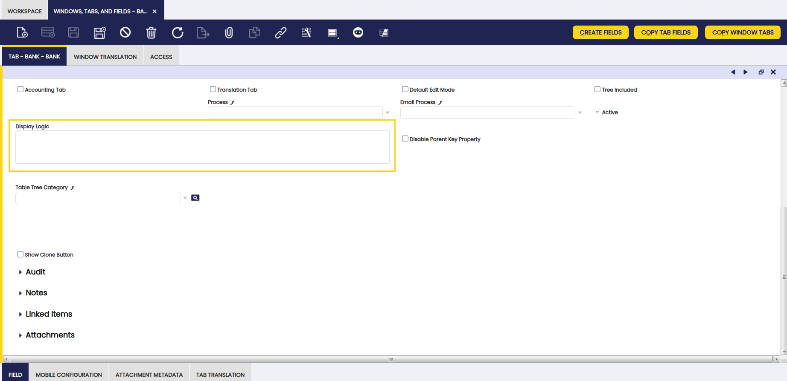

#  How To Define Display Logic For Tabs

!!! example  "IMPORTANT: THIS IS A BETA VERSION"
    This page is under active development and may contain **unstable or incomplete features**. Use it **at your own risk**.

##  Overview

The objective of this how-to is to show how you can define display logic for tabs, so its visibility will depend on the value of the fields of its ancestor tabs, of preferences and of system variables. 

!!!note
    The display logic will only be applicable for tabs that are **not** header tabs.

For that purpose, a new field called **Display Logic** has been added to the **Tab** tab in the **Windows, Tabs and Fields** window:

##  How to Define the Tab Display Logic

The syntax of the **Display Logic** tab is the same as the Display Logic field. Boolean values (true, false) can be entered, and also expressions that evaluate into a boolean value.

If there is a reference the a field of a tab of a higher level, the name of the field should be placed between '@'. I.e., if we only want to show the Query tab of the Widget window when the selected widget is a Query widget, the Query tab display logic can be defined as: `@Widget_Superclass_ID@='2A32CF26F3F64FE39C7F94E9D82497D1`.

If there is a reference to a preference, the preference name must also be placed between '@'. I.e. if a tab must be shown only if the `StockReservations` property is set, this display logic can be used: `@StockReservations@`.

And if inside the display logic there is a reference to a system variable, its name must be placed between '@#' and '@', i.e. `@#ShowAcct@='Y'`.

---

This work is a derivative of [How to Define Display Logic for Tabs](http://wiki.openbravo.com/wiki/How_To_Define_Display_Logic_For_Tabs){target="\_blank"} by [Openbravo Wiki](http://wiki.openbravo.com/wiki/Welcome_to_Openbravo){target="\_blank"}, used under [CC BY-SA 2.5 ES](https://creativecommons.org/licenses/by-sa/2.5/es/){target="\_blank"}. This work is licensed under [CC BY-SA 2.5](https://creativecommons.org/licenses/by-sa/2.5/){target="\_blank"} by [Etendo](https://etendo.software){target="\_blank"}. 