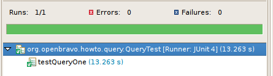

# How to do a Complex Query Using the DAL
 
!!! example  "IMPORTANT: THIS IS A BETA VERSION"
    This page is under active development and may contain **unstable or incomplete features**. Use it **at your own risk**.

## Overview

This section illustrates how a complex query can be programmed using Data Access Layer constructs. The solution will be using [Hibernate HQL](https://docs.hibernate.org/orm/3.5/reference/en/html/queryhql.html){target="\_blank"}, so before reading this how-to, make sure you **know the basics of HQL**.

The how-to starts with an SQL query from the requisition-to-order form inside Procurement Management and from pending goods receipt and translates it to a HQL representation. Different aspects of using HQL and the DAL are discussed including performance and debugging aspects.

## Setup a Test Case

There is a separate how-to on creating test cases using the Data Access Layer (see [here](./how-to-create-testcases/how-to-create-junit-testcases.md)). In this how-to, we will only give a summary.

The test case which we will be using is created inside of the modules directory of the Etendo development project. We will not actually create a new module in the database but it is best to place custom code separate from the main Etendo source tree. To create a new source folder in IntelliJ, right-click on the `project/modules` and select **New** and then source folder.

In the source folder, create a new package (right click on the new folder and select New > package): `org.openbravo.howto.query`. Inside of this package create a java file `QueryTest.java`. This file has the following content:

``` java
package org.openbravo.howto.query;

import org.openbravo.test.base.OBBaseTest;

/**
* Complex queries howto.
*/

public class QueryTest extends OBBaseTest {

public void testQueryOne() {
    // this sets the user to the Etendo Admin
    setUserContext("100");

    // here we will be doing our stuff...

    commitTransaction();
}
}
```

This test case inherits from the `OBBaseTest` class provided by Etendo. The base test class provides a user context and transaction handling. There is one test method in the class: `testQueryOne`. This method first selects the user context. The `commitTransaction()` at the end commits the transaction If an exception occurs during the test then this statement will not be executed and the transaction is automatically rolled back.

You can right-click the Java file in Intellij and then run as > junit testcase, you should see the green bar in the junit view:


  
This is the main testcase setup. The next section will add some code to the testcases to query the DAL and show some results.

## Requisition SQL query

The following SQL query will be translated to HQL:

``` sql
SELECT M_REQUISITIONLINE_ID, M_REQUISITIONLINE.NEEDBYDATE,
M_REQUISITIONLINE.QTY - M_REQUISITIONLINE.ORDEREDQTY AS QTYTOORDER,
M_REQUISITIONLINE.PRICEACTUAL AS PRICE,
AD_COLUMN_IDENTIFIER(to_char('C_BPartner'),
    to_char(COALESCE(M_REQUISITIONLINE.C_BPARTNER_ID, M_REQUISITION.C_BPARTNER_ID)), ?) AS VENDOR,
AD_COLUMN_IDENTIFIER(to_char('M_PriceList'), to_char(COALESCE(M_REQUISITIONLINE.M_PRICELIST_ID, 
M_REQUISITION.M_PRICELIST_ID)), ?) AS PRICELISTID,
AD_COLUMN_IDENTIFIER(to_char('M_Product'), 
    to_char(M_REQUISITIONLINE.M_PRODUCT_ID), ?) AS PRODUCT,
AD_COLUMN_IDENTIFIER(to_char('M_AttributeSetInstance'), 
    to_char(M_REQUISITIONLINE.M_ATTRIBUTESETINSTANCE_ID), ?) AS ATTRIBUTE,
AD_COLUMN_IDENTIFIER(to_char('AD_User'), to_char(M_REQUISITION.AD_USER_ID), ?) AS REQUESTER
FROM M_REQUISITIONLINE, M_REQUISITION, C_BPARTNER
WHERE M_REQUISITIONLINE.M_REQUISITION_ID = M_REQUISITION.M_REQUISITION_ID
AND COALESCE(M_REQUISITIONLINE.C_BPARTNER_ID,M_REQUISITION.C_BPARTNER_ID) = C_BPARTNER.C_BPARTNER_ID
AND C_BPARTNER.PO_PAYMENTTERM_ID IS NOT NULL
AND M_REQUISITION.ISACTIVE = 'Y'
AND M_REQUISITIONLINE.ISACTIVE = 'Y'
AND M_REQUISITION.DOCSTATUS = 'CO'
AND M_REQUISITIONLINE.REQSTATUS = 'O'
AND (M_REQUISITIONLINE.LOCKEDBY IS NULL OR 
                    COALESCE (M_REQUISITIONLINE.LOCKDATE, TO_DATE('01-01-1900', 'DD-MM-YYYY')) < (now()-3))
AND M_REQUISITION.AD_CLIENT_ID IN ?
AND M_REQUISITIONLINE.AD_ORG_ID IN ?
AND M_REQUISITIONLINE.NEEDBYDATE >= ?
AND M_REQUISITIONLINE.NEEDBYDATE < ?
AND M_REQUISITIONLINE.M_PRODUCT_ID = ?
AND M_REQUISITION.AD_USER_ID = TO_CHAR(?)
AND ((M_REQUISITIONLINE.C_BPARTNER_ID = ? OR M_REQUISITION.C_BPARTNER_ID = ?) OR 
    (M_REQUISITIONLINE.C_BPARTNER_ID IS NULL AND M_REQUISITION.C_BPARTNER_ID IS NULL))
ORDER BY M_REQUISITIONLINE.NEEDBYDATE, M_REQUISITIONLINE.M_PRODUCT_ID, M_REQUISITIONLINE.M_ATTRIBUTESETINSTANCE_ID
```

This query is used in the Requisition-to-order form inside Procurement Management. It returns the requisition line info with the identifiers of its business partner, product, pricelist, etc.

The [Hibernate Query Language](https://docs.hibernate.org/core/3.5/reference/en/html/queryhql.html){target="\_blank"} supports querying for a complete business object. The columns specified in the select clause above are all related to the Requisition Line. So in **HQL** the query will be used to filter the main object: the Requisition Line, and then retrieve the required information from the Requisition Line object. A second step describes how to make the query more efficient to prevent the  N + 1 select problem.

!!! Note
    In HQL, we use the concept of Entity and Properties.

### Translating to HQL

This section show how to translate the above SQL query to a HQL query using the Data Access Layer.

The query and its results have been tested against the Small Bazaar test data. It uses the Etendo *Admin* user, this user has been set to the *F&B Admin* role as displayed below (Note: the default field has been checked). To show results, new requisitions have been entered in Etendo for the product and business partner used in this how-to.
  
- Begin by setting the user context to the standard Etendo Admin user. The query will be build using a `StringBuilder`. The where-clause starts with 'as rl', this is because we know that we will query for the `RequisitionLine` and use the alias `rl` in the rest of the where-clause. The [DAL](../concepts/data-access-layer.md) will add the select clause automatically later.

    ``` java
    setUserContext("100");
     
    // create the where clause stringbuilder
    final StringBuilder whereClause = new StringBuilder();
    // rl is used as the alias for the RequisitionLine
    whereClause.append(" as rl");
     
    // Initialize the parameter map, will be used to
    // add parameters to the query
    final Map<String, Object> parameters = new HashMap<>(6);
    ```

- Next, left outer join on the business partner property of the requisition line and requisition:

    ``` java
    // do a left outer join on business partner as it can be null
    // in both the requisition line and the requisition
    whereClause.append(" left outer join rl.businessPartner ");
    whereClause.append(" left outer join rl.requisition.businessPartner ");
    ```

    !!!note
        The `HQL` uses property and entity names of Etendo business objects. See the Entity Model reference manual for a complete listing of all entities. You can also find the correct names by checking out the generated code in the `src-gen` folder. You can search this folder using the table names to find the correct entity.  

    The left outer join is required because in the where-clause there will be expressions which use properties of the business partner. If no explicit left- outer-join is specified then Hibernate will use an inner-join. With an inner- join, if the business partner is null for a requisition line then no results are returned.

- The next clause uses the joined business partner.

    ``` java
    // AND COALESCE(M_REQUISITIONLINE.C_BPARTNER_ID,M_REQUISITION.C_BPARTNER_ID) = C_BPARTNER.C_BPARTNER_ID
    // AND C_BPARTNER.PO_PAYMENTTERM_ID IS NOT NULL
    whereClause.append(" where (rl.businessPartner.pOPaymentTerms != null or rl.requisition.businessPartner.pOPaymentTerms != null)");
    ```

- The following lines add more where clauses, note that the Data Access Layer will automatically add a filter on active:

    ``` java
    // AND M_REQUISITION.ISACTIVE = 'Y'
    whereClause.append(" and rl.requisition.active=true");
     
    // AND M_REQUISITIONLINE.ISACTIVE = 'Y' <-- is done by the DAL Layer
     
    // AND M_REQUISITION.DOCSTATUS = 'CO'
    whereClause.append(" and rl.requisition.documentStatus='CO'");
     
    // AND M_REQUISITIONLINE.REQSTATUS = 'O'
    whereClause.append(" and rl.requisitionLineStatus='O'");
    ```

- Next add the `lockedBy` and `lockDate` filter. The coalesce is translated into an or, the date is added as a parameter using a java Date object. Note that HQL supports coalesce (although we will not use it here).

    ``` java
    // AND (M_REQUISITIONLINE.LOCKEDBY IS NULL OR
    // COALESCE (M_REQUISITIONLINE.LOCKDATE, TO_DATE('01-01-1900', 'DD-MM-YYYY')) < (now()-3))
    whereClause.append(" and (rl.lockedBy = null or rl.lockDate<:lockDate or rl.lockDate = null)");   
    final long threeDays = 1000 * 3600 * 24 * 3;
    parameters.put("lockDate", new Date(System.currentTimeMillis() - threeDays));
    ```

- The Data Access Layer adds the organization/client filtering automatically, the `neededDate` filter is done by adding two parameters:

    ```java
    // AND M_REQUISITION.AD_CLIENT_ID IN ? <-- Done by the DAL
    // AND M_REQUISITIONLINE.AD_ORG_ID IN ? <-- Done by the DAL
     
    // AND M_REQUISITIONLINE.NEEDBYDATE >= ?
    whereClause.append(" and rl.needByDate>=:needByDateFrom");
    // needByDate from, set at 30 days back
    final long thirtyDays = threeDays * 10;
    parameters.put("needByDateFrom", new Date(System.currentTimeMillis() - thirtyDays));
     
    // AND AND M_REQUISITIONLINE.NEEDBYDATE < ?
    whereClause.append(" and rl.needByDate<:needByDateTo");
    // needByDate to, set at 30 days in the future
    parameters.put("needByDateTo", new Date(System.currentTimeMillis() + thirtyDays));
    ```

- The product and user contact filter are added like this. Note that the actual values depend on the database used:

    ``` java
    // AND M_REQUISITIONLINE.M_PRODUCT_ID = ?
    whereClause.append(" and rl.product.id=:productId");
    parameters.put("productId", "1000010");
     
    // AND M_REQUISITION.AD_USER_ID = TO_CHAR(?)
    whereClause.append(" and rl.requisition.userContact.id=:userId");
    parameters.put("userId", "100");
    ```

- The filter on business partner is added like below. Note that also the requisitions business partner can be null:

    ``` java
    // AND ((M_REQUISITIONLINE.C_BPARTNER_ID = ? OR M_REQUISITION.C_BPARTNER_ID = ?) OR
    // (M_REQUISITIONLINE.C_BPARTNER_ID IS NULL AND M_REQUISITION.C_BPARTNER_ID IS NULL))
    // ORDER BY M_REQUISITIONLINE.NEEDBYDATE, M_REQUISITIONLINE.M_PRODUCT_ID,
    // M_REQUISITIONLINE.M_ATTRIBUTESETINSTANCE_ID
    whereClause
        .append(" and ((rl.businessPartner.id = :bpId or rl.requisition.businessPartner.id = :bpId) or "
            + "(rl.businessPartner = null and rl.requisition.businessPartner = null))");
    parameters.put("bpId", "1000011");
    ```

    In this code the business partner id is `1000011`, this can be different for different databases.

- In the last part of building the query the order by is added, the query is created and the parameters are set:

    ``` java
    // ORDER BY M_REQUISITIONLINE.NEEDBYDATE, M_REQUISITIONLINE.M_PRODUCT_ID,
    // M_REQUISITIONLINE.M_ATTRIBUTESETINSTANCE_ID
    whereClause.append(" order by rl.needByDate, rl.product.id, rl.attributeSetValue.id");
     
    final OBQuery<RequisitionLine> obQuery = OBDal.getInstance().createQuery(RequisitionLine.class,
        whereClause.toString());
     
    obQuery.setNamedParameters(parameters);
    ```

- The total HQL is:

``` sql
SELECT rl 
FROM ProcurementRequisitionLine  AS rl 
    LEFT OUTER JOIN rl.businessPartner  
    LEFT OUTER JOIN rl.requisition.businessPartner  
WHERE ( (rl.businessPartner.pOPaymentTerms != NULL OR rl.requisition.businessPartner.pOPaymentTerms != NULL) 
AND rl.requisition.active=true 
AND rl.requisition.documentStatus='CO' 
AND rl.requisitionLineStatus='O' 
AND (rl.lockedBy = NULL OR rl.lockDate<:lockDate OR rl.lockDate = NULL) 
AND rl.needByDate>=:needByDateFrom AND rl.needByDate<:needByDateTo 
AND rl.product.id=:productId 
AND rl.requisition.userContact.id=:userId 
AND ((rl.businessPartner.id = :bpId OR rl.requisition.businessPartner.id = :bpId) 
    OR (rl.businessPartner = NULL AND rl.requisition.businessPartner = NULL)) ) 
AND rl.organization.id  IN ('1000007', '1000008', '1000009', '0', '1000000', '1000002', '1000003', 
        '1000004', '1000005', '1000006') 
AND rl.client.id  IN ('1000000', '0') 
AND rl.active='Y' 
ORDER BY rl.needByDate, rl.product.id, rl.attributeSetValue.id
```

### Executing the HQL Query and Retrieving Results

The HQL is executed when the list method is called on the query object. This is done in a for-loop to process all the results. As you can see, the `list()` method returns a type-casted list of `RequisitionLine` objects. This makes developing against a query result very easy and also type safe.

``` java
// now print the select clause parts
for (RequisitionLine requisitionLine : obQuery.list()) {
```

Within the for-loop the information from the `RequisitionLine` is fetched and printed.

``` java
// now print the information from the select clause
// SELECT M_REQUISITIONLINE_ID, M_REQUISITIONLINE.NEEDBYDATE,
System.err.println(requisitionLine.getId());
System.err.println(requisitionLine.getNeedByDate());
 
// M_REQUISITIONLINE.QTY - M_REQUISITIONLINE.ORDEREDQTY AS QTYTOORDER,
if (requisitionLine.getOrderQuantity() != null) {       
System.err.println(requisitionLine.getQuantity().min(requisitionLine.getOrderQuantity()));
}
 
// M_REQUISITIONLINE.PRICEACTUAL AS PRICE,
System.err.println(requisitionLine.getUnitPrice());
```

The identifier of an object is retrieved by calling the `getIdentifier()` method, this is different from before, which required calling a database function:

``` java
// AD_COLUMN_IDENTIFIER(to_char('C_BPartner'),
// to_char(COALESCE(M_REQUISITIONLINE.C_BPARTNER_ID, M_REQUISITION.C_BPARTNER_ID)), ?) AS
// VENDOR,
if (requisitionLine.getBusinessPartner() != null) {
System.err.println(requisitionLine.getBusinessPartner().getIdentifier());
} else if (requisitionLine.getRequisition().getBusinessPartner() != null) {       
System.err.println(requisitionLine.getRequisition().getBusinessPartner().getIdentifier());
}
 
// AD_COLUMN_IDENTIFIER(to_char('M_PriceList'),
// to_char(COALESCE(M_REQUISITIONLINE.M_PRICELIST_ID,
// M_REQUISITION.M_PRICELIST_ID)), ?) AS PRICELISTID,
if (requisitionLine.getPriceList() != null) {
System.err.println(requisitionLine.getPriceList().getIdentifier());
} else if (requisitionLine.getRequisition().getPriceList() != null) {
System.err.println(requisitionLine.getRequisition().getPriceList().getIdentifier());
}
 
// AD_COLUMN_IDENTIFIER(to_char('M_Product'),
// to_char(M_REQUISITIONLINE.M_PRODUCT_ID), ?) AS PRODUCT,
System.err.println(requisitionLine.getProduct().getIdentifier());
 
// AD_COLUMN_IDENTIFIER(to_char('M_AttributeSetInstance'),
// to_char(M_REQUISITIONLINE.M_ATTRIBUTESETINSTANCE_ID), ?) AS ATTRIBUTE,
if (requisitionLine.getAttributeSetValue() != null) {
System.err.println(requisitionLine.getAttributeSetValue().getIdentifier());
}
 
// AD_COLUMN_IDENTIFIER(to_char('AD_User'), to_char(M_REQUISITION.AD_USER_ID), ?) AS REQUESTER
System.err.println(requisitionLine.getRequisition().getUserContact().getIdentifier());
}
```

### The Result

The above code results in the following output:

``` txt
2FA597B938EF4007A6AE5E85068BD98B
2009-04-01 00:00:00.0
0.94
Bell Phone Company
Purchase
Screwdriver
Etendo
10000000 Screwdriver 10 2009-04-01 00:00:00.0
```

### The Executed SQL, the N+1 Select Problem

Now let us look at the actual SQL which is executed. This will also show that the above implementation might suffer from the N+1 select problem.

The SQL query is executed when the for `list()` method is called on the query object (the start of the for-loop). Hibernate generates the following SQL query:

``` sql
SELECT procuremen0_.M_Requisitionline_ID AS M1_297_, procuremen0_.AD_Client_ID AS AD2_297_, procuremen0_.AD_Org_ID AS AD3_297_, 
    procuremen0_.IsActive AS IsActive297_, procuremen0_.Created AS Created297_, procuremen0_.Createdby AS Createdby297_, 
    procuremen0_.Updated AS Updated297_, procuremen0_.Updatedby AS Updatedby297_, procuremen0_.M_Requisition_ID AS M9_297_, 
    procuremen0_.M_Product_ID AS M10_297_, procuremen0_.Qty AS Qty297_, procuremen0_.PriceList AS PriceList297_, 
    procuremen0_.LineNetAmt AS LineNetAmt297_, procuremen0_.C_BPartner_ID AS C14_297_, procuremen0_.C_UOM_ID AS C15_297_, 
    procuremen0_.M_Product_Uom_Id AS M16_297_, procuremen0_.QuantityOrder AS Quantit17_297_, procuremen0_.M_AttributeSetInstance_ID AS M18_297_, 
    procuremen0_.Reqstatus AS Reqstatus297_, procuremen0_.Orderedqty AS Orderedqty297_, procuremen0_.Description AS Descrip21_297_, 
    procuremen0_.Changestatus AS Changes22_297_, procuremen0_.Internalnotes AS Interna23_297_, procuremen0_.Suppliernotes AS Supplie24_297_, 
    procuremen0_.Dateplanned AS Datepla25_297_, procuremen0_.Needbydate AS Needbydate297_, 
    procuremen0_.PriceActual AS PriceAc27_297_, procuremen0_.Discount AS Discount297_, 
    procuremen0_.C_Currency_ID AS C29_297_, procuremen0_.Lockedby AS Lockedby297_, procuremen0_.Lockqty AS Lockqty297_, 
    procuremen0_.Lockprice AS Lockprice297_, procuremen0_.M_PriceList_ID AS M33_297_, procuremen0_.Lockdate AS Lockdate297_, 
    procuremen0_.Lockcause AS Lockcause297_, procuremen0_.Line AS Line297_ 
FROM M_RequisitionLine procuremen0_ 
    LEFT OUTER JOIN C_BPartner businesspa1_ ON procuremen0_.C_BPartner_ID=businesspa1_.C_BPartner_ID 
    LEFT OUTER JOIN M_Requisition procuremen2_ ON procuremen0_.M_Requisition_ID=procuremen2_.M_Requisition_ID 
    LEFT OUTER JOIN C_BPartner businesspa3_ ON procuremen2_.C_BPartner_ID=businesspa3_.C_BPartner_ID 
WHERE (businesspa1_.PO_PaymentTerm_ID IS NOT NULL OR businesspa3_.PO_PaymentTerm_ID IS NOT NULL) 
AND procuremen2_.IsActive='Y' 
AND procuremen2_.DocStatus='CO' 
AND procuremen0_.Reqstatus='O' 
AND (procuremen0_.Lockedby IS NULL OR procuremen0_.Lockdate<? OR procuremen0_.Lockdate IS NULL) 
AND procuremen0_.Needbydate>=? AND procuremen0_.Needbydate<? 
AND procuremen0_.M_Product_ID=? 
AND procuremen2_.AD_User_ID=? 
AND (procuremen0_.C_BPartner_ID=? OR procuremen2_.C_BPartner_ID=? OR 
    (procuremen0_.C_BPartner_ID IS NULL) AND (procuremen2_.C_BPartner_ID IS NULL)) 
AND (procuremen0_.AD_Org_ID IN ('1000007' , '1000008' , '1000009' , '0' , '1000000' , '1000002' , '1000003' , '1000004' , '1000005' , '1000006')) 
AND (procuremen0_.AD_Client_ID IN ('1000000' , '0')) 
AND procuremen0_.IsActive='Y' 
ORDER BY procuremen0_.Needbydate, procuremen0_.M_Product_ID, procuremen0_.M_AttributeSetInstance_ID
```

When comparing this SQL with the original SQL, the main difference is that much more information is selected. This is because in this approach we choose to select the complete `RequisitionLine` object. This makes the HQL query much simpler but also less efficient. It is also possible to select the individual `RequisitionLine` fields, in this case a direct Hibernate query has to be used.

Now, let us check what happens when information is requested from the `RequesitionLine` object. The `OrderLine` object references other objects which are lazily loaded (up-on-request). So the thing you will see is that additional queries are fired by Hibernate (this is the N+1 select problem).

when in the for-loop the following statement is executed:

``` java
} else if (requisitionLine.getRequisition().getBusinessPartner() != null) {
```

Then Hibernate fires this SQL statement:

``` sql
SELECT procuremen0_.M_Requisition_ID AS M1_263_0_, procuremen0_.AD_Client_ID AS AD2_263_0_, 
.... (list of COLUMNS abbreviated FOR clarity)
FROM M_Requisition procuremen0_ WHERE procuremen0_.M_Requisition_ID=?
```

Hibernate does this because the Requisition object (in the Requisition Line) is initially **lazy loaded**, this means that the Requisition instance has been created but its data has not yet been retrieved from the database. The above Java code accesses the requisition (retrieving the business partner) and therefore initiates a load of the Requisition object.

The same situation occurs when accessing the business partner, product and price list in the following Java statements:

``` java
System.err.println(requisitionLine.getRequisition().getBusinessPartner().getIdentifier());
....
System.err.println(requisitionLine.getPriceList().getIdentifier());
.....
System.err.println(requisitionLine.getRequisition().getPriceList().getIdentifier());
.....
System.err.println(requisitionLine.getProduct().getIdentifier());
```

Resulting in four additional queries to retrieve the required information. So for each `RequisitionLine` potentially 5 additional queries are done. This can result in lesser performance.

Hibernate offers a way to solve this issue: Use left join fetching in the original query: in this approach the referred-to information is retrieved together with the main query. This is discussed next. 

To enable left join fetching for the related objects the following has to be added to the where clause (replacing the left outer join used above):

``` java
whereClause.append(" left join fetch rl.product");
whereClause.append(" left join fetch rl.businessPartner");
whereClause.append(" left join fetch rl.businessPartner.language");
whereClause.append(" left join fetch rl.requisition");
whereClause.append(" left join fetch rl.priceList");
whereClause.append(" left join fetch rl.requisition.businessPartner");
whereClause.append(" left join fetch rl.requisition.businessPartner.language");
```

This solves the N+1 problem for this case. However, it is clear that this adds many joins to the query.

## Order Line SQL Query

The following SQL query will be translated to a DAL representation:

``` sql
SELECT ID, C_ORDER_ID, DOCUMENTNO, DATEORDERED, C_BPARTNER_ID, PARTNER_NAME, PRODUCT_NAME, DESCRIPTION, TOTAL_QTY, 
QTYORDERED, ISACTIVE, ? AS DATE_FORMAT
FROM(
SELECT C_ORDERLINE.C_ORDERLINE_ID AS ID, C_ORDER.C_ORDER_ID AS C_ORDER_ID, 
C_ORDER.DOCUMENTNO AS DOCUMENTNO, C_ORDER.DATEORDERED AS DATEORDERED,
C_BPARTNER.C_BPARTNER_ID AS C_BPARTNER_ID, C_BPARTNER.NAME AS PARTNER_NAME,
AD_COLUMN_IDENTIFIER(TO_CHAR('M_Product'), TO_CHAR(C_ORDERLINE.M_PRODUCT_ID), TO_CHAR(?)) AS PRODUCT_NAME, 
M_ATTRIBUTESETINSTANCE.DESCRIPTION AS DESCRIPTION, C_ORDERLINE.QTYORDERED AS TOTAL_QTY,
C_ORDERLINE.QTYORDERED-SUM(COALESCE(M_MATCHPO.QTY,0)) AS QTYORDERED, '-1' AS ISACTIVE
FROM C_ORDERLINE LEFT JOIN M_MATCHPO ON C_ORDERLINE.C_ORDERLINE_ID = M_MATCHPO.C_ORDERLINE_ID
AND M_MATCHPO.M_INOUTLINE_ID IS NOT NULL
LEFT JOIN M_ATTRIBUTESETINSTANCE ON C_ORDERLINE.M_ATTRIBUTESETINSTANCE_ID = M_ATTRIBUTESETINSTANCE.M_ATTRIBUTESETINSTANCE_ID,
C_ORDER, C_BPARTNER
WHERE C_ORDER.C_BPARTNER_ID = C_BPARTNER.C_BPARTNER_ID
AND C_ORDER.C_ORDER_ID = C_ORDERLINE.C_ORDER_ID
AND C_ORDER.AD_CLIENT_ID IN ('1')
AND C_ORDER.AD_ORG_ID IN ('1')
AND C_ORDER.ISSOTRX='N'
AND C_BPARTNER.C_BPARTNER_ID = ?
AND C_ORDER.DOCSTATUS = 'CO'
GROUP BY C_ORDERLINE.C_ORDERLINE_ID, C_ORDER.C_ORDER_ID, C_ORDER.DOCUMENTNO, C_ORDER.DATEORDERED, C_BPARTNER.C_BPARTNER_ID,
C_BPARTNER.NAME, C_ORDERLINE.M_PRODUCT_ID, M_ATTRIBUTESETINSTANCE.DESCRIPTION, C_ORDERLINE.QTYORDERED
ORDER BY PARTNER_NAME, DOCUMENTNO, DATEORDERED)
WHERE QTYORDERED <>0
ORDER BY C_BPARTNER_ID, ID
```

This query is from the goods receipt pending manual.

When translating this query to a [Hibernate Query Language](https://docs.hibernate.org/core/3.5/reference/en/html/queryhql.html){target="\_blank"} query the following aspects have to be taken into account:

- Hibernate does not support the usage of select aliases inside the where clause. 
- Hibernate does not support the use of a select, which selects results from another select. 
- With HQL we can query for complete business objects and navigate the object graph after the query to retrieve additional results. 

With this in mind we will use a slightly different query approach in HQL. Most information in the select part is related to the Order Line. So in HQL the query will be used to filter the main object: the `OrderLine`, and then retrieve the required information from the Order Line. In a second step, we discuss how to make the query more efficient to prevent the well-known N + 1 select problem.

Let us look at what the above query does:

- It queries for the sum of the quantity on the matched PO's for a certain order line and filters order lines which have an order quantity unequal to this sum. 
- The order line is further filtered using some other parameters (business partner, document status, etc.) 
- Then the results are displayed in a certain order, the ordering of the inner select is not important, as the outer select re-orders also. 

The next step is to translate this approach to HQL. We will ignore the select part initially because this information is retrieved from the Order Lines business objects returned from the HQL.

### Translating to HQL

In this section, the above SQL is translated to HQL. For HQL, we will be using the Entity/Property concept versus the Table/Column concept for SQL.

The query and its results have been tested against the **Small Bazaar** test data. It uses the Etendo Admin user, this user has been set to the Etendo Admin role as displayed below (note: check the default box).


First, set the user context to the Standard Etendo Admin user. The query will be build using a `StringBuilder`. The where-clause starts with 'as ol', this is because we know that we will query for the  OrderLine  entity and use the alias 'ol' in the rest of the where-clause.

``` java
setUserContext("100");
 
// create the where clause
final StringBuilder whereClause = new StringBuilder();
// set the alias, the OrderLine will be added by the DAL
whereClause.append(" as ol ");
```

Next, add the filtering on the sum of the quantities of matched PO's. Note the use of the alias in the _where clause_ of the subselect.

``` java
// the subselect to filter on the matched invoices, only orders with a
// different order quantity are returned.
whereClause.append(" where ol.orderedQuantity <> ");
whereClause.append(" (select sum(quantity) from ProcurementPOInvoiceMatch ").append(" where goodsShipmentLine is not null and salesOrderLine=ol)");
```

!!!note
    The HQL uses property and entity names of Etendo business objects. You can also find the correct names by checking out the generated code in the src-gen folder. You can search this folder using the table names to find the correct entity. 
  
Add other filter options, the organisation and client filtering are done by the Data Access Layer so do not need to be taken into account explicitly. The Sales Transaction column in the database holds `'Y'` or `'N'`, but because in Java we use booleans we can use true or false in the where-clause (here it is false).

``` java
// Other filtering options:
// AND C_ORDER.AD_CLIENT_ID IN ('1') <-- these are done automatically by the dal
// AND C_ORDER.AD_ORG_ID IN ('1') <-- these are done automatically by the dal
 
// AND C_ORDER.ISSOTRX='N'
whereClause.append(" and ol.salesOrder.salesTransaction=false ");
```

Add the filtering on business partner and document status. The business partner parameter is added below.

``` java
// AND C_BPARTNER.C_BPARTNER_ID = ?
// note the value of the parameter is set below
whereClause.append(" and ol.salesOrder.businessPartner.id=:bpId ");
 
// AND C_ORDER.DOCSTATUS = 'CO'
whereClause.append(" and ol.salesOrder.documentStatus='CO' ");
```

Add the order by.

``` java
// ORDER BY C_BPARTNER_ID, ID
whereClause.append(" order by ol.salesOrder.businessPartner.id, ol.id");
```

Now, we are ready to create the `OBQuery` object using the main class we are querying (the `OrderLine.class`) and the where-clause. The business partner parameter is also added. The business partner id 1000017 is used, this can differ based on the data in the database.

``` java
// final Session session = OBDal.getInstance().getSession();
// session.createQuery(hql.toString());
final OBQuery<OrderLine> qry = OBDal.getInstance().createQuery(OrderLine.class,
    whereClause.toString());
 
// set the business partner parameter
final Map<String, Object> parameters = new HashMap<>(1);
parameters.put("bpId", "1000017");
qry.setNamedParameters(parameters);
```

The above where-clause results in the following overall HQL query (which is not directly visible as it is held inside the OBQuery object):

``` sql
SELECT ol FROM OrderLine  AS ol 
WHERE ( ol.orderedQuantity <>  (SELECT sum(quantity) FROM  
    ProcurementPOInvoiceMatch WHERE goodsShipmentLine IS NOT NULL AND salesOrderLine=ol) 
AND ol.salesOrder.salesTransaction=false  
AND ol.salesOrder.businessPartner.id=:bpId  
AND ol.salesOrder.documentStatus='CO') 
AND ol.organization.id  IN ('1000007', '1000008', '1000009', '0', 
    '1000000', '1000002', '1000003', '1000004', '1000005', '1000006') 
AND ol.client.id  IN ('1000000', '0')
AND ol.active='Y'
ORDER BY ol.salesOrder.businessPartner.id, ol.id
```

Note the following:

- The query is much simpler than the original SQL. 
- The DAL has automatically added extra organization/client filtering. 

At this point, the query is ready to be 'fired'. A for-loop is used. Within the for-loop different data is retrieved from the `OrderLine`. The data retrieved corresponds to the information requested in the SQL select clause. A separate
query will be used to retrieve the sum of the matched PO's (see below).

``` java
for (OrderLine ol : qry.list()) {
 
    // C_ORDERLINE.C_ORDERLINE_ID AS ID, C_ORDER.C_ORDER_ID AS C_ORDER_ID
    System.err.println(ol.getId());
    System.err.println(ol.getSalesOrder().getId());
 
    // C_ORDER.DOCUMENTNO AS DOCUMENTNO, C_ORDER.DATEORDERED AS DATEORDERED,
    System.err.println(ol.getSalesOrder().getDocumentNo());
    System.err.println(ol.getSalesOrder().getOrderDate());
 
    // C_BPARTNER.C_BPARTNER_ID AS C_BPARTNER_ID, C_BPARTNER.NAME AS PARTNER_NAME,
    System.err.println(ol.getSalesOrder().getBusinessPartner().getId());
    System.err.println(ol.getSalesOrder().getBusinessPartner().getName());
 
    // AD_COLUMN_IDENTIFIER(TO_CHAR('M_Product'), TO_CHAR(C_ORDERLINE.M_PRODUCT_ID),
    // TO_CHAR(?)) AS PRODUCT_NAME,
    System.err.println(ol.getProduct().getIdentifier());
    System.err.println(ol.getProduct().getId());
    System.err.println(ol.getProduct().getName());
 
    // M_ATTRIBUTESETINSTANCE.DESCRIPTION AS DESCRIPTION,
    if (ol.getAttributeSetValue() != null) {
    System.err.println(ol.getAttributeSetValue().getDescription());
    }
 
    // C_ORDERLINE.QTYORDERED AS TOTAL_QTY,
    System.err.println(ol.getOrderedQuantity());
```

To get the sum of the matched PO's, a second query needs to be used. This is done within the for-loop. It is clear that this is less optimal than the direct SQL statement, a different approach is discussed below.

!!!Note 
    The `ol` object is passed as a parameter. We use a named parameter (`orderLine`) to set it.

``` java
// C_ORDERLINE.QTYORDERED-SUM(COALESCE(M_MATCHPO.QTY,0)) AS QTYORDERED, '-1' AS ISACTIVE
// todo this we have to repeat the sum query, we use direct hql for this
final String hql = "select sum(quantity) from ProcurementPOInvoiceMatch "
    + "where goodsShipmentLine is not null and salesOrderLine=:orderLine";
final Session session = OBDal.getInstance().getSession();
final Query query = session.createQuery(hql);
query.setParameter("orderLine", ol);
final BigDecimal sum = (BigDecimal) query.uniqueResult();
System.err.println(sum);
}
```

### The Result

The above code results in the following output:

``` txt
1000045
1000032
800007
2006-04-12 00:00:00.0
1000017
Neil Riley Productions (invoice monthly)
Block of Wood
1000022
Block of Wood
30
60
```

### The Executed SQL, the N+1 Select Problem

Now, let us look at the actual SQL which is executed. This will also show that the above implementation might suffer from the N+1 select problem.

The SQL query is executed when the `list()` method is called on the query object (the start of the for-loop). This results in the following query:


``` sql
SELECT orderline0_.C_OrderLine_ID AS C1_462_, orderline0_.AD_Client_ID AS AD2_462_, orderline0_.AD_Org_ID AS AD3_462_, 
    orderline0_.IsActive AS IsActive462_, orderline0_.Created AS Created462_, orderline0_.CreatedBy AS CreatedBy462_, 
    orderline0_.Updated AS Updated462_, orderline0_.UpdatedBy AS UpdatedBy462_, orderline0_.C_Order_ID AS C9_462_, 
    orderline0_.Line AS Line462_, orderline0_.C_BPartner_ID AS C11_462_, orderline0_.C_BPartner_Location_ID AS C12_462_, 
    orderline0_.DateOrdered AS DateOrd13_462_, orderline0_.DatePromised AS DatePro14_462_, 
    orderline0_.DateDelivered AS DateDel15_462_, orderline0_.DateInvoiced AS DateInv16_462_, orderline0_.Description AS Descrip17_462_, 
    orderline0_.M_Product_ID AS M18_462_, orderline0_.M_Warehouse_ID AS M19_462_, orderline0_.DirectShip AS DirectShip462_, 
    orderline0_.C_UOM_ID AS C21_462_, orderline0_.QtyOrdered AS QtyOrdered462_, orderline0_.QtyReserved AS QtyRese23_462_, 
    orderline0_.QtyDelivered AS QtyDeli24_462_, orderline0_.QtyInvoiced AS QtyInvo25_462_, orderline0_.M_Shipper_ID AS M26_462_, 
    orderline0_.C_Currency_ID AS C27_462_, orderline0_.PriceList AS PriceList462_, 
    orderline0_.PriceActual AS PriceAc29_462_, orderline0_.PriceLimit AS PriceLimit462_, 
    orderline0_.LineNetAmt AS LineNetAmt462_, orderline0_.Discount AS Discount462_, orderline0_.FreightAmt AS FreightAmt462_, 
    orderline0_.C_Charge_ID AS C34_462_, orderline0_.ChargeAmt AS ChargeAmt462_, orderline0_.C_Tax_ID AS C36_462_, 
    orderline0_.S_ResourceAssignment_ID AS S37_462_, orderline0_.Ref_OrderLine_ID AS Ref38_462_, orderline0_.M_AttributeSetInstance_ID AS M39_462_, 
    orderline0_.IsDescription AS IsDescr40_462_, orderline0_.QuantityOrder AS Quantit41_462_, orderline0_.M_Product_Uom_Id AS M42_462_, 
    orderline0_.M_Offer_ID AS M43_462_, orderline0_.PriceStd AS PriceStd462_ 
FROM C_OrderLine orderline0_, C_Order order2_ 
WHERE orderline0_.C_Order_ID=order2_.C_Order_ID 
    AND orderline0_.QtyOrdered<>(SELECT sum(procuremen1_.Qty) FROM M_MatchPO procuremen1_ WHERE (procuremen1_.M_InOutLine_ID IS NOT NULL) 
        AND procuremen1_.C_OrderLine_ID=orderline0_.C_OrderLine_ID) 
    AND order2_.IsSOTrx='N' AND order2_.C_BPartner_ID=? AND order2_.DocStatus='CO' 
    AND (orderline0_.AD_Org_ID IN ('1000007' , '1000008' , '1000009' , '0' , '1000000' , '1000002' , 
        '1000003' , '1000004' , '1000005' , '1000006')) 
    AND (orderline0_.AD_Client_ID IN ('1000000' , '0'))
    AND orderline0_.IsActive='Y'
ORDER BY order2_.C_BPartner_ID, orderline0_.C_OrderLine_ID
```

When comparing this SQL with the original SQL, the main difference is that much more information is selected. This is because, in this approach, we choose to select the complete Order Line object. This makes the HQL query much simpler
but also less efficient. It is also possible to select the individual Order Line fields, in this case a direct Hibernate query has to be used.

Now, let us check what happens when information is requested from the Order Line object. The Order Line object references other objects which are lazily loaded (up-on-request). So the thing you will see is that additional queries are fired by Hibernate (this is the N+1 select problem).

when in the for-loop the following statement is executed:
 
``` java
System.err.println(ol.getSalesOrder().getBusinessPartner().getId());
```

then Hibernate will fire the following two queries (select clause abbreviated for clarity):

``` sql
SELECT businesspa0_.C_BPartner_ID AS C1_98_0_, businesspa0_.AD_Client_ID AS AD2_98_0_, 
.... (ALL business partner COLUMNS are retrieved)
FROM C_BPartner businesspa0_ WHERE businesspa0_.C_BPartner_ID=?
 
SELECT adlanguage0_.AD_Language_ID AS AD1_247_0_, adlanguage0_.AD_Language AS AD2_247_0_, 
.... (ALL COLUMNS of adlanguage are being retrieved)
FROM AD_Language adlanguage0_ WHERE adlanguage0_.AD_Language=?
```

In the next Java statement;
 
``` java
System.err.println(ol.getProduct().getIdentifier());
```

Hibernate will fire this SQL:

``` sql
SELECT product0_.M_Product_ID AS M1_31_0_, product0_.AD_Client_ID AS AD2_31_0_, product0_.AD_Org_ID AS AD3_31_0_,
.... (ALL COLUMNS of M_Product are retrieved)
FROM M_Product product0_ WHERE product0_.M_Product_ID=?
```

This means that for every Order Line, Hibernate will fire multiple additional queries. This is why it is called the N+1 select problem, one query is used for getting the overall results, and then for each result one or more queries are done (N queries if the first result-set has N results).

Hibernate offers different ways to solve this issue:

1. Use a second-level cache, if hibernate can find the refered-to object in the second-level cache then no query is fired. Using a second-level cache is an important performance improvement because in practice information does not change very often, most (often like 95%) access is read-access. 

2. Use left join fetching in the original query: in this approach the referred-to information is retrieved together with the main query. This is discussed next. 

To enable left join fetching for the Product and Business Partner the following has to be added to the where clause:

``` java
whereClause.append(" left join fetch ol.product ");
whereClause.append(" left join fetch ol.salesOrder ");
whereClause.append(" left join fetch ol.businessPartner ");
whereClause.append(" left join fetch ol.businessPartner.language ");
```

This has to be added just after the 'as ol' part.

Now, when executing the query and for-loop, additional queries are executed. The original Order Line query will now have a 'from' clause with the additional joined information:

``` sql
FROM C_OrderLine orderline0_ LEFT OUTER JOIN M_Product product1_ ON orderline0_.M_Product_ID=product1_.M_Product_ID 
    LEFT OUTER JOIN C_Order order2_ ON orderline0_.C_Order_ID=order2_.C_Order_ID 
    LEFT OUTER JOIN C_BPartner businesspa3_ ON orderline0_.C_BPartner_ID=businesspa3_.C_BPartner_ID 
    LEFT OUTER JOIN AD_Language adlanguage5_ ON businesspa3_.AD_Language=adlanguage5_.AD_Language
```

So, this solves the N+1 select problem. 

!!! Note
    As mentioned above, it also makes sense to use the Hibernate second-level cache as this has other performance benefits (data is retrieved from in-memory which is much faster than querying, overall).

## How you Can See What SQL Statements are Executed

Note to see the SQL queries fired by Hibernate, the following log4j property has to be set:
    
```
### log just the SQL
log4j.logger.org.hibernate.SQL=debug
```

If it does not work for you, it is possible that the log4j.properties file is read from another location than you expect. To see where log4j reads its properties from set this jvm parameter:
 
```
-Dlog4j.debug
```

### Conclusion

This concludes the description of this complex query in HQL. Some important conclusions which can be drawn:

- When performing more complex querying using **Hibernate** it is critical to analyze the SQL generated by Hibernate. 
- When joining with nullable properties always use left join statements in the HQL. 
- With Hibernate it can make sense to actually move part of the processing and logic to Java. Although there are performance drawbacks, the resulting code and queries are much simpler. This results in less errors, and a more productive development. Which again leaves time for performance improvements in other areas. 
- Consider to use 'left join fetching' to control the amount of additional queries done by Hibernate. 


## An Alternative HQL Approach

The above approach focused on querying for the complete OrderLine object.

The main advantage of this approach is that the java code which processes the results is much more meaningfull and easier to understand. However, this approach has two performance drawbacks:

- the queries have very large select clauses, all columns are returned, eventhough maybe only a subset is used 
- this means that the sum of the matched PO's query has to be repeated, the reason is that it is not practical to list all properties of the OrderLine and its related entities in the group by clause. 

The above approach re-queries for the sum of the matched PO's inside the for-loop. This is less optimal than querying directly in the database. A different approach is to rewrite the HQL above to return the sum directly in the select statement and use a group by clause in the HQL. This is certainly possible in HQL, with the following remarks:

- Instead of using `OBQuery` the Hibernate query object should be used, this object can be retrieved from the session object (as illustrated above). 
- When using the Hibernate query object, organisation and client filtering is not automatically applied. So these filters have to be manually added to the hibernate query. 

With this in mind the following HQL will query for practically the same information as listed above:

``` sql
SELECT ol.id, ol.salesOrder.id, ol.salesOrder.documentNo, ol.salesOrder.orderDate,  ol.salesOrder.businessPartner.id, 
    ol.salesOrder.businessPartner.name, ol.product.name,  ol.orderedQuantity, sum(matchPO.quantity) AS totalQty 
FROM OrderLine ol, ProcurementPOInvoiceMatch matchPO  
WHERE ol.orderedQuantity <>  (SELECT sum(quantity) FROM ProcurementPOInvoiceMatch WHERE goodsShipmentLine IS NOT NULL AND salesOrderLine=ol) 
    AND ol = matchPO.salesOrderLine  
    AND ol.salesOrder.salesTransaction=false  
    AND ol.salesOrder.businessPartner.id=:bpId  
    AND ol.salesOrder.documentStatus='CO'  
    AND ol.organization IN ('1000007', '1000008', '1000009', '0', '1000000', '1000002', '1000003', '1000004', '1000005', '1000006') 
    AND ol.client  IN ('1000000', '0') 
    AND ol.active=true 
GROUP BY ol.id, ol.salesOrder.id, ol.salesOrder.documentNo, ol.salesOrder.orderDate,  ol.salesOrder.businessPartner.id,
    ol.salesOrder.businessPartner.name, ol.product.name,  ol.orderedQuantity 
ORDER BY ol.salesOrder.businessPartner.id, ol.id
```

!!! note
    The `OBDal` class offers two convenience methods to create the client and organization filter clauses in the HQL:
    
    ``` java
    OBDal.getInstance().getReadableOrganizationsInClause();
    OBDal.getInstance().getReadableClientsInClause();
    ```
  
To use HQL directly, you can get the Hibernate Session object from the OBDal instance and call `createQuery` (the hql variable contains the above HQL). The result of the above query is actually an Object array:

``` java
final Query query = OBDal.getInstance().getSession().createQuery(hql);
query.setParameter("bpId", "1000017");
 
for (Object o : query.list()) {
    final Object[] os = (Object[]) o;
    for (Object result : os) {
    System.err.println(result);
    }
}
```

The SQL executed by the above HQL is also simpler than before:

``` sql
SELECT orderline0_.C_OrderLine_ID AS col_0_0_, orderline0_.C_Order_ID AS col_1_0_, order2_.DocumentNo AS col_2_0_, 
    order2_.DateOrdered AS col_3_0_, order2_.C_BPartner_ID AS col_4_0_, businesspa6_.Name AS col_5_0_, product7_.Name AS col_6_0_, 
    orderline0_.QtyOrdered AS col_7_0_, sum(procuremen1_.Qty) AS col_8_0_ 
FROM C_OrderLine orderline0_, C_Order order2_, C_BPartner businesspa6_, M_Product product7_, M_MatchPO procuremen1_ 
WHERE orderline0_.C_Order_ID=order2_.C_Order_ID 
AND order2_.C_BPartner_ID=businesspa6_.C_BPartner_ID 
AND orderline0_.M_Product_ID=product7_.M_Product_ID 
AND orderline0_.QtyOrdered<>(SELECT sum(procuremen8_.Qty) FROM M_MatchPO procuremen8_ WHERE (procuremen8_.M_InOutLine_ID IS NOT NULL) 
        AND procuremen8_.C_OrderLine_ID=orderline0_.C_OrderLine_ID) 
AND orderline0_.C_OrderLine_ID=procuremen1_.C_OrderLine_ID 
AND order2_.IsSOTrx='N' AND order2_.C_BPartner_ID=? 
AND order2_.DocStatus='CO' 
AND (orderline0_.AD_Org_ID IN ('1000007' , '1000008' , '1000009' , '0' , '1000000' , '1000002' , '1000003' , '1000004' , '1000005' , '1000006')) 
AND (orderline0_.AD_Client_ID IN ('1000000' , '0')) 
AND orderline0_.IsActive='Y' 
GROUP BY orderline0_.C_OrderLine_ID , orderline0_.C_Order_ID , order2_.DocumentNo , order2_.DateOrdered , 
    order2_.C_BPartner_ID , businesspa6_.Name , product7_.Name , orderline0_.QtyOrdered 
ORDER BY order2_.C_BPartner_ID, orderline0_.C_OrderLine_ID
```

There are a few things to note about this *simpler* SQL:

- because HQL does not allow a select alias to be used in the where-clause, the sum on the matched `PO` quantities is repeated in the where clause 
- the original SQL also took care of getting the identifier of a product and attribute set value. This is not possible when doing HQL in this approach. When the identifier values are important then the earlier *query complete OrderLine object* can make more sense. 

---
This work is a derivative of [How to do a Complex Query Using the DAL-1](http://wiki.openbravo.com/wiki/How_to_do_a_complex_query_using_the_DAL-1){target="\_blank"}  and [How to do a Complex Query Using the DAL-2](http://wiki.openbravo.com/wiki/How_to_do_a_complex_query_using_the_DAL-2){target="\_blank"} by [Openbravo Wiki](http://wiki.openbravo.com/wiki/Welcome_to_Openbravo){target="\_blank"}, used under [CC BY-SA 2.5 ES](https://creativecommons.org/licenses/by-sa/2.5/es/){target="\_blank"}. This work is licensed under [CC BY-SA 2.5](https://creativecommons.org/licenses/by-sa/2.5/){target="\_blank"} by [Etendo](https://etendo.software){target="\_blank"}. 