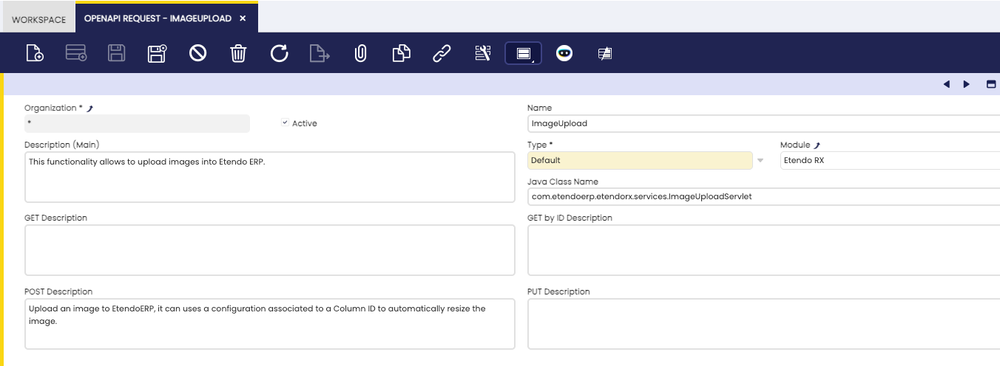
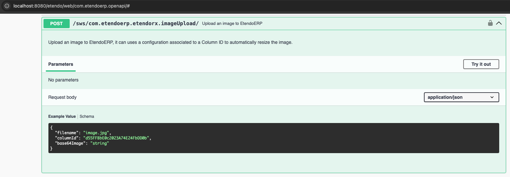
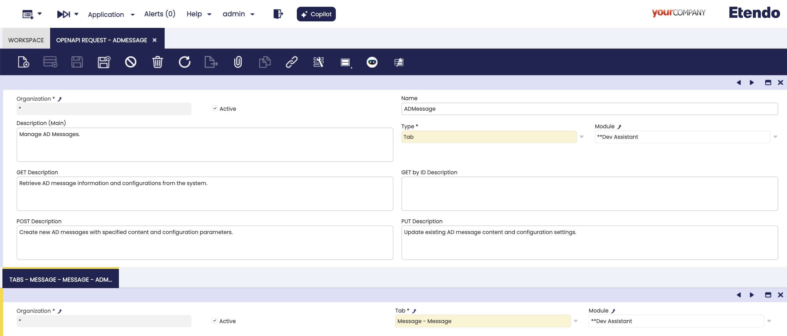
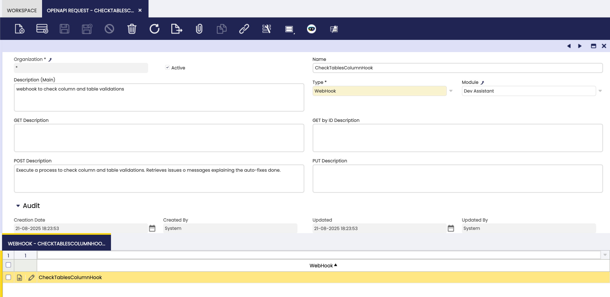
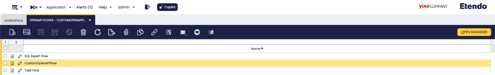
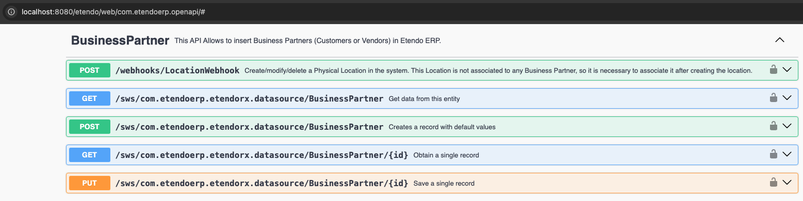

---
tags:
  - How to
  - Infrastructure
  - OpenAPI
  - Swagger

title: How to Document an Endpoint with OpenAPI
---

# How to Document an Endpoint with OpenAPI

## Overview

This documentation details the steps to document API endpoints using the OpenAPI specification. By leveraging Swagger, developers can ensure their APIs are well-documented, standardized, and easy to integrate.

!!! info
    To be able to include this functionality, the Platform Extensions Bundle must be installed. To do that, follow the instructions from the marketplace: [_Platform Extensions Bundle_](https://marketplace.etendo.cloud/#/product-details?module=5AE4A287F2584210876230321FBEE614){target="\_blank"}. For more information about the available versions, core compatibility and new features, visit [Platform Extensions - Release notes](../../../whats-new/release-notes/etendo-classic/bundles/platform-extensions/release-notes.md).


## Define a Default OpenAPI Request

This type requires implementing the endpoint programmatically. Create a new Java class that extends the abstract `OpenAPIDefaultRequest` and implement the required methods (for example: `getClasses()`, `getEndpointPath()`, and the operation methods such as `getPOSTEndpoint()`).

The `OpenAPIDefaultRequest` abstract class provides the base functionality for adding default API endpoints to Swagger documentation. It:

- Retrieves related tags and flows.
- Adds definitions to the OpenAPI object.
- Supports `GET`, `POST`, and `PUT` operations.

Here is an example:

```java
package com.etendoerp.etendorx.openapi;

public class ImageUploadOpenAPI extends OpenAPIDefaultRequest {
    public static final String ETENDO_ID_PATTERN = "^[0-9a-fA-F]{1,32}$";

    @Override
    protected Class<?>[] getClasses() {
        return new Class<?>[]{ com.etendoerp.etendorx.services.ImageUploadServlet.class };
    }

    @Override
    protected String getEndpointPath() {
        return "/sws/com.etendoerp.etendorx.imageUpload/";
    }

    @Override
    Operation getPOSTEndpoint() {
        Operation endpoint = new Operation();
        endpoint.setSummary("Upload an image to EtendoERP");
        endpoint.setDescription("Upload an image to EtendoERP, it can use a configuration associated with a Column ID to automatically resize the image.");

        Schema reqSchema = new Schema()
            .addProperty("filename", new StringSchema().description("The name of the file").example("image.jpg"))
            .addProperty("columnId", new StringSchema().description("The column ID where the size and resize configuration is stored").pattern(ETENDO_ID_PATTERN))
            .addProperty("base64Image", new StringSchema().description("The base64 encoded image"));
        reqSchema.required(List.of("filename", "base64Image"));

        RequestBody requestBody = new RequestBody().content(new Content()
            .addMediaType("application/json", new MediaType().schema(reqSchema)));
        endpoint.requestBody(requestBody);

        return endpoint;
    }
}
```

This class specifies a POST endpoint for uploading images. It defines the endpoint path, request body schema, and required properties.

The `ImageUploadOpenAPI` class demonstrates:

- **Endpoint Path**: `/sws/com.etendoerp.etendorx.imageUpload/`
- **POST Operation**: Defines required properties (`filename`, `base64Image`) and validates input.
- **Java Class Association**: Links to `ImageUploadServlet` for handling requests.


### OpenAPI Request Window

:material-menu: `Application` > `General Setup` > `Application` > `OpenAPI Request`

An OpenAPI Request record represents a single API endpoint in your application. 



Fields to note: 

1. **Type**: Set the type to `Default`.
2. **Description**: Add the endpoint general description. This description is appended to the OpenAPI main description.
3. **Java Class**: Specify the Java class created that extends the `OpenAPIDefaultRequest` class.
4. **GET Description**: Provide a description for the GET method of the endpoint. This description is used if the endpoint supports the GET method.
5. **GET by ID Description**: Provide a description for the GET by ID method of the endpoint. This description is used if the endpoint supports the GET by ID method.
6. **POST Description**: Provide a description for the POST method of the endpoint. This description is used if the endpoint supports the POST method.
7. **PUT Description**: Provide a description for the PUT method of the endpoint. This description is used if the endpoint supports the PUT method.


### OpenAPI Flow Window

:material-menu: `Application` > `General Setup` > `Application` > `OpenAPI Flow`

An **OpenAPI Flow** groups related API endpoints under a single category or _flow_. These flows make it easier to organize and navigate the API documentation.

Each OpenAPI Flow record can:

- Define a flow name and description.
- Include one or more OpenAPI Requests through the `Endpoints` tab.
- Specify which HTTP methods (GET, GET by ID, POST, PUT) the endpoints support using the `Endpoints` tab fields. When these fields are checked, they generate the corresponding endpoint methods documentation.


To ensure an OpenAPI Request appears in Swagger documentation, it must be linked to an OpenAPI Flow. This ensures logical grouping and visibility.


### OpenAPI Endpoint Interface

This interface ensures consistent API endpoint behavior by defining methods such as:

- `boolean isValid(String tag)`
- `void add(OpenAPI openAPI)`

For example, the `ImageUploadOpenAPI` class implements these methods to validate tags and add endpoint definitions to the OpenAPI object.



##  Other OpenAPI Request Types

=== "Tab"

    This type is used to document existing entities or database tables without creating a custom class that extends `OpenAPIDefaultRequest`. It lets you expose ERP data as API endpoints while supporting full **CRUD** operations (Create, Read, Update, Delete).

    **Key Features**:

    - All fields from the selected tab are automatically available in the API endpoint.
    - Business logic such as `callouts`, `event handlers`, `triggers`, and `default values` are applied automatically when creating, updating, or deleting records.
    - Endpoints are session-aware, which guarantees data consistency and secure access.
    - The OpenAPI Specification is generated automatically. By default, it includes the mandatory fields for `POST` and `PUT` operations, but you can simplify it by specifying only the required fields in the **Fields** sub-tab of the OpenAPI Request window.
    - Since Tab-type endpoints reuse the same business logic as Etendo Tabs, they behave consistently. For example, you can create a *Sales Order* header by providing only the Business Partner ID, and the system will apply the same logic as when creating it through the ERP UI.


    To configure a **Tab** OpenAPI Request:

    

    1. **Create a New Record in the `OpenAPI Request` Window**:

        - **Type**: Set the type to _Tab_.
        - **Description**: Provide a description of the endpoint, including its purpose and functionality.
        - **Tabs**: A new window tab will be visible. Add a new record and select the desired window tab from the tab selector.
        - **Get description**: Provide a description for the GET method of the endpoint. Its recommended to include details about the expected request parameters and response format.
        - **Get by ID description**: Provide a description for the GET by ID method of the endpoint. Its recommended to include details about the expected request parameters and response format.
        - **Post description**: Provide a description for the POST method of the endpoint. Its recommended to include details about the expected request parameters and response format.
        - **Put description**: Provide a description for the PUT method of the endpoint. Its recommended to include details about the expected request parameters and response format.

    2. **Link the Request to an OpenAPI Flow**:

        - Open the `OpenAPI Flow` window.
        - Add a new record.
        - Link the OpenAPI Request in the child tab.

    
=== "Webhook"

    Use this type to document webhook events without writing a custom class. It makes integration simple and keeps the format consistent.

    **Key Features**:

    - Provides clear documentation of webhook events.
    - Follows standard formats for easier integration.
    - Visible and easy to test in the Swagger UI.

    To configure a **Webhook** OpenAPI Request:

     

    1. **Create a New Record in the `OpenAPI Request` Window**:
        
        - **Type**: Set the type to _Webhook_.
        - **Description**: Provide a description of the webhook.
        - **Webhook Tab**: A new window tab will be visible. Add a new record and select the desired webhook from the selector.
        - **POST description**: Provide a description for the POST method of the webhook. Its recommended to include details about the expected request parameters and response format. This only method description is required, due to the nature of webhooks that are only POST.

    2. **Link the Request to an OpenAPI Flow**:
     
        - Open the `OpenAPI Flow` window.
        - Add a new record.
        - Link the OpenAPI Request in the child tab.


## Check Swagger

:material-menu: `Application` > `General Setup` > `Application` > `OpenAPI Flow`

The new endpoint documentation should be visible at the Swagger UI. Execute the **Open Swagger** button to open the Swagger in a new tab.





Verify that the new endpoint appears under the defined tag and displays the correct request and response schemas.

It will look like this:



---
This work is licensed under :material-creative-commons: :fontawesome-brands-creative-commons-by: :fontawesome-brands-creative-commons-sa: [ CC BY-SA 2.5 ES](https://creativecommons.org/licenses/by-sa/2.5/es/){target="_blank"} by [Futit Services S.L](https://etendo.software){target="_blank"}.
