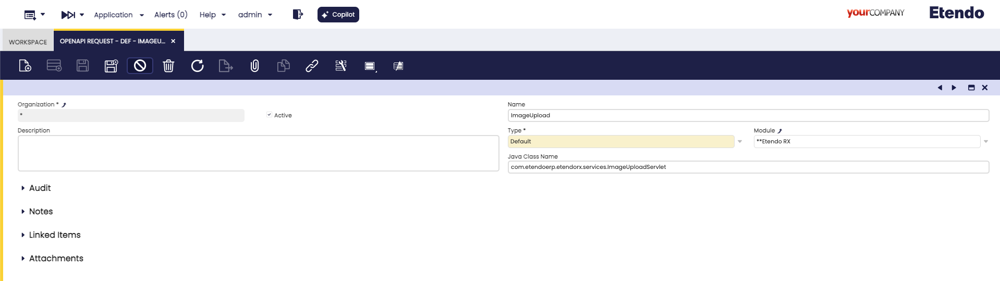
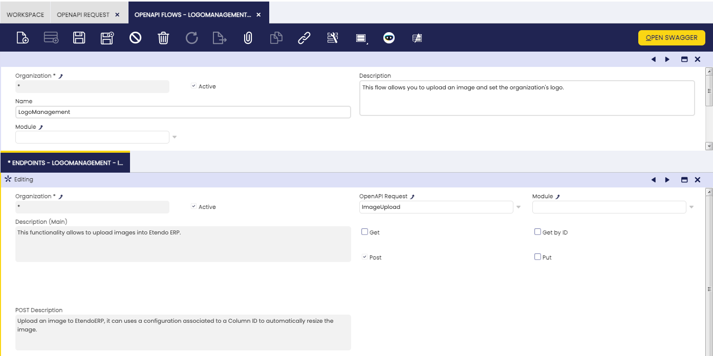
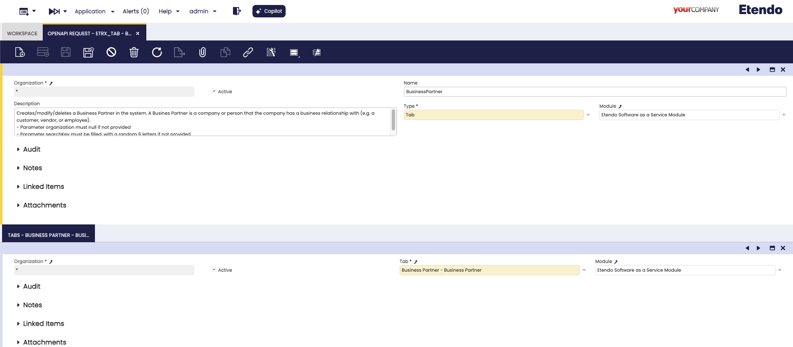
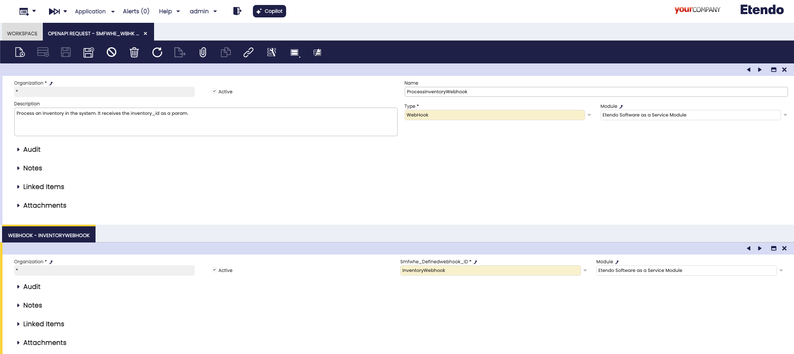

---
tags:
  - How to
  - Infrastructure
  - OpenAPI
  - Swagger

title: How to Document an Endpoint with OpenAPI
---

# How to Document an Endpoint with OpenAPI

## Overview

This documentation details the steps to document API endpoints using the OpenAPI specification. By leveraging Swagger, developers can ensure their APIs are well-documented, standardized, and easy to integrate.

!!! info
    To be able to include this functionality, the Platform Extensions Bundle must be installed. To do that, follow the instructions from the marketplace: [_Platform Extensions Bundle_](https://marketplace.etendo.cloud/#/product-details?module=5AE4A287F2584210876230321FBEE614){target="\_blank"}. For more information about the available versions, core compatibility and new features, visit [Platform Extensions - Release notes](../../../whats-new/release-notes/etendo-classic/bundles/platform-extensions/release-notes.md).

## Define a New OpenAPIDefaultRequest

To define a new `OpenAPIDefaultRequest`, you need to extend the abstract class `OpenAPIDefaultRequest`.

Here is an example:

```java
package com.etendoerp.etendorx.openapi;

public class ImageUploadOpenAPI extends OpenAPIDefaultRequest {
    public static final String ETENDO_ID_PATTERN = "^[0-9a-fA-F]{1,32}$";

    @Override
    protected Class<?>[] getClasses() {
        return new Class<?>[]{ com.etendoerp.etendorx.services.ImageUploadServlet.class };
    }

    @Override
    protected String getEndpointPath() {
        return "/sws/com.etendoerp.etendorx.imageUpload/";
    }

    @Override
    Operation getPOSTEndpoint() {
        Operation endpoint = new Operation();
        endpoint.setSummary("Upload an image to EtendoERP");
        endpoint.setDescription("Upload an image to EtendoERP, it can use a configuration associated with a Column ID to automatically resize the image.");

        Schema reqSchema = new Schema()
            .addProperty("filename", new StringSchema().description("The name of the file").example("image.jpg"))
            .addProperty("columnId", new StringSchema().description("The column ID where the size and resize configuration is stored").pattern(ETENDO_ID_PATTERN))
            .addProperty("base64Image", new StringSchema().description("The base64 encoded image"));
        reqSchema.required(List.of("filename", "base64Image"));

        RequestBody requestBody = new RequestBody().content(new Content()
            .addMediaType("application/json", new MediaType().schema(reqSchema)));
        endpoint.requestBody(requestBody);

        return endpoint;
    }
}
```

This class specifies a POST endpoint for uploading images. It defines the endpoint path, request body schema, and required properties.


## Define an OpenAPI Request & Flow

An OpenAPI Request record represents a single API endpoint in your application. OpenAPI Requests are defined in the window `OpenAPI Request`.

1. **Type**: Set the type to `Default`.
2. **Description**: Add the endpoint description.
3. **Java Class**: Specify the Java class created that extends the `OpenAPIDefaultRequest` class.




An **OpenAPI Flow** groups related API endpoints under a single category or _flow_. These flows make it easier to organize and navigate the API documentation.

Each OpenAPI Flow record can:

- Define a flow name and description.
- Include one or more OpenAPI Requests through the `Endpoints` tab.
- Specify which HTTP methods (GET, GET by ID, POST, PUT) the endpoints support using the `Endpoints` tab fields. When these fields are checked, they generate the corresponding endpoint methods documentation.



To ensure an OpenAPI Request appears in Swagger documentation, it must be linked to an OpenAPI Flow. This ensures logical grouping and visibility.

## Additional OpenAPI Request Types

=== "Tab - Etendo RX Module"

    This type allows documenting existing entities or tables without defining a custom class that extends `OpenAPIDefaultRequest`. It enables seamless interaction with the ERP entities and supports full CRUD operations.

    To configure a **Tab** OpenAPI Request:

    1. **Create a New Record in the `OpenAPI Request` Window**:

        - **Type**: Set the type to _Tab_.
        - **Description**: Provide a description of the endpoint.
        - **Tabs**: A new window tab will be visible. Add a new record and select the desired window tab from the tab selector.

        

    2. **Link the Request to an OpenAPI Flow**:

        - Open the `OpenAPI Flow` window.
        - Add a new record.
        - Link the OpenAPI Request in the child tab.

    **Features**:

    - All fields defined in the tab will be available in the endpoint.
    - Callouts, event handlers, triggers, and default values are automatically applied when adding, modifying, or deleting data.
    - Endpoints are session-aware, ensuring data consistency and security.

=== "Webhook - Webhook Events Module"

    This type allows documenting webhook events without defining a custom class that extends `OpenAPIDefaultRequest`. It is designed for ease of integration and adherence to standardized formats.

    To configure a **Webhook** OpenAPI Request:

    1. **Create a New Record in the `OpenAPI Request` Window**:
        
        - **Type**: Set the type to _Webhook_.
        - **Description**: Provide a description of the webhook.
        - **Webhook Tab**: A new window tab will be visible. Add a new record and select the desired webhook from the selector.

        

    2. **Link the Request to an OpenAPI Flow**:
     
        - Open the `OpenAPI Flow` window.
        - Add a new record.
        - Link the OpenAPI Request in the child tab.

    **Features**:

    - Enables clear documentation of webhook events.
    - Simplifies integration by following standardized formats.
    - Easily accessible in the Swagger UI.


## Check Swagger

The new endpoint documentation should now be visible at the Swagger UI URL. The URL might vary depending on your deployment but typically follows the format:


[http://localhost:8080/etendo/web/com.etendoerp.openapi/#/](http://localhost:8080/etendo/web/com.etendoerp.openapi/#/)


Verify that the new endpoint appears under the defined tag and displays the correct request and response schemas.


## Key Components of OpenAPI Integration

### OpenAPIDefaultRequest

The `OpenAPIDefaultRequest` abstract class provides the base functionality for adding default API endpoints to Swagger documentation. It:

- Retrieves related tags and flows.
- Adds definitions to the OpenAPI object.
- Supports GET, POST, and PUT operations.

### Example of an OpenAPI Endpoint Implementation

The `ImageUploadOpenAPI` class demonstrates:

- **Endpoint Path**: `/sws/com.etendoerp.etendorx.imageUpload/`
- **POST Operation**: Defines required properties (`filename`, `base64Image`) and validates input.
- **Java Class Association**: Links to `ImageUploadServlet` for handling requests.

### OpenAPIEndpoint Interface

This interface ensures consistent API endpoint behavior by defining methods such as:

- `boolean isValid(String tag)`
- `void add(OpenAPI openAPI)`

For example, the `ImageUploadOpenAPI` class implements these methods to validate tags and add endpoint definitions to the OpenAPI object.
