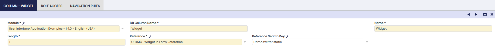
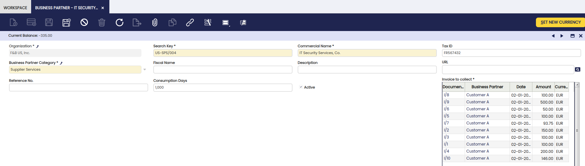
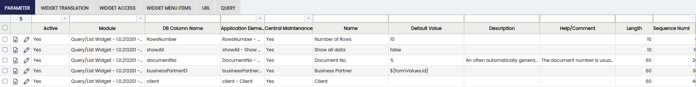

---
tags:
  - How to
  - Etendo Classic
  - Widget
  - Tab
---

#  How to embed a Widget into a Window Tab

 
This document is still a work in progress. It may contain inaccuracies or errors.   

##  Introduction

This Howto assumes familiarity with both how windows, tabs and fields work and also how widgets are defined in general.
  
This HowTo describes how to embed a widget into a tab of a generated window. In detail it will show the restrictions/differences in the Widget definition itself and explains the following two examples:

  1. How to embed a simple widget into a Tab.
  2. How to embed a QueryList widget into a Tab which filters its data according to the currently displayed record.

##  How to place a Widget into a Tab

In this part we will define two simple Widgets and place them into a generated Window/Tab.

The goal of this section is to show define a generated Window/Tab which looks like in the following screenshot.


Widget embedded in a Tab

In this example one widget is placed next to a few normal fields in a demo tab. This widget spans a single column but four rows on the top right and does not have a field label (to use the extra space of the label for the content itself). The widget content shows twitter entries including the text "Openbravo".

The rest of this sections assumes the following action to be done:

  * Creation of a table.
  * Creation of a window & tab to show this table.

The following now concentrates on how to add the two widgets in the positions shown above to this tab. This will consist of four basic steps for each of the widgets:

  1. Define the widget itself.
  2. Define a new reference entry to use the widget.
  3. Add a new column & field to the table & tab.
  4. Configure the new field to match the layout shown above.

The third step of this uses the same flow as adding any other field and is described in detail in  these  two  other documents.

First step is to create a new widget definition which will show the twitter content matching 'Openbravo'. This widget will reuse the code from the already defined Twitter widget shipped with the Openbravo 3 distribution.


Twitter widget definition

One important detail in this definition is that the parameter is defined as **Fixed** as for widgets embedded in a Window/Tab there are no Widget Instances as described  here.

The next step is to define a reference which can be used in the column for the widget.


Reference definition for Twitter widget

The important details in this definition are:

  * On reference Tab: _Parent Reference_ = **OBKMO_Widget in Form Reference**
  * On 'Widget in Form' tab: the newly created _Widget Class' & unmark _ Show Field Title _to use the extra available space for the widget content itself._

The last step for this widget is to add a column CHAR(1) to the table and a new field to the demo tab. The column needs to be defined according to the following details:



Column definition for Twitter widget

The last step is to add a form field to the tab and configure this form field with the wanted UI details consisting of:

  * Sequence No: for the usual field ordering.
  * Colspan: to define how many columns the field/widget should occupy.
  * Rowspan: to define how many rows the field/widget should occupy.


Field definition for Twitter widget

##  How to link a Widget to the current Record

The goal of this section is to create a QueryList widget similar to the existing _Invoice to collect_ widget available for placement in the workspace which shows data for all business partners.

In order to see changes done in the widget is necessary to refresh the entire Workspace not only the tab. This can be done in the Workspace Tab - Manage Workspace - Refresh


Invoice to collect in Workspace

The widget to be create here should instead be shown in the Business Partner window and only show the data for the currently displayed record.



Invoice to collect in Business Partner Window

Comparing to the original _Invoices to collect_ widget the following changes need to be done:

  1. Removal of the _Business Partner_ column, as instead the new widget should be filtered by the current business partner.
  2. Removal of the user-editable parameter definition.
  3. Addition of one new named parameter **businessPartnerID** linking to the current record.
  4. Changes to the HQL-Query to adjust it to the last two changes listed here.

The following shows the changed HQL in detail. Examining the HQL for the newly added named parameter it can be seen that the named parameter definition is identical to a 'normal' named parameter like it would be used for a user-editable value.

```
  SELECT
    inv.id AS invoiceId,
    inv.documentNo AS documentNo,
    inv.businessPartner.id AS businessPartnerId,
    inv.businessPartner.name AS businessPartnerName,
    inv.invoiceDate AS invoiceDate,
    inv.grandTotalAmount AS grandTotalAmount,
    inv.currency.iSOCode AS currency,
    inv.paymentTerms.name AS paymentTerms,
    inv.outstandingAmount AS outstandingAmount,
    inv.daysTillDue AS daysTillDue,
    inv.dueAmount AS dueAmount,
    inv.organization.name AS organizationName
  FROM
    Invoice AS inv
  WHERE
    inv.businessPartner.id = :businessPartnerID
  AND inv.processed = true
  AND inv.paymentComplete = false
  AND inv.salesTransaction = true
  AND inv.client.id = :client
  AND inv.organization.id IN (:organizationList)
  AND @optional_filters@
  ORDER BY
    inv.invoiceDate
```

The last and interesting difference in the definition of the new parameter **businessPartnerID** so that it automatically takes the _id_ -value of the currently displayed record.

To achieve this a new parameter entry needs to be created having the following details:

  * _DB Column Name_ = _businessPartnerID_ matching the named parameter in the query.
  * _Fixed_ = not marked.
  * _Default Value_ = ${formValues.id} to refer to the _id_ property of the currently displayed record.

This dynamic parameter definition and the naming rules for the properties are explained in more detail in  this  section of the Widgets documentation.

Copying the _Invoices to collect_ widget definition and doing the adjustments described above will lead to a parameter definition as seen in the following image:



Invoices Widget Parameter definition

The placement of this widget definition in the business partner definition works exactly like outlined in the previous section by following its steps of:

  * Definition new reference for the widget.
  * Adding a new column using this reference.
  * Adding a new field using this column + configuring its layout.

This concludes this HowTo which placed the information about collectible invoices the current Business Partner directly into the view of a user looking at the Business Partner tab.

---

This work is a derivative of [How to embed a widget into a window tab](http://wiki.openbravo.com/wiki/How_to_embed_a_Widget_into_a_Window_Tab){target="\_blank"} by [Openbravo Wiki](http://wiki.openbravo.com/wiki/Welcome_to_Openbravo){target="\_blank"}, used under [CC BY-SA 2.5 ES](https://creativecommons.org/licenses/by-sa/2.5/es/){target="\_blank"}. This work is licensed under [CC BY-SA 2.5](https://creativecommons.org/licenses/by-sa/2.5/){target="\_blank"} by [Etendo](https://etendo.software){target="\_blank"}.