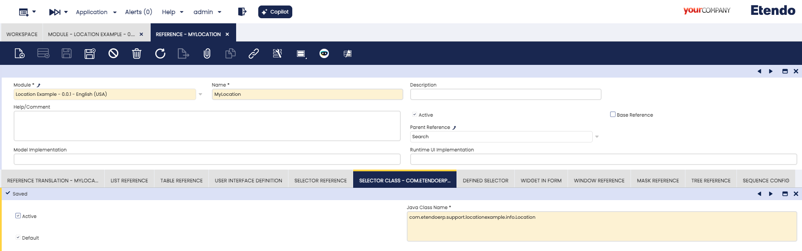
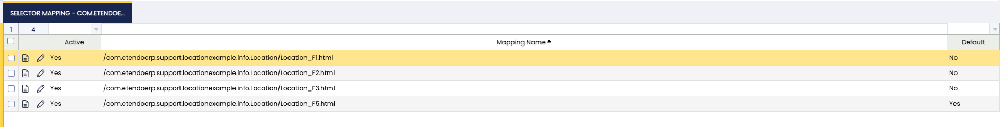
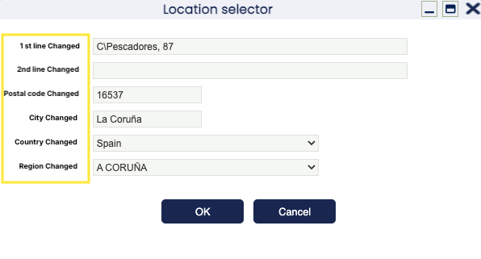

# How To Modularize The Location Selector

!!! example "IMPORTANT: THIS IS A BETA VERSION"
    This page is under active development and may contain **unstable or incomplete features**. Use it **at your own risk**.

## Overview

In this section, it is explained how to modify and modularize the **Location Selector** .

## Recommended Articles

Before reading this guide, it is necessary to have a proper understanding of Etendo's [Modularity](../concepts/modularity-concepts.md) concept and [how to create a module](../how-to-guides/how-to-create-a-module.md), as we take the knowledge from these articles as a given in this guide.

In case you are working with configuration scripts or templates on a regular basis, the following link to an article might be of interest to you, since it describes [how to create a configuration script](../how-to-guides/how-to-create-a-configuration-script.md).

## Execution Steps

The steps needed to change and modularize the **Location Selector** are as follows:

1. Define your own **Module** and export it. The module folder will be then be generated, for example: 

    ```
    modules/com.etendoerp.locationexample/
    ```

2. Create the source folder for the **Module** we just created previously. For our example, it should look like this: 

    ```
    src/ com/etendoerp/locationexample/info/
    ```

3. Copy the original files of the Location Selector into the newly created folder. When copying the files, maintain the original file names. The original files are located at: 

    ```
    src/org/openbravo/erpCommon/info/Location
    ```

4. Modify the following files to make them part of your package:   
  
    - **Location_Search_data.xsql**: Change the defined package to: `com.etendoerp.locationexample.info`
    - Change the package to: `com.etendoerp.locationexample.info`

        Change the following mappings to use the new mappings:

        ````
        org/openbravo/erpCommon/info/Location_FS ->  com/etendoerp/locationexample/info/Location_FS
        org/openbravo/erpCommon/info/Location_F1 ->  com/etendoerp/locationexample/info/Location_F1
        org/openbravo/erpCommon/info/Location_F2 ->  com/etendoerp/locationexample/info/Location_F2
        ```

    After that you can apply all the changes you want to do. In our example, we have just changed the labels for the fields.

    !!! note

        There is a **trigger** `c_bpartner_location_trg` that inserts the location name into the name field of the `c_bpartner_location` name after any changes. That name is created using the **function** `c_location_name`.

        If you add new fields in the Location Selector and also want to use the information to compose the name, you will need to do the following:

        - Create your own **function** based on `c_location_name` to compose the name that you want to save. 
        - Create your own **trigger** based on `c_bpartner_location_trg` to use that new function to save the name. 
        - Deactivate the `c_bpartner_location_trg` **trigger** and use your own one instead. 

        To deactivate it, you have to delete it and then export the changes into a **Template** set `In Development`. At the top of the `configScript.xml` template you will see that there is a line that indicates that the trigger was removed (`RemoveTriggerChange`). 
  

5. Create a new search reference for the new files for your module and your own name. Define that new reference to use your own Java Class and your own mappings: 

    

    

  
6. Define a new template module and mark it as `In Development`. You can use the template we used to deactivate the Trigger: In the **Tables and Columns** window, find the column which you want to use with the Locator Selector we have created and change the **Reference Searchkey** combo to use this new reference. In the example we have done it in the `C_Bpartner_location` table, in the `c_location_Id` column.


7. Compile the application with: 

    ```   
    ./gradlew smartbuild
    ```

8. Restart tomcat and use the column to check that the new reference is working with the new changes. 


    The results of our changes are:

    

---
This work is a derivative of [How To Modularize The Location Selector](https://wiki.openbravo.com/wiki/How_To_Modularize_The_Location_Selector){target="\_blank"} by [Openbravo Wiki](http://wiki.openbravo.com/wiki/Welcome_to_Openbravo){target="\_blank"}, used under [CC BY-SA 2.5 ES](https://creativecommons.org/licenses/by-sa/2.5/es/){target="\_blank"}. This work is licensed under [CC BY-SA 2.5](https://creativecommons.org/licenses/by-sa/2.5/){target="\_blank"} by [Etendo](https://etendo.software){target="\_blank"}.