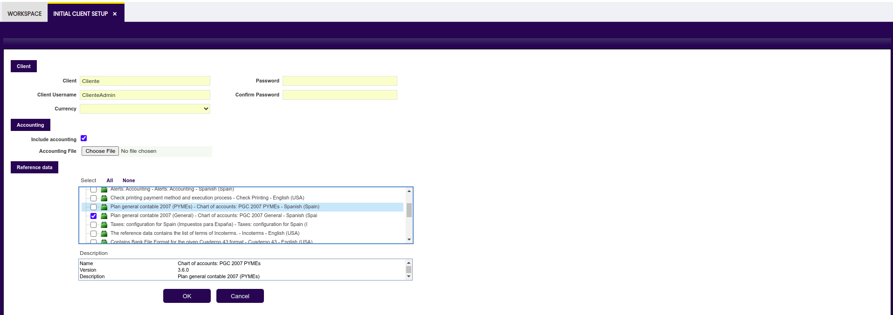
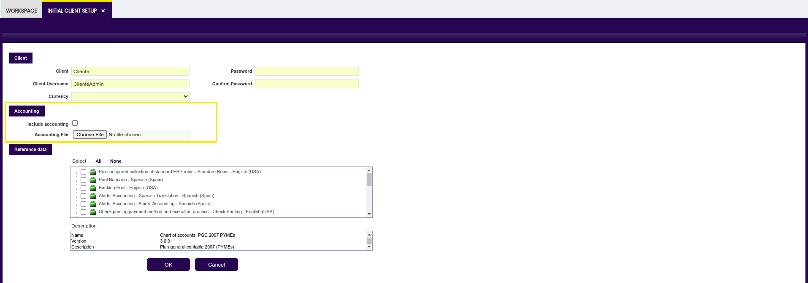

---
tags:
    - How to
    - Accounting Schema
    - Client Setup
    - Organization Setup
    - System Administrator
---

#  How to Run an Initial Client Setup Process

## Overview

<iframe width="560" height="315" src="https://www.youtube.com/embed/yGzPXU3nxpk?si=akTrp1_j8RAafSWx" title="YouTube video player" frameborder="0" allow="accelerometer; autoplay; clipboard-write; encrypted-media; gyroscope; picture-in-picture; web-share" referrerpolicy="strict-origin-when-cross-origin" allowfullscreen></iframe>

The Initial Client Setup process is a crucial process in Etendo which allows defining information about the client and the accounting schema the organization will use. The information configured through this window sets the bases for the organizational structure and the chart of accounts to be used with every organization of the client. 

!!!info
    It can be run by logging in Etendo as *System Administrator* role.

This process allows to:

- Enter the name of the client, the client username and a password.
- Enter the base currency of the client, that is going to be the currency of the Client regardless of if an Organization which belongs to it might have a different currency.
- Include Accounting for the client.

## Including accounting Schema

Decide on the *accounting schema* the organization will use and set the accounting using the Initial Client Set up window.

### Include accounting

To include this data, there is a checkbox named *Include Accounting* which obligates the user to enter a specific chart of accounts. For this, there are two options:

1. Uploading a `CSV` file with the chart of accounts, as explained in the [Accounting File](#accounting-file) section below.
2. If you have a localization bundle installed, selecting one of the chart of accounts listed in the Reference data section since these datasets are already installed.

!!!info
    It is recommended to have the Include Accounting option checked if the user needs to apply the same chart of accounts to all of its organizations.
    In case of entering a different chart of accounts for each specific organization, you should run this process without checking the checkbox and then configure the Chart of Accounts in the [Initial Organization Setup](../../../user-guide/etendo-classic/basic-features/general-setup/enterprise-model.md#initial-organization-setup) window.

!!!note
    In the Reference Data section, the existing datasets will depend on the localization installed, if any. 

If the checkbox *Include Accounting* is selected and an accounting file or reference data is selected, Etendo creates:

  - a [Fiscal Calendar](../../../user-guide/etendo-classic/basic-features/financial-management/accounting/setup.md#fiscal-calendar) which can be shared by all the *Legal with Accounting* organizations types which belongs to that Client and 
  - an [Account Tree](../../../user-guide/etendo-classic/basic-features/financial-management/accounting/setup.md#account-tree) or *Chart of Accounts* and a [General Ledger configuration](../../../user-guide/etendo-classic/basic-features/financial-management/accounting/setup.md#general-ledger-configuration) which is shared by all the organizations created within the Client.

The *General Ledger Configuration* and the *Chart of Accounts* created by default can be later on customized. 

!!!info
    For more information, read [General Setup](../../../user-guide/etendo-classic/basic-features/general-setup/getting-started.md). 

The *General Ledger Configuration* is linked to the *Account Tree* as the *Account* is a mandatory [dimension](../../../user-guide/etendo-classic/basic-features/financial-management/accounting/setup.md#dimension) of the general ledger configuration.

### Accounting file 

Etendo also allows choosing the accounting `CSV` file with the corresponding chart of accounts ([Account Tree](../../../user-guide/etendo-classic//basic-features/financial-management/accounting/setup.md#account-tree)) to upload into the system from the field *Accounting File*. 

!!!info
    For more information, read [How to Create Accounts Files](how-to-create-accounts-files.md) 

## Module configuration

Etendo distributes accounting `CSV` files as modules which can be applied as reference data. These kinds of modules are part of the Etendo localization for a given country.

!!!info
    The list of available localization bundles is found in the [Etendo marketplace](https://marketplace.etendo.cloud/#/){target="\_blank"}.

There are some additional modules that may be important for the initial client setup.

The key modules include:

- Standard document types for orders, invoices, etc, this one is selected by default as it is necessary for creating transactional data such as orders and invoices.

- Reference data such as master data or configuration data (i.e. tax setup) created for Etendo extension modules.

These modules are useful as tax configurations generally apply to all organizations in a country, and setting standard document types helps avoid inconsistent numbering issues across different organizations.

!!!note
    It is recommended to install necessary modules for the proper operation of the client, based on their specific requirements.

!!!info
    Datasets Installation: additional modules can be added from the [Enterprise Module Management](../../../user-guide/etendo-classic/basic-features/general-setup/enterprise-model.md#enterprise-module-management) window within the system.

Every new [Client](../../../user-guide/etendo-classic/basic-features/general-setup/client.md) created in Etendo centrally maintains at least the mandatory accounting dimensions listed below:

- Organization
- Business Partner
- and Product

unless the *Central Maintenance* checkbox is unselected for the Client which would imply the configuration and management of all the accounting dimensions (mandatory and not mandatory) at organization level.

To conclude, it is important to carefully conduct the initial setup in Etendo, considering the organization's needs and specific requirements. Additionally, thorough documentation of the accounting structure and module configurations is essential for future reference and efficient system management.

!!!info
    Visit [General Setup](../../../user-guide/etendo-classic/basic-features/general-setup/getting-started.md) to continue with Etendo's initial setup.

---

This work is a derivative of [Initial Client Setup](https://wiki.openbravo.com/wiki/Initial_Client_Setup){target="\_blank"} by [Openbravo Wiki](http://wiki.openbravo.com/wiki/Welcome_to_Openbravo){target="\_blank"}, used under [CC BY-SA 2.5 ES](https://creativecommons.org/licenses/by-sa/2.5/es/){target="\_blank"}. This work is licensed under [CC BY-SA 2.5](https://creativecommons.org/licenses/by-sa/2.5/){target="\_blank"} by [Etendo](https://etendo.software){target="\_blank"}.