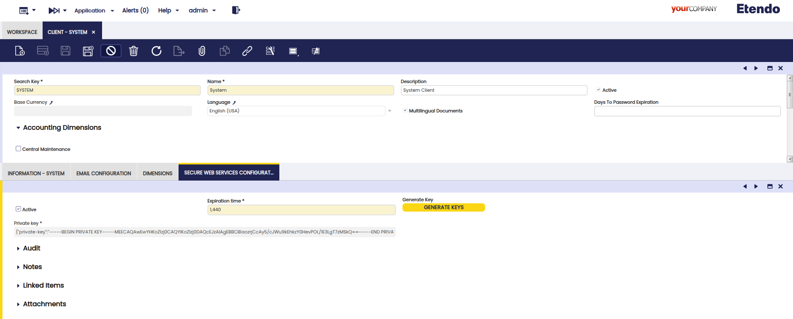

---
tags:
  - How to
  - Swagger
  - Secure Web Services
  - Secure Webservices
  - Web Services
---

# How to Use Secure Web Services

## Overview

This module allows calling any standard Etendo web service in the same way as calling the `/ws` endpoint, but using token authentication.

This authentication method also allows defining the context for the calls by choosing the role and/or organization when requesting a token. It is also possible to renew a token to refresh the expiration date or change the role/organization.

Besides the authentication implementation, the module includes utilities for developers and useful web services, such as jsonDal (to access the OB Data Access Layer with json).

## Setup 

!!! Info 
    By default, the ES256 encryption algorithm is used, it is possible to change it by setting a new preference with the `Encryption Algorithm` property and set its value to `HS256`.

### Initial configuration
:material-menu: `Application` > `General Setup` > `Client` > `Client`
It is necessary to configure the encryption key and the expiration time for the authentication tokens in the Client window with the System Administrator role.

If the expiration time is equal to "0" the tokens do not expire.

Generate a random key with the "Generate key" button.

## Secure Web Services Swagger

!!! info
    For more information, visit [Secure Web Services Swagger](https://demo.etendo.cloud/etendo/web/com.smf.securewebservices/doc/#/Login/post_sws_login){target="_blank"}.

---
This work is licensed under :material-creative-commons: :fontawesome-brands-creative-commons-by: :fontawesome-brands-creative-commons-sa: [ CC BY-SA 2.5 ES](https://creativecommons.org/licenses/by-sa/2.5/es/){target="_blank"} by [Futit Services S.L](https://etendo.software){target="_blank"}.
