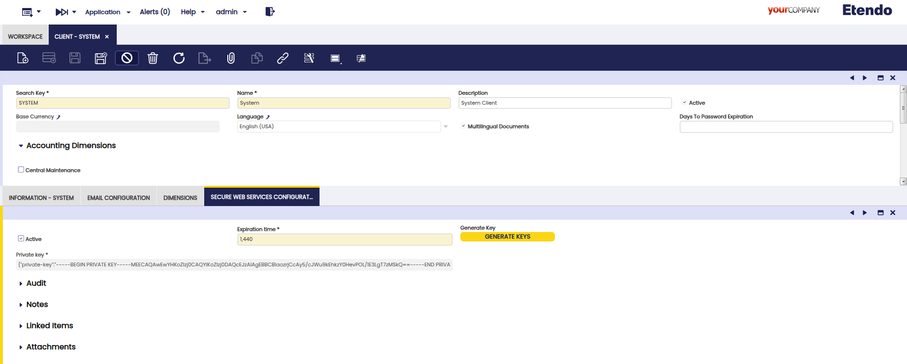

---
tags:
  - How to
  - Swagger
  - Secure Web Services
  - Secure Webservices
  - Web Services
---

# How to Use Secure Web Services

## Overview

This module allows calling any standard **Etendo web service** in the same way as calling the `/ws` endpoint, but using token authentication.

This authentication method also allows defining the context for the calls by choosing the role and or organization when requesting a token. It is also possible to renew a token to refresh the expiration date or change the role/organization.

Besides the authentication implementation, the module includes utilities for developers and useful web services, such as jsonDal (to access the OB Data Access Layer with json).

## Setup

!!! Info
    By default, the **ES256 encryption algorithm** is used, it is possible to change it by setting a new preference with the `Encryption Algorithm` property and set its value to `HS256` to use a legacy algorithm.

!!! Warning
    A valid domain name and `SSL/TLS` certificate are required to use **Secure Web Services**. Please install a certificate or contact your administrator to avoid runtime errors when generating tokens in server instances.

### Automatic Configuration (26Q1+)

Starting from **26Q1**, the Secure Web Services key is **automatically generated** when running the `./gradlew install` task. No manual setup is required for new installations.

- The generated key uses the **ES256 algorithm** by default.
- The token expiration is set to **0** (no expiration) by default.
- The token expiration time can be changed later from the Client window (value expressed in **minutes**, where `0` means no expiration).

!!! warning "Security recommendation"
    While the default expiration is set to `0` (no expiration) for ease of setup, the Etendo team recommends configuring a reasonable expiration time for production environments. Non-expiring tokens pose a security risk — if a token is compromised, it remains valid indefinitely. Set an expiration policy and rotate tokens periodically.

### Existing Installations

For instances installed before 26Q1, the SWS key can be generated or rotated in two ways:

1. **From the UI:** Navigate to :material-menu: `Application` > `General Setup` > `Client` > `Client`, open the **Secure Web Service Configuration** tab, and use the **Generate Key** button.

2. **From the command line:** Run the following Gradle task:

    ```bash
    ./gradlew generate.sws.keys
    ```

!!! warning
    Both methods will **overwrite the existing SWS key**. All tokens signed with the previous key will be immediately invalidated.

### Manual Configuration (Optional)

:material-menu: `Application` > `General Setup` > `Client` > `Client`

It is also possible to manually configure or rotate the encryption key and the expiration time for the authentication tokens in the Client window with the *System Administrator* role.

The expiration time value is expressed in **minutes** (set to `0` for no expiration).

Use the **Generate Key** button to generate a random key.



## Secure Web Services Swagger

!!! info
    For more information, visit [Secure Web Services Swagger](https://demo.etendo.cloud/etendo/web/com.smf.securewebservices/doc/#/Login/post_sws_login){target="_blank"}.

---
This work is licensed under :material-creative-commons: :fontawesome-brands-creative-commons-by: :fontawesome-brands-creative-commons-sa: [CC BY-SA 2.5 ES](https://creativecommons.org/licenses/by-sa/2.5/es/){target="_blank"} by [Futit Services S.L](https://etendo.software){target="_blank"}.
