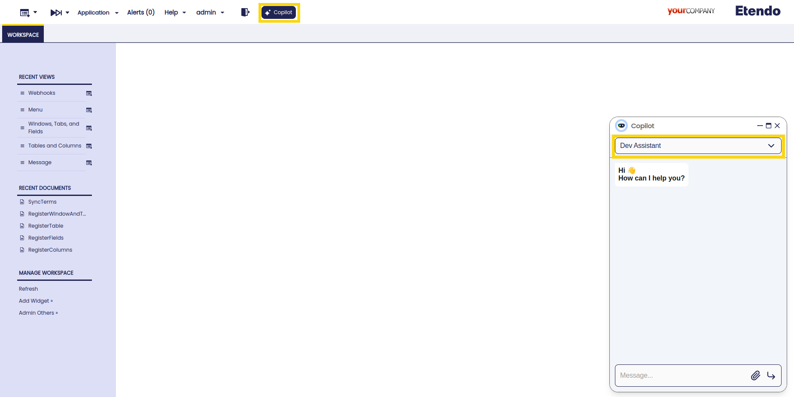
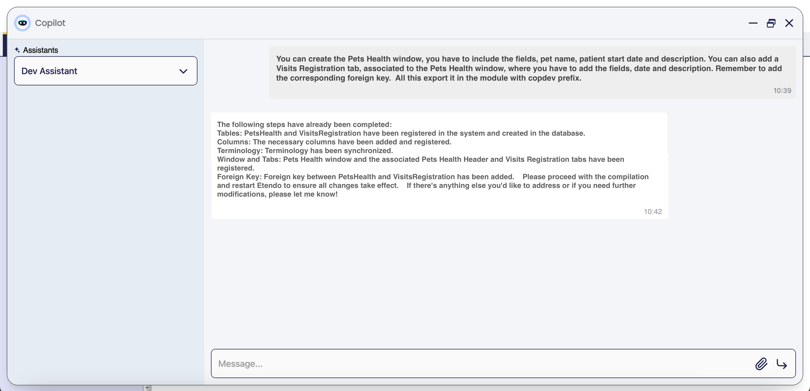
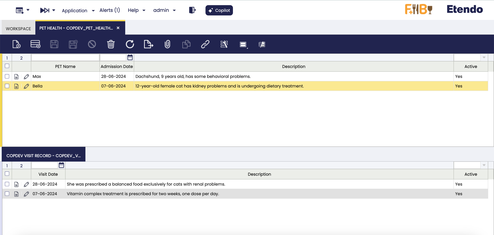

---
tags:
    - Beta
    - Copilot
    - IA
    - Windows, tabs and fields
    - Create Table
    - Add column
---

# Dev Assistant

## Overview

This assistant is designed to help developers and speed up the process of creating windows, tabs, fields, system elements, menu entries, etc.  As well as tables and columns in the database.
It is possible to give an input with all the necessary information, or the assistant will go step by step, asking for more information. Also, depending on the context, the assistant can make suggestions that the developer must confirm.

!!!warning
    This Assistant is currently in its beta testing phase. While it is designed to automate the process of creating windows and tables, there are instances where tasks may not be fully completed. Specifically, there may be issues with adding foreign keys, correctly naming elements, etc.

    For optimal results, it is recommended to proceed step-by-step and be as specific as possible in your instructions to the Assistant. This will help mitigate potential errors and ensure more accurate task completion.

    Thank you for your understanding as we continue to improve the functionality and reliability of this assistant.

## Installation
You can install only the module containing the **Dev Assistant** by following the guide on [How to install modules in Etendo](../../etendo-classic/getting-started/installation/install-modules-in-etendo.md), looking for the GitHub Package `com.etendoerp.copilot.devassistant`.


## Components
The Dev Assistant is composed of the following components:

- [**DDL Tool**](../../../developer-guide/etendo-copilot/available-tools/ddl-tool.md): This tool allows to regsitering and creating tables on Etendo and on the database using queries generated with the parameters given on the tool. The query is adjusted for the user needs, for example, if the user wants to add a column with a default value, the tool can receive a value or not if the element should not has a default value.

- Multiples Webhooks: These webhooks are used to run the java files that create or modify the fields on the Etendo Classic and execute process or queries. These webhooks are: `RegisterTable`, `CreateTable`, `RegisterFields`, `RegisterWindowAndTab`, `RegisterColumns`, `ElementsHandler`, `SyncTerms`.


## Functionality

!!! info
    With this assistant, it is possible to create: 

    - **Tables and Columns**: both tables and columns are created based on user specification and the supported types are `string`, `number`, `tableDir`, `date`, `text` and `boolean` (each field will have default lengths unless specified).  
    - **Windows**: only Mantein type windows are supported
    - **Tabs**: Can be created at multiple levels, although it is important to make it clear to the assistant to add the corresponding foreign keys.
    - **Fields**: Fields are created from columns, respecting the same name but without *"_"*.
    - **Elements**: The elements will be created automatically, sharing the name of the columns, but replacing the *"_"* with spaces. The help and description fields will also be added automatically.
    - **Menu**: A menu entry is automatically created, the developer must manually place it in the desired position.

 - Ask the **Dev Assistant** for a window to add in the system and the module database prefix where the table will be exported. The assistant will then register in the system the table and create it in database, including the mandatory columns. At this stage the assistant checks if the module is in development. If is not, the assistant prompts the user for a correct prefix from a module in development. Additionaly, the assistant checks if the table name is already in use; if it is, asks the user to provide a new name. In case the window belongs to the module under development, new columns, tabs and fields can be added.

- The assistant will ask to the user for information to add, like columns, data types, help and description, etc.

- The user must confirm the steps or set up a modification about the given information.


## Usage Example 

### 1. Setup
To use this assistant, it is necessary to log in as `System Administrator` role and set the module in which the changes will be exported in development.

### 2. Open Copilot, and select Dev assistant


### 3. Ask the assistant for what you need to create.


**User**: *"You can create the Pets Health window, you have to include the fields, pet name, patient start date and description. You can also add a Visits Registration tab, associated to the Pets Health window, where you have to add the fields, date and description. Remember to add the corresponding foreign key.  All this export it in the module with copdev prefix."*

**Copilot**: *"The following steps have already been completed: 
Tables: PetsHealth and VisitsRegistration have been registered in the system and created in the database. 
Columns: The necessary columns have been added and registered. 
Terminology: Terminology has been synchronized. 
Window and Tabs: Pets Health window and the associated Pets Health Header and Visits Registration tabs have been registered. 
Foreign Key: Foreign key between PetsHealth and VisitsRegistration has been added.    Please proceed with the compilation and restart Etendo to ensure all changes take effect.    If there's anything else you'd like to address or if you need further modifications, please let me know!"*


### 4. Compile
    
With the task complete, it is necessary recompile with a smartbuild and restart Tomcat

```title="Terminal"
./gradlew smartbuild --info
```


### 5. Reviewing the results
    
Window in the System,the window can be viewed with the user role.



### 6. Export the changes
    
Once the development is validated by the developer, and the necessary manual modifications are made, it is possible to export the changes in the corresponding module.

```title="Terminal"
./gradlew export.database --info
```