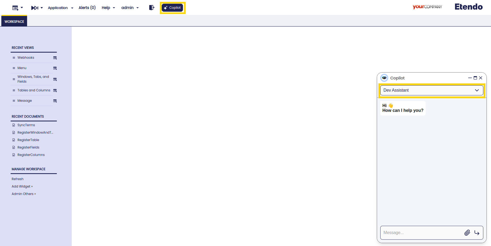

---
tags:
    - Copilot
    - IA
    - Machine Learning
    - Windows, tabs and fields
    - Create Table
    - Add column
---

# DEV ASSISTANT

## Overview

This intelligent Assistant is designed to help users to automate the process of create a window and a table in both the Etendo ERP and the database throw the Copilot chat. It is possible ask the complete task to the assistant or proceed step by step, also the assistant can suggest elements to complete the fields correctly. 

## Components
The Dev Assistant is composed of the following components:
- **DDL** tool: This tools allows to regsitering and creating tables on Etendo and on the database using queries generated with the parameters given on the tool. The query is adjusted for the user needs, for example, if the user wants to add a column with a default value, the tool can receive a value or not if the element should not has a default value.
- Multiples Webhooks: These webhooks are used to run the java files that modify the fields on the Etendo ERP and execute the queries generated previously. These webhooks are: RegisterTable, CreateTable, RegisterFields, RegisterWindowAndTab, RegisterColumns, ElementsHandler, SyncTerms.

## Functionality

1. Ask the Copilot chat for a table to register in the system with the correct prefix. The assistant will then register in the system the table and create it in database, including the mandatory columns. At this stage the assistant checks if the module is in development. If is not, the assistant prompts the user for a correct prefix from a module in development. Additionaly, the assistant checks if the table name is already in use; if it is, asks the user to provide a new name.

2. The assistant will ask to the user for information to add, like columns, data types, help and description, etc.

3. The user must confirm the steps or set up a modification about the given information.

4. Recompile and restart Tomcat to a successful application of changes.

5. You can use the Dev Assistant as System Administrator but the results can be seen with the User role. It can be used for other roles, but first, you need to configure the access in the **Role** window and **WebHooks** window.

## Usage Example 

**User**: "I want to create a table with the name 'Table Test' and prefix 'copdev'."

**Copilot**: "Let's begin by registering the table in the system.
Can you provide me with the following details:
Classname (or I can generate one automatically for you).
Description of the table (or I can generate one automatically).
Help comment for the table (or I can generate one automatically)."

**User**: "Just generate automatically"

**Copilot**: "The table "Table_Test" has been created successfully in the database.
Now, please provide the specific columns you want to add to the table, including:
Column name
Column data type
If the column can be null
If the column has a default value (and what it is, if applicable)
For example:
Column name: dogColor
Column type: String
Can be null: Yes
Default value: None"

**User**: "add the column 'Specific Data' with a text, can be null and has not default value"

**Copilot**: "The table "Table Test" has been successfully created and configured in the system. Here's a summary of the steps performed:
Registered the table "Table Test" in the system.
Created the table "Table_Test" in the database.
Added a column "Specific Data" with type "Text" to the table.
Registered the columns of the table in the system.
Synchronized the terminology.
Created a window and header tab for "Table Test".
Registered the fields for the window tab in the system.
Synchronized the terminology again.
Added descriptions and help comments to the columns without them.
Synchronized the terminology again.
It's strongly recommended to compile and restart Etendo to apply all changes effectively."

## Results

**First Response**

**With the task complete, it is necessary restart Etendo**

**Window in the system**

