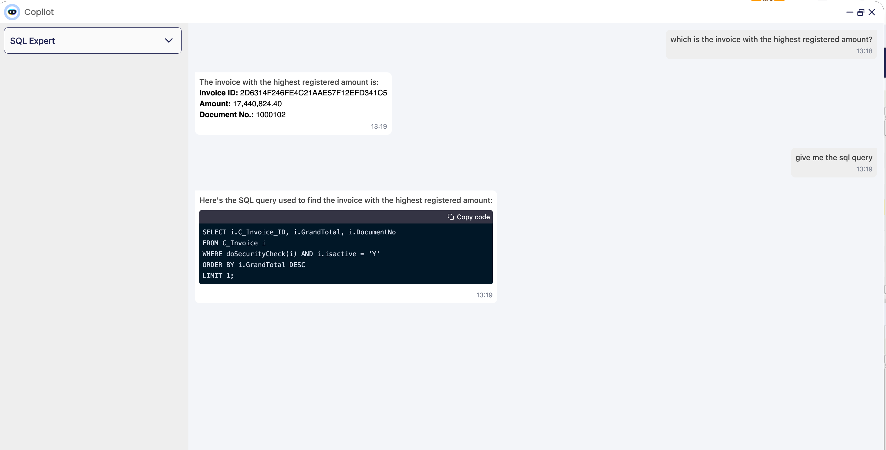

---
tags:
    - Copilot
    - IA
    - Machine Learning
    - Database
    - DB query tool
---

# SQL Expert (DB Query Tool)

:octicons-package-16: Javapackage: com.etendoerp.copilot.dbquerytool

## Overview

This Assistant is designed to help users to read information from the database. It is a tool that allows users to ask questions in natural language and get the SQL query that retrieves the information they need. The tool uses the DBQueryTool to infer the necessary information to generate the SQL query. The user can ask questions about the database, and the Assistant will retrieve the information from the database and, if the user's request is clear, generate the SQL query to retrieve the information.

## Components
The SQL Expert Assistant is composed of the following components:
- DBQueryGenerator tool: This tools allows to ask to Etendo for tables available in the database and the columns of each table. It also allows Copilot to execute SQL queries in the database that are generated by the Assistant.
- "DBQueryExec" Webhook: This Webhook allows the Assistant to execute SQL queries in the database. The DBQueryGenerator tool sends the SQL query to the Webhook, and the Webhook executes the query in the database and returns the result to the Assistant. This is a secure way to execute SQL queries in the database, because Etendo handles the security of the database connection and the execution of the queries.


## Functionality


1. Add Copilot DB Query Tool dependency in the Etendo Classic project, In `build.gradle`, add:
    ```groovy
    implementation('com.etendoerp:copilot.dbquerytool:1.1.1')
    ```

2. It is necessary to add the ```gradle.properties``` file with the following configuration:
    ``` properties
    ETENDO_HOST=http://localhost:8080/etendo
    ```
    !!! warning
        Replace http://localhost:8080/etendo with the real url of the Etendo system.

3. Do a compilation with a database update, to register the tool and the assistant in the database.
    ``` bash title="Terminal"   
    ./gradlew update.database smartbuild --info
    ```

4. Restart Tomcat and check the Assistant in the Copilot App Window. 

5. Sync the Copilot App.

6. Restart Docker image using `./gradlew copilot.stop` and `./gradlew copilot.start` tasks.
    !!! note 
        If you have problems with shutting down the container, you can use the `docker ps` command to see the container id and then use `docker stop <container_id>` to stop it manually.

7. You can use the SQL Expert Assistant as System Administrator. It can be used for other roles, but first, you need to configure the access in the `Role` window and "WebHooks" window for "DBQueryExec" WebHook.


## Examples

#### Examples of questions for information retrieval

1. **What is the amount of the last F&B España - Región Sur organization sales invoice?**
    

2.  **Can you tell me which is the invoice  with the highest registered amount?**
    
3. **Can you execute the sum of the orders in the last month?**
    


#### Examples of SQL query generation

1. **Query to know the name of the best 5 customer of junuary 2011?** 
    
    
2. **Query to obtain which is the invoice with the highest registered amount?** 
    


