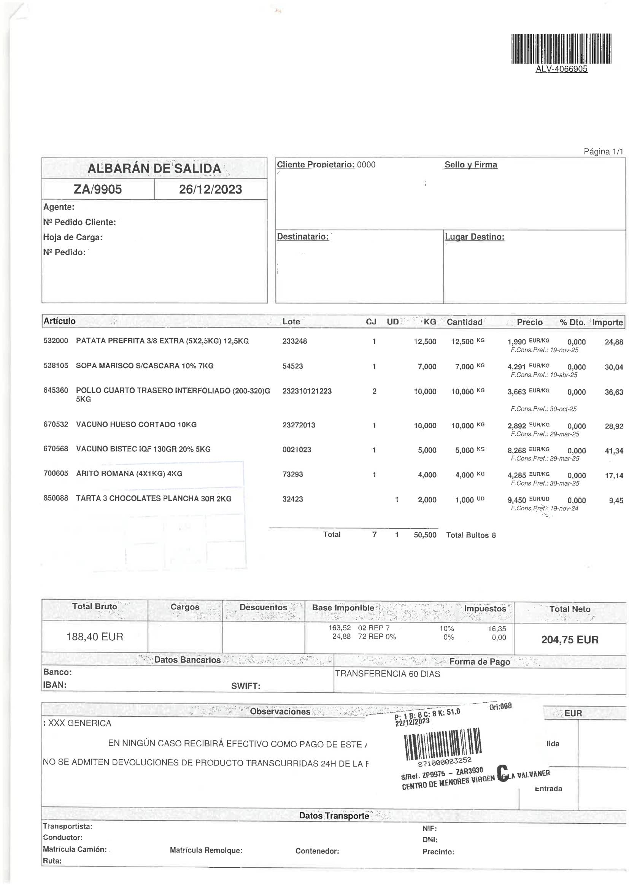

---
tags:
    - Copilot
    - Codbar
    - Image Recognition
    - Barcode
---

# Codbar Tool

:octicons-package-16: Javapackage: `com.etendoerp.copilot.ocrtool`

## Overview

The **CodbarTool** is a tool that reads barcodes from image files. It accepts an array of file paths as an input and returns an array of barcodes found in those images.

!!!info
    To be able to include this functionality, the Copilot Extensions Bundle must be installed. To do that, follow the instructions from the marketplace: [Copilot Extensions Bundle](https://marketplace.etendo.cloud/?#/product-details?module=82C5DA1B57884611ABA8F025619D4C05){target="\_blank"}. For more information about the available versions, core compatibility and new features, visit [Copilot Extensions - Release notes](../../../whats-new/release-notes/etendo-copilot/bundles/release-notes.md).

## Functionality

This tool allows agents to **read barcodes from multiple images**, which can then be applied in inventory management, product tracking, and document processing among other areas.

Using this tool consists of the following actions: 

- Receiving Parameters: 

    - The tool receives an input object containing a key called filepath which is a list of strings. Each string represents the file path of an image to be analyzed.
    - Example input:

        `{"filepath": ["/tmp/test.png", "/tmp/test1.png"]}`

- Processing Images: 

    - For each file path provided, the tool opens the image and attempts to decode any barcodes present.
    - It utilizes the pyzbar library to decode barcodes from the images.

- Returning the Result: 

    - If barcodes are found, the tool collects and returns them in a list.
    - Example output:

        `{"message": ["123456789012", "987654321098", ...]}`


!!!info
    The tool utilizes the PIL library to open image files.


!!!note
    The **pyzbar library** is used to decode barcodes from the image. If no barcodes are found, it returns None for that image. If barcodes are found, it decodes each barcode’s data.

## Usage Example

- Suppose there is an image at `/tmp/goods-receipt.png` and you want to extract the barcode related to the goods receipt information:

The following is an example image of a goods receipt: 



- The tool will be used as follows: 

    - Input

        ```
        `{"filepath": ["/tmp/goods-receipt.png"]}`

        ```

    - Output

        ```
        `{"message": ['ALV-4066905', '871000003252']}`

        ```
