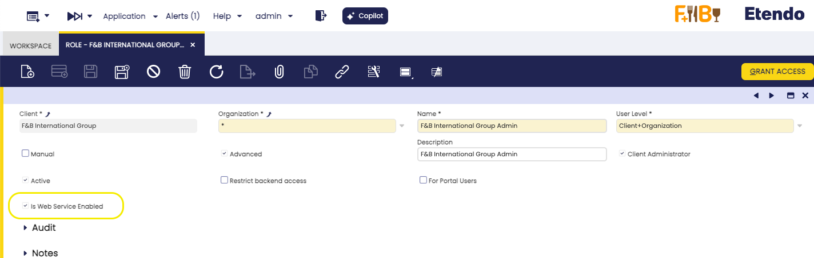

---
tags:
    - Copilot
    - IA
    - Database
    - DB query tool
---

# Database Query Generator tool

:octicons-package-16: Javapackage: `com.etendoerp.copilot.dbquerytool`

## Overview

This tool allows asking to Etendo for tables available in the database and the columns of each table. It also allows Copilot to execute SQL queries in the database that are generated by the Assistant.

!!!info
    To be able to include this functionality, the Copilot Extensions Bundle must be installed. To do that, follow the instructions from the marketplace: [Copilot Extensions Bundle](https://marketplace.etendo.cloud/?#/product-details?module=82C5DA1B57884611ABA8F025619D4C05){target="\_blank"}. For more information about the available versions, core compatibility and new features, visit [Copilot Extensions - Release notes](../../../whats-new/release-notes/etendo-copilot/bundles/release-notes.md).

## Installation
The tool is included with the SQL Expert installation, see the [SQL Expert installation guide](../../../user-guide/etendo-copilot/bundles/sql-expert.md) for more information.

## Configuration
This tool can be configured in an Assistant:

1. Add **Database Query Generator tool** into the Assistant configuration, that you want to use the tool. Go to Assistant window, pick the Assistant and add the tool to the App in the **Tools** tab.

2. Re-Sync the Assistant running **Sync Assistant** process to get the tool available in the Assistant.

3. Check that the role of the user has permissions to use Secure Web Services in the **Role** Window. 
4. Check that the WebHook **DBQueryExec** is enabled and has the Role Access configured for the role.
    Example for *F&B International Group Admin*:
    

5. Check that the `ETENDO_HOST` is configured in the `gradle.properties` file.

6. Can you check if the tool is available for the Assistant, asking for it. 
    <figure markdown>
    {align=right width=300}
    </figure>


## Security

For security and data segmentation:

- The tables instrospection is limited for the readable tables of the user.

- The tool automatically parses the `doSecurityCheck(entity)` with the conditions for a correct access to the Readable **Client** and **Organization**, for example: `doSecurityCheck(inv)`  for Invoices, is converted to

``` sql
inv.ad_client_id IN ('23C59575B9CF467C9620760EB255B389','0')  AND inv.ad_org_id IN ('0','E443A31992CB4635AFCAEABE7183CE85','B843C30461EA4501935CB1D125C9C25A','BAE22373FEBE4CCCA24517E23F0C8A48','DC206C91AA6A4897B44DA897936E0EC3','2E60544D37534C0B89E765FE29BC0B43','19404EAD144C49A0AF37D54377CF452D','7BABA5FF80494CAFA54DEBD22EC46F01')
```