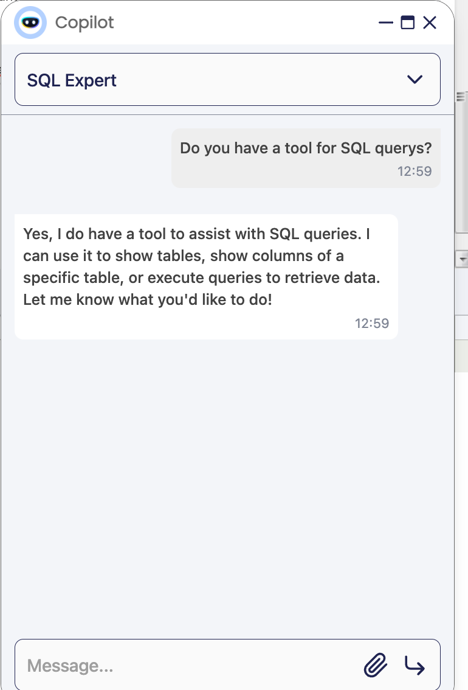

---
tags:
    - Copilot
    - IA
    - Machine Learning
    - Database
    - DB query tool
---

# Database Query Generator tool

:octicons-package-16: Javapackage: com.etendoerp.copilot.dbquerytool

## Overview

This Assistant is designed to help users to read information from the database. It is a tool that allows users to ask questions in natural language and get the SQL query that retrieves the information they need. The tool uses the DBQueryTool to infer the necessary information to generate the SQL query. The user can ask questions about the database, and the Assistant will retrieve the information from the database and, if the user's request is clear, generate the SQL query to retrieve the information.

## Components
The SQL Expert Assistant is composed of the following components:
- DBQueryGenerator tool: This tools allows to ask to Etendo for tables available in the database and the columns of each table. It also allows Copilot to execute SQL queries in the database that are generated by the Assistant.
- "DBQueryExec" Webhook: This Webhook allows the Assistant to execute SQL queries in the database. The DBQueryGenerator tool sends the SQL query to the Webhook, and the Webhook executes the query in the database and returns the result to the Assistant. This is a secure way to execute SQL queries in the database, because Etendo handles the security of the database connection and the execution of the queries.

## Installation
The tool is included with the SQL Expert installation, see the [SQL Expert installation guide](../available-assistants/sql-expert.md) for more information.

## Configuration
This tool can be configured in a Copilot App:

1. Add "Database Query Generator tool" into the Copilot App configuration, that you want to use the tool. Go to Copilot App window, pick the App and add the tool to the App in the "Tools" tab.

2. Re-Sync the Copilot App to get the tool available in the Copilot App.

3. Check that the role of the user has permissions to use Web Services in the "Role" Window.
4. Check that the WebHook "DBQueryExec" is enabled and has the Role Access configured for the role.
    Example for "F&B International Group Admin":
    

5. Check that the ETENDO_HOST is configured in the gradle.properties file.

6. Can you check if the tool is available for the Assistant, asking for it.


## Security

For security and data segmentation:
- The Table instrospection is limited for the Readable tables of the user.
- The Tool automatically parses the doSecurityCheck(entity) with the conditions for a correct access to the Readable Client and Organization, for example: ```doSecurityCheck(inv)```  for Invoices, is converted to
``` sql
inv.ad_client_id IN ('23C59575B9CF467C9620760EB255B389','0')  AND inv.ad_org_id IN ('0','E443A31992CB4635AFCAEABE7183CE85','B843C30461EA4501935CB1D125C9C25A','BAE22373FEBE4CCCA24517E23F0C8A48','DC206C91AA6A4897B44DA897936E0EC3','2E60544D37534C0B89E765FE29BC0B43','19404EAD144C49A0AF37D54377CF452D','7BABA5FF80494CAFA54DEBD22EC46F01')
```
