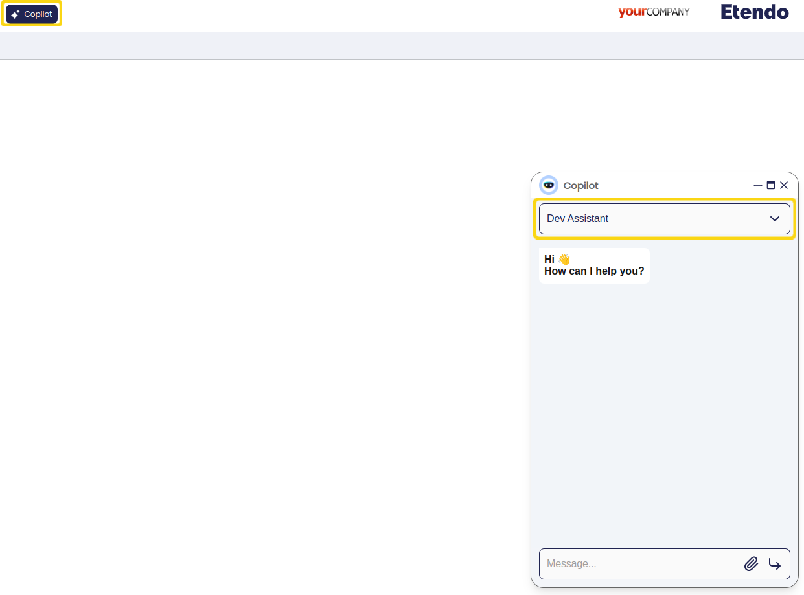
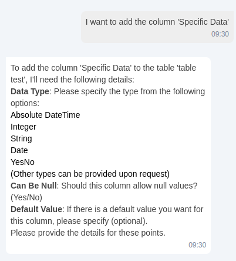
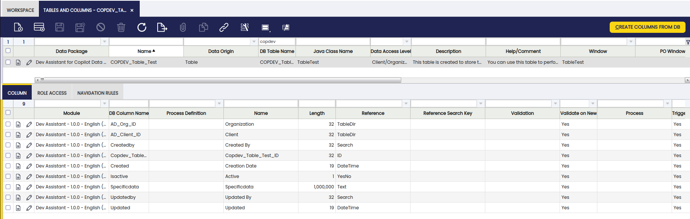
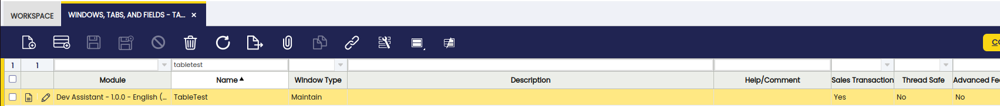
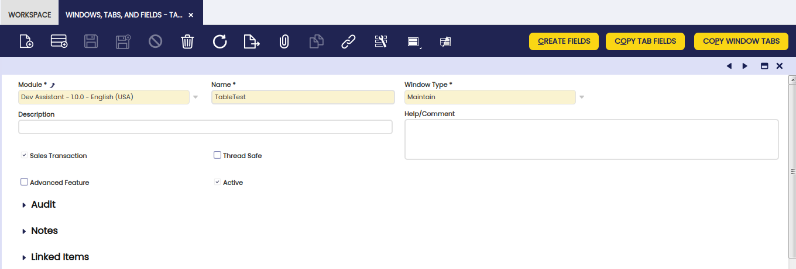
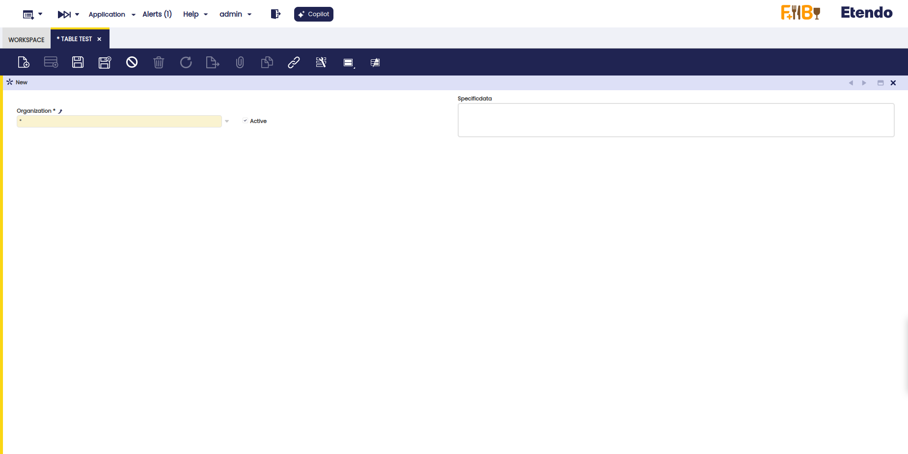

---
tags:
    - Copilot
    - IA
    - Machine Learning
    - Tool
    - Dev Assistant
    - Assistant
    - Create Windows, Tabs and Fields
    - Create Table
---

## Overview

The **DDLTool** is an Etendo Copilot tool, developed in Python, to create a table in the database by adding mandatory columns and specific columns that the user wants. In addition, it is able to create and register tables, windows, items and menu options in the system so that data can be displayed.

## Functionality

The **DDLTool** works with modes, each for a specific action. Through the prompt, the assistant can infer the mode is needed to do the task request by the user, the tool has a variable that contains a list with the availables modes, and with the prompt the assistant choose wich is better for the task.

Users can choose modes using the chat:

- **REGISTER_TABLE:** This mode registers a table on the Etendo System, creating a table header. It requires a table name and a prefix of a module in development. The tool can infer fields like Java Class Name, Description, and Help. This mode has a method that fix the java class name with a camelcase style. The tool uses a webhook to execute a Java file named RegisterTableWebHook to check if a table name is already registered and then sets parameters as prefix, java class name, data acces level, etc. with Etendo rules.

- **CREATE_TABLE:** Creates a table on the database using the table name and prefix to build the query with mandatory columns and necessary constraints. The mandatory constraints with the ad_org and ad_client table are created withe a method that fix the name if these are longer that 32 characters. This query is executed in the database with an Etendo webhook that runs a Java file named CreateTableWebHook. This file uses the parameters given to execute the query with the user data (name of database, local host, etc).

- **ADD_COLUMN:** This mode modifies the previously created table instead of creating a new one. The tool has a list of acceptable data types for each column and this is chosen by the assistant, that also infers if the column can have a null value or if it needs a default value. If unsure, it waits for more information. It can generate the correct query if the column data type needs a constraint. This mode uses the same webhook CreateTableWebHook, cause should execute also a shortest query, but it is build with different params that assistant suppose (data type of the column, if can be null or not, name of the column, default values, etc).

- **REGISTER_COLUMNS:** This mode is executed automatically after the ADD_COLUMN mode. It creates columns on Etendo System from the database with the previous created columns by calling a webhook that runs a Java file named RegisterColumns. This mode ensures that is the correct and unique table where add the columns.

- **SYNC_TERMINOLOGY:** Cleans the terminology, removing "_" and adding spaces. It works by calling a webhook to execute a Java file named SyncTermsWebHook.

- **REGISTER_WINDOW_AND_TAB:** Registers a window and a table to show the data in the application, also add a menu to provide an easy access. It first checks if there is a window already created with the same name. If necessary, the tool can force the creation with a parameter called ForceCreate. This mode uses the RegisterWindowAndTabWebHook java file.

- **REGISTER_FIELDS:** Registers the fields of a tab in Etendo System to be recognized for it. It works by calling a webhook to run a Java file.

## Usage Example 

**User**: "I want to create a table with the name 'Table Test' and prefix 'copdev'."

**Copilot**: "Let's begin by registering the table in the system.
Can you provide me with the following details:
Classname (or I can generate one automatically for you).
Description of the table (or I can generate one automatically).
Help comment for the table (or I can generate one automatically)."

**User**: "Just generate automatically"

**Copilot**: "The table "Table_Test" has been created successfully in the database.
Now, please provide the specific columns you want to add to the table, including:
Column name
Column data type
If the column can be null
If the column has a default value (and what it is, if applicable)
For example:
Column name: dogColor
Column type: String
Can be null: Yes
Default value: None"

**User**: "add the column 'Specific Data' with a text, can be null and has not default value"

**Copilot**: "The table "Table Test" has been successfully created and configured in the system. Here's a summary of the steps performed:
Registered the table "Table Test" in the system.
Created the table "Table_Test" in the database.
Added a column "Specific Data" with type "Text" to the table.
Registered the columns of the table in the system.
Synchronized the terminology.
Created a window and header tab for "Table Test".
Registered the fields for the window tab in the system.
Synchronized the terminology again.
Added descriptions and help comments to the columns without them.
Synchronized the terminology again.
It's strongly recommended to compile and restart Etendo to apply all changes effectively."

## Results

**First Response**

**With the task complete, it is necessary restart Etendo**

**Window in the system**

