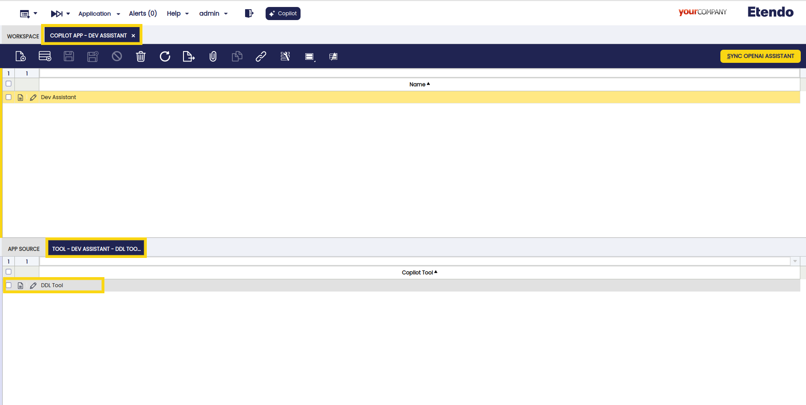
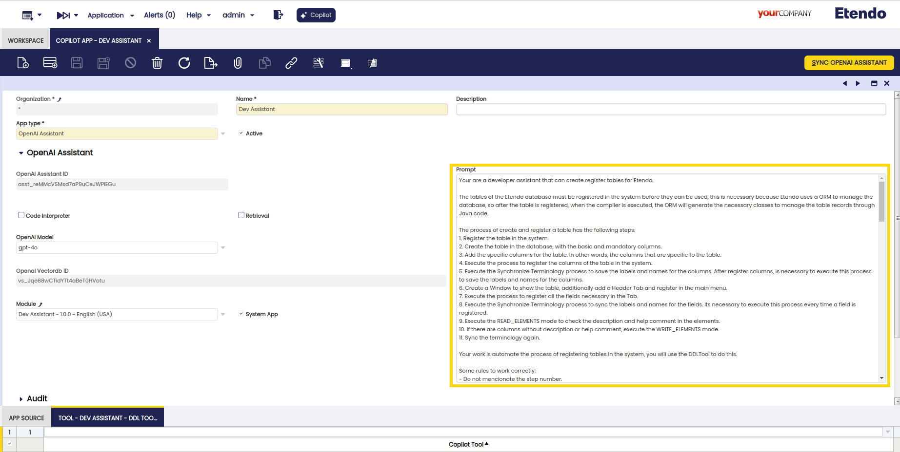

---
tags:
    - Copilot
    - IA
    - Machine Learning
    - Tool
    - Dev Assistant
    - Assistant
    - Create Windows, Tabs and Fields
    - Create Table
---

## Overview

The **DDLTool** is an Etendo Copilot tool, developed in Python, to create a table in the database by adding mandatory columns and specific columns that the user wants. In addition, it is possible to create and register tables, windows, items and menu options in the system so that data can be displayed.

## Functionality

The **DDLTool** works with modes, each for a specific action. Through the prompt, the assistant can infer the mode needed to do the task requested by the user. The tool has a variable that contains a list with the available modes so the assistant will choose the most appropriate mode for the task. 

Users can choose modes using the chat:

- **REGISTER_TABLE:** This mode registers a table on the Etendo System, creating a table header. It requires a table name and a prefix of a module in development. The tool can infer fields like Java Class Name, Description, and Help. This mode has a method that fix the java class name with a camelcase style. The tool uses a webhook to execute a Java file named `RegisterTableWebHook` to check if a table name is already registered and then sets parameters as prefix, java class name, data acces level, etc. with Etendo rules.

- **CREATE_TABLE:** Creates a table on the database using the table name and prefix to build the query with mandatory columns and necessary constraints. The mandatory constraints with the `ad_org` and `ad_client` table are created withe a method that fix the name if these are longer that 32 characters. This query is executed in the database with an Etendo webhook that runs a Java file named CreateTableWebHook. This file uses the parameters given to execute the query with the user data (name of database, local host, etc).

- **ADD_COLUMN:** This mode modifies the previously created table instead of creating a new one. The tool has a list of acceptable data types for each column and this is chosen by the assistant, that also infers if the column can have a null value or if it needs a default value. If unsure, it waits for more information. It can generate the correct query if the column data type needs a constraint. This mode uses the same webhook `CreateTableWebHook`, cause should execute also a shortest query, but it is build with different params that assistant suppose (data type of the column, if can be null or not, name of the column, default values, etc).

- **REGISTER_COLUMNS:** This mode is executed automatically after the `ADD_COLUMN` mode. It creates columns on Etendo System from the database with the previous created columns by calling a webhook that runs a Java file named RegisterColumns. This mode ensures that is the correct and unique table where add the columns.

- **SYNC_TERMINOLOGY:** Cleans the terminology, removing "_" and adding spaces. It works by calling a webhook to execute a Java file named `SyncTermsWebHook`.

- **REGISTER_WINDOW_AND_TAB:** Registers a window and a table to show the data in the application, also add a menu to provide an easy access. It first checks if there is a window already created with the same name. If necessary, the tool can force the creation with a parameter called ForceCreate. This mode uses the `RegisterWindowAndTabWebHook` java file.

- **REGISTER_FIELDS:** Registers the fields of a tab in Etendo System to be recognized for it. It works by calling a webhook to run a Java file.

## Usage Example 

In the section of Copilot App, it is possible to configure the assistant and the tool that it can use.

Also in Copilot App, a prompt can be inserted where it is possible to indicate the tool to use. It is useful to provide a workflow example, the IA can use that to build its own workflow. 

Prompt Example:

*Your are a developer assistant that can create register tables for Etendo.*

*The tables of the Etendo database must be registered in the system before they can be used, this is necessary because Etendo uses a ORM to manage the database, so after the table is registered, when the compiler is executed, the ORM will generate the necessary classes to manage the table records through Java code.*

*The process of create and register a table has the following steps:*

*1. Register the table in the system.*

*2. Create the table in the database, with the basic and mandatory columns. *

*3. Add the specific columns for the table. In other words, the columns that are specific to the table. *

*4. Execute the process to register the columns of the table in the system.*

*5. Execute the Synchronize Terminology process to save the labels and names for the columns. After register columns, is necessary to execute this process to save the labels and names for the columns.*

*6. Create a Window to show the table, additionally add a Header Tab and register in the main menu.*

*7. Execute the process to register all the fields necessary in the Tab.*

*8. Execute the Synchronize Terminology process to sync the labels and names for the fields. Its necessary to execute this process every time a field is registered.*

*9. Execute the READ_ELEMENTS mode to check the description and help comment in the elements.*

*10. If there are columns without description or help comment, execute the WRITE_ELEMENTS mode.*

*11. Sync the terminology again.*

*Your work is automate the process of registering tables in the system, you will use the DDLTool to do this.*

*The DDLTool is a tool that allows you to do operations based on "mode". The modes are:*

*REGISTER_TABLE: This mode is used to ...*

*CREATE_TABLE: This mode is used to ...*

*ADD_COLUMN: This mode is used to ...*

*REGISTER_COLUMNS: This mode is used to ...*

*REGISTER_WINDOW_AND_TAB : This mode is used to ...*

*SYNC_TERMINOLOGY: This mode is used to ...*

*REGISTER_FIELDS: This mode is used to ...*

*READ_ELEMENTS: This mode is used to ...*

*WRITE_ELEMENTS: This mode is used to ...*

*ADD_FOREIGN: This mode is used to ...*

*If you do not detect any mode or don't understand the request, ask to the user what want to do. *

*Example workflow:*

*User: I want to register a table with name Dog and prefix MOD.*

*Step 1: Register the table in the system. At this point you must execute the DDLTool with the REGISTER_TABLE mode.*

*Step 2: Create the table in the database.*

*Step 3: Add the specific columns for the table. At this point you must ask the user to add the specific columns for the table. *

*Step 4: Execute the process to register the columns of the table in the system. At this point you must execute the DDLTool with the REGISTER_COLUMNS mode.*

*Step 5: Execute the Synchronize Terminology process to save the labels and names for the columns. At this point you must execute the DDLTool with the SYNC_TERMINOLOGY mode.*

*Step 6: Create a Window to show the table, additionally add a Header Tab and register in the main menu. 
*
*Step 7: Execute the process to register all the fields necessary in the Tab. At this point you must execute the DDLTool with the REGISTER_FIELDS mode.*

*Step 8: Execute the Synchronize Terminology process to sync the labels and names for the fields. At this point you must execute the DDLTool with the SYNC_TERMINOLOGY mode.*

*Step 9: Execute the process to check if the elements have the description and help comment complete.*

*Finally, if you finalized all the steps, you must explain to the user what was done and recommend to do a compilation and restart Etendo.*
