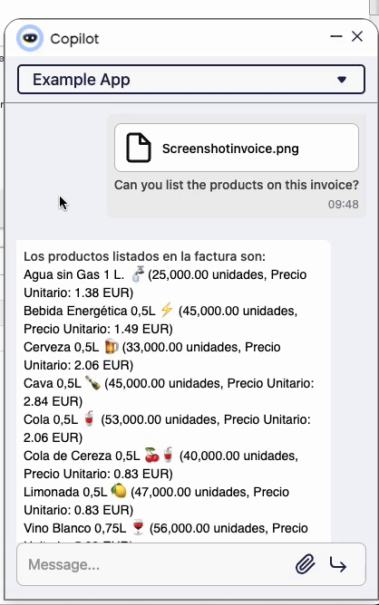

---
tags:
    - Copilot
    - IA
    - OCR
    - Image Recognition
---

# Optical Character Recognition (OCR) Tool

:octicons-package-16: Javapackage: `com.etendoerp.copilot.ocrtool`

## Overview

The **Optical Character Recognition (OCR) Tool** is a tool that recognizes text from images or pdfs. It can be used in Copilot Apps to extract information from images or pdfs that are uploaded to the chat.

!!!info
    To be able to include this functionality, the Copilot Extensions Bundle must be installed. To do that, follow the instructions from the marketplace: [Copilot Extensions Bundle](https://marketplace.etendo.cloud/?#/product-details?module=82C5DA1B57884611ABA8F025619D4C05){target="\_blank"}. For more information about the available versions, core compatibility and new features, visit [Copilot Extensions - Release notes](../../../whats-new/release-notes/etendo-copilot/bundles/release-notes.md).

## Functionality

This tool automates the process of **text extraction from image-based files or PDFs**. This can be particularly useful for tasks such as document digitization, data extraction, and content analysis. 

Using this tool consists of the following actions:

- Receiving Parameters:

    - The tool receives an input object that contains two keys:

        - **path**: The path of the image or PDF file to be processed.
        - **question**: A contextual question specifying the information to be extracted from the image. This is mandatory for precise results.

- Obtaining the File:

    - The tool retrieves the file specified in the **path** parameter. It verifies the existence of the file and ensures it is in a supported format (JPEG, JPG, PNG, WEBP, GIF, PDF).

- PDF Conversion:

    - If the input file is a PDF, it is converted to an image format (JPEG) using the **pypdfium2** library. Each page of the PDF is rendered as a separate image.

- Image Conversion:

    - Other image formats are processed directly or converted to JPEG if necessary.

- Image Processing:

    - The image is processed using a Vision model powered by GPT. This model interprets the text within the image and extracts the relevant information based on the provided **question**.

- Returning the Result:

    - The tool returns a JSON object containing the extracted information from the image or PDF.

## Usage Example

!!! info 
    It is important to clarify that this is a first version subject to improvements. Maybe the tool is not able to recognize all the images or pdfs that are presented to it.
    In general, the Tool returns the information in JSON format, but the information in the JSON may not reach the user directly, since Copilot can reinterpret the information summarizing it. It is recommended to either specify the result you expect well or ask it to show you the complete JSON.
    
### Requesting text recognition from an image/pdf

After the configuration, you can upload an image or pdf to the chat and the tool will recognize the text:
    
1. Open Copilot button and open a chat with the OpenAI Assistant.
2. Suppose you have an image at `/home/user/image.png` and you want to extract text related to an invoice number:

    - Use the tool as follows:

        - Input:
```
{"path": "/home/user/image.png", "question": "What is the invoice number in the image?"}

```

        - Output:
```
{"invoice_number": "INV123456"}

```

3. The tool will recognize the text and return it in the chat.


The following is an example image of an invoice:


Copilot will return the recognized(and interpreted) text in the chat.



### Result Chaining

!!!note
        Remember that the result of the tool can be used in other tools, for example, you can use the result of the OCR Tool in a tool that writes the information in a database or sends it to a web service. 