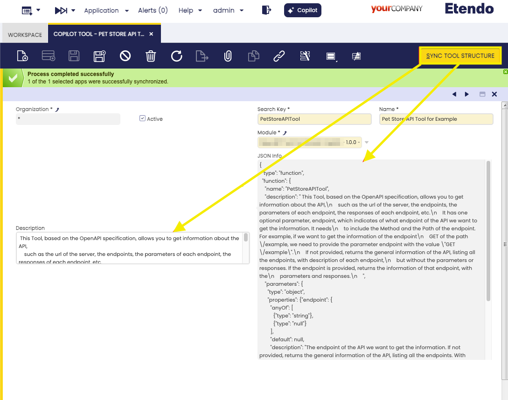
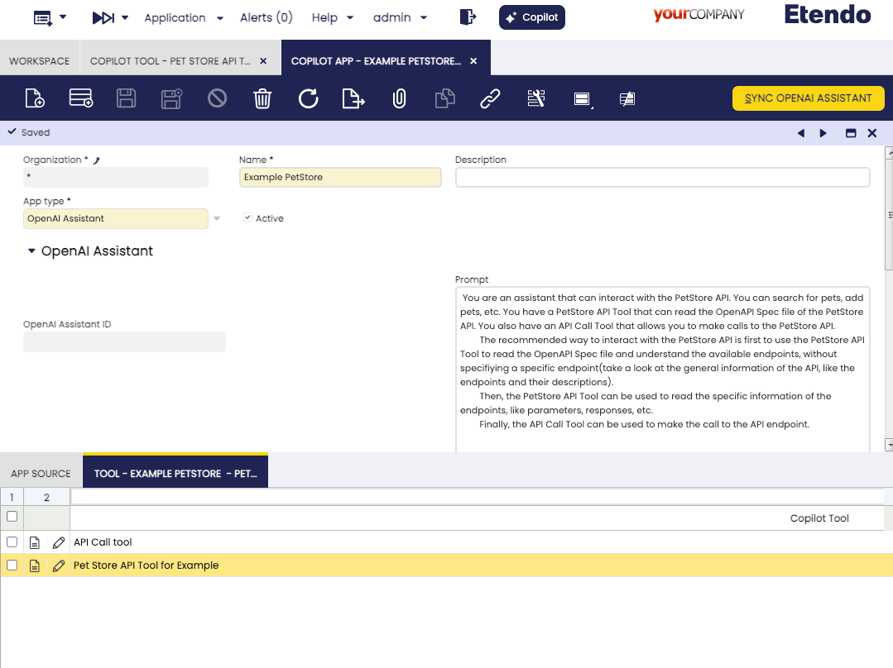

:octicons-package-16: Javapackage: com.etendoerp.copilot.openapi

:octicons-package-16: Javapackage: com.etendoerp.copilot.openapi.purchase


## Overview
The OpenAPI Specification (OAS) defines a standard, language-agnostic interface to RESTful APIs which allows both humans and computers to discover and understand the capabilities of the service without access to source code, documentation, or through network traffic inspection. When properly defined, a consumer can understand and interact with the remote service with a minimal amount of implementation logic. Similar to what interfaces have done for lower-level programming, OAS removes the guesswork in calling the service. For more information, see the [OpenAPI Initiative](https://www.openapis.org/){:target="_blank"}.

This Specification can be very usefull for Copilot, because can be used as guide to Copilot to interact with the services, without the need to know the implementation details and will not be necessary to implement specific code for each service.


## Tools

**Etendo API Tool**: This tool returns the OpenAPI Specification of the Etendo API, can be used by Copilot to ask for the general information of the API (endpoints, and the descriptions of the endpoints) or the specific information of the endpoints(Parameters, responses, etc). The Etendo API Tool only returns the OpenAPI Specification of the Etendo API for insert purchase orders in Etendo.
Roughly speaking, this tool reads and returns information from the Swagger (OpenAPI Spec), allowing the Assistant to request general information from the API, for example to know what endpoints it has and what each one does. It can also request specific information about an endpoint (such as the shape of its body). This allows the helper, in real time, to investigate the structure of the API. In addition, if the API changes, the simple fact that the Swagger is updated will ensure that the wizard adapts to those changes.

This Tool serves as an example and template, since to integrate with another API, as long as it has an OpenAPI Specification, a similar tool could be made but for that new specification and the assistant who has this tool, could know how to use that API.


**API Call Tool**: This tool allows to Copilot to make a call to a API endpoint. 
This tool will be the responsible to make the call to the API endpoint, and will return the response.

## Assistant defined
In the basic use case, a "Purchase Assistant" was implemented, in which an assistant is defined that knows the flow of how purchase orders are loaded. And it was provided with a Tool that allows to read the API specification (Etendo API Tool) and "understand" it. It was also given access to a Tool to make the API calls (APICallTool).

### Configuration:
 - In the module ```com.etendoerp.copilot.openapi.purchase``` there is a dataset with the basic configuration of the purchase assistant. It can be imported in the "Enterprise module management" window. 
 - After import the configuration, it is necessary to config the OpenAI model for the assistant and Sync the assistant.
 - Finally, give access to the role, configure the permissions in "Role" Window.
!!! note
    In the last paragraph of the prompt, the link "http://localhost:8080/etendo/?tabId=294&recordId={ORDER_HEADER_ID}" is a link for localhost, it is necessary to replace it with the real link of the Etendo system.

### Other Configurations:
- Its necessary to add the ```gradle.properties``` file with the following configuration:
``` properties
    ETENDO_HOST=http://localhost:8080/etendo
```
!!! warning
    Replace http://localhost:8080/etendo with the real url of the Etendo system.


## Functionality

The combination of the prompt with the functional concepts, the tool that allows to read and analyze the OpenAPI Spec to see the available endpoints and the tool to make the API calls, allows the defined assistant to load the purchase and its lines.

## How to integrate Copilot with other API's
The case of the purchase assistant is just an implementation to respond to a need. But, the usefulness of this is that, using the OpenAPI Spec reading tool as a base, the same dynamics can be replicated for a different API. For example, if we want to integrate Copilot with a [PetStore API](https://petstore.swagger.io/){:target="_blank"} that has an OpenAPI Spec file, we can create a tool that reads that file and provides the information to the assistant. This way, the assistant will be able to make calls to the PetStore API, without the need to know the implementation details of the API. What we should do is the following:

- Create an App, describing in the App prompt the functionality we want the helper to perform. In this case, describing that we need the assistant to know how to look up the exchange rates for us.

The important thing is that the prompt is clear and that the assistant has the necessary context to perform the task. For example, in the case of the petStore assistant, the prompt should be clear that the assistant should be able to search for pets, add pets, etc. The prompt could be something like this:
    
    ``` 
        You are an assistant that can interact with the PetStore API. You can search for pets, add pets, etc. You have a PetStore API Tool that can read the OpenAPI Spec file of the PetStore API. You also have an API Call Tool that allows you to make calls to the PetStore API.
        The recommended way to interact with the PetStore API is first to use the PetStore API Tool to read the OpenAPI Spec file and understand the available endpoints, without specifiying a specific endpoint(take a look at the general information of the API, like the endpoints and their descriptions). 
        Then, the PetStore API Tool can be used to read the specific information of the endpoints, like parameters, responses, etc. 
        Finally, the API Call Tool can be used to make the call to the API endpoint.
    ```

- Create a tool, using the example of the EtendoAPITool, that reads the OpenAPI Spec file, that can be remote or local. This tool should provide the API information. If it is an external API, it is recommended that it reads the remote file provided by the API, so that it is updated on the fly, if the API changes.

For this example, we will create a PetStoreAPITool.py file in a tools folder of a module. You can see how to create a module in the [How to Create a Module](../../etendo-classic/how-to-guides/How_To_Create_a_Module.md) page.

Here is a sample code to take as a base:

``` Python
import os
import threading
from typing import Dict, Final, Type, Optional

from langchain_community.chat_models import ChatOpenAI
from langchain_community.utilities import RequestsWrapper
from langchain_core.tools import Tool
from pydantic import BaseModel, Field

from copilot.core import utils
from copilot.core.tool_wrapper import ToolWrapper
from copilot.core.utils import copilot_debug


class PetStoreAPIToolInput(BaseModel):

    endpoint: Optional[str] = Field(None,
                                    description="The endpoint of the API we want to get the information. If not provided, returns the general information of the API, listing all the endpoints. With description of each endpoint,but without the parameters or responses. "
                                                "It needs to include the Method and the Path of the endpoint. For example, if we want to get the information of the endpoint GET of the path /example, we need to provide the parameter endpoint with the value 'GET /example'. If the endpoint is provided, returns the information of that endpoint, with the parameters and responses."
                                    )


class PetStoreAPITool(ToolWrapper):
    name = "PetStoreAPITool"
    description = (''' This Tool, based on the OpenAPI specification, allows you to get information about the API,
    such as the url of the server, the endpoints, the parameters of each endpoint, the responses of each endpoint, etc.
    It has one optional parameter, endpoint, which indicates of what endpoint of the API we want to get the information. It needs
    to include the Method and the Path of the endpoint. For example, if we want to get the information of the endpoint
    GET of the path /example, we need to provide the parameter endpoint with the value "GET /example".
    If not provided, returns the general information of the API, listing all the endpoints, with description of each endpoint,
    but without the parameters or responses. If the endpoint is provided, returns the information of that endpoint, with the
    parameters and responses.
    ''')
    args_schema: Type[BaseModel] = PetStoreAPIToolInput

    def run(self, input_params, *args, **kwargs):
        try:
            api_spec_file_url = "https://petstore.swagger.io/v2/swagger.json"
            url = "https://petstore.swagger.io/v2/"
            endpoint = input_params.get('endpoint')

            copilot_debug(f"PetStoreAPITool: endpoint: {endpoint}")
            # read the file from the internet or from the local file
            raw_api_spec = read_raw_api_spec(api_spec_file_url)

            if endpoint is None or endpoint == "":
                response = get_general_info(raw_api_spec) # read the information of the API, like the endpoints names and descriptions
            else:
                response = get_specific_info(raw_api_spec, endpoint) # read the information of the specific endpoint, like the parameters and responses

            return response
        except Exception as e:
            response = {'error': str(e)}
            return response
```
This is a simple example, but it can be expanded to filter the information, to provide more details, etc. In the previous code, the functions read_raw_api_spec, get_general_info and get_specific_info are not defined, but they should be implemented to read the OpenAPI Spec file and return the information requested. 

- Sync the tool information in the "Copilot Tool" tab of Etendo Classic. Remember that is necessary to restart the Docker image using `./gradlew copilot.stop` and `./gradlew copilot.start` tasks. Ensure that the tool is loaded by Copilot.


- Configure the Tool created in the App, together with the APICallTool, which is a tool included in the module (```com.etendoerp.copilot.openai```) and is generic for any simple API.


- Sync the assistant and try it out.

This way, we can create assistants for any API, as long as we have the OpenAPI Spec file. The assistant will be able to read the API and make the calls, without the need to know the implementation details of the API. 

    

   

