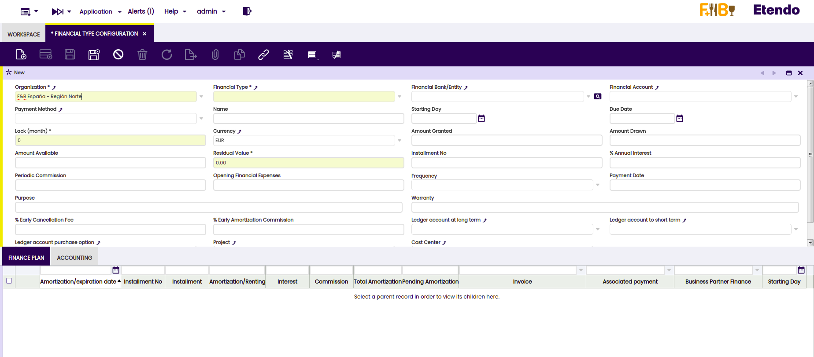
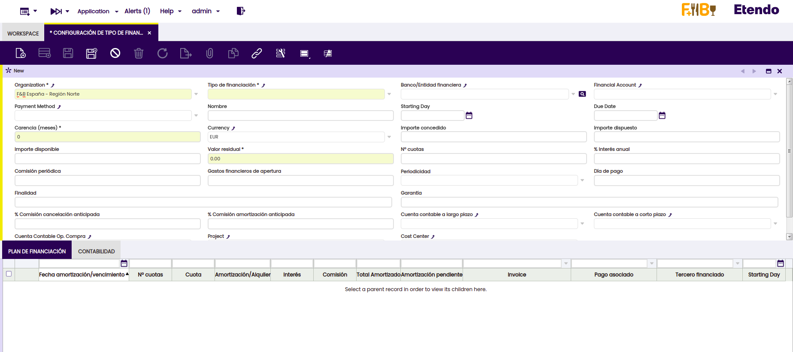

---
tags:
    - Copilot
    - IA
    - Translation tool
    - XML
---

#  XML Translation Tool

:octicons-package-16: Javapackage: `com.etendoerp.copilot.xmltranslationtool`

## Overview

This tool translates the content of an XML file from one language to another, as specified within the XML.  

<iframe width="560" height="315" src="https://www.youtube.com/embed/vu-eQDqZpKY?si=E5JPpLafZG04-tJP" title="YouTube video player" frameborder="0" allow="accelerometer; autoplay; clipboard-write; encrypted-media; gyroscope; picture-in-picture; web-share" allowfullscreen></iframe>

!!!info
    To be able to include this functionality, the Copilot Extensions Bundle must be installed. To do that, follow the instructions from the marketplace: [Copilot Extensions Bundle](https://marketplace.etendo.cloud/?#/product-details?module=82C5DA1B57884611ABA8F025619D4C05){target="\_blank"}. For more information about the available versions, core compatibility and new features, visit [Copilot Extensions - Release notes](../../../whats-new/release-notes/etendo-copilot/bundles/release-notes.md).

## Functionality

1. Add Copilot Translation Tool dependency in the Etendo Classic project, In `build.gradle`, add:
    ```groovy
    implementation('com.etendoerp:copilot.xmltranslationtool:1.1.1')

2. Restart Docker image using `./gradlew copilot.stop` and `./gradlew copilot.start` tasks

3. The tool will translate the XML files to the language indicated when the XML file to be translated is generated, for example if the first line of the file is:

    ```xml
    <compiereTrl baseLanguage="en_US" language="es_ES" table="AD_ELEMENT" version="">
    ```

    The tool will know that the language to be translated will be Spanish.

4. It goes through each of these XML files and translates what is in the source language to the target language, overwriting them for later use.

## How to use the XML translation tool shown in an example

First of all, we start from the module `com.etendoerp.bankingpool` originally in English and we can see the Financial Type Configuration window:



1. Generate the `com.etendoerp.bankingpool` translation module, you can see how to do it in [How to Create and Update Translation Modules](../../../developer-guide/etendo-classic/how-to-guides/how-to-create-and-update-translation-modules.md){target="_blank"}. <br> Initially all its fields will be in the source language and then it will be translated by the translation tool.
  
    After having created the translation module in the modules folder, we will find `com.etendoerp.bankingpool.es_es`

2.  To execute translation tool, in a new terminal, run:
    ``` bash title="Terminal"
    ./gradlew copilot.translate -Parg=com.etendoerp.bankingpool.es_es
    ```

3. In the folder ```modules/com.etendoerp.bankingpool.es_es``` you will find the automatic translations.

4. To apply the translation, compile the enviroment
    ``` bash title="Terminal"
    ./gradlew update.database smartbuild --info
    ```

5. Now we can see the *Financial Type Configuration* windows with their respective fields translated into Spanish.
    