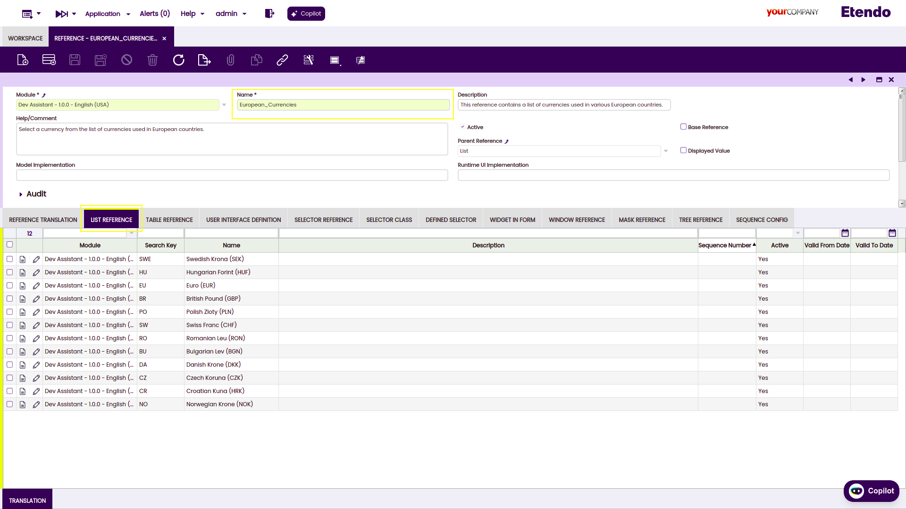

---
tags:
    - Copilot
    - References
    - IA
    - Webhook
    - Automation
    - Add Lists
---

# Create References

## Overview

The Create References Tool is a tool that **creates a reference** in the Etendo Application Dictionary. With this tool, it is for example, possible to add new list references to a specific module within the Etendo database via an HTTP request to a webhook.

This tool is useful in the context of module administration and configuration on the Etendo platform. It allows system administrators or developers to define new references that can be used later in applications. It is especially useful to **automate the creation of these references and ensure consistency** in the configuration.


## Installation
You can install only the module containing the **Create References** by following the guide on [How to install modules in Etendo](../../etendo-classic/getting-started/installation/install-modules-in-etendo.md), looking for the GitHub Package `com.etendoerp.copilot.devassistant`.


## Components

The Create References Assistant is composed of the following component: 

- [Create Reference Tool](../available-tools/create-reference-tool.md): This tool allows to create references on Etendo and on the database using queries generated with the parameters given in the tool. 


## Functionality

The **Creates References Assistant** is designed to facilitate the creation of references, for example, it is possible to create list of references in the Etendo Application Dictionary by providing the assistant the necesary input parameters. 

Let's see an example about how the user can interact with the assistant and create the needed references in Etendo. 


## Usage Example 

### 1. Setup

To use this assistant, it is necessary to log in as `System Administrator` role and set the module in which the changes will be exported in development.

### 2. Open Copilot and select Create Reference Assistant


### 3. Ask the assistant which reference type you need to create


**User:** *"Create a list with the current currencies used in all European countries and suggest a name for the reference. The prefix to export this information in the module is copdev."*.

**Copilot:** *"Great! Let's start creating the reference list with the currencies used in European countries. Prefix: copdev Reference Name Suggestion: European Currencies. Reference Items:  Euro (EUR) British Pound (GBP) Swiss Franc (CHF) Norwegian Krone (NOK) Swedish Krona (SEK) Danish Krone (DKK) Polish Zloty (PLN) Hungarian Forint (HUF) Czech Koruna (CZK) Bulgarian Lev (BGN) Romanian Leu (RON) Croatian Kuna (HRK) (Note: Replaced by Euro in 2023 but might be useful historically) Serbian Dinar (RSD) Turkish Lira (TRY) Russian Ruble (RUB) Do you want to provide the list of currencies yourself, or should we go with this list?    Additionally, would you like me to infer the description and help text, or do you want to provide them? Here's what I suggest: Description:List of currencies currently used in various European countries. Help: Select the appropriate currency from the list that represents the currencies used in Europe.Is this okay with you?"*

### 4. Receiving the results

The Create References Tool will process these parameters, verify the access token, build the request body and call the Etendo webhook to create the reference.

In the Reference window, Etendo shows all the fields with the corresponding information generated and in the List Reference tab, it is possible to see the new list reference created. 




### 5. Export the changes

Once the development is validated by the developer, and the necessary manual modifications are made, it is possible to export the changes in the corresponding module.

```title="Terminal"
./gradlew export.database --info
```


