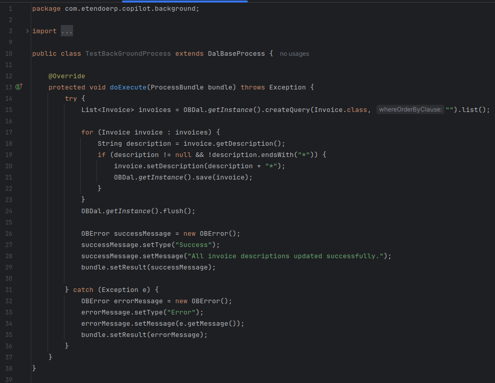
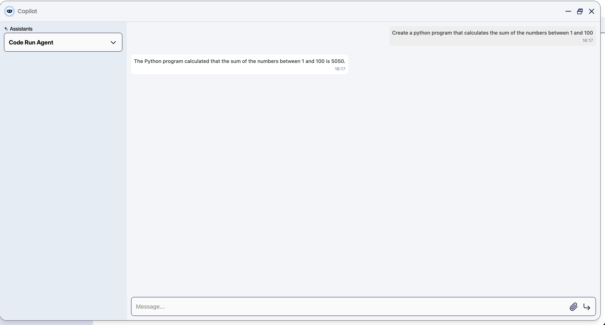
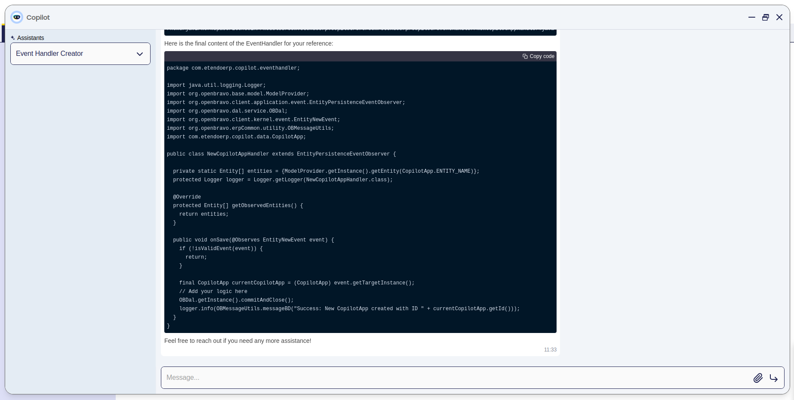
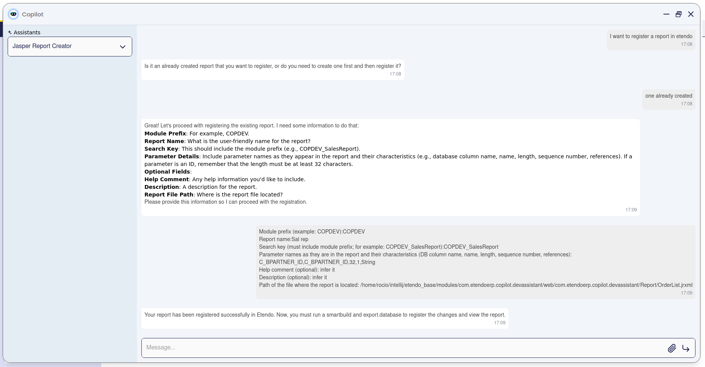
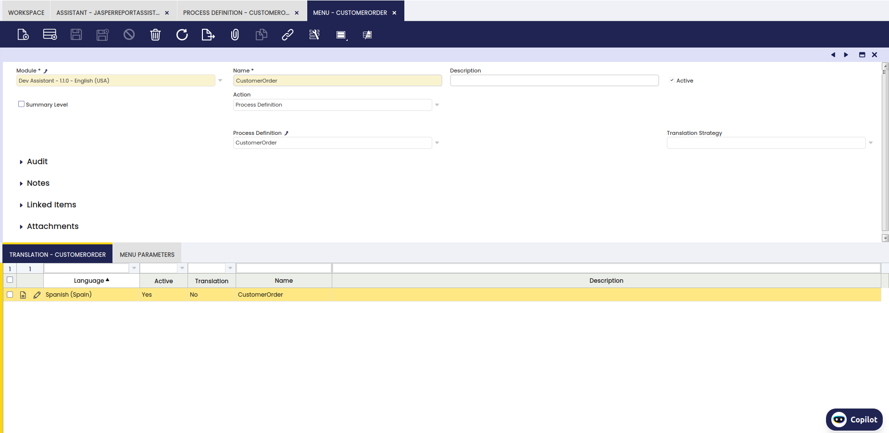
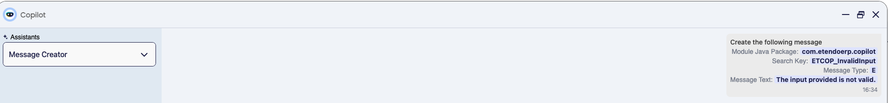
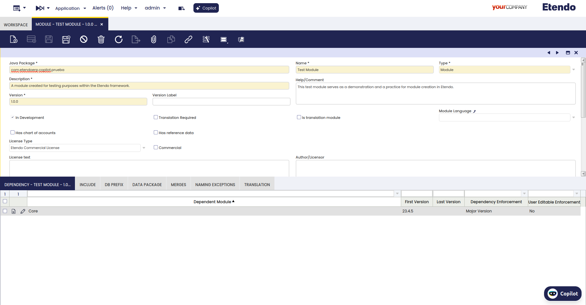
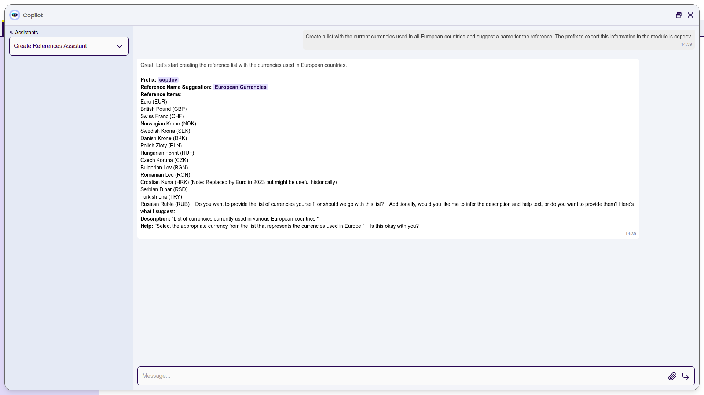
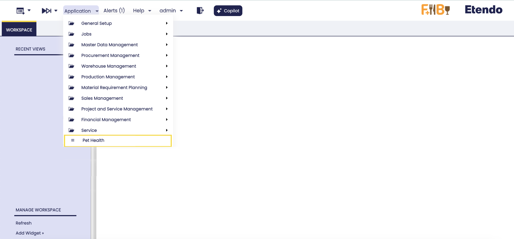

---
tags:
    - Beta
    - Copilot
    - IA
    - Tools
    - Creator
    - Assistants
---

# Dev Assistant

:octicons-package-16: Javapackage:  `com.etendoerp.copilot.devassistant`

## Overview

<iframe width="560" height="315" src="https://www.youtube.com/embed/58U9LThdTGo?si=kSxA3MAf22U8fdHh" title="YouTube video player" frameborder="0" allow="accelerometer; autoplay; clipboard-write; encrypted-media; gyroscope; picture-in-picture; web-share" referrerpolicy="strict-origin-when-cross-origin" allowfullscreen></iframe>

This page provides an overview of the tools, functionality, and usage examples for various development assistants available in Etendo. Dev Assistant streamlines workflow management for developers by offering **specialized assistants** that simplify tasks such as creating buttons, windows, tabs and tables, Event Handlers, Jasper Reports, background processes, and more. These assistants are designed to enhance productivity and reduce complexity, making it easier for developers to efficiently build and manage different components within the Etendo platform.

!!!info
    To be able to include this functionality, the Copilot Extensions Bundle must be installed. To do that, follow the instructions from the marketplace: [Copilot Extensions Bundle](https://marketplace.etendo.cloud/#/product-details?module=82C5DA1B57884611ABA8F025619D4C05){target="_blank"}. For more information about the available versions, core compatibility and new features, visit [Copilot Extensions - Release notes](../../../whats-new/release-notes/etendo-copilot/bundles/release-notes.md).

!!!warning
    Consider that the assistants are currently in their beta testing phase. 

Access to the information for each of the Assistants:

[:material-file-document-outline: Background process creator](../bundles/dev-assistant.md#background-process-creator){ .md-button .md-button--primary } <br>

[:material-file-document-outline: Button process creator](../bundles/dev-assistant.md#button-process-creator){ .md-button .md-button--primary } <br>

[:material-file-document-outline: Code Run](../bundles/dev-assistant.md#code-run){ .md-button .md-button--primary } <br>

[:material-file-document-outline: Etendo Code Expert](../bundles/dev-assistant.md#etendo-code-expert){ .md-button .md-button--primary } <br>

[:material-file-document-outline: Event Handler creator](../bundles/dev-assistant.md#event-handler-creator){ .md-button .md-button--primary } <br>

[:material-file-document-outline: Jasper report creator](../bundles/dev-assistant.md#jasper-report-creator){ .md-button .md-button--primary } <br>

[:material-file-document-outline: Message Creator](../bundles/dev-assistant.md#message-creator){ .md-button .md-button--primary } <br>

[:material-file-document-outline: Module creator](../bundles/dev-assistant.md#module-creator){ .md-button .md-button--primary } <br>

[:material-file-document-outline: Module Translation Creator](../bundles/dev-assistant.md#module-translation-creator){ .md-button .md-button--primary } <br>

[:material-file-document-outline: Reference creator](../bundles/dev-assistant.md#reference-creator){ .md-button .md-button--primary } <br>

[:material-file-document-outline: Tables, windows and tabs](../bundles/dev-assistant.md#tables-windows-and-tabs-creator){ .md-button .md-button--primary } <br>

[:material-file-document-outline: Webhook creator](../bundles/dev-assistant.md#webhook-creator){ .md-button .md-button--primary } <br>

### Background Process Creator

**Background Process Creator** is an assistant specialized in the automatic creation of Background Processes in Java. The assistant reads previously indexed code and uses examples of classes extending `DalBaseProcess` to build new Background Processes.

#### Tools

- [API Call Tool](../available-tools/openapi-tool.md)

- [Read File Tool](../available-tools/read-file-tool.md)
  
- [Write File Tool](../available-tools/write-file-tool.md)

#### Functionality

Background Process Creator generates Background Processes in Java using indexed examples of classes that extend `DalBaseProcess`. To configure the assistant properly, you need to provide the following parameters:

- **Java package**: The Java package where the new process will be saved. It should follow the format `java.package.of.the.module`.
- **Name**: The name of the Java file to be created.
- **Search Key**: A key that will be used to locate the process in other windows when necessary.
- **Code description**: The purpose and logic that the Background Process should fulfill.

#### Usage Example

1. To use this assistant, it is necessary to log in as `System Administrator` role and set the role access. For this, go to the **Assistant** window, configure Background Process Creator and synchronize it. Then, go to the **Assistant Access** window and give access to the role.

    


2. Open Copilot and select Background Process Creator, then ask to the assistant what you need to create.

3. Then, this is the result given by the assistant.

    

    


### Button Process Creator

The **Button Process Creator** simplifies the process of creating and registering buttons and process definitions in Etendo Classic. By automating the workflow through webhooks, it removes the need for manual configuration, ensuring that your processes and buttons are set up correctly and efficiently.

#### Tools

- [ApiCallTool](../available-tools/openapi-tool.md) 
    
- [ReadFileTool](../available-tools/read-file-tool.md)

- [WriteFileTool](../available-tools/write-file-tool.md)

#### Functionality

The **Button Process Creation Assistant** automates the creation of a button and the registration of a process in Etendo Classic through a webhook call. Through a webhook call, the tool ensures the correct setup by validating necessary parameters like the module prefix, Java package, and process name, making sure the search key is correctly formed. It then generates a Java class for the button, which extends `BaseProcessActionHandler`, and registers this button in the desired window, tab, and table within the Etendo system. 

Additionally, it defines and registers the process by creating a process definition and associating it with any required parameters, including attributes like database name, length, and reference, ensuring integration and functionality within the system. 

When creating a button or registering a process, the assistant will request the following information:

- **Java Package**: The Java package of the module where the button's class will be created (e.g., `com.etendoerp.module`).
- **Module Prefix**: A prefix for the module (e.g., `COPDEV`).
- **Window**: The window in Etendo where the button will appear.
- **Tab**: The specific tab within the window where the button will be located.
- **Table**: The table associated with the process.
- **Process Name**: The name of the process to be created.
- **Search Key**: A unique search key for the process that includes the module prefix (e.g., `COPDEV_ActualizarDescripciónPedido`).
- **Parameters**: Optional parameters for the process, including:
    - **BD_NAME**: The database column name.
    - **NAME**: The name of the parameter.
    - **LENGTH**: The length of the parameter field.
    - **SEQNO**: The sequence number of the parameter.
    - **REFERENCE**: A reference for the parameter (if it's linked to another field or table).
- **Help Comment**: An optional help comment for the process.
- **Description**: An optional description for the process.

The webhook call used to register the process in Etendo will require the following body parameters:

```json
body_params = {
    "Prefix": "COPDEV",
    "SearchKey": "COPDEV_ActualizarDescripciónPedido",
    "ProcessName": "ActualizarDescripciónPedidos",
    "HelpComment": "This process updates the description of associated orders.",
    "Description": "A process to update the description of the associated sales orders based on a text input.",
    "Parameters": [
        {
            "BD_NAME": "text_parameter",
            "NAME": "Description Text",
            "LENGTH": 255,
            "SEQNO": 10,
            "REFERENCE": "Text"
        }
    ],
    "JavaPackage": "com.etendoerp.copilot.devassistant"
}
```

This call registers the process in the system and attaches the necessary parameters.

#### Usage Example 

The process and the button will be automatically registered, and the user will be notified.


At this point, we will have the Java class of the button created along with the registered process.


### Code Run

**Code Run** is an assistant designed for executing Python commands in a controlled environment. It translates the request into Python or Bash commands to fulfill the task. 

#### Tools

- [Docker Tool](../available-tools/docker-tool.md)

#### Functionality

Code Run enables users to execute Python scripts and commands dynamically, even if dependencies or configurations are missing. Key features include:

1. Dynamic Code Execution:

    - Allows running Python code snippets.

    - Example: `print('Hello, World!')`.


2. Natural Language Requests:

    - Users can provide tasks in plain language (e.g., "Ping Google"), and the assistant translates them into executable Python or Bash commands.


3. Automatic Dependency Management:

    - Identifies and installs missing libraries when a task requires them.

    - Example: `!pip install numpy`.


4. Error Handling:

    - Provides meaningful error messages for invalid commands or missing inputs.


5. Flexible Task Management:

    - Supports file operations and multi-step workflows combining Python and Bash.


#### Usage Example

1. Log in to the system as the **System Administrator** role and configure the assistant in the **Assistant** window. Synchronize it and grant access to the role in the **Assistant Access** window.

2. Open Copilot and select **Code Run**. Then, ask the assistant what you need to execute.

3. Example interaction and result:

    

    **Input:**

    - "Create a Python program that calculates the sum of the numbers between 1 and 100."

    **Execution:**

    - The assistant processes the request and executes the following Python code:

      ```python
      def calculate_sum(start, end):
          return sum(range(start, end + 1))

      # Calculate the sum of numbers between 1 and 100
      result = calculate_sum(1, 100)
      print(f'The sum of numbers between 1 and 100 is: {result}')
      ```

    **Result:**

    - The assistant outputs the result of the program:

      ```
      The sum of numbers between 1 and 100 is: 5050
      ```
      

### Etendo Code Expert 

**Etendo Code Expert** is an assistant designed to read indexed files and provide answers related to their content. 

#### Functionality

With this assistant it is possible to ask **code development questions** and based on Etendo code indexed, the assistant will give possible code suggestions or solutions. It can summarize, answer technical questions, suggest programming code improvements, and offer general assistance about files.

This assistant is useful for avoiding the need to manually review all files. Also, multiple files can be configured if neccesary.


#### Usage Example 

1. To use this assistant, it is necessary to log in as `System Administrator` role and set the role access. This assistant do not include the path configured to the indexed files. To do that, go to the **Knowledge Base File** window in `Application`>`Service`>`Copilot`>`Knowledge Base File` and select the `EtendoJAvaSourceCode` file and, in the **File Path Tab**, specify the path where the code files you need the assistant to read are located. 
		
	<figure markdown="span">
		
		<figcaption>In this example using the path shown in the image, we will obtain all the files with Java extension from the Etendo core source code</figcaption>
	</figure>


2.  Then, go to the **Assistant** window, configure Etendo Code Expert and synchronize it. After that, go to the **Assistant Access** window and give access to the role.  

3. Start using the assistant. Open Copilot and select Etendo Code Expert.

    

4. Ask the assistant for what you need to create.

    


### Event Handler Creator

This assistant is capable of creating **Event Handlers** in Etendo Classic. You only need to provide the Java package of the module where it should be exported and specify the action to be performed. 

#### Tools

- [Read File Tool](../available-tools/read-file-tool.md)
  
- [Write File Tool](../available-tools/write-file-tool.md)

#### Functionality

**Event Handler Creator** is an assistant designed to automatically create event handlers in Java. It uses code indexed in its knowledge base to read classes that extend `EntityPersistenceEventObserver`, providing examples to build a new event handler. To generate an event handler, the assistant requires the following parameters:
  
- **Java package**: The package where the file will be saved.
- **File name**: The name of the file to create.
- **Entity**: The entity to observe.
- **Description**: A description of the functionality to be implemented by the event handler.

#### Usage Example

1. To use this assistant, it is necessary to log in as `System Administrator` role and set the role access. For this, go to the **Assistant** window, configure Event Handler Creator and synchronize it. Then, go to the **Assistant Access** window and give access to the role.  

2. Open Copilot and select Event Handler Creator, then ask to the assistant what you need to create.

    

3. Then, this is the result given by the assistant.

    


### Jasper Report Creator

The **Jasper Assistant** is designed to facilitate the creation, editing, and registration of reports within the Etendo platform. Using JasperReports, it allows developers to define the structure of the report, apply styles, manage parameters, and register the reports in the system to use in different modules.

!!!info
    This assistant simplifies the process by verifying that all fields used in a report are correctly defined in the database, thus avoiding common errors such as **Field not found**. It also supports integrating logos, applying styles, and performing data grouping to ensure that the reports meet business requirements.

#### Tools

- [DBQueryGeneratorTool](../available-tools/database-query-tool.md)

- **JasperTool**

- [OCRTool](../available-tools/ocr-tool.md)

- [ReadFileTool](../available-tools/read-file-tool.md)

- [WriteFileTool](../available-tools/write-file-tool.md)

#### Functionality

**Report Creation**

The Jasper Assistant requests the following parameters to create a report:

- **Report storage path**: The location in the file system where the report file will be saved.
- **Report name**: The name that will be assigned to the report.
- **Report encoding language**: The language in which the report will be encoded (default is UTF-8).
- **Report parameters**: A list of parameters that the report will accept.
- **SQL query**: The SQL query that will provide data to the report.
- **Report styles**: Definition of the visual styles applied to the report.
- **Data grouping**: Configuration of data grouping within the report.
- **Image or logo in the report**: Specification of images or logos to include.
- **Data distribution**: Structure of how the data will be organized in the report.

**Report Registration**

Once the report is created, it can be registered in the system. The assistant requests the following arguments:

- **Report name**: Name that will be used to register the report in the system.
- **Module prefix**: Prefix that identifies the module where the report will be registered.
- **Search key**: Unique key to identify the report in the system.
- **Help comments**: Additional information to help understand the purpose of the report.
- **Description**: Detailed description of the report.
- **Report path**: Path where the report is stored.
- **Parameters**: List of registered parameters that can be used when executing the report.

**Report Editing**

The assistant also allows editing existing reports. Available actions include:

- **Parameter Modification**: Allows editing any already registered report parameter.
- **SQL Query Update**: Modification of the SQL query used by the report.
- **Change of Styles and Groupings**: Update of visual styles and data grouping configuration.

#### Usage Example

1. To use this assistant, it is necessary to log in as `System Administrator` role and set the role access. For this, go to the **Assistant** window, configure Jasper Report Creator and synchronize it. Then, go to the **Assistant Access** window and give access to the role.  

2. Open Copilot and select Jasper Report Creator

3. Depending on the request, the Jasper Assistant will return:

**Report Creation**


**Report Registration**



After running the smartbuild we will be able to see the process of the created report:


As you can see in the image, it also adds the parameters and even in the **Report Definition** tab, it defines the PDF Template of the report and in the **Menu**, it creates the Process definition that we have defined in the previous step.





Finally, we can observe the created report and set the chosen parameter to see the printed version.


**Report Editing**


### Message Creator

The **Message Creator** streamlines the process of creating and registering AD_Messages in Etendo Classic. By utilizing a webhook, it ensures efficient and error-free message creation while adhering to naming conventions and best practices. 

#### Tools

- [ApiCallTool](../available-tools/openapi-tool.md)

#### Functionality

The **Message Creator** facilitates the creation of AD_Messages by interacting with Etendo Classic via a webhook. It validates the input parameters, enforces the proper format for search keys, and registers the message with the appropriate module. This assistant supports both parametric and non-parametric messages and ensures messages are immediately usable in Java code. 

The assistant performs the following tasks:

- **Validates Input Parameters**: Ensures required fields like module Java package, search key, message type, and message text are correctly provided.
- **Search Key Format Enforcement**: Confirms that search keys follow the required format: `PREFIX_DescriptiveName`, where:
  - `PREFIX` is the module's prefix in uppercase.
  - `DescriptiveName` is in CamelCase.
  - The total length does not exceed 32 characters.
- **Message Type Validation**: Confirms the message type is either `"I"` (Informative) or `"E"` (Error).
- **Registers the AD_Message**: Saves the message in the system, linking it to the specified module.

When creating a message, the assistant will request the following information:

- **Module Java Package**: The Java package of the module where the message will be created (e.g., `com.etendoerp.module`).
- **Search Key**: A unique identifier for the message following the `PREFIX_DescriptiveName` format.
- **Message Type**: The type of the message:
  - `"I"` for informative messages.
  - `"E"` for error messages.
- **Message Text**: The content of the message.

Notes:

- **Module In Development**: The module must be set to development mode to allow the assistant to create it.

- **Java Usability**: After creation, the AD_Message can be used in Java with:  
  `OBMessageUtils.messageBD("MESSAGE_SEARCH_KEY")`.

- **Parametric Messages**: If the message requires parameters, `%s` can be added to the text, and the assistant will provide a code snippet to use `String.format`.  
  Example:  
  **Message Text**: `"The value %s is invalid."`  
  **Java Usage**:  
  ```java
  String formattedMessage = String.format(OBMessageUtils.messageBD("PREFIX_InvalidValue"), value);
  ```

#### Usage Example

1. Provide the required inputs:
    - Module Java Package: `com.etendoerp.module`
    - Search Key: `MODPREFIX_InvalidInput`
    - Message Type: `E`
    - Message Text: `"The input provided is not valid."`

    

2. The assistant validates and sends the request to the webhook.

3. Upon successful creation, the system will confirm:
    - Message created with the key: `MODPREFIX_InvalidInput`.

    

4. The message is ready for use in Java:
    ```java
    OBMessageUtils.messageBD("MODPREFIX_InvalidInput");
    ```


### Module Creator

Etendo Classic allows you to create modules that provide additional functionality that can be deployed independently. These modules can range from additional reports to content packs (translations, chart of accounts, etc.).

#### Tools

- [ApiCallTool](../available-tools/openapi-tool.md)

#### Functionality

The Module Creator streamlines the process of building independent modules that enhance Etendo Classic with new functionalities, such as additional reports or content packs like translations or charts of accounts. By using the `CreateModuleWebHook`, the tool automates several critical steps. It begins by validating essential details like the module's Java package, name, description, version, and database prefix, ensuring everything is properly formatted and complete. After validation, it assigns the necessary database prefix, registers the module within the system, and allows for optional inclusion of dependencies. 

To start creating your module in Etendo, follow the steps below.

- Provide the following information:

- **Javapackage**: The Java package of the module (e.g., `com.etendoerp.copilot.prueba`).
- **Module Name**: A name for your module (e.g., `Test Module`).
- **Description**: A brief description of the module's functionality.
- **Help/Comment**: Additional help text or comments regarding the module (optional).
- **Version**: The version of the module (e.g., `1.0.0`).
- **Type**: The type of the module. Option are "M" for standard module, "T" for template module.
- **DBprefix**: A prefix for the database objects associated with the module (must be in uppercase, e.g., `FJTS`).
- **License**: The license type for the module. Options are:
    - `Apache License 2.0`
    - `Openbravo Public License`
    - `Mozilla Public License 1.1`
    - `Etendo Commercial License`

- Call the `CreateModuleWebHook`. The `CreateModuleWebHook` simplifies the creation process by automating various steps. This webhook will:

- Validate all the parameters (such as module name, version, and license).
- Assign the database prefix.
- Register the module.
- Optionally, add module dependencies.

- When invoking the webhook, the **body parameters** should follow this structure:

```json
body_params = {
  "Javapackage": "com.etendoerp.copilot.test",
  "SearchKey": "testmodule",
  "ModuleName": "Test Module",
  "HelpComment": "This is a test module created for demonstration purposes.",
  "Description": "This module adds test functionality to Etendo Classic.",
  "Version": "1.0.0",
  "Prefix": "FJTS",
  "Type": "M",
  "ModuleLicense": "Etendo Commercial License"
}
```

!!!note
    The database prefix must always be in uppercase.

#### Usage Example

1. To use this assistant, it is necessary to log in as `System Administrator` role and set the role access. For this, go to the **Assistant** window, configure Module Creator and synchronize it. Then, go to the **Assistant Access** window and give access to the role.

2. Open Copilot and select Module Creator, then ask to the assistant what you need to create.


If we go to the **Module** window we can find the created record.



The module will also have the dependency, in this case **Core** with the prefix and data package mentioned by the user.


Once the webhook has been called, it will automatically:

- Register the module in Etendo.
- Assign the **Java package** and **database prefix**.
- Handle the specified **license**.
- Set up basic **module dependencies**.

You can confirm that the module has been created by navigating to the `Module` window in Etendo.

!!!note
    If your module depends on other modules (besides the Core module), you need to manually add these dependencies in the `Dependency` tab of the module window.


!!!info
    For further customization and development, refer to the official [Etendo Developer Guide](https://docs.etendo.software/latest/developer-guide/etendo-classic/how-to-guides/how-to-create-a-page-in-etendo-documentation/) for more detailed steps.


### Module Translation Creator

#### Tools

- [XML Translation Tool](../available-tools/xml-translation-tool.md)

#### Functionality

The Module Translation Creator automatically translates the content of a module.

Before using the assistant, the user will need to have a translation module already created with the XML files to translate.
!!!note
    For more info check [How to Create and Update Translation Modules](../../../developer-guide/etendo-classic/how-to-guides/how-to-create-and-update-translation-modules.md){target="_blank"}.

Then, provide the path to the translation module to the assistant (e.g., `/modules/com.etendoerp.mymodule.es_ES`) and it will automatically translate all the files to the desired language.

#### Usage Example
1. Create a new module in the `Module` window
    - Check the flag "Is translation module".
    - Select the module languague (e.g., `Spanish (Spain)`). 
    - It should depend on the module you want to translate.


2. If it's the first time the language is configured:
    - In the `Language` window, look for the language selected and mark the "System Language" checkbox.
    - Execute the button `Verify Languages``.


3. Then, go to the "Import/Export Language" window, select the language and execute the Export process (this may take some time to finish).


4. The previous step will generate XML files for all modules in the `attachments/lang/es_ES` folder. Locate the module you want to translate and copy the files to the translation module in the `modules/<JAVAPACKAGE.OF.THE.MODULE>/referencedata/translation/es_ES` folder.


5. Now, to use this assistant it is necessary to log in as `System Administrator` role and set the role access. For this, go to the **Assistant** window, configure Module Translation Creator and synchronize it. Then, go to the **Assistant Access** window and give access to the role.


6. Open Copilot and select Module Translation Creator, then ask to the assistant to translate the files in your module (e.g., `/modules/<JAVAPACKAGE.OF.YOUR.MODULE>`).


7. To apply the changes, execute these commands:

``` bash title="Terminal"
./gradlew install.translation -Dmodule=javapackage
./gradlew smartbuild -Dlocal=no
```


### Reference Creator

The **Reference Creator** creates references in the Etendo Application Dictionary. This tool allows for example the addition of new list references to a specific module within the Etendo database via an HTTP request to a webhook.

It is particularly useful in the development process, enabling system administrators or developers to define new references that can later be utilized in applications. This tool automates the creation of these references, ensuring **consistency and adherence** to quality standards in the configuration.

#### Tools

- [Create Reference Tool](../available-tools/create-reference-tool.md)

#### Functionality

The **Reference Creator** is designed to facilitate the creation of references, for example, it is possible to create list of references in the Etendo Application Dictionary by providing the assistant the necesary input parameters. 

#### Usage Example 

1. To use this assistant, it is necessary to log in as `System Administrator` role and set the module in which the changes will be exported in development.

2. Open Copilot and select Reference Creator

    

3. Ask the assistant which reference type you need to create

    

4. The Create References Tool will process these parameters, verify the access token, build the request body and call the Etendo webhook to create the reference.

    In the Reference window, Etendo shows all the fields with the corresponding information generated and in the List Reference tab, it is possible to see the new list reference created. 

    


5. Once the development is validated by the developer, and the necessary manual modifications are made, it is possible to export the changes in the corresponding module.

    ```title="Terminal"
    ./gradlew export.database --info
    ```


### Tables, Windows and Tabs Creator

!!!warning
    The Tables, windows and tabs assistant is currently in its beta testing phase. While it is designed to automate the process of creating windows and tables, there are instances where tasks may not be fully completed. Specifically, there may be issues with adding foreign keys, correctly naming elements, etc.

    For optimal results, it is recommended to proceed step-by-step and be as specific as possible in your instructions to the Assistant. This will help mitigate potential errors and ensure more accurate task completion.

The **Tables, Windows and Tabs Creator** is designed to help developers and speed up the process of creating windows, tabs, fields, system elements, menu entries, etc.  as well as tables and columns in the database.
It is possible to give an input with all the necessary information, or the assistant will go step by step, asking for more information. Also, depending on the context, the assistant can make suggestions that the developer must confirm.

#### Tools

- [**DDL Tool**](../../etendo-copilot/available-tools/ddl-tool.md): This tool allows to registering and creating tables on Etendo and on the database using queries generated with the parameters given on the tool. The query is adjusted for the user needs, for example, if the user wants to add a column with a default value, the tool can receive a value or not if the element should not has a default value.

- **Multiples Webhooks**: These webhooks are used to run the java files that create or modify the fields on the Etendo Classic and execute process or queries. These webhooks are: `RegisterTable`, `CreateTable`, `RegisterFields`, `RegisterWindowAndTab`, `RegisterColumns`, `ElementsHandler`, `SyncTerms`.


#### Functionality

!!! info
    With this assistant, it is possible to create: 

    - **Tables and Columns**: both tables and columns are created based on user specification and the supported types are `string`, `number`, `tableDir`, `date`, `text` and `boolean` (each field will have default lengths unless specified).  
    - **Windows**: only Mantein type windows are supported
    - **Tabs**: Can be created at multiple levels, although it is important to make it clear to the assistant to add the corresponding foreign keys.
    - **Fields**: Fields are created from columns, respecting the same name but without *"_"*.
    - **Elements**: The elements will be created automatically, sharing the name of the columns, but replacing the *"_"* with spaces. The help and description fields will also be added automatically.
    - **Menu**: A menu entry is automatically created, the developer must manually place it in the desired position.

 - Ask the **Tables, Windows and Tabs Creator** for a window to add in the system and the module database prefix where the table will be exported. The assistant will then register in the system the table and create it in database, including the mandatory columns. At this stage the assistant checks if the module is in development. If is not, the assistant prompts the user for a correct prefix from a module in development. Additionaly, the assistant checks if the table name is already in use; if it is, asks the user to provide a new name. In case the window belongs to the module under development, new columns, tabs and fields can be added.

- The assistant will ask to the user for information to add, like columns, data types, help and description, etc.

- The user must confirm the steps or set up a modification about the given information.


#### Usage Example 

1. To use this assistant, it is necessary to log in as `System Administrator` role and set the module in which the changes will be exported in development.

2. Open Copilot, and select Tables, Windows and Tabs Creator 
    

3. Ask the assistant for what you need to create.
    


4. With the task complete, it is necessary recompile with a smartbuild and restart Tomcat

    ```title="Terminal"
    ./gradlew smartbuild --info
    ```
    

5. Window in the System, the window can be viewed with the user role.
    
    

6. Once the development is validated by the developer, and the necessary manual modifications are made, it is possible to export the changes in the corresponding module.

```title="Terminal"
./gradlew export.database --info
```


### Webhook Creator

**Webhook Creator** is an assistant designed to facilitate the creation and registration of webhooks in Java. A webhook acts as a communicator between applications or services, allowing data to be automatically sent from one system to another in real-time when a specific event occurs.

#### Tools

- [API Call Tool](../available-tools/openapi-tool.md)

- [Read File Tool](../available-tools/read-file-tool.md)
  
- [Write File Tool](../available-tools/write-file-tool.md)

#### Functionality

This assistant simplifies webhook creation by automatically generating the necessary Java files and registering them in the Etendo ERP system, taking examples of indexing code readeing the classes extends of `BaseWebhookService`. It is necessary give some useful information:

- **Module Package**: The Java package where the new process will be saved. It should follow the format `java.package.of.the.module`.
- **Webhook Name**: The name of the Java file to be created.
- **Parameters**: The parameters will be added to the webhook for the use.

#### Usage Example

1.  To use thisassistant, it is necessary to log in as `System Administrator` role and set the role access. For this, go to the **Assistant** window, configure Webhook Creator and synchronize it. Then, go to the **Assistant Access** window and give access to the role.

2. Open Copilot and select Webhook Creator, then ask to the assistant what you need to create.

	

3. Then, this is the result given by the assistant.

    

    


### Refactor Assistant

An expert code refactoring assistant focused on improving clarity, maintainability, and originality while preserving functionality. The assistant analyzes code files, identifies areas for improvement, and suggests changes to variable names, documentation, and structures for better readability. It ensures imports, method names, and entity names remain unchanged to maintain functionality. Workflow includes code analysis, user confirmation, applying changes, and verifying updates. Clear explanations and a summary of changes are provided for user understanding.

### Unique Java Test Assistant
#### Description
This assistant is designed to generate tests for a sigle Java File or a Etendo Module. In the case of a given Module, the assistant will check for file without tests and generate for them. The assistant expected behaviour is to read the Java file and generate a test file with the same name and the suffix `Test` in the same package. The assistant will also generate the test methods for each method in the Java.
This assistant has a Knowledge Base with the Java classes of Etendo Classic.
#### Tools Used
- [Print Directory Tool](../available-tools/print-directory-tool.md)
- [Read File Tool](../available-tools/read-file-tool.md)
- [Write File Tool](../available-tools/write-file-tool.md)

### Java Test Generator
This assistant generates tests for a single Java file or an Etendo Module. It reads the Java file and creates a test file with the same name and the suffix `Test` in the same package. The assistant generates test methods for each method in the Java file. The assistant has a Knowledge Base with the Java classes of Etendo Classic.
This assistant will generate the tests and execute them, checking for errors and providing feedback to the user.
#### Tools Used
- [Read File Tool](../available-tools/read-file-tool.md)
- [Write File Tool](../available-tools/write-file-tool.md)
- [Test Run Tool](../available-tools/test-run-tool.md)

!!!info
    This assistant is intended and designed to be used as part of a Langgraph type supervisor, it can be used individually, but does not have full functionality.

### Java Test Checker
This assistant receiving a Etendo Module, will check for Java files, determining which ones have tests and which ones do not. The assistant will generate a report with the results and will suggest the user to generate tests for the files without them.
#### Tools Used
- [Print Directory Tool](../available-tools/print-directory-tool.md)

!!!info
    This assistant is intended and designed to be used as part of a Langgraph type supervisor, it can be used individually, but does not have full functionality.

### Java Test Executor

This assistant is designed to execute tests for a Java Package, can be used to executa:
- All tests
- Tests for a module
- Tests for a single Java file
This depends on the user input. The assistant will execute the tests and provide feedback to the user.
#### Tools Used
- [Test Run Tool](../available-tools/test-run-tool.md)

!!! note
    This assistant is intended and designed to be used as part of a Langgraph type supervisor, it can be used individually, but does not have full functionality.

### Java Test Supervisor
A supervisor that allows to generate tests for a whole Etendo Module through a workflow, checking the files without tests and generating them. The supervisor will also execute the tests and provide feedback to the user.
#### Team Members
- [Java Test Generator](#java-test-generator)
- [Java Test Checker](#java-test-checker)
- [Java Test Executor](#java-test-executor)


