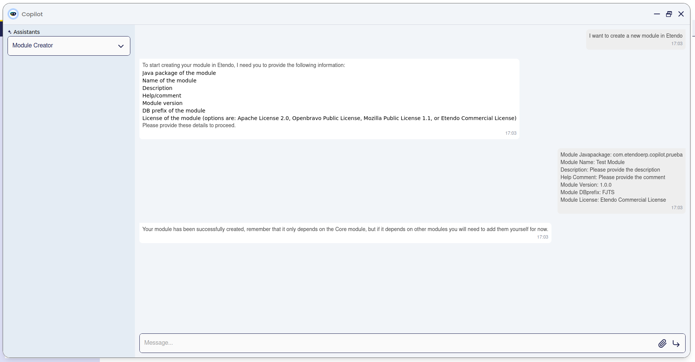
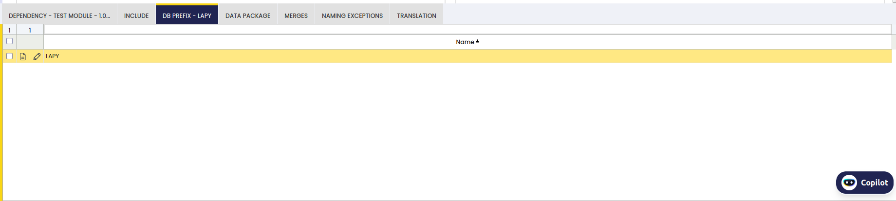

---
tags:
    - Beta
    - Copilot
    - IA
    - Windows, tabs and fields
    - Create Table
    - Add column
---

# Dev Assistant

:octicons-package-16: Javapackage: `com.etendoerp.copilot.devassistant`

## Overview

The **Dev Assistant** assistant is designed to help developers and speed up the process of creating windows, tabs, fields, system elements, menu entries, etc.  As well as tables and columns in the database.
It is possible to give an input with all the necessary information, or the assistant will go step by step, asking for more information. Also, depending on the context, the assistant can make suggestions that the developer must confirm.

!!!warning
    This Assistant is currently in its beta testing phase. While it is designed to automate the process of creating windows and tables, there are instances where tasks may not be fully completed. Specifically, there may be issues with adding foreign keys, correctly naming elements, etc.

    For optimal results, it is recommended to proceed step-by-step and be as specific as possible in your instructions to the Assistant. This will help mitigate potential errors and ensure more accurate task completion.

    Thank you for your understanding as we continue to improve the functionality and reliability of this assistant.

## Installation
You can install only the module containing the **Dev Assistant** by following the guide on [How to install modules in Etendo](../../etendo-classic/getting-started/installation/install-modules-in-etendo.md), looking for the GitHub Package `com.etendoerp.copilot.devassistant`.


## Components
The Dev Assistant is composed of the following components:

- [**DDL Tool**](../../etendo-copilot/available-tools/ddl-tool.md): This tool allows to regsitering and creating tables on Etendo and on the database using queries generated with the parameters given on the tool. The query is adjusted for the user needs, for example, if the user wants to add a column with a default value, the tool can receive a value or not if the element should not has a default value.

- Multiples Webhooks: These webhooks are used to run the java files that create or modify the fields on the Etendo Classic and execute process or queries. These webhooks are: `RegisterTable`, `CreateTable`, `RegisterFields`, `RegisterWindowAndTab`, `RegisterColumns`, `ElementsHandler`, `SyncTerms`.


## Functionality

!!! info
    With this assistant, it is possible to create: 

    - **Tables and Columns**: both tables and columns are created based on user specification and the supported types are `string`, `number`, `tableDir`, `date`, `text` and `boolean` (each field will have default lengths unless specified).  
    - **Windows**: only Mantein type windows are supported
    - **Tabs**: Can be created at multiple levels, although it is important to make it clear to the assistant to add the corresponding foreign keys.
    - **Fields**: Fields are created from columns, respecting the same name but without *"_"*.
    - **Elements**: The elements will be created automatically, sharing the name of the columns, but replacing the *"_"* with spaces. The help and description fields will also be added automatically.
    - **Menu**: A menu entry is automatically created, the developer must manually place it in the desired position.

 - Ask the **Dev Assistant** for a window to add in the system and the module database prefix where the table will be exported. The assistant will then register in the system the table and create it in database, including the mandatory columns. At this stage the assistant checks if the module is in development. If is not, the assistant prompts the user for a correct prefix from a module in development. Additionaly, the assistant checks if the table name is already in use; if it is, asks the user to provide a new name. In case the window belongs to the module under development, new columns, tabs and fields can be added.

- The assistant will ask to the user for information to add, like columns, data types, help and description, etc.

- The user must confirm the steps or set up a modification about the given information.


## Usage Example 

### 1. Setup
To use this assistant, it is necessary to log in as `System Administrator` role and set the module in which the changes will be exported in development.

### 2. Open Copilot, and select Dev assistant


### 3. Ask the assistant for what you need to create.


**User**: *"You can create the Pets Health window, you have to include the fields, pet name, patient start date and description. You can also add a Visits Registration tab, associated to the Pets Health window, where you have to add the fields, date and description. Remember to add the corresponding foreign key.  All this export it in the module with copdev prefix."*

**Copilot**: *"The following steps have already been completed: 
Tables: PetsHealth and VisitsRegistration have been registered in the system and created in the database. 
Columns: The necessary columns have been added and registered. 
Terminology: Terminology has been synchronized. 
Window and Tabs: Pets Health window and the associated Pets Health Header and Visits Registration tabs have been registered. 
Foreign Key: Foreign key between PetsHealth and VisitsRegistration has been added.    Please proceed with the compilation and restart Etendo to ensure all changes take effect.    If there's anything else you'd like to address or if you need further modifications, please let me know!"*


### 4. Compile
    
With the task complete, it is necessary recompile with a smartbuild and restart Tomcat

```title="Terminal"
./gradlew smartbuild --info
```


### 5. Reviewing the results
    
Window in the System,the window can be viewed with the user role.


### 6. Export the changes
    
Once the development is validated by the developer, and the necessary manual modifications are made, it is possible to export the changes in the corresponding module.

```title="Terminal"
./gradlew export.database --info
```

---

## Assistants

The Dev Assistant is not just a single tool; it is a complete ecosystem of interconnected assistants working together seamlessly. Each assistant specializes in a specific area of development, enabling you to tackle complex tasks with speed and precision. Think of it as a team of experts, each enhancing your workflow, removing obstacles, and ensuring that every step you take is more agile and efficient. Whether generating queries, managing files, or orchestrating complex configurations, the Dev Assistant and its suite of complementary tools have your back, making development not only faster but also more intuitive and enjoyable.

---

### Jasper Report Creator

#### Overview

The **Jasper Assistant** is designed to facilitate the creation, editing, and registration of reports within the Etendo platform. Using JasperReports, it allows developers to define the structure of the report, apply styles, manage parameters, and register the reports in the system for use in different modules.

!!!info
    This assistant simplifies the process by verifying that all fields used in a report are correctly defined in the database, thus avoiding common errors such as 'Field not found'. It also supports integrating logos, applying styles, and performing data grouping to ensure that the reports meet business requirements.

#### Purpose

The **Jasper Assistant** is useful for generating custom reports within Etendo. It allows developers and system administrators to create detailed reports by applying a wide range of styles and configurations and registering these reports in the Etendo database so they are available in different modules and functionalities of the platform.

#### Components

The Jasper Assistant is composed of the following tools:

- **DBQueryGeneratorTool**:
    - `SHOW_TABLES` mode: Returns the database tables with their name and description.
    - `SHOW_COLUMNS` mode: Returns the columns of a table with their name and description. This mode requires the `p_data` parameter with the table name.
    - `EXECUTE_QUERY` mode: Executes the SQL query provided by the user. This mode requires the `p_data` parameter with the query.

- **JasperTool**:
    - Allows creating, editing, or registering reports in Etendo based on the provided data.

- **OCRTool**:
    - Returns a JSON object with information from a local file (image or PDF). This tool can extract the JRXML from an already created report or edit a report using an image.

- **ReadFileTool**:
    - Reads JRXML files from the path provided by the user.

- **WriteFileTool**:
    - Saves reports to the specified path or rewrites files with the requested modifications.

#### Functionality

##### Report Creation

The Jasper Assistant requests the following parameters to create a report:

- **Report storage path**: The location in the file system where the report file will be saved.
- **Report name**: The name that will be assigned to the report.
- **Report encoding language**: The language in which the report will be encoded (default is UTF-8).
- **Report parameters**: A list of parameters that the report will accept.
- **SQL query**: The SQL query that will provide data to the report.
- **Report styles**: Definition of the visual styles applied to the report.
- **Data grouping**: Configuration of data grouping within the report.
- **Image or logo in the report**: Specification of images or logos to include.
- **Data distribution**: Structure of how the data will be organized in the report.

##### Report Registration

Once the report is created, it can be registered in the system. The assistant requests the following arguments:

- **Report name**: Name that will be used to register the report in the system.
- **Module prefix**: Prefix that identifies the module where the report will be registered.
- **Search key**: Unique key to identify the report in the system.
- **Help comments**: Additional information to help understand the purpose of the report.
- **Description**: Detailed description of the report.
- **Report path**: Path where the report is stored.
- **Parameters**: List of registered parameters that can be used when executing the report.

##### Report Editing

The assistant also allows editing existing reports. Available actions include:

- **Parameter Modification**: Allows editing any already registered report parameter.
- **SQL Query Update**: Modification of the SQL query used by the report.
- **Change of Styles and Groupings**: Update of visual styles and data grouping configuration.

#### Output

Depending on the request, the Jasper Assistant will return:

- A created report, saved in the path indicated by the user.
- The edition of a specific report, with the changes applied as requested.
- The registration of a report in Etendo, ready to be used in the system.

#### Utility

- **Automation**: Facilitates automated creation and registration of reports in Etendo, reducing manual intervention.
- **Consistency**: Ensures that reports are created and registered uniformly and following best practices.
- **Flexibility**: Allows the creation of highly customized reports to meet specific needs.
- **Error Handling**: Provides clear feedback on any issues encountered during the creation or registration of the report.

#### Usage Example

##### 1. Report Creation
**User**: *"Create a sales report with the fields: customer name, sales date, and total amount. Group the data by customer name and include a summary of total sales. Add the company logo to the report header and export the report to the 'salmod' module."*

**Jasper Assistant**: *"The sales report has been created with the specified fields and grouped by customer name. The company logo has been added to the report header. The report has been registered in the system under the 'salmod' module. Please compile and restart Etendo to ensure the changes take effect. If you need further modifications, please let me know."*


##### 2. Report Registration
**User**: *"I want to register a report in Etendo."*

**Jasper Assistant**: *"Please provide the following details: Report name, module prefix, search key, parameters, and report path."*


Once the report is created the assistant will respond:


After running the smartbuild we will be able to see the process of the created report:


As you can see in the image, it also adds the parameters and even in the "Report Definition" tab it defines the PDF Template of the report and in the "Menu" it creates the Process definition that we defined in the previous step.


Finally, we can observe the created report and set the chosen parameter to see the printed version.


##### 3. Report Editing
**User**: *"I want to update the sales report by changing the style and adding a new field 'discount'."*

**Jasper Assistant**: *"The sales report has been updated with the new style and the 'discount' field has been added."*


#### Conclusion

The **Jasper Assistant** is an essential tool for managing reports on the Etendo platform. By automating and simplifying the process of creating, editing, and registering reports, it allows developers and system administrators to optimize the workflow related to generating custom reports and integrating them into Etendo modules.

---

### Module Creator


#### How to Create a Module in Etendo Classic

Etendo Classic allows you to create modules that provide additional functionality that can be deployed independently. These modules can range from additional reports to content packs (translations, chart of accounts, etc.). In this guide, we will walk through the process of creating a module using the **CreateModuleWebHook**.

##### Steps to Create a Module

To start creating your module in Etendo, follow the steps below.

###### 1. Gather Required Information

Before you can create your module, you need to provide the following information:

- **Javapackage**: The Java package of the module (e.g., `com.etendoerp.copilot.prueba`).
- **Module Name**: A name for your module (e.g., `Test Module`).
- **Description**: A brief description of the module's functionality.
- **Help/Comment**: Additional help text or comments regarding the module (optional).
- **Version**: The version of the module (e.g., `1.0.0`).
- **DBprefix**: A prefix for the database objects associated with the module (must be in uppercase, e.g., `FJTS`).
- **License**: The license type for the module. Options are:
    - `Apache License 2.0`
    - `Openbravo Public License`
    - `Mozilla Public License 1.1`
    - `Etendo Commercial License`

###### 2. Call the `CreateModuleWebHook`

The `CreateModuleWebHook` simplifies the creation process by automating various steps. This webhook will:

- Validate all the parameters (such as module name, version, and license).
- Assign the database prefix.
- Register the module.
- Optionally, add module dependencies.

###### 3. Webhook Call Example

When invoking the webhook, the **body parameters** should follow this structure:

```json
body_params = {
  "Javapackage": "com.etendoerp.copilot.test",
  "SearchKey": "testmodule",
  "ModuleName": "Test Module",
  "HelpComment": "This is a test module created for demonstration purposes.",
  "Description": "This module adds test functionality to Etendo Classic.",
  "Version": "1.0.0",
  "Prefix": "FJTS",
  "ModuleLicense": "Etendo Commercial License"
}
```

**Note**: The database prefix must always be in uppercase.

###### 4. Example Interaction with the Assistant

Here is an example interaction with the module creation assistant:

**User Input:**
```
I need to create a new module in Etendo. The data is as follows:
- Javapackage: com.etendoerp.copilot.test
- Module Name: Test Module
- Description: Infer the description
- Help/Comment: Infer the help/comment
- Version: 1.0.0
- DBprefix: FJTS
- License: Etendo Commercial License
```

**Assistant Response:**
```
To create your module in Etendo, I have inferred the following:

- Description: "This module adds test functionality to Etendo Classic."
- Help/Comment: "This is a test module created for demonstration purposes."

Your module has been created successfully, and it only depends on the Core module. If it depends on other modules, you should add them yourself.
```



If we go to the "Module" window we can find the created record.


The module will also have the dependency, in this case "Core" with the prefix and data package mentioned by the user.





###### Components

The Module Creator Assistant is composed of the following tools:

- **ApiCallTool**:
    - This tool executes a call to an API and returns the response.

###### 6. Validation and Registration

Once the webhook has been called, it will automatically:

- Register the module in Etendo.
- Assign the **Java package** and **database prefix**.
- Handle the specified **license**.
- Set up basic **module dependencies**.

You can confirm that the module has been created by navigating to the `Module` window in Etendo.

##### Additional Information

###### Managing Dependencies

If your module depends on other modules (besides the Core module), you need to manually add these dependencies in the `Dependency` tab of the module window.

###### Editing the Module

You can further edit the module properties, such as changing descriptions or adding more complex logic, through the Etendo development environment.

###### License Handling

The license you choose will determine how the module is handled legally. Ensure you select the appropriate license based on your module's distribution needs.

##### Conclusion

The **CreateModuleWebHook** greatly simplifies the process of creating and registering modules in Etendo. By providing the necessary parameters, you can quickly deploy your functionality without extensive manual setup.

For further customization and development, refer to the official [Etendo Developer Guide](https://docs.etendo.software/latest/developer-guide/etendo-classic/how-to-guides/how-to-create-a-page-in-etendo-documentation/) for more detailed steps.

---

### Button Process Creator


#### Button Process Creation Assistant for Etendo Classic

This assistant simplifies the process of creating and registering buttons and process definitions in **Etendo Classic**. By automating the workflow through webhooks, it removes the need for manual configuration, ensuring that your processes and buttons are set up correctly and efficiently.

##### Functionality Overview

The **Button Process Creation Assistant** automates the creation of a button and the registration of a process in **Etendo Classic** through a webhook call. Here's what it does:

1. **Validation of Parameters**:
    - Ensures that all required fields (such as module prefix, Java package, process name, etc.) are provided.
    - Validates that the search key is properly formed (e.g., including the module prefix).

2. **Process Button Creation**:
    - Creates a Java class for a process button that extends `BaseProcessActionHandler`.
    - Registers the button in the specified window, tab, and table of the Etendo system.

3. **Process Definition Creation**:
    - Registers the process in the system by creating a process definition.
    - Associates the process with parameters, if needed.

4. **Parameter Registration**:
    - Automatically registers any necessary parameters for the process with attributes such as database name, name, length, sequence number, and reference.

5. **Webhook Automation**:
    - The entire process is executed via a webhook, ensuring seamless and automated integration into Etendo Classic.

##### Required Data for Button and Process Creation

When creating a button or registering a process, the assistant will request the following information:

- **Java Package**: The Java package of the module where the button's class will be created (e.g., `com.etendoerp.module`).
- **Module Prefix**: A prefix for the module (e.g., `COPDEV`).
- **Window**: The window in Etendo where the button will appear.
- **Tab**: The specific tab within the window where the button will be located.
- **Table**: The table associated with the process.
- **Process Name**: The name of the process to be created.
- **Search Key**: A unique search key for the process that includes the module prefix (e.g., `COPDEV_ActualizarDescripciónPedido`).
- **Parameters**: Optional parameters for the process, including:
    - **BD_NAME**: The database column name.
    - **NAME**: The name of the parameter.
    - **LENGTH**: The length of the parameter field.
    - **SEQNO**: The sequence number of the parameter.
    - **REFERENCE**: A reference for the parameter (if it's linked to another field or table).
- **Help Comment**: An optional help comment for the process.
- **Description**: An optional description for the process.

##### Webhook Call for Process Definition

The webhook call used to register the process in Etendo will require the following body parameters:

```json
body_params = {
    "Prefix": "COPDEV",
    "SearchKey": "COPDEV_ActualizarDescripciónPedido",
    "ProcessName": "ActualizarDescripciónPedidos",
    "HelpComment": "This process updates the description of associated orders.",
    "Description": "A process to update the description of the associated sales orders based on a text input.",
    "Parameters": [
        {
            "BD_NAME": "text_parameter",
            "NAME": "Description Text",
            "LENGTH": 255,
            "SEQNO": 10,
            "REFERENCE": "Text"
        }
    ],
    "JavaPackage": "com.etendoerp.copilot.devassistant"
}
```

This call registers the process in the system and attaches the necessary parameters.

##### Example Usage

Here's an example of how the assistant is used to create and register a process in Etendo:

###### User Request:
```
I want to create a button for a process in the "Sales Invoice" window. The button will allow users to update the description of associated sales orders with a text input. Here are the details:

- Java package: com.etendoerp.copilot.devassistant
- Module prefix: COPDEV
- Window: Sales Invoice
- Tab: Header
- Table: C_invoices
- Process name: UpdateOrderDescriptions
- Search key: COPDEV_UpdateOrderDescriptions

Please infer the necessary parameters.
```

###### Assistant Response:

The assistant will infer that the process needs a text parameter and will generate the following response:

```
To create your button and register the process, I have inferred the following:

Process Name: UpdateOrderDescriptions
Search Key: COPDEV_UpdateOrderDescriptions
Parameters:
- BD_NAME: "description_text"
- NAME: "Order Description"
- LENGTH: 255
- SEQNO: 10
- REFERENCE: Text

Your process definition has been saved successfully.
```

The process and the button will be automatically registered, and the user will be notified.


At this point we will have the Java class of the button created along with the registered process.


##### Components

The Button Process Assistant is composed of the following tools:

- **ApiCallTool**:
    - This tool executes a call to an API and returns the response.

- **ReadFileTool**:
    - Reads JRXML files from the path provided by the user.

- **WriteFileTool**:
    - Saves reports to the specified path or rewrites files with the requested modifications.

##### Conclusion

The **Button Process Creation Assistant** greatly simplifies the task of creating buttons and registering process definitions in Etendo. By automating this workflow through webhooks, you can focus on core development tasks, trusting that the setup and configuration are handled quickly and accurately.

For further customization and development, refer to the official Etendo documentation and API specifications.

---
