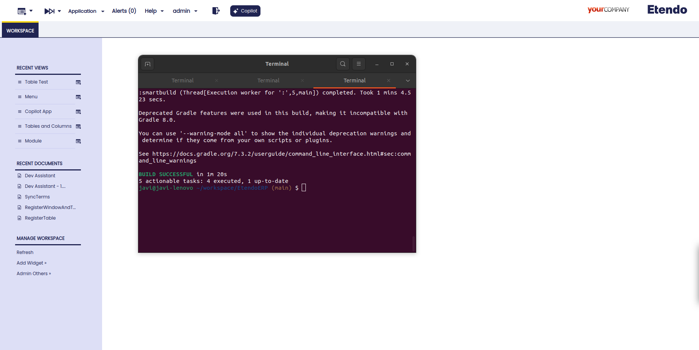

---
tags:
    - Beta
    - Copilot
    - IA
    - Windows, tabs and fields
    - Creator
    - Assistants
---

# Dev Assistant

:octicons-package-16: Javapackage:  `com.etendoerp.copilot.devassistant`

## Overview

The **Dev Assistant section** provides an overview of the tools, functionality, and usage examples for various development assistants available in Etendo. Dev Assistant streamlines workflow management for developers by offering **specialized assistants** that simplify tasks such as creating buttons, windows, tabs and tables, Event Handlers, Jasper Reports, background processes, and more. These assistants are designed to enhance productivity and reduce complexity, making it easier for developers to efficiently build and manage different components within the Etendo platform.

!!!info
    To be able to include this functionality, the Copilot Extensions Bundle must be installed. To do that, follow the instructions from the marketplace: [Copilot Extensions Bundle](https://marketplace.etendo.cloud/#/product-details?module=82C5DA1B57884611ABA8F025619D4C05){target="_blank"}. For more information about the available versions, core compatibility and new features, visit [Copilot Extensions - Release notes](../../../whats-new/release-notes/etendo-copilot/bundles/release-notes.md).


## Assistants

### Etendo Code Expert 

**Etendo Code Expert** is an assistant designed to read previously indexed files and provide answers related to their content. It can summarize, answer technical questions, suggest programming code improvements, and offer general assistance about files.

This assistant is useful for avoiding the need to manually review all files. There is no need to load the files directly into the system since it will have Etendo Classic code preconfigured. Also more files can be configured if neccesary.

#### Functionality

With this assistant it is possible to: 

- Ask code development questions and based on Etendo code previously indexed, the assistant will give possible code suggestions or solutions. 

#### Usage Example 

1. To use this assistant, it is necessary to log in as `System Administrator` role and set the role access. For this, go to the **Assistant** window, configure Etendo Code Expert and synchronize it. Then, go to the **Assistant Access** window and give access to the role.  

2. Open Copilot and select Etendo Code Expert

    

3. Ask the assistant for what you need to create.

    

### Event Handler Creator

This assistant is capable of creating Event Handlers in Etendo Classic. You only need to provide the Java package of the module where it should be exported and specify the action to be performed. 

#### Tools

- [Read File Tool](../available-tools/read-file-tool.md)
  
- [Write File Tool](../available-tools/write-file-tool.md)

#### Functionality

**Event Handler Creator** is an assistant designed to automatically create event handlers in Java. It uses code indexed in its knowledge base to read classes that extend `EntityPersistenceEventObserver`, providing examples to build a new event handler. To generate an event handler, the wizard requires the following parameters:
  
- **Java package**: The package where the file will be saved.
- **File name**: The name of the file to create.
- **Entity**: The entity to observe.
- **Description**: A description of the functionality to be implemented by the event handler.

#### Usage Example

### Reference Creator

The Reference Creator assistant that **creates references** in the Etendo Application Dictionary. This tool allows for example the addition of new list references to a specific module within the Etendo database via an HTTP request to a webhook.

It is particularly useful in the development process, enabling system administrators or developers to define new references that can later be utilized in applications. This tool automates the creation of these references, ensuring **consistency and adherence** to quality standards in the configuration.

#### Tools

- [Create Reference Tool](../available-tools/create-reference-tool.md): This tool allows to create references on Etendo and on the database using queries generated with the parameters given in the tool. 

#### Functionality

The **Reference Creator** assistant is designed to facilitate the creation of references, for example, it is possible to create list of references in the Etendo Application Dictionary by providing the assistant the necesary input parameters. 

Let's see an example about how the user can interact with the assistant and create the needed references in Etendo.

#### Usage Example 

1. To use this assistant, it is necessary to log in as `System Administrator` role and set the module in which the changes will be exported in development.

2. Open Copilot and select Reference Creator Assistant

    

3. Ask the assistant which reference type you need to create

    

4. The Create References Tool will process these parameters, verify the access token, build the request body and call the Etendo webhook to create the reference.

    In the Reference window, Etendo shows all the fields with the corresponding information generated and in the List Reference tab, it is possible to see the new list reference created. 

    


5. Once the development is validated by the developer, and the necessary manual modifications are made, it is possible to export the changes in the corresponding module.

    ```title="Terminal"
    ./gradlew export.database --info
    ```

### Tables, Windows and Tabs Creator

The **Tables, Windows and Tabs Creator** is designed to help developers and speed up the process of creating windows, tabs, fields, system elements, menu entries, etc.  as well as tables and columns in the database.
It is possible to give an input with all the necessary information, or the assistant will go step by step, asking for more information. Also, depending on the context, the assistant can make suggestions that the developer must confirm.

!!!warning
    This Assistant is currently in its beta testing phase. While it is designed to automate the process of creating windows and tables, there are instances where tasks may not be fully completed. Specifically, there may be issues with adding foreign keys, correctly naming elements, etc.

    For optimal results, it is recommended to proceed step-by-step and be as specific as possible in your instructions to the Assistant. This will help mitigate potential errors and ensure more accurate task completion.

    Thank you for your understanding as we continue to improve the functionality and reliability of this assistant.


#### Tools

- [**DDL Tool**](../../etendo-copilot/available-tools/ddl-tool.md): This tool allows to registering and creating tables on Etendo and on the database using queries generated with the parameters given on the tool. The query is adjusted for the user needs, for example, if the user wants to add a column with a default value, the tool can receive a value or not if the element should not has a default value.

- Multiples Webhooks: These webhooks are used to run the java files that create or modify the fields on the Etendo Classic and execute process or queries. These webhooks are: `RegisterTable`, `CreateTable`, `RegisterFields`, `RegisterWindowAndTab`, `RegisterColumns`, `ElementsHandler`, `SyncTerms`.


#### Functionality

!!! info
    With this assistant, it is possible to create: 

    - **Tables and Columns**: both tables and columns are created based on user specification and the supported types are `string`, `number`, `tableDir`, `date`, `text` and `boolean` (each field will have default lengths unless specified).  
    - **Windows**: only Mantein type windows are supported
    - **Tabs**: Can be created at multiple levels, although it is important to make it clear to the assistant to add the corresponding foreign keys.
    - **Fields**: Fields are created from columns, respecting the same name but without *"_"*.
    - **Elements**: The elements will be created automatically, sharing the name of the columns, but replacing the *"_"* with spaces. The help and description fields will also be added automatically.
    - **Menu**: A menu entry is automatically created, the developer must manually place it in the desired position.

 - Ask the **Tables, Windows and Tabs Creator** for a window to add in the system and the module database prefix where the table will be exported. The assistant will then register in the system the table and create it in database, including the mandatory columns. At this stage the assistant checks if the module is in development. If is not, the assistant prompts the user for a correct prefix from a module in development. Additionaly, the assistant checks if the table name is already in use; if it is, asks the user to provide a new name. In case the window belongs to the module under development, new columns, tabs and fields can be added.

- The assistant will ask to the user for information to add, like columns, data types, help and description, etc.

- The user must confirm the steps or set up a modification about the given information.


#### Usage Example 

1. To use this assistant, it is necessary to log in as `System Administrator` role and set the module in which the changes will be exported in development.

2. Open Copilot, and select Tables, Windows and Tabs Creator 
    

3. Ask the assistant for what you need to create.
    


4. With the task complete, it is necessary recompile with a smartbuild and restart Tomcat

    ```title="Terminal"
    ./gradlew smartbuild --info
    ```
    

5. Window in the System, the window can be viewed with the user role.
    
    

6. Once the development is validated by the developer, and the necessary manual modifications are made, it is possible to export the changes in the corresponding module.

    ```title="Terminal"
    ./gradlew export.database --info
    ```