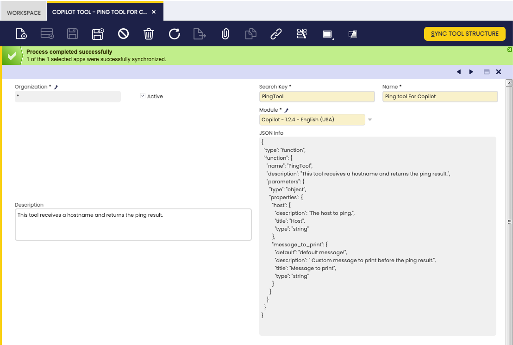
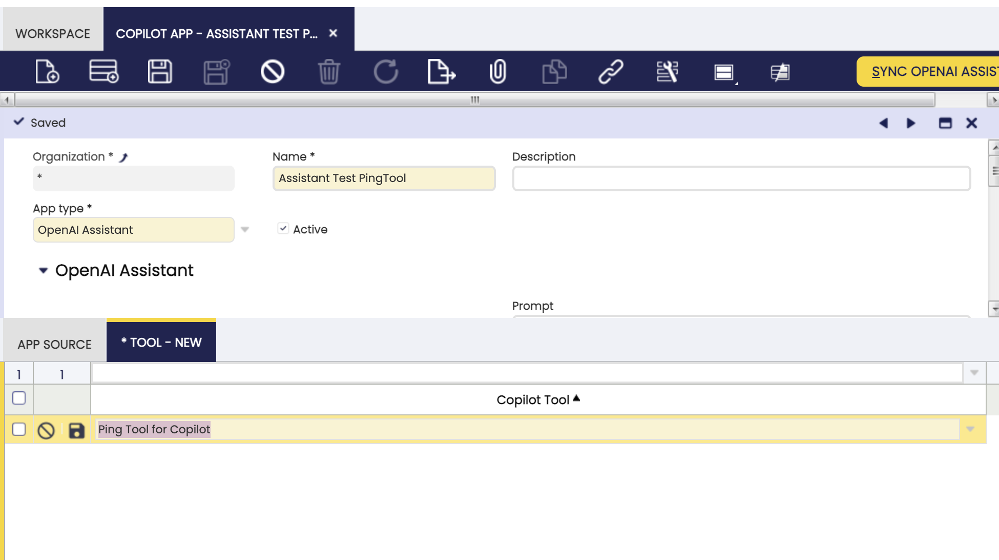

---
tags:
    - Copilot
    - IA
    - Machine Learning
---

# How to create Copilot tools

## Overview
This article explains how to create a new tool for Copilot.

## Etendo Copilot

Etendo Copilot module allows the creation of tools that add functionality to it. These tools are developed in Python and run in the Docker container where Copilot runs. Next, we explain how to create a new tool for Copilot, in a new module. But you can also add a new tool in an existing module and it can contain several tools.

!!! note "Etendo Copilot is based on Langchain"
    The Langchain libraries are available by default in Copilot. You can use them in your tools. See [Langchain documentation](https://python.langchain.com/){target="_blank"} for more information.

### Requirements
- Copilot module installed in Etendo Classic. If you do not have it, you can install it using the getting started guide for the Copilot API [Installation](../../developer-guide/etendo-copilot/installation.md){target="_blank"}.

### Create a new tool
For this example, we will create a tool that will allow us to make a ping to a host. The tool will be called `Ping Tool` and will be located in the `com.etendoerp.copilot.pingtool` package.

!!! note "Create the classic module"
    
    Copilot tools are created within an Etendo Classic module. So the first thing we have to do is create an Etendo Classic module. 

1. The structure of the module will be as follows:

    ``` 
    modules
    └── com.etendoerp.copilot.pingtool
        ├── src-db 
        │   └── database
        │       └── sourcedata
        │           ├── AD_MODULE.xml
        │           ├── AD_MODULE_DBPREFIX.xml
        │           ├── AD_MODULE_DEPENDENCY.xml
        │           └── ETCOP_TOOL.xml
        ├── tools 
        │   └── PingTool.py
        ├── .gitignore
        ├── build.gradle
        └── tools_deps.toml
    ```
    *src-db*: Contains the database structure of the module. This folder is created automatically when creating and exporting the module from Etendo Classic.
   
    *tools*: Contains the tools of the module. Can contain one or more tools.
    
    *.gitignore*: Contains the files that will be ignored by git.
   
    *build.gradle*: Contains the configuration of the module. This file is created when the module is prepared to be published. See 
    [How to publish modules to GitHub repository](../../developer-guide/etendo-classic/how-to-guides/how-to-publish-modules-to-github-repository.md)
    
   
    *tools_deps.toml*: Contains the dependencies of the tools of the module. This file contains the dependencies of the tools of the module.


    

2. Its necessary to use a Dict as input. In order to do that, we have to create a new class that defines the inputs of the tool using pydantic. 
For the case of the PingTool, we will create a class called `PingToolInput` that will define the inputs of the tool. The class will be located in the `PingTool.py` file. Here is an example of a tool that receives a Dict as input, with the structure of the Dict defined in a class:
    
    !!!Warning 
        The SearchKey of the tool must be the same as the name of the class that extends the ToolWrapper class.

    ```python title="PingTool.py"
    import os
    from typing import Type, Dict

    from copilot.core.tool_input import ToolInput, ToolField

    from copilot.core.tool_wrapper import ToolWrapper  # Import the ToolWrapper class from the copilot.core.tool_wrapper module. This class is the one that must be extended to create a new tool.


    class PingToolInput(ToolInput):
        host: str = ToolField(
            title="Host",
            description='''The host to ping.''',
        )
        message_to_print: str = ToolField(
            default="default message!",  # Default value of the input, if there is no default value, the input is mandatory.
            title="Message to print",
            description=" Custom message to print before the ping result.",
        )


    class PingTool(ToolWrapper):
        name = 'PingTool'  # Name of the tool
        # Description of the tool.
        # This description tells Copilot what the tool does and based on this description it will decide if this tool will solve the user's request.
        description = (
            '''This tool receives a hostname and returns the ping result.''')
        args_schema: Type[ToolInput] = PingToolInput  # The args_schema attribute must be a Pydantic model that defines the inputs of the tool.
        
        #return_direct = True  # If return_direct is True, the tool will return the result directly, without execute any other tool. If return_direct is not defined, the tool output can be used as input of another tool. This is only available for tools in the Langchain agent. In the OpenAI agent, the return_direct attribute is taken into account, and the tool output can be used as input of another tool.

        def run(self, input_params: Dict, *args,
                **kwargs):  # The run method is the one that will be executed when the tool is executed.
            import requests  # Import the necessary libraries to execute the tool.
            # It is recommended to import the libraries inside the run method to avoid conflicts with other tools.
            host = input_params.get('host')  # Get the host input from the input_params dictionary.
            # Get the message_to_print input from the input_params dictionary
            # or from the args attribute that contains the default values of the inputs.
            message_to_print = input_params.get('message_to_print') or self.args.get('message_to_print').get('default')
            print('MESSAGE:' + message_to_print)
            response = requests.get(host)
            return {"status_code": response.status_code}  # The run method must return a dictionary with the outputs of the tool.
    ```
    !!! note "Enviroment variables"
        Automatically, Copilot reads the `gradle.properties` file of Etendo Classic and add configuration as environment variables. The name of the environment variable will be the same as the name of the property. The only difference is that the . is replaced by _. For example, if we have the property `COPILOT_PORT` in the gradle.properties file, Copilot will create the environment variable `COPILOT_PORT`. If we have the property `bbdd.sid` in the gradle.properties file, Copilot will create the environment variable `bbdd_sid`.
         This allows us to use the environment variables in the tools. 
        
    

3. Create the file `tools_deps.toml` in the root folder of the module. This file will contain the dependencies of the tools of the module. The content of the file follows the TOML format. The content of the file will be as follows:

    ``` toml
    [ToolName]
    dependency_name = "dependency_version"
    dependency_name = "dependency_version"
    ```
    For our example, the content of the file will be as follows:

    ``` toml
    [PingTool]
    requests = "*"
    ```
    The SearchKey of the tool must be the same as the name of the class that extends the ToolWrapper class. In our case, the SearchKey of the tool is `PingTool` and the name of the class that extends the ToolWrapper class is also `PingTool`. During the load of copilot, the tool will be loaded and the dependencies will be installed. Additionally, the dependencies will be tested to ensure that they are installed correctly.

    The version of the dependency can be specified or not. If the version is not specified, the latest version will be installed. If the version is specified, the version specified will be installed. The version can be specified with the following operators:
    ``` toml
    [PingTool]
    requests = "*" # Installing latest version
    requests = "==2.26.0" # Installing a specific version
    requests = ">=2.26.0" # Greater than or equal to a certain version
    requests = "<=2.26.0" # Less than or equal to a certain version
    requests = ">2.26.0" # Greater than a certain version
    requests = "<2.26.0" # Less than a certain version
    requests = ">=2.26.0,<=2.26.1" # Using version ranges
    requests = "~=2.26.0" # Tilde operator (~) for installing compatible versions
    
    ```


    !!! warning "Different name of depedency while installing and importing"
        If the name of the dependency is different from the name of the dependency that is imported in the tool, it is necessary to specify the name of the dependency that is imported in the tool. For example, if the dependency is installed with the name `pyscopg2-binary` but is imported with the name `psycopg2`, we can use a | to specify both names. If this clarification is not made, the tool will not be able to import the dependency to "test" if it is installed correctly, this will throw a warning, but the tool will be able to run correctly.
        The content of the file will be as follows:


        ``` toml
        [PingTool]
        requests2 = "*" 

        [OtherTool]
        "pyscopg2-binary|psycopg2" = "*"   # First name is the name of the dependency that is installed, second name is the name of the dependency that is imported. In the tool code, we will do import psycopg2
        ```

4. Additionaly, open the *Copilot Tool* window as *System Administrator* role. In this window we will create a new record, with the following information:

    - *Search key*: The tool search key. The same name as the tool class must be used, this field is mandatory to find the tool in the `Sync Tool Structure` process. 
    - *Name*: The name of the tool. It is the name that will be shown in the Copilot UI.
    - *Description*: This is a description of what the tool does. This field is automatically populated when the tool is synchronized.
    - *Module*: The module where the tool is located. This field is a reference to the module that we have created in the first step, and where these configurations will be exported.
    - *JSON Info*: Contains a JSON descrition of the tool. This field is automatically filled when the tool is synchronized. 
 

    The last step is getting the Tool parameter information from the tool class. This information is used to create the parameters in the Assistant. To do so, we have to execute the button `Sync Tool Structure` in the `Skill/Tool` window. This process will load the *Description* and the *JSON Info* fields of the tool. This data is obtained from the tool class.

    !!! Warning Before Sync Tool Structure
        It is mandatory to have copilot running and the tool loaded in the copilot container. If the tool is not loaded, the process will not retrieve the tool parameters.

    

    After creating the record, we have to export the module to persist the changes in the database:
    ```bash title="Terminal"
    ./gradlew export.database
    ```
    Once the *Copilot Tool* is defined, this tool must be associated to the assistant(s), to do so, a record must be created in the *tools* tab of the **Assistant** window, this record will allow us to activate or deactivate the tool.

    

    !!! note "OpenAI Assistants tools"
        Remember to execute `Sync Assistant` process after linking the tool, if not, the tool will not be available in the OpenAI Assistant.

5. Finally, restart the Copilot service and check that the tool and its dependencies have been installed correctly. 
To test the developed Tool, you can ask Copilot to run it or, for example, to list which tools are available.

    ``` bash title="Terminal"
    ./gradlew copilot.do -Pprompt="What tools do you have available?"
    ```