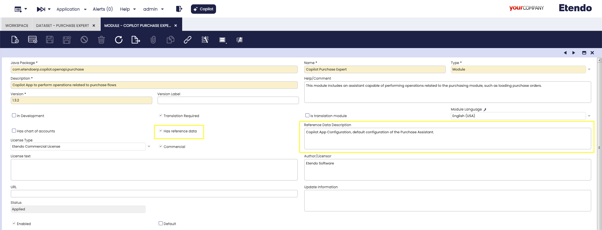
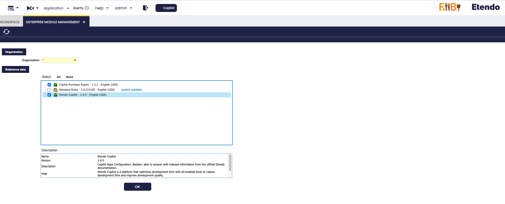
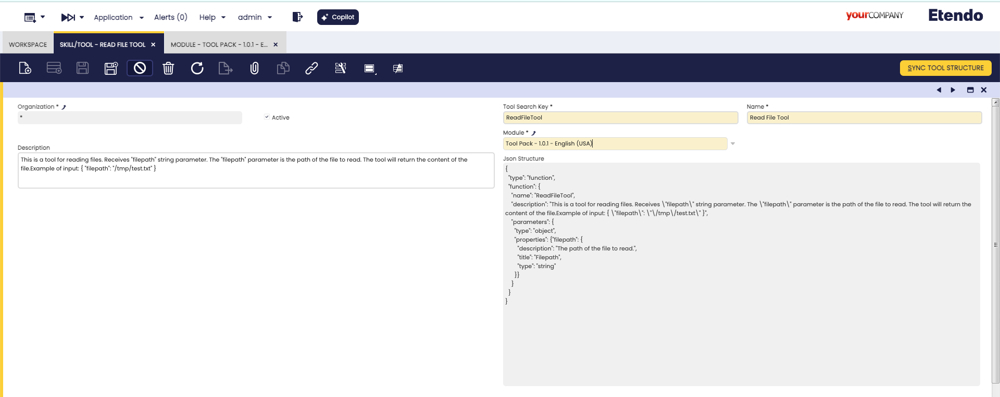

---
tags:
    - Copilot
    - IA
    - Tools
    - Datasets
---

# How to Export Tools and Assistants

## Overview

When developing in Etendo Copilot, it is possible to export assistants and tools. This documentation details how to export them and how to make sure that, when installing the module, the configurations are ready to use, allowing a **plug and play** process.

## Exporting Assistants

There are two main methods for exporting assistants: export it as a dataset where the configured assistant is exported within an Etendo Classic dataset or export as a System Administrator, where the assistant(s) defined with the System Administrator role are exported directly together with the module.

### Exporting Assistants as Datasets

1. Initial setup of the assistant:
    - Configure the assistant and tools in the environment where the development takes place.
    - Make sure to include all the necessary fields to be exported. Make sure to configure correctly the **Knowledge Base**, **Skills/Tools** and **Team Members** tabs, as well as the records in the **Knowledge Base File** window.

    

2. Create and Configure a Dataset:
    - As System Administrator, go to the **Dataset** window and create a new record by selecting the module under development.
    - Define the **Search Key** and **Name** of the dataset.
    - Set the **Data Access Level** to **Client/Organization** (recommended for user assistants).

3. Add Tables to the Dataset

    For each window to be exported, create a record in the **Table** tab. Specify the corresponding table and add the appropriate **HQL/SQL Where** clause.

    - **Assistant:** Table `etcop_app` (Clause: `id in ('<AssistantID>')`)
    - **Knowledge Base:** Table `etcop_app_source` (Clause: `etcopApp.id in ('<AssistantID>')`)
    - **Skills/Tools:** Table `etcop_app_tool` (Clause: `copilotApp.id in ('<AssistantID>')`)
    - **Team Members:** Table `ETCOP_Team_Member` (Clause: `copilotApp.id in ('<AssistantID>')`)
    - **Knowledge Base File:** Table `etcop_file` (Clause: `id in ('<knowladgeBaseFileID>')`)

    

4. Export Data
    - Execute the **Export Reference Data** process, which will create the `referencedata/` folder inside the selected module.

5. Include Reference Data in the Module
    - Check the **Include Reference Data** checkbox in the module and add a description to the dataset.

    

    - When the module is installed, the dataset will be available for application in the **Enterprise Module Management** window.

    

## Exporting Assistants as System Administrator

1. Define Assistant with System Administrator Role

    - Log in with the **System Administrator** role.
    - Configure the assistant and its tabs. Select the module under development in the **Module** field.
    - Optionally, check the **System App** checkbox to restrict the use of the assistant to the administrator role only.

    

2. **Export the Database**.
    - Execute the command `./gradlew export.database` to export the assistant together with the module.

## Exporting Tools in a Module

**Tool configuration**: When defining a tool, select the module (under development) in which it will be exported, and run `./gradlew export.database`

!!!info
    For more information on how to create an Etendo Copilot Tool, visit [How to create a Copilot Tool](../../developer-guide/etendo-copilot/how-to-create-copilot-tools.md)