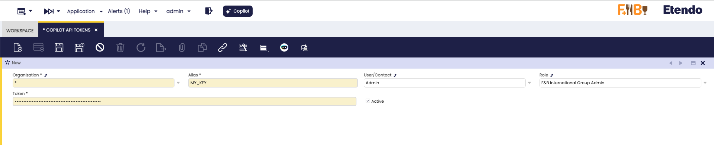

# How to configure API tokens for Etendo Copilot

## Overview

!!! example  "IMPORTANT: THIS IS A BETA VERSION"
    It is under active development and may contain **unstable or incomplete features**. Use it **at your own risk**. The module behavior may change without notice. Do not use it in production environments.

This guide explains how to configure and use **API Tokens** in **Etendo Copilot** for secure authentication with external services. API tokens allow agents to authenticate with third-party APIs while maintaining security through proper token management and replacement mechanisms.

### What are API Tokens in Etendo Copilot?

API Tokens in Etendo Copilot are secure credentials that allow agents to authenticate with external services and APIs. These tokens are:

- **Context-aware**: Different tokens can be assigned based on user, role, or global settings
- **Prioritized**: The system automatically selects the most appropriate token based on context
- **Secure**: Tokens are stored securely and only exposed during prompt processing
- **Flexible**: Supports multiple aliases for different services

### API Token Priority System

The system implements a sophisticated priority mechanism for token selection:

1. **User + Role specific**: Tokens assigned to both a specific user and role (highest priority)
2. **User specific**: Tokens assigned only to a specific user 
3. **Role specific**: Tokens assigned only to a specific role
4. **Global**: Tokens with no user or role assignment (lowest priority)

This ensures that the most contextually appropriate token is always used.

## Configuration


### Create a New API Token

:material-menu: `Application` > `Service` > `Copilot API Tokens`

Etendo must be opened using the role to which the key is to be added. Access is typically restricted to the configuration window for administrators; however, this may vary depending on the access level and configuration assigned to each role.



Create a new record with these fields:

- **Organization (Required)**: The organization that will have access to this token.
- **Alias (Required)**: Name used to reference the token in prompts/configs. Unique name for the token (e.g., `OPENAI_API`, `GITHUB_TOKEN`).
- **Token (Required)**: The API key or token value. (e.g., `sk-abc123...`)
- **User/Contact (Optional)**: User with access to the token. Assign to a specific user (leave empty for wider scope).
- **Role (Optional)**: Role allowed to use the token. Assign to a specific role (leave empty for wider scope).


### Token Usage in Prompts

**Token Placeholder Format**

API tokens are referenced in prompts using the following format:

```
@TOKEN_ALIAS@
```

The alias is automatically converted to uppercase for placeholder matching.


#### Example Usage

**In Agent Prompts**
```
Use the OpenAI API with key @OPENAI_API@ to generate a response.
Access GitHub repository using token @GITHUB_TOKEN@.
Connect to Salesforce with @SALESFORCE_API@ credentials.
```

**In Tool Configurations**
```json
{
  "api_key": "@OPENAI_API@",
  "base_url": "https://api.openai.com/v1",
  "headers": {
    "Authorization": "Bearer @OPENAI_API@"
  }
}
```

**In MCP Server Authentication**

API tokens can be used in MCP server configurations:

```json
{
  "command": "npx",
  "args": ["custom-mcp-server"],
  "env": {
    "API_KEY": "@CUSTOM_API@",
    "AUTH_TOKEN": "@SERVICE_TOKEN@"
  }
}
```

### Token Replacement Process

When prompts are processed, the system:

1. **Identifies** all token placeholders in the format `@ALIAS@`
2. **Evaluates** the current user and role context
3. **Selects** the highest priority token for each alias
4. **Replaces** placeholders with actual token values
5. **Processes** the prompt with authenticated credentials

---

This work is licensed under :material-creative-commons: :fontawesome-brands-creative-commons-by: :fontawesome-brands-creative-commons-sa: [ CC BY-SA 2.5 ES](https://creativecommons.org/licenses/by-sa/2.5/es/){target="_blank"} by [Futit Services S.L](https://etendo.software){target="_blank"}. 
